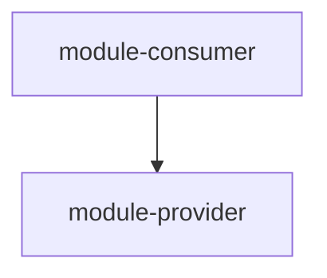
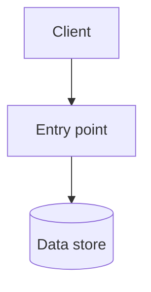

<!--
Template for architecture.md. Delete every comment block before committing.

Delete a conditional section outright when its trigger does not hold; never
leave an empty heading. Delete a cross-cutting heading only when the concern
genuinely does not exist in the system.

Every diagram is Mermaid and carries prose. A section holding a diagram and
nothing else is incomplete.
-->

# Architecture

## Overview

<The system's shape and its decomposition into modules.>

## Module Dependency Graph

<The direction rule the graph obeys, what an arrow means, and the constraints
the shape encodes.>

## Logical Deployment Architecture

<What runs where, and which boundaries are process boundaries.>

<!-- Conditional: include only when the system runs as more than one process or replica. -->
## Physical Deployment Architecture

<!-- Conditional: include only when call chains are non-trivial. -->
## Inter-Module Call Relationships

<!-- Conditional: include only when data moves across module boundaries. -->
## Data Flow

## Cross-Cutting Design

### Error Model

### Authentication and Authorization Boundaries

### Data Consistency and Transaction Boundaries

### Concurrency Model

### Failure and Degradation

### Observability

### Performance and Capacity Targets

### Security Boundaries

## Architecture Invariants

<The rules the system must not violate. These are what a review adjudicates
against, so each one is stated so that a violation is recognizable.>

## Implementation Status

<!--
One line per module, linking to that module's document. Roll-up only: the
module document is authoritative and holds the detail. Status is one of
Implemented / Partially implemented / Not implemented.
-->

| Module | Status |
|---|---|
| [<module-name>](modules/design-<slug>.md) | Implemented |
