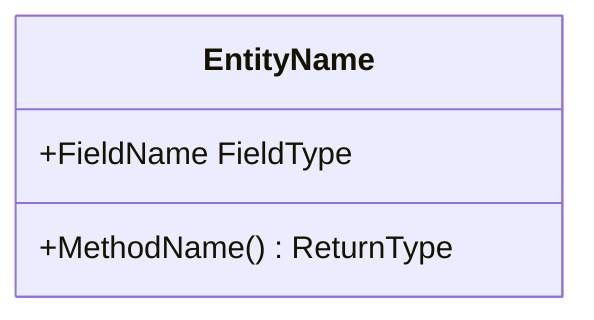

<!--
Template for a module design document, modules/design-<slug>.md. Delete every
comment block before committing.

The section order is fixed so modules can be read against each other. Delete
a section marked applicable-only when it does not apply; keep the order of
the rest.

The slug is lowercase kebab-case, matches the module's directory or package
name in the code, and never changes.
-->

# <Module name>

## Responsibilities

<What the module owns.>

### Non-Responsibilities

<What the module explicitly does not own, and which module owns it instead.>

## External Interface Contract

<What other modules may call, and what stability is promised. Signatures or
pseudocode only, trimmed to the part that carries design meaning. Examples
are not required to compile.>

## Dependencies

<What this module depends on, and how that satisfies the architecture
invariants.>

## Diagrams

<!--
Select diagram types by fact, never to fill this template:
  class diagram    core data structures and their relationships
  sequence diagram cross-module interaction
  state diagram    entities with a lifecycle
  activity diagram branch-heavy flows
When the module holds no corresponding fact, draw nothing.
Every diagram carries prose.
-->

## Core Data Structures

## Core Algorithms and Flows

<!--
Complexity analysis is required for performance-sensitive algorithms and is
not required for procedural flows.
-->

<!-- Applicable only: delete when the module has no non-trivial failure behaviour. -->
## Error and Failure Semantics

<Failure modes, retry behaviour, idempotency, degradation.>

<!-- Applicable only. -->
## Concurrency and Transaction Boundaries

<!-- Applicable only. -->
## Extension Points

## Implementation Status

<!--
Status is one of Implemented / Partially implemented / Not implemented.
Partially implemented must name what is missing. Every entry carries a code
anchor: path plus symbol name, never a line number.
-->

| Capability | Status | Code |
|---|---|---|
| <capability> | Implemented | `path/to/file.go` `SymbolName` |
| <capability> | Partially implemented — <what is missing> | `path/to/file.go` `SymbolName` |
| <capability> | Not implemented | — |
