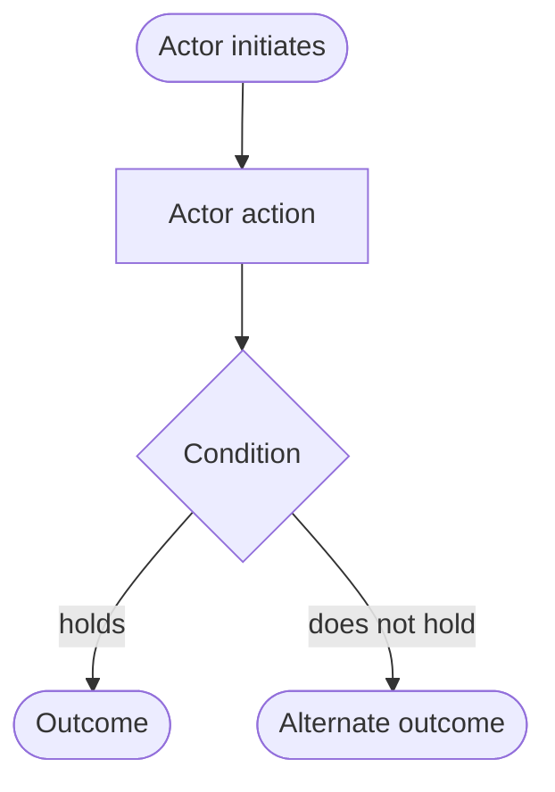

<!--
Template for one user journey, journeys/journey-<slug>.md. Delete every
comment block before committing.

One journey per file. A journey is a real business process that spans several
requirements -- a path exercising a single requirement is not a journey,
because that requirement's own acceptance criteria already cover it.

Everything is written from the actor's point of view. Internal steps the actor
cannot observe are design, not requirements.

The slug is the journey's identifier. File names carry no sequence number.
-->

# <Journey name>

## Who

<The actor taking this path, and the authority they hold.>

## Precondition

<What must already be true before the path can start: the state of the system,
the data that must already exist, what the actor must already have done.>

## Steps

1. <What the actor does.>
2. <What the actor does next, and what they observe.>
3. <...>

<!--
Optional: only when the path branches. A linear journey needs no diagram, and
a diagram drawn to fill this slot is a defect. Delete the block when unused.
-->

<What the branch depends on, in the actor's terms.>

## Outcome

<What the actor ends up with, stated so that it can be asserted.>

<!-- Optional: only when the path has meaningful alternate endings. -->
## Alternate Paths

<!--
Optional. The requirements this path runs across. A journey spans several of
them by definition, so a list with a single entry is a sign the path is not a
journey.
-->
## Requirements Exercised

- `REQ-<slug>-001`
- `REQ-<slug>-002`

## End-to-End Test

<!-- Path plus test name, or "Not implemented". Never a line number. -->

`path/to/spec.ts` `test name`
