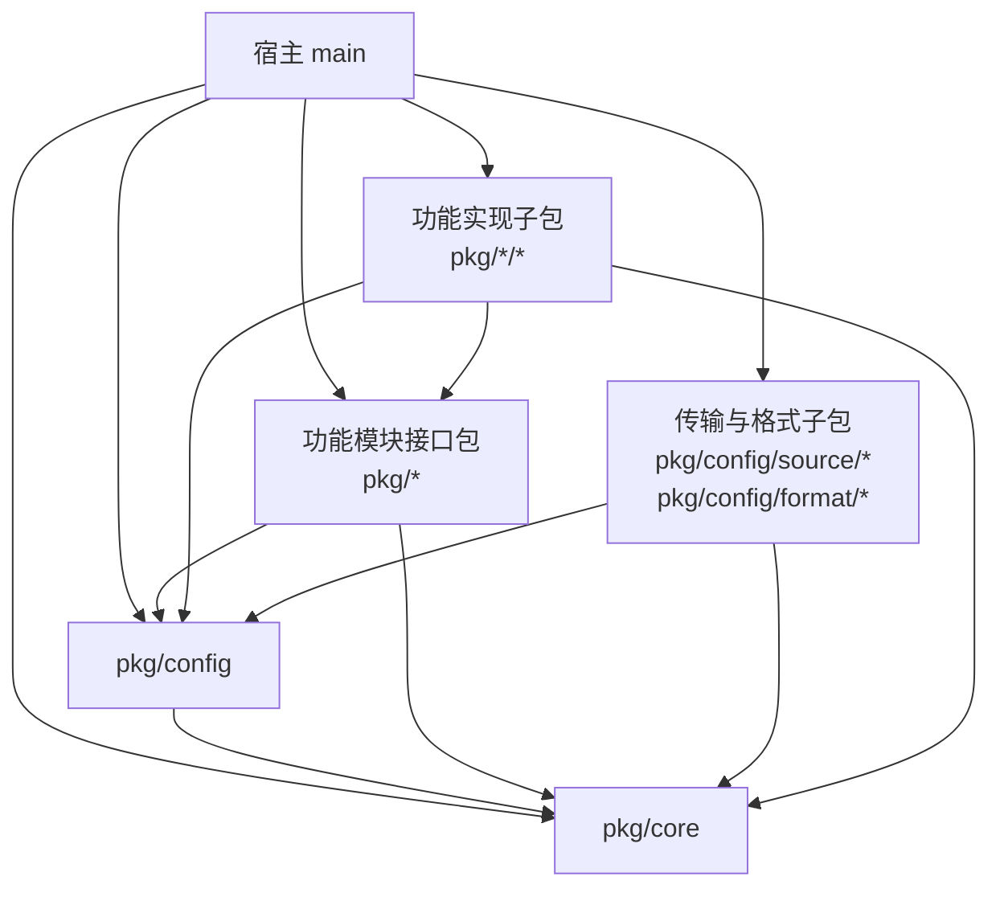
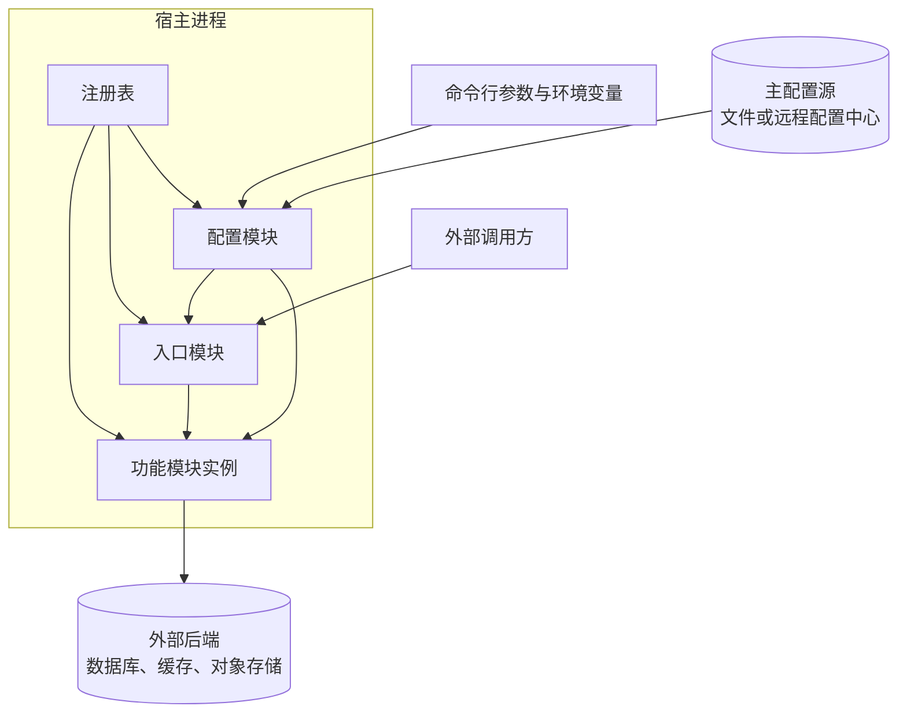

# 架构

## 概览

speed 以库的形式交付。`pkg/` 下每个目录是一个发布单元，提供一种功能；功能的多种实现拆为它的子包，每个实现子包各自登记为一个模块（[ADR-module-packaging-2026-09-13](../adr/adr-module-packaging-2026-09-13.md)）。

宿主编写自己的 `main`，import 所需的模块，驱动启动与停止。speed 不接管程序入口，也不规定应用的形态：HTTP 服务、gRPC 服务、不对外暴露入口的后台进程，都由模块与宿主自己组成（[ADR-core-scope-2026-09-13](../adr/adr-core-scope-2026-09-13.md)）。

`pkg/core` 承载模块化的基础设施（描述符、注册、查询、生命周期驱动），以及零第三方依赖的公共基础设施。`pkg/config` 承载启动必须项的加载。其余每个发布单元提供一种功能，对外入口也是模块。

模块的选择分层进行，每层回答一个问题：

| 层次 | 输入 | 回答 |
|---|---|---|
| 编译期 | 被 import 进来的模块 | 这个二进制里存在哪些模块（可用集） |
| 运行期 | 各模块依据配置的表态 | 本次运行构造哪些模块（启用集） |

可用集由 import 决定，但不限于宿主 `main` 里那几行：模块的注册发生在 `init`，凡被 import 进来的模块包都会执行，所以宿主的某个依赖 import 了一个模块，它同样进入可用集，宿主未必知情。可用集是编译的结果，不是宿主的一份声明。

启用集必为可用集的子集，由各模块在 `Prepare` 阶段依据自己的配置表态、再经排他冲突消解得出，并含配置模块（若已登记）。没有一份集中的模块清单，模块自己最清楚它需要的配置是否齐备。

启用的判断分散在各模块，宿主因而没有一处能统一否决：一个由依赖间接引入的模块，只要自己表态启用且不与他人冲突，就会真的运行起来。是否提供关闭开关由各模块自行决定（[ADR-module-enablement-2026-09-13](../adr/adr-module-enablement-2026-09-13.md)）。

## 模块依赖图

箭头表示 import。依赖方向自上而下收敛于 `pkg/core`，`core` 不 import 任何模块。

图中编码了以下约束。

实现子包 import `pkg/core`（`init` 中注册所需）与自己的接口包，跨发布单元的依赖一律指向对方的接口包，不 import 任何其他发布单元的实现子包。实现所绑定的第三方库因此不会传染给依赖方。

声明配置的模块还要 import `pkg/config`，因为配置声明与取用都用到它的类型。`config` 与 `core` 因而同属被广泛依赖的底层，区别是 `core` 被每一个模块 import，而 `config` 只被声明了配置的那些 import。

宿主同时 import 接口包与实现子包：接口包供业务代码取用，实现子包供其 `init` 完成注册（[ADR-module-registration-2026-09-13](../adr/adr-module-registration-2026-09-13.md)）。图中画的是宿主自己 import 的典型情形；实现子包也可能由宿主的某个依赖引入，注册的效果相同。

配置源与功能实现在结构上同形，都是接口包加实现子包，配置模块因而不需要独立于模块机制的加载方式。它与其他模块的差别只在于构造时机与隐含的被依赖关系（[ADR-assembly-bootstrap-2026-09-13](../adr/adr-assembly-bootstrap-2026-09-13.md)）。

## 逻辑部署架构

speed 不引入进程边界。宿主是单一进程，注册表与全部模块实例都在该进程内，模块之间的调用是进程内的直接调用，不经过序列化、网络或服务发现。

图中的箭头不表示 import：`registry` 指向各模块表示驱动其生命周期，`cli` 与 `primary` 指向配置模块表示数据流入，`cfg` 指向其余模块表示提供配置，`entry` 与 `instances` 之间是运行期调用。

命令行、环境变量与主配置源都由配置模块读取，注册表不认识配置；它对配置模块的特殊处理限于先行构造与隐含被依赖。

外部调用方只经由入口模块进入。入口是否存在、是 HTTP 还是 gRPC，都由宿主 import 了哪些模块决定：不含任何入口模块的进程就是一个纯后台应用（[ADR-core-scope-2026-09-13](../adr/adr-core-scope-2026-09-13.md)）。

进程的外部依赖是启动期读取的主配置源，以及模块实例在运行期访问的外部后端。主配置源在启动期读取一次后不再访问（[ADR-config-lifecycle-2026-09-13](../adr/adr-config-lifecycle-2026-09-13.md)）。

主配置源可以没有。配置是默认值、主配置源、环境变量与命令行逐层叠加的结果，缺了这一层，其余各层照常给出配置，只用内存实现的进程因此可以不依赖任何外部配置来源。装配由配置驱动，不由配置源驱动。

进程内有一个进程级注册表，`init` 期的注册写入它。另建的注册表不继承这些登记，其中的模块需手工登记，因而适用于测试中只装配一小组模块的场合。

## 跨切面设计

### 错误模型

错误按启动期与运行期划分，边界是入口开始接受流量的时刻。

启动期错误一律终止启动，不降级、不跳过。请求帮助输出是例外：它同样中止启动流程，但不是失败，宿主据此以成功状态退出。模块的组成是配置驱动的，其最危险的失败不是启动不起来，而是启动起来了却缺失一部分功能且无人察觉，因此依赖缺失与排他冲突表现为启动失败。配置缺失的后果由模块自己决定：它可以表态禁用而让启动继续，此时启动诊断是察觉的唯一途径。

启动期错误使用哨兵错误，调用方以 `errors.Is` 判别类别，错误文本承载定位所需的具体信息。**哨兵表是封闭的，且必须覆盖全部启动期失败**：新出现的一类确定失败，要么并入某条既有哨兵（当宿主的补救动作与它相同），要么补一条；不允许留下没有哨兵的启动期失败，否则「以 `errors.Is` 判别类别」这条承诺就有一个说不出名字的缺口。

**包裹错误一律用 `%w`，不用 `%v`。** 哨兵的判别力依赖整条错误链完好，链上任何一层改用 `%v`，其下的哨兵就再也 `errors.Is` 不到，而调用方看到的错误文本与包裹正确时几乎一样——这类缺陷不会在文本上显形，只会在判别时静默失效。配置源把底层错误归类为哨兵（见 [config](modules/design-config.md)）正依赖这一点。`core` 自身定义的哨兵错误清单见 [core](modules/design-core.md)。

面向宿主的启动期错误必须给出修复动作。模块未启用时，错误或诊断要给出它表态禁用的原因，而非仅报告某个功能没有提供者。

### 并发模型

注册表的描述符部分在 `Run` 之前写入，此后只读。生命周期驱动自身是单协程的：阶段之间严格有序，阶段内逐个调用回调，需要顺序的阶段按依赖序。

模块实例自身的并发安全由模块各自负责；`core` 不为模块调用加锁，也不保证模块方法的调用来自单一协程。

### 失败与降级

启动期不降级。运行期的降级行为由各模块自行定义，`core` 不提供统一的降级机制。

可选依赖是唯一的例外：模块显式声明某依赖可选时，该依赖缺失是一种合法配置，模块据其文档所载的默认行为继续运行（[ADR-dependency-resolution-2026-09-13](../adr/adr-dependency-resolution-2026-09-13.md)）。

### 可观测性

启动诊断是装配期唯一的可观测面，固定写 `os.Stderr`。未进入启用集的模块必须在诊断中列出，并给出它表态禁用或消解落选的原因；注册表另提供按名查询最终启用结果的方法，宿主据此把同一批信息接进自己的日志，因为传入一个接收端只能经由 `Run` 的参数或包级设值，两者都被不变量排除。这是"启动起来了却缺一部分功能且无人察觉"这一失败的唯一防线（[ADR-module-enablement-2026-09-13](../adr/adr-module-enablement-2026-09-13.md)）。

运行期的日志、指标与追踪不由 `core` 提供，它们是各自模块的事。日志由 [log](modules/design-log.md) 承担，它在 `New` 阶段才构造，因而接不到装配期的诊断；两者的分界见该文档。

### 安全边界

标注为敏感的输入项不写入日志，帮助输出中也不回显其默认值。这条约定跨模块生效，由 `config` 统一执行，模块无需各自处理。

配置定位符会出现在命令行、进程列表与诊断输出中，因而不得承载凭据。

### 性能与容量目标

生命周期驱动是启动时的一次性开销，与请求处理无关。依赖解析在构造之前完成，规模是启用集及其依赖边数。

## 架构不变量

以下规则的违反都是可识别的，评审据其裁定。

1. **`pkg/core` 不含第三方依赖。** 它被每一个模块 import，其依赖会落到每一个宿主头上。这条同时是 `core` 作为公共基础设施容器的边界：零依赖的公共基础可以放进来，带依赖的不行。
2. **`pkg/core` 不解释任何资源，也不认识任何功能。** 模块声明的资源由它原样保存供查询，含义归定义该资源类型的模块；任何功能接口都不出现在其中，新增一种功能或一种横切机制都不修改 `core`。
3. **描述符不可变。** 登记之后不再变化，实例由注册表在生命周期驱动中建立。
4. **描述符上保留具名字段的判据是注册表自身是否要解释它。** 其余对外元数据一律作为资源声明（[ADR-module-resources-2026-09-13](../adr/adr-module-resources-2026-09-13.md)）。
5. **宿主向装配提供的东西一律经由模块机制。** 宿主注册自己的模块，把要交给框架的声明放进它的 `Resources`，不经由 `Run` 的参数、包级设值函数或其他旁路。宿主身份（环境变量前缀与默认配置定位符）走的正是这条路。宿主声明因此随注册表而非随进程，同一进程内的多个注册表互不干扰，`Run` 的签名也不随宿主声明的增加而变化。宿主在模块机制之外的只有驱动：编写 `main`、调用 `Run`、决定 `ctx` 何时取消。
6. **`core` 的注册、查询与生命周期一律是注册表的方法。** **导出的**包级函数与变量限于：注册表的构造函数、进程级注册表变量、哨兵错误，以及需要类型参数的泛型封装（Go 不允许方法带类型参数）。类型与常量不受此限，未导出的实现辅助函数同样不受此限——本条约束的是对外契约面。
7. **描述符与 `Prepare` 都不得依赖执行顺序。** Go 的 `init` 顺序只保证包依赖偏序；`Prepare` 阶段内不保证顺序。
8. **启用集是可用集的子集，由模块表态加消解得出。** 排他交付的冲突在消解阶段暴露，不留到构造期。
9. **模块之间只按功能取用彼此，构造期依赖显式声明且无环。** 不按名称取用，不使用全局变量传递实例；相互引用推迟到接线阶段。
10. **消解之后，仍然启用的提供者中若还有排他者，该功能不得有多于一个提供者。** 违反即启动失败。未声明排他的提供者之间可以并存，只能整体取出；被消解禁用的排他者不再主张独占。
11. **接口包不引入第三方依赖。** 它定义功能的接口与数据类型，也可含不引入第三方依赖的公共逻辑；绑定第三方库的实现一律位于子包。
12. **生命周期的阶段集合是固定契约。** `Prepare`、`New`、`Migrate`、`Init`、`Start`、`Serve`、`Stop`、`Close`，新增阶段会改变全部既有模块的假设（[ADR-lifecycle-stages-2026-09-13](../adr/adr-lifecycle-stages-2026-09-13.md)）。
13. **`core` 只按名称识别配置模块这一个特例。** 除它之外没有任何模块享有特殊的构造时机或隐含的被依赖关系（[ADR-assembly-bootstrap-2026-09-13](../adr/adr-assembly-bootstrap-2026-09-13.md)）。
14. **配置只承载启动必须项。** 判据为该值是否在数据库可用之前就被需要（[ADR-config-scope-2026-09-13](../adr/adr-config-scope-2026-09-13.md)）。

## 实现状态

| 模块 | 状态 |
|---|---|
| [core](modules/design-core.md) | 已实现 |
| [config](modules/design-config.md) | 已实现 |
| [log](modules/design-log.md) | 未实现 |
