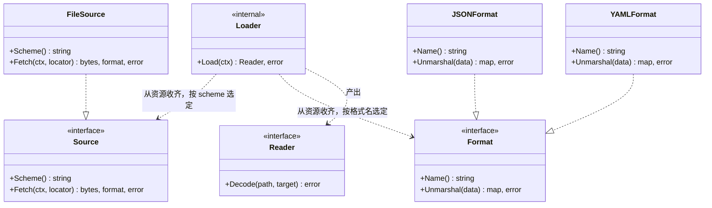
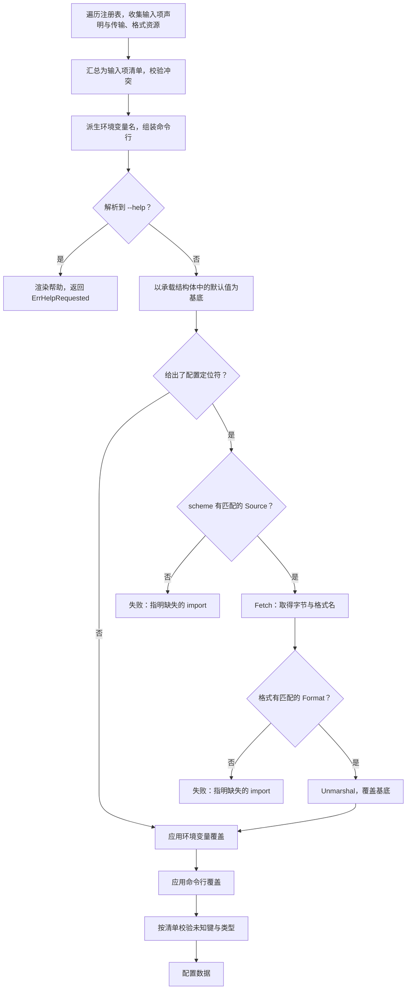

# config

## 职责

`pkg/config` 承载启动必须项的加载：

- 定义输入项声明、传输与格式这些资源类型，遍历注册表收齐它们，汇总为完整的输入项清单并校验冲突。
- 按清单解析命令行与环境变量，各输入项只从自己声明的来源取值。
- 给出了配置定位符时，按其 scheme 选定主配置源、按格式选定解析器并读入数据；未给出则跳过这一层。
- 在解析结果上依次应用环境变量与命令行覆盖层，产出配置数据。
- 向各模块提供按路径取回自己那份值的功能。

根包定义传输与格式扩展点的接口，并实现声明收集、来源解析、覆盖层与配置数据的产出。具体的传输与格式实现位于子包。

`pkg/config` 在 `Prepare` 阶段最先构造，并且是所有模块的隐含依赖，无需任何模块声明。这是 `core` 对本模块的全部特殊处理，两者都不体现为描述符中的字段（[ADR-assembly-bootstrap-2026-09-13](../../adr/adr-assembly-bootstrap-2026-09-13.md)）。

### 非职责

- **不承载运行期参数。** 运行期可变、可按租户取值的参数属于设置，由独立模块承担（[ADR-config-scope-2026-09-13](../../adr/adr-config-scope-2026-09-13.md)）。
- **不提供热重载。** 配置是启动时的快照，变更需要重启进程（[ADR-config-lifecycle-2026-09-13](../../adr/adr-config-lifecycle-2026-09-13.md)）。
- **不合并多个主配置源。** 主源唯一，同层不合并（[ADR-config-source-2026-09-13](../../adr/adr-config-source-2026-09-13.md)）。
- **不实现任何具体的传输与格式。** 文件、远程配置中心、JSON、YAML 均位于子包，其第三方依赖不落入根包。

## 术语表

以下术语的含义限于本模块，以及配置主题的决策记录。

| 术语 | 英文 | 定义 |
|---|---|---|
| 输入项 | input item | 一个启动期参数。它有一条路径、一组来源与一份元信息，来源可以是主配置源、环境变量、命令行中的任意组合。 |
| 输入项声明 | Schema | 本模块定义的资源类型，承载一个模块的全部输入项。它描述该模块接受哪些键及其类型，同时承载默认值：承载结构体中字段的取值即该字段的默认值。 |
| 配置数据 | config data | 各来源逐层覆盖后得到的完整配置。任何一层都可以缺席，包括主配置源。 |
| 主配置源 | primary config source | 配置数据的来源，形如文件或远程配置中心。一次运行中至多一个，也可以没有。 |
| 配置定位符 | config locator | 指明主配置源的 URI，其 scheme 决定由哪个配置源模块解析。可以不给出，此时没有主配置源。 |

## 外部接口契约

传输扩展点，一个实现对应一个 scheme：

```go
type Source interface {
    Scheme() string
    Fetch(ctx context.Context, locator *url.URL) (data []byte, format string, err error)
}
```

格式扩展点，一个实现对应一种格式：

```go
type Format interface {
    Name() string
    Unmarshal(data []byte) (map[string]any, error)
}
```

传输与格式正交：传输回答"从哪里取得字节"，格式回答"这些字节怎么解析"。文件源与远程配置中心共用同一批格式解析器。

**两者都以资源声明交付，不作为功能取用。** 子包在自己的 `init` 中注册一个只含 `Resources` 的模块，把实现放进去：

```go
core.ProcessRegistry.Register(core.Module{
    Name:      "config.source.file",
    Resources: []any{fileSource{}},
})
```

资源按可赋值性匹配，`fileSource` 实现了 `Source` 就会被 `core.Resources[Source](reg)` 收到，无需也无法在声明处标注它以哪个接口交付：放进 `[]any` 时接口壳即被抹除。

本模块在 `Prepare` 中用 `core.Resources[Source](reg)` 与 `core.Resources[Format](reg)` 收齐它们。走资源而非功能取用，是因为配置模块是最先构造的那一个，此刻没有任何其他实例存在，按功能取用只会取到空集；而资源在 `Run` 之前即确定，任何阶段查询都给出同一结果。传输与格式是无状态的解析器，没有生命周期需求。

两个扩展点的实现都位于子包，按种类分置，避免只从包名分不清它是传输还是格式：

| 子包 | 提供 | 第三方依赖 |
|---|---|---|
| `config/source/file` | `file://` | 无 |
| `config/format/json` | `json` | 无，标准库 |
| `config/format/yaml` | `yaml` | 有，YAML 解析库 |

JSON 与 YAML 分为两个子包，尽管 YAML 解析器也能解析 JSON：合并会让只用 JSON 的宿主背上 YAML 库的依赖，而零依赖正是 JSON 这一支的价值所在。

本模块定义资源类型 `Schema`，模块把它放进描述符的 `Resources` 中。它声明本模块接受哪些输入项、各自从哪些来源取值：

```go
type Schema struct {
    Namespace string            // 本模块在配置数据中的挂载位置，空表示顶层
    Mounts    []Mount           // 承载结构体，可以有多个
    Items     map[string]Item   // 路径 -> 来源与元信息；未列出的取默认
}

type Mount struct {
    Path  string   // 相对命名空间的路径前缀，空表示挂在命名空间根
    Value any      // 承载结构体，字段的当前取值即默认值
}

type Origin uint8

const (
    OriginPrimary Origin = 1 << iota   // 主配置源，文件或远程配置中心
    OriginEnv                          // 环境变量
    OriginFlag                         // 命令行
)

type Item struct {
    Origins     Origin   // 零值表示默认，即 OriginPrimary | OriginEnv
    FlagName    string   // 含 OriginFlag 时必填，不派生
    FlagShort   string   // 短名，可空
    EnvName     string   // 钉死环境变量名；空则按规则派生
    Placeholder string   // 帮助输出中的取值占位符
    Group       string   // 帮助输出中的分组
    Description string
    Required    bool     // 除默认值外无人给值时，Decode 返回错误
    Sensitive   bool     // 不写入日志，帮助输出不回显默认值
}
```

主配置源、环境变量与命令行不是各自独立的机制，而是同一批输入项的不同来源。绝大多数输入项取默认来源，因而根本不必出现在 `Items` 里。

本模块的描述符排他地交付 `(*Reader)(nil)`，其余模块因此能用按功能取用取到它。它不执行 `Prepare` 表态，消解中视同表态 `StateEnabled`，交付的功能照常参与消解，第二个 `Reader` 提供者因而在消解阶段就被判定，不会留到取用时（[core](design-core.md)）。

宿主用一个资源声明自己的身份，它先于一切配置读取，无处可从配置获得：

```go
type HostIdentity struct {
    Prefix         string   // 环境变量前缀
    DefaultLocator string   // 配置定位符的默认值
}
```

注册表中至多一个，多于一个即冲突。

模块取自己那份值的接口，按挂载点各解一次。`Prepare` 与 `New` 两个阶段都用它：`Prepare` 据此表态是否启用，`New` 据此构造产物。

```go
type Reader interface {
    Decode(path string, target any) error   // path 是完整路径：命名空间加挂载路径
}
```

`path` 是配置数据中的完整路径，不是相对本模块的路径。模块自己拼出它：命名空间与挂载路径都是本模块声明的，无需经由模块名反查。模块名不参与输入项的路径，用它定位路径会多一层与路径无关的间接。

代价是命名空间在声明与取用各出现一次，改动要同步。把它写成常量可以消掉这一处重复。

`Mounts` 中的结构体是**原型**，只用于推导字段结构与默认值，不接收运行期的值。同一原型被两个注册表用到时，它们各自解出的值互不相干。

一个模块的声明与取用：

```go
const ns = "cache"

var (
    defaults      = options{TTL: 5 * time.Minute}
    redisDefaults = redis.Options{PoolSize: 10}
)

config.Schema{
    Namespace: ns,
    Mounts: []config.Mount{
        {Path: "",      Value: &defaults},
        {Path: "redis", Value: &redisDefaults},
    },
    Items: map[string]config.Item{
        "redis.addr":     {Required: true, Description: "Redis 服务地址"},
        "redis.password": {Sensitive: true},
    },
}

// New 中
cfg, err := core.Resolve[config.Reader](reg)
...
var opts options
err = cfg.Decode(ns, &opts)

var ropts redis.Options
err = cfg.Decode(ns+".redis", &ropts)
```

两个模块的命名空间可以相同，只要它们的输入项路径不相交。`Decode` 因此只解出调用方自己声明的那些键，配置数据中同一子树下属于别人的键不视为未知键。

`Items` 的键相对本模块的命名空间，`Decode` 的路径则是完整的。基准不同是因为用途不同：`Items` 声明自己的内部结构，`Decode` 在整份配置数据中定位。

模块通过按功能取用取得 `Reader` 的实例。接口上只有读操作，配置在启动后不再变化；配置不流经注册表，`core` 因此不需要认识任何配置接口。

**稳定性承诺**：`Source` 与 `Format` 是子包作者与根包之间的契约。新增一种传输或格式不修改根包。

## 依赖

`pkg/config` 只依赖 `pkg/core`。根包不含第三方依赖：声明收集、来源解析、覆盖层与配置数据的产出都在标准库范围内完成。

第三方依赖全部位于子包，落入宿主依赖清单的只有实际 import 到的那些。

## UML 图



`Loader` 只与 `Source` 和 `Format` 打交道，不认识任何具体的传输或格式，它本身不出现在对外接口上。图中的实现类位于子包，列出它们是为了标明实现关系的方向：子包依赖根包，根包不依赖子包。同一扩展点可以有多个实现并存，宿主 import 哪个就有哪个。



收集先于读取：不先掌握完整的输入项清单，就无法判断某个来源给出的键是未知键还是拼错的键，也无法知道命令行该由哪些参数组成。

传输缺失与格式缺失是同一类失败：定位符点名了一个未编译进二进制的 scheme 或格式。错误信息必须给出需要补上的 import 路径。

## 核心数据结构

### 输入项清单

输入项是叶子：一个可以被赋值的标量或容器，嵌套结构体只贡献路径的中间段，本身不是输入项。清单由 `core.Resources[config.Schema](reg)` 得到：每个模块的 `Schema` 贡献一组输入项，挂在它声明的命名空间下；未声明命名空间的模块，其输入项直接落在顶层。清单是此后一切的依据，环境变量名由它派生，命令行由它组装，未知键与类型校验按它进行。

命名空间默认不加，所以输入项不会因模块名不同而自动互斥，冲突是可能的，收集阶段逐一检出：

| 冲突 | 判据 |
|---|---|
| 输入项路径相交 | 一个输入项展开后的路径是另一个的前缀，含完全相同 |
| 命令行长名重名 | 两个输入项的 `FlagName` 相同 |
| 命令行短名重名 | 两个输入项的 `FlagShort` 相同 |
| 环境变量名重名 | 派生名与钉死名相同，或两个钉死名相同 |
| 与保留名冲突 | 命令行参数名为 `config` 或 `help`，或环境变量名派生为 `<前缀>_CONFIG` |
| 宿主身份不唯一 | 注册表中有多于一个 `HostIdentity` 资源 |
| 传输 scheme 重复 | 两个 `Source` 资源声明同一个 scheme |
| 格式名重复 | 两个 `Format` 资源声明同一个格式名 |

判据取前缀关系而非相等，是因为冲突不止于同名：一个模块的标量输入项落在 `cache.redis`，另一个模块的输入项展开为 `cache.redis.pool-size` 时，同一路径既是叶子又是内部节点，主配置源无法同时表达两者，而两条路径并不相同。

挂载点之间的重叠不单列判据：挂载路径互为前缀是正常形态，根挂载点与具名挂载点并存正是多挂载的典型用法，真正的冲突只在展开后的输入项上体现。

**同一功能的互斥实现也必须划分各自的输入项路径。** 清单收集自全部已注册模块，其中包含本次不会启用的那些，因而两个实现即便永远不会同时运行，它们的声明仍然同时在清单里：内存实现与远程实现若都在 `cache` 下声明 `ttl`，只要都被 import 就是冲突，进程起不来。互斥实现各自挂在自己的命名空间下，或各自加前缀。

命令行与环境变量都处于全局命名空间，它们的重名与输入项路径是否冲突无关：分处不同命名空间的两个输入项，仍可能给出同名的命令行参数。

`--config`、`--help` 与 `<前缀>_CONFIG` 是本模块保留的名字，模块声明不得占用，否则配置定位符或帮助输出会被静默劫持。

传输与格式按精确匹配选定，同一个 scheme 或同一个格式名有两个实现时无从取舍，因此在收集阶段即判冲突并点名两个声明它的模块，而不是留到读取主配置源时才发现。

单个声明自身的缺陷不是冲突，它不涉及两方，归 `ErrInvalidSchema`：含 `OriginFlag` 却无 `FlagName`，标 `Sensitive` 却无 `Description`，键名违反字符集，展开中出现类型环，以及 **`Items` 中的键不对应任何叶子**——所有输入项都住在承载结构体里且都有路径，`Items: {"redis.addres": ...}` 这样的拼写错误因此是确定的缺陷，不判它就会让一个写错的 `Required` 或 `Sensitive` 静默失效。敏感项必须带说明，是因为帮助输出不回显它的默认值，没有说明读者就完全不知道该给什么。

### 配置数据

**配置是各层叠加的结果，不等同于主配置源的内容。** 一个输入项的值可能来自默认值、主配置源、环境变量或命令行中的任意一层，取到哪个值由覆盖顺序决定，而不由它出自哪一层决定。装配由配置驱动，不由配置源驱动：主配置源缺席时配置照常存在，只是少了一层来源。

配置数据由自低向高的各层覆盖而成，同层不合并：

| 层 | 来源 | 覆盖粒度 |
|---|---|---|
| 默认值 | 承载结构体中字段的当前取值 | 字段 |
| 主配置源 | 配置定位符指向的文件或远程配置中心，可缺席 | 已声明的叶子逐个；容器值整体 |
| 环境变量 | 声明了 `OriginEnv` 的输入项 | 标量条目 |
| 命令行 | 声明了 `OriginFlag` 的输入项 | 标量条目 |

缺少某一来源的输入项跳过该层。不进主配置源的输入项没有那一层，其余照旧。

**主配置源按已声明的叶子逐个覆盖，不整体替换子树。** 嵌套结构体的键集出自输入项声明，每个叶子都是独立的输入项，因此主源给出 `cache.addr` 不会把同一结构体里未给出的 `cache.ttl` 打回零值。映射与结构体列表则整体替换：它们的键不在清单里，逐叶合并无从谈起，而「要改就改那里」正是容器类型基本只接受主配置源的同一条理由。

**配置数据为每个叶子记住它的值来自哪一层。** 必填判定只认主配置源、环境变量与命令行三层，若只留最终值，默认值层总有值这一事实会让「无人给出」与「取到零值」无从区分（见取值与校验）。

配置数据的顶层键是各模块的配置项，按各自声明的命名空间分布：

```yaml
log-level: info      # 未声明命名空间的模块，配置项直接在顶层

cache:               # 声明了命名空间 cache 的模块
  addr: localhost:6379
```

配置里没有模块清单。哪些模块启用由它们各自依据配置表态决定，模块名因此完全不出现在配置数据里，也不参与输入项的路径。配置数据的形状由各模块的命名空间声明决定，一个模块改名不会牵动它的配置段。

代价是顶层不再天然互斥。两个模块的配置项落在同一个键上即为冲突，在收集阶段检出。

## 核心算法与流程

### 配置定位符

配置定位符指明主配置源。它必须在读取配置之前就确定，因此不能出自配置本身，取值顺序为：宿主设定的默认值、`<前缀>_CONFIG` 环境变量、`--config` 命令行参数；序列中靠后的覆盖靠前的。

环境变量前缀同样不出自配置：它是宿主身份的一部分，不随运行改变。

`--config` 与 `<前缀>_CONFIG` 都不进入配置数据：它们是保留名，不出自任何输入项声明，只用于选定主配置源。若让它们进去，未知键校验第一个撞上的就是它们自己。

这两项先于一切配置读取，无处可从配置获得，只能由宿主直接给出。宿主把它们作为资源声明，注册一个只含 `Resources` 的模块：

```go
core.ProcessRegistry.Register(core.Module{
    Name:      "host",
    Resources: []any{config.HostIdentity{
        Prefix:         "MYAPP",
        DefaultLocator: "file:///etc/myapp.yaml",
    }},
})
```

走资源而不是包级函数，宿主身份因此随注册表而不是随进程：同一进程内的两个注册表可以各有各的前缀与默认定位符，测试之间不互相干扰。本模块在 `Prepare` 中用 `core.Resources[HostIdentity](reg)` 取它，至多一个，多于一个即冲突。

前缀缺席时，配置定位符的环境变量这一路整体不生效——`<前缀>_CONFIG` 是派生名，没有前缀就没有这个名字，与保留名冲突的那条判据同样不再触发，定位符只能由宿主的默认值或命令行给出。

前缀缺席时派生的环境变量名不生效，**`EnvName` 钉死的名字照常生效**：它本就不由前缀拼出，`NO_COLOR` 这类名字正是为此而设。前缀之下的陌生变量放行并列入诊断，那个扫描域是前缀之下的变量，与钉死名所在的集合并不重合。

默认定位符缺席时主配置源由环境变量或命令行给出，都不给出则没有主配置源。

定位符是 URI，其 scheme 选定传输：

```
file:///etc/myapp.yaml
etcd://10.0.0.1:2379/myapp/config
```

定位符只能有一个值，主配置源的唯一性因此无需额外校验即成立。

定位符是否可用由选定的 `Source` 判定，不只看它是不是合法 URI：`file://host/path` 形态完整，文件源却不支持远程主机。两者同归 `ErrMalformedLocator`，因为宿主要做的事情是同一件，改掉自己给出的那个定位符。

**主配置源可以缺席。** 宿主身份、环境变量与命令行都没有给出定位符是一种合法配置，此时配置数据少的只是主配置源这一层，默认值、环境变量与命令行照常参与。只用内存实现、参数全部来自命令行的进程因此不需要任何配置文件。

缺席与不可达是两回事：没有给出定位符是合法的，而给出了却读不到（文件不存在、远程不可达）仍然是 `ErrSourceUnavailable`。

### 来源矩阵

每个输入项声明自己从哪些来源取值，组合如下：

| 情形 | `Origins` | 进主配置源 | 补充 |
|---|---|---|---|
| 普通配置项 | 默认 | 是 | 不必出现在 `Items` 里 |
| 只读主配置源，禁止环境变量覆盖 | `OriginPrimary` | 是 | |
| 配置项兼作命令行参数 | `OriginPrimary\|OriginEnv\|OriginFlag` | 是 | 给 `FlagName` |
| 独立命令行参数 | `OriginFlag` | 否 | 给 `FlagName` |
| 独立环境变量 | `OriginEnv` | 否 | 通常给 `EnvName` |
| 命令行加环境变量 | `OriginFlag\|OriginEnv` | 否 | |

不进主配置源的输入项仍然住在承载结构体里，也仍然有路径。路径此时只用于 `Items` 索引与环境变量名派生。

### 格式的选定

`Fetch` 在返回数据的同时给出格式名，格式由该名字精确匹配选定，不做内容嗅探。各传输自行决定这个名字从哪来：

- **文件源**按扩展名判定，`.json` 对应 `json`，`.yaml` 与 `.yml` 对应 `yaml`。无法识别的扩展名即失败。
- **远程配置中心**没有扩展名可依，由定位符的查询参数给出，形如 `etcd://10.0.0.1:2379/myapp/config?format=yaml`。未给出即失败。

远程传输自身的连接参数同样只能来自定位符：它在配置读出之前工作，没有配置可读。超时、重试这类非敏感项写进查询参数；**凭据不写进定位符**，定位符会出现在命令行、进程列表与诊断输出中。凭据由该传输实现自行约定的环境变量提供，这是本机制覆盖范围之外的一处，需要由各传输在自己的文档中写明。

扩展名与查询参数都不做猜测。内容嗅探在 JSON 与 YAML 之间尤其不可靠，因为合法的 JSON 同时也是合法的 YAML，嗅错的后果是用另一套语法规则解析同一份数据。

格式名未被任何已 import 的 `Format` 实现认领时，启动失败并指明缺失的 import。

**`Unmarshal` 返回 `map[string]any`，非字符串键一律拒绝，嵌套层也不例外。** YAML 允许 `1: a` 这样的键，顶层放不进返回类型，嵌套层则会让 `map[any]any` 漏进类型转换层。由格式实现在解码后整棵树校验键类型，发现非字符串键即返回错误，根包映射为 `ErrMalformedConfig`。YAML 的合并键 `<<` 随之一并拒绝：它的标签是 `!!merge` 而非字符串，落在同一条规则里，而这是有意的。合并键会在文件内部再引入一层叠加，而配置数据的层叠语义已经由来源层定义，必填判定也依赖每个叶子记住它来自哪一层；文件内部多出一个不受本机制管辖的合并来源，那条判定就失去依据。

静默转成字符串会让 `1` 与 `"1"` 再也分不开，而配置键本就限定为小写字母、数字与短横线，数字键无论如何都不是一个合法的键。

### 名字的派生与映射

规则如下，实现不得偏离：

- **字段名到路径**：优先 `config` tag，其次 `json` tag，都没有则字段名转小写短横线，`PoolSize` 成为 `pool-size`。配置键因此限定为小写字母、数字与短横线，收集阶段逐段校验，违反即 `ErrInvalidSchema`。`Namespace` 与 `Mount.Path` 按 `.` 切段后适用同一规则，两者都可以是多段；它们同样进入环境变量名的派生，不受同一约束就会从另一头破坏分层。这条限制是「双下划线分层、单下划线属于键名」得以成立的前提：键名里一旦允许下划线，`a.pool_size` 与 `a.pool-size` 就会派生出同一个环境变量名，而两者路径不同，既不被输入项路径相交覆盖，也不被环境变量名重名的两条判据覆盖。
- **环境变量名**：前缀，加下划线，加完整路径各段以双下划线连接，段内短横线转为单下划线，整体大写。

```
cache.redis.max-conns   ->   MYAPP_CACHE__REDIS__MAX_CONNS
```

双下划线用于分层，单下划线属于键名，两者不会混淆。`EnvName` 非空时钉死该名，不再派生，`NO_COLOR` 这类约定俗成的名字由此表达。

- **命令行长名不派生**，含 `OriginFlag` 的输入项必须给出 `FlagName`。命令行是人机界面，名字应当刻意选取，而由路径派生出的 `--cache-redis-max-conns` 往往不是想要的那个。
- **命令行语法**：`--name=value` 与 `--name value` 都接受，短名同样接受 `-s value` 与 `-s=value`；布尔项可以省略取值，`--verbose` 即为真，要显式给值只能写 `--verbose=false`，不接受 `--verbose false` 那种空格形式，否则下一个词是取值还是另一个参数无从判断；短名不支持聚合（`-abc` 不等于 `-a -b -c`），聚合只在短名密集的工具里划算，而这里的短名由各模块零散声明；`--` 之后的内容一律不再解析；不接受位置参数，出现即 `ErrUnknownKey`；不设 `-h`，短名一律出自声明，保留名因此只有 `--config` 与 `--help` 两个长名。
- **不可解码的字段自动跳过**：未导出字段，函数、通道、接口类型的字段，以及取值为 `nil` 的结构体指针字段，都不进清单，既不出现在配置数据里，也不产生环境变量名或命令行参数。前三类无法由任何来源给出；`nil` 的结构体指针则没有可读出的默认值，展开它只会产出一片无默认值的键。第三方结构体中的连接钩子由函数一类排除，未设置的 TLS 配置指针由 `nil` 一类排除。要让其中某些项可配，把该指针在承载结构体中设为非 `nil`，它随即按嵌套结构体展开，其字段的当前取值即默认值。
  展开按类型检测环：某个类型在自己的展开路径上再次出现即 `ErrInvalidSchema`，错误文本点名造成环的字段与类型。检测环而不设深度上限，是因为环是确定的缺陷而深度不是：合法的嵌套可以很深，一个凭空选定的上限只会在某天拦住一份正当的声明。同一类型出现在两条不同的分支上不构成环，只有它出现在自己的祖先链上才是。
- **容器类型基本只接受主配置源**，一个例外是字符串列表：它可以从环境变量与命令行以逗号分隔的形式给出，整体替换而非追加。映射、结构体列表等其余容器类型只认主配置源，需要修改时改那里。
  字符串列表开这个口子，是因为主配置源缺席时它也需要能被给出，而分隔符表达在配置领域是通行做法；映射与结构体列表没有同样通行的扁平表达，勉强支持只会产出一套只有本项目认得的语法。
  分隔符不支持转义：元素本身含逗号时，这条扁平表达给不出，只能走主配置源。引入转义等于为一处便利发明一套本项目专有的引号规则，正是开口子时要避免的那件事。

### 帮助输出

清单收齐、命令行组装完成之后，若解析到 `--help`，本模块渲染全部暴露为命令行参数的输入项及其说明、占位符、分组与默认值，并返回 `ErrHelpRequested`。

**帮助写入 `os.Stdout`，`ErrHelpRequested` 是不携带正文的哨兵。** 宿主以 `errors.Is` 识别它并以成功状态退出，不需要自己打印。去向不交给宿主，理由与启动诊断固定写 `os.Stderr` 相同：传入一个接收端只能经由 `Run` 的参数或包级设值，两者都被架构不变量排除；而帮助进标准输出是命令行程序的通行约定，诊断与错误进标准错误，两者分流之后管道取用互不干扰。把帮助全文塞进错误的 `Error()` 是另一条路，但那样任何一次 `fmt.Errorf("...: %w", err)` 包裹都会产出一整篇帮助。

渲染之后返回错误而不是终止进程：`core` 被宿主调用，不调用宿主，直接退出会让 `Run` 在非错误路径上永不返回，宿主的清理也不执行。

敏感项只列出名字与说明，不回显默认值。这发生在读取主配置源之前，因而不依赖任何外部来源可达。

### 取值与校验

各来源的值按类型转换到目标字段，转换失败即 `ErrTypeMismatch`。转换规则如下，实现不得偏离：

- **实现了 `encoding.TextUnmarshaler` 的类型交由它自己解析**，`time.Time` 因此按它自己的约定处理，无需本机制另立规则。
- **`time.Duration` 只接受 `time.ParseDuration` 可解的字符串**，`"5m"` 可以，裸数字 `300` 判 `ErrTypeMismatch`。`Duration` 的底层是 `int64` 纳秒，接受裸数字就等于让 `300` 在人眼里是五分钟、在机器上是三百纳秒，而它并不实现 `TextUnmarshaler`，这条规则只能由本机制给出。
- **浮点写入整数字段要求可无损转换**。JSON 没有整数类型，`10` 解出来是 `float64`，写进 `int` 字段是正常用法；而带小数部分或超出目标宽度的值判 `ErrTypeMismatch`，不做截断。

**容器叶子内部的键不参与未知键校验。** 映射与结构体列表整体替换，其内部的键按定义就不在清单里，若一并校验，任何映射类型的配置项都会在第一个键上判为未知键而无法使用。同一个事实不能一边用来决定覆盖粒度、一边用来判未知键。

**主配置源或命令行给出了它不接受的键，即启动失败**：清单中没有这个键，或清单中有而该输入项未声明这一来源，两者都是同一件事——这个来源不该给出这个键。后者若放行，等于静默吞掉用户写进配置文件的值，而来源矩阵专门列了三行不进主配置源的情形，正是这类键。错误文本要区分是哪一种。

**环境变量层例外：前缀之下不在清单中的变量放行，并在启动诊断中列出。** 主配置源与命令行由宿主逐字写定，出现陌生键只可能是写错；环境变量所在的进程环境却不归宿主独有，编排系统会按服务名注入形如 `<前缀>_PORT`、`<前缀>_SERVICE_HOST` 的变量，把它们判为启动失败，等于让一个与配置无关的部署动作掐死进程。放行而列出，既不夺走察觉的途径，也不把无从控制的环境变成启动条件。

标注 `Required` 的输入项，在主配置源、环境变量、命令行三层都没有给出它时，`Decode` 返回 `ErrMissingRequired`。**默认值层不算给出**：承载结构体的字段总有取值，若把默认值也算作一个来源，必填与取到零值就无从区分，判定失去依据。**必填的校验发生在 `Decode`，不像未知键与类型那样全局扫描一遍清单。** 清单收集自全部已注册模块，其中包含本次不会启用的那些；对它们的必填项一律判失败，会让"没有配置连接地址就表态禁用"这一用法直接启动不起来，而那正是默认实现得以退让的前提。

模块在 `Prepare` 中 `Decode` 自己那份配置，拿到 `ErrMissingRequired` 即表态禁用并以此为原因。必填因而是模块判断自己能否工作的依据，而不是一道先于判断的全局关卡。

未声明 `Prepare` 回调的模块等同于表态 `StateAuto`，它在 `New` 中才首次 `Decode`；此时的 `ErrMissingRequired` 没有表态可退，构造失败即启动失败。需要缺配置就退让的模块必须声明 `Prepare`。

**`target` 的默认值经配置数据的基底层传递，`Decode` 不回查 `Mount` 原型。** 收集阶段已把各 `Mount` 中字段的当前取值铺成配置数据的最低一层，`Decode` 因而只从配置数据取值，调用方传一个零值结构体即可拿到默认值，示例中的 `var opts options` 正是这样得到 `5 * time.Minute` 的。

**`Decode` 的路径在配置数据中不存在时不报错**，`target` 保持调用方传入的内容。已声明的路径必然存在，默认值层已经把它们建立起来；路径不存在只发生在调用方解一条自己没有声明过的路径上。缺的是必填项这件事由 `Required` 单独表达，不靠路径存在与否推断。

每个挂载点各 `Decode` 一次是模块的义务：从不 `Decode` 的挂载点，其下的必填项永远不会被校验。

`Sensitive` 的输入项不写入日志，帮助输出中也不回显其默认值。

## 错误与失败语义

| 哨兵错误 | 触发条件 |
|---|---|
| `ErrHelpRequested` | 解析到 `--help`，帮助已渲染，宿主据此退出 |
| `ErrMalformedLocator` | 配置定位符不合法：不是合法的 URI，或该 scheme 的 `Source` 不接受这一形态（例如文件源收到 `file://host/path`） |
| `ErrUnknownScheme` | 定位符的 scheme 没有匹配的 `Source` |
| `ErrUndeterminedFormat` | 无法确定数据的格式：文件扩展名不可识别，或远程定位符未给出 `format` 参数 |
| `ErrUnknownFormat` | 格式已确定，但没有匹配的 `Format` |
| `ErrSourceUnavailable` | `Fetch` 失败：文件不存在、远程不可达、权限不足 |
| `ErrMalformedConfig` | 数据无法按选定格式解析 |
| `ErrConfigConflict` | 收集阶段检出的冲突，见冲突判据表 |
| `ErrInvalidSchema` | 单个声明自身的缺陷，见冲突判据一节末尾所列 |
| `ErrUnknownKey` | 主配置源或命令行给出了它不接受的键：清单中没有，或清单中有而未声明这一来源（环境变量层不触发，见取值与校验） |
| `ErrTypeMismatch` | 来源给出的值无法转换为目标字段的类型 |
| `ErrMissingRequired` | 标注 `Required` 的输入项在主配置源、环境变量与命令行三层中都没有值 |

全部错误都发生在启动期并中止启动流程。`ErrHelpRequested` 不是失败：帮助已经渲染，宿主据此以成功状态退出。配置加载不重试：`Fetch` 的重试策略由各 `Source` 实现自行定义，远程配置中心的瞬时不可达属于该实现的职责范围。

## 扩展点

- **`Source`**：新增一种传输，例如远程配置中心。实现位于 `config/source/` 下的子包，以资源声明交付。
- **`Format`**：新增一种格式，例如 TOML。实现位于 `config/format/` 下的子包，以资源声明交付。

扩展点都不要求修改根包。新增实现对既有配置的解析结果没有影响：传输由 scheme 选定，格式由格式名选定，都是精确匹配而非优先级竞争。

第三方结构体可以直接挂载而不必镜像一份，代价是把配置界面的稳定性交给了上游：上游改字段名、增删字段，配置数据的形状随之变化，而这不体现在本模块的代码里。面向使用者的稳定配置界面应当镜像，内部细节或本就预期与上游同步演进的部分直接挂载。

## 实现状态

| 功能 | 状态 | 代码 |
|---|---|---|
| 输入项声明与收集 | 未实现 | — |
| 命令行与环境变量解析 | 未实现 | — |
| 传输扩展点 | 未实现 | — |
| 格式扩展点 | 未实现 | — |
| 文件传输实现 | 未实现 | — |
| JSON 格式实现 | 未实现 | — |
| YAML 格式实现 | 未实现 | — |
| 环境变量与命令行覆盖层 | 未实现 | — |
| 配置数据的产出 | 未实现 | — |
