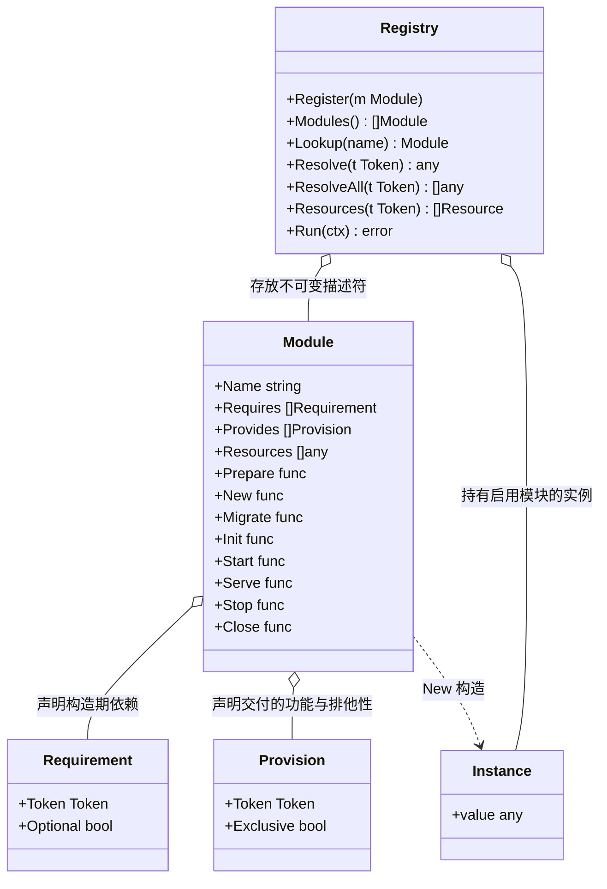
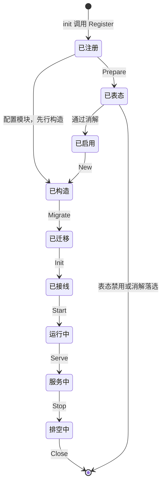

# core

## 职责

`pkg/core` 承载模块化的基础设施：

- **模块的核心数据结构**：描述符 `Module`，约束一个模块的样子。
- **注册**：模块在自身 `init` 中登记到进程级注册表。
- **查询**：凡注册表自己持有的东西都可被问到：描述符按名称、实例按功能、资源按类型、启用结果按名称，以及遍历全部已登记模块。具体方法见外部接口契约一节，那里是权威。
- **生命周期管理**：按固定阶段驱动模块的回调，并在需要顺序的阶段按依赖关系排序。

除模块机制外，`core` 还承载被多个模块共用、且不引入第三方依赖的基础类型与工具。零第三方依赖是这部分内容的准入边界。

### 非职责

- **不编码应用形态。** 一个应用可能是 HTTP 服务、gRPC 服务，或者不对外暴露任何入口的后台进程。`core` 驱动阶段，形态由模块与宿主自己决定，驱动入口不认识形态，也不为形态提供选项（[ADR-core-scope-2026-09-13](../../adr/adr-core-scope-2026-09-13.md)）。
- **不解释任何资源。** 模块声明的资源由 `core` 原样保存并供查询，它不认识其中任何一种的含义。配置 schema、命令行参数、API spec、i18n 资源，各自由需要它的模块定义类型并自行解释。
- **不认识任何具体功能。** `core` 中不出现任何功能接口的类型名。依赖取用借助泛型与反射完成，类型由调用方给出。
- **不提供任何具体功能。** 日志、数据库、缓存、HTTP 服务等一律由各自的模块承担。
- **不接管程序入口。** 宿主编写自己的 `main`，`core` 被调用，不调用宿主。
- **不提供运行期参数。** 归设置承载的那些参数由独立模块提供，`core` 不介入；配置与设置的划界判据见 [ADR-config-scope-2026-09-13](../../adr/adr-config-scope-2026-09-13.md)。

## 外部接口契约

模块机制以注册表的方法为入口，注册、查询与生命周期都在其上。进程级的那一个是包级变量：

```go
var ProcessRegistry = New()   // init 期的注册写入它
func New() *Registry          // 独立实例，其中的模块需手工登记
```

**导出的包级函数只有构造函数与泛型封装两类。** 注册表的构造函数无法是它自己的方法；泛型封装则是语言的限制所致，Go 不允许方法带类型参数，凡要靠类型参数换取类型安全的封装都只能写成自由函数。除这两类之外不新增导出的包级函数，泛型封装也不得携带方法之外的任何语义。约束的是对外契约面：未导出的实现辅助函数不受此限，它们不构成契约，也不构成包级状态。

**注册**。模块在自身 `init` 中调用，写入进程级注册表，重名直接 panic。另建的注册表不继承这些登记：要装配哪些模块就登记哪些。自注册与导出描述符并不互斥，需要被手工登记的模块可以同时导出一个返回自身描述符的函数：

```go
func (r *Registry) Register(m Module)
```

**描述符查询**。描述符在 `Run` 之后不再变化，任何阶段都可用：

```go
func (r *Registry) Modules() []Module
func (r *Registry) Lookup(name string) (Module, bool)
```

`Modules` 给出描述符的全集。单提供者的功能可以从这里按 `Provides` 声明反查它出自哪个模块；多提供者的功能反查只能得到候选集合，按名路由要靠功能接口自己提供的名字。按类型收集资源的横切机制走 `Resources`，不走这里。

**实例查询**。构造之后才有意义，按功能取：

```go
func (r *Registry) Resolve(t Token) (any, error)              // 要求恰好一个
func (r *Registry) ResolveAll(t Token) []any                  // 取全部
```

功能以类型化空指针指代。方法这一层返回 `any`，取用与断言落在调用点：

```go
v, err := reg.Resolve((*Cache)(nil))
cache := v.(Cache)
```

`core` 为这两个方法各提供一个自由泛型函数，它们自行构造功能标识并完成断言：

```go
func Resolve[T any](r *Registry) (T, error)
func ResolveAll[T any](r *Registry) []T
```

调用因此写成 `core.Resolve[Cache](reg)`。它们换来的是调用点的类型安全，不是少敲几个字符：`Token` 的构造与结果的类型断言都收进了函数里，不再可能写错。

`Resolve` 的匹配域是**声明了该功能的模块**：恰好一个这样的模块已构造，其产物即结果。一个产物碰巧实现了某功能却未在 `Provides` 中声明，取用时看不到它，声明因而是唯一权威，装配期校验与运行期取用面对同一个集合。取不到即 `ErrMissingProvider`，可选依赖的读法就是对它做 `errors.Is` 判断，随后走模块自己文档所载的默认行为（[ADR-dependency-resolution-2026-09-13](../../adr/adr-dependency-resolution-2026-09-13.md)）。缺席是一种合法配置这件事，由声明中的 `Optional` 表达，不需要第二个取用接口。

**一条交付声明与被请求的功能标识，按元素类型相同匹配，不按可赋值性。** 设 `SuperCache` 内嵌 `Cache`，交付 `(*SuperCache)(nil)` 的模块与交付 `(*Cache)(nil)` 的模块交付的是两个功能，`Resolve[Cache]` 只看到后者。

按可赋值性匹配则无法自洽：消解要把提供者按功能分组，而可赋值是偏序不是等价关系，`SuperCache` 的提供者既属于自己那一组又属于 `Cache` 那一组，「该功能的提供者」定不出唯一的分组。后果是消解放行的组合，取用时反而报 `ErrAmbiguousProvider`，与「排他冲突在消解阶段一次暴露，早于任何构造」和「装配期校验与运行期取用面对同一个集合」同时相悖。

资源查询仍按可赋值性，见资源查询一节。可赋值性说的是值与它所要满足的类型之间的关系，与一个标识如何匹配另一个标识是两回事（[ADR-capability-token-2026-09-13](../../adr/adr-capability-token-2026-09-13.md)）。

取用不按 `Requires` 过滤：只要实例已构造就能取到。依赖的依赖不会出现在自己的声明里，而取用它是合法的。`Requires` 的作用是决定构造顺序并在构造之前完成校验，不是限制可见范围。

`ResolveAll` 的匹配域与 `Resolve` 相同，同样限于声明了该功能的模块，取其中全部已构造的，零个返回空切片而非错误。返回的实例不带模块名：若需要按名字路由，那个名字是领域概念，由功能接口自己提供。

**`ResolveAll` 与 `Resources` 的返回一律按模块名字典序。** 登记顺序不可用作依据：`init` 只保证包依赖偏序，同层之间不保证，按登记顺序返回会让结果随构建而变。按名排序与该约束一致，也让依赖它的错误文本（例如配置冲突要点名哪两个模块）在各次构建之间稳定。

**资源查询**。资源是模块对外声明的只读数据，查询同样按类型：

```go
type Resource[T any] struct {
    Module string   // 声明它的模块
    Value  T
}

func (r *Registry) Resources(t Token) []Resource[any]
func Resources[T any](r *Registry) []Resource[T]      // 泛型封装
```

匹配规则与取用一致：**可赋值给目标类型的资源全部返回**。目标是接口时，实现了它的资源都算匹配；目标是具体类型时，只有该类型匹配。同一条规则覆盖两种用法，`config` 因此既能用接口收齐各家传输实现，也能用结构体精确取出自己的声明。

`Resources` 的参数指代的是资源类型，不是功能，写法与功能标识相同但含义不同：功能一定是接口，资源类型可以是任意类型。

查询结果携带模块名。资源是被动数据，没有方法可以自报身份，而消费方几乎总要用到它：冲突报错要指出是哪两个模块，i18n 资源要按模块归类，迁移要记录归属。这与 `ResolveAll` 不带模块名并不矛盾，那里取的是有方法的实例。

`core` 不认识任何资源类型。资源在 `Run` 之前全部就位，此后查询结果不再变化。`config` 用 `core.Resources[config.Schema](reg)` 收集输入项声明，`http` 模块用它收集 API spec，各自定义自己的资源类型并自行解释。

**启用结果查询**。消解完成之后，每个模块的最终结果与原因可按名取得：

```go
func (r *Registry) Enablement(name string) (Enablement, bool)
```

返回的是最终结果而非模块自己的表态：被消解禁用的模块在此表现为 `StateDisabled`，原因是消解给出的那一条。消解尚未发生时一律返回 `false`，与查一个未登记的名字同形：它承诺的是最终结果，而最终结果此时并不存在，给出任何值都会被当成结论。启动诊断固定写 `os.Stderr`，宿主无法重定向它，因为传入一个接收端只能经由 `Run` 的参数或包级设值，两者都被架构不变量排除。这个查询是宿主把同一批信息接进自己日志的合法途径：诊断保证信息不会无人察觉，查询让它可被程序取用。

**生命周期**：

```go
func (r *Registry) Run(ctx context.Context) error
```

`Run` 推进全部阶段，阻塞运行，`ctx` 取消后逆序关闭并返回。**取消是正常的停止途径，清理无失败时返回 `nil`**，不返回 `ctx.Err()`：取消由宿主自己发出，把它报成错误会迫使每个宿主去特判一个自己刚刚做出的动作。清理有失败则返回聚合后的清理错误。生命周期是一个不可分割的过程而非一对可分别调用的操作：进去就一定会出来，资源释放不依赖宿主记得调用第二个方法。宿主的 `main` 因此负责 import 所需模块、声明自己的宿主身份（见 [config](design-config.md)）、调用 `Run`、以及决定 `ctx` 何时取消。

**稳定性承诺**：`Module` 的字段与 `Registry` 的方法集是模块作者与 `core` 之间的契约，其变更会波及每一个模块。字段集限于注册表自身要解释的内容，横切机制经由 `Resources` 扩展，不改变这份契约。

## 依赖

`core` 不依赖任何模块，也不依赖任何第三方库。它位于依赖图的底部，被每一个模块 import。

这一位置是架构不变量的直接后果：`core` 的任何依赖都会落到每一个宿主的依赖清单中。

## UML 图



描述符与实例在注册表中的地位不同：描述符不可变，随 `init` 登记后不再变化；实例可变，由注册表在生命周期驱动过程中逐阶段建立。

`Requires` 与 `Provides` 都声明在功能上，不声明在模块身份上。依赖因此指向"谁提供这个接口"而不是"哪个模块"，替换实现不影响依赖方。



配置模块之外的全部已注册模块都会执行 `Prepare` 并表态，只有通过消解的进入后续阶段。落选的模块停留在已表态状态，它的 `init` 已执行、代码已编译进二进制，此后不再有回调被调用。配置模块不走表态这条边，它被先行构造后直接进入启用集。

## 核心数据结构

描述符是模块向注册表登记的全部内容：

```go
type Module struct {
    Name      string          // 模块的唯一标识，进程内唯一
    Requires  []Requirement   // 构造期依赖，声明在功能上，必须无环
    Provides  []Provision     // 本模块交付的功能
    Resources []any           // 对外声明的只读资源，core 只保存不解释

    Prepare func(ctx context.Context, reg *Registry) (Enablement, error)
    New     func(ctx context.Context, reg *Registry) (any, error)
    Migrate func(ctx context.Context, reg *Registry, instance any) error
    Init    func(ctx context.Context, reg *Registry, instance any) error
    Start   func(ctx context.Context, reg *Registry, instance any) error
    Serve   func(ctx context.Context, reg *Registry, instance any) error
    Stop    func(ctx context.Context, reg *Registry, instance any) error
    Close   func(ctx context.Context, reg *Registry, instance any) error
}
```

没有 `New` 回调的模块，其后续各阶段收到的 `instance` 是 `nil`。只含 `Resources` 的模块必然如此，配置源与格式子包、宿主声明自己身份的那个模块都属于这一类。这是模块作者与注册表之间契约的一部分：声明了后续阶段却没有 `New` 的模块，必须按 `nil` 处理它。

`Run` 只能调用一次，重复调用直接 panic。一个已经走完生命周期的注册表其实例部分不可复用，而重复调用是调用点的编程错误，与重名登记同类。

生命周期是描述符的字段，不是实例可选实现的接口。声明式的形态让注册表在驱动之前就能看到每个模块参与哪些阶段，而类型断言只能在驱动到那一步时才发现。

功能在声明与取用中以类型化空指针指代：

```go
// Token 指代一种功能，写作指向该功能接口的类型化空指针，例如 (*Cache)(nil)。
type Token = any
```

**`Token` 指代的是功能，不是实例。** 在交付声明、依赖声明与取用三处，它的含义完全一致：提供这种功能。`Resolve` 问的是"谁能提供这个功能"，而不是"把某个特定的实例给我"。同一功能因此可以有多个提供者而不矛盾，按实例身份寻址则不属于这套机制。

类型化空指针是功能的写法，不需要任何构造函数（[ADR-capability-token-2026-09-13](../../adr/adr-capability-token-2026-09-13.md)）。

代价是 `Token` 的静态类型退化为 `any`，写成 `Cache(nil)` 或误传一个实例，编译器都不会拦。注册表因此在 `Register` 中校验每个 `Token` 确为类型化空指针，不合法的当场 panic，与重名冲突同样暴露在登记的那一刻。

**功能标识的元素类型必须是接口**，`Provides` 与 `Requires` 中出现 `(*bytes.Buffer)(nil)` 这类指向具体类型的空指针即 panic。功能是模块之间相互取用的单位，取用方拿到的是一组方法而非一份内存布局；要求接口也让交付校验始终有意义，否则无从判断产物是否实现了所声明的功能。资源标识不受此限：资源是被动数据，其类型可以是任意类型。

**取用时传入非法的功能标识同样 panic，不返回错误。** 非法标识是调用点的编程错误，与数据无关，首次执行即确定地暴露；把它表达成错误，要么迫使 `ResolveAll` 与 `Resources` 为一个只可能因 bug 触发的情形添上错误返回值，要么让文档承诺一种这两个方法的签名给不出的行为。泛型封装自行构造标识，形状不会出错，但元素类型仍可能不是接口，`core.ResolveAll[int]` 因此也是 panic。

交付声明可以标注排他：

```go
type Provision struct {
    Token     Token
    Exclusive bool   // 独占该功能，不容许其他仍然启用的提供者
}

type Requirement struct {
    Token    Token
    Optional bool
}
```

模块在 `Prepare` 中表态自己是否启用：

```go
type Enablement struct {
    State  EnablementState
    Reason string   // 禁用时必填，用于启动诊断
}

type EnablementState int

const (
    StateAuto     EnablementState = iota   // 零值：不与他人冲突则启用
    StateEnabled                           // 启用
    StateDisabled                          // 禁用
)
```

判断的依据是模块自己的配置，`config` 此时已经可用，模块在 `Prepare` 中取用它读自己那份配置，与在 `New` 中的读法相同。零值是 `StateAuto`，未声明 `Prepare` 回调的模块因此等同于表态 `StateAuto`。

模块的声明因此写成：

```go
Requires: []Requirement{{Token: (*Cache)(nil)}},
Provides: []Provision{{Token: (*Store)(nil)}},
```

排他是提供方对自身的声明，不是对该功能的全局断言。一个模块无从知道别人会不会也提供同一功能，它只能说明自己要不要独占。因此不存在"各提供者声明必须一致"这类规则：任何一个排他声明在本次启动中被违反，即启动失败。

由此得到的组合是自洽的：都不排他则多个提供者共存；只有一个提供者时排他与否结果相同；有提供者声明排他而该功能在消解之后又不止一个**仍然启用的**提供者，启动失败并点名双方。未启用的提供者不参与，消解的规则见核心算法与流程一节。

`New` 不接收配置。模块在 `New` 中取得配置模块的实例，向它查询自己那份配置。配置因此不流经注册表，`core` 不需要认识任何配置接口。

`Resources` 是模块对外声明的全部只读资源，`core` 原样保存、供查询，不认识其中任何一种。资源的类型由需要它的模块定义：

```go
// pkg/config 定义，声明本模块接受哪些输入项
config.Schema{Namespace: "cache", Mounts: ...}

// pkg/http 定义，声明本模块提供哪些 API
http.Spec{...}
```

**资源是静态声明，`Run` 之前确定，此后不变。** 模块的资源随它的描述符在 `init` 期登记；宿主自己的资源在 `main` 中登记。 需要依赖配置才能决定的东西不属于资源，那是运行期交互：模块在 `Init` 阶段取到对方的功能，调它的方法登记。静态声明与动态登记分开，资源查询才能在任何阶段都给出确定结果。

哪些东西留作具名字段、哪些进 `Resources`，判据是注册表自己是否要解释它：`Name`、`Requires`、`Provides` 与阶段回调是排序和驱动所必需的，留在字段上；其余一律是资源（[ADR-module-resources-2026-09-13](../../adr/adr-module-resources-2026-09-13.md)）。

## 核心算法与流程

### 阶段

| 阶段 | 作用 | 顺序 |
|---|---|---|
| `Prepare` | 配置就位，各模块表态是否启用 | 不保证顺序，对配置模块之外的全部已注册模块执行 |
| `New` | 构造产物 | 依赖序 |
| `Migrate` | 应用已收齐的迁移集 | 依赖序 |
| `Init` | 接线与发布 | 依赖序 |
| `Start` | 启动自身服务，不接外部流量 | 依赖序 |
| `Serve` | 开始接受外部流量 | 依赖序，且在全体 `Start` 完成之后 |
| `Stop` | 停止接收新工作，开始排空 | 逆依赖序 |
| `Close` | 释放资源 | 逆依赖序 |

`Run` 依次推进 `Prepare` 到 `Serve`，任一阶段失败则回滚全部已构造的实例并返回；此后阻塞运行，`ctx` 取消时推进 `Stop` 与 `Close`。

**`Stop` 与 `Close` 收到的 context 去掉取消、保留值。** 正常停止的触发方式就是 `ctx` 被取消，把它原样递下去，任何遵守 context 的排空都会立刻返回，而 `Stop` 的职责恰恰是排空；`Run` 只收一个 `ctx`，加第二个参数被不变量排除，因此由注册表在进入停机时剥掉取消。保留值是为了让追踪、租户一类随 context 传递的东西在停机路径上仍然可用。

注册表不对停机施加超时。时长是策略，而它无处可来：`Run` 的参数被不变量排除，`core` 解释一种资源又被「不解释任何资源」排除。`Stop` 与 `Close` 的回调因此必须自己保证有界，这是模块作者与注册表之间契约的一部分。**接受的代价**：一个不肯结束的 `Stop` 会让进程停不下来，而宿主此时阻塞在 `Run` 里，没有补救手段。

`Migrate` 独立成一个阶段，因为迁移要求的时机在别处都放不下（[ADR-lifecycle-stages-2026-09-13](../../adr/adr-lifecycle-stages-2026-09-13.md)）。它必须在全部产物构造完成之后运行：迁移要写进的那个库，是数据库模块在 `New` 中建立连接之后才可达的。

数据库模块在此应用迁移。任何要访问库的模块都必须声明对数据库功能的依赖，因而必然排在它之后。`Migrate` 之后的各阶段面对的都是已迁移的 schema；`New` 整体早于 `Migrate`，所以构造阶段只应建立连接，不应读写数据。

### 配置先于一切

配置模块在 `Prepare` 阶段最先构造，由它完成命令行参数与环境变量的收集、配置源的读取与全局校验。它同时是所有模块的隐含依赖，无需任何模块在 `Requires` 中声明。

这是 `core` 对配置模块的全部特殊处理：在 `Prepare` 阶段最先构造，以及作为所有模块的隐含依赖。两者都不体现为描述符中的字段，识别依据是约定的模块名 `config`。

配置模块不执行 `Prepare` 表态，消解中视同表态 `StateEnabled`：它先于表态就已构造，没有它其余模块无从读取配置。它交付的功能因此照常参与消解：表态未禁用的第二个提供者，若声明排他且取默认表态则被传播禁用，否则在裁决阶段判为失败，都不会留到取用时才暴露。

它已在 `Prepare` 中构造，`New` 阶段跳过它；其余阶段照常执行，关闭时排在最后，因为任何模块都可能在关闭途中读配置。

**注册表中没有名为 `config` 的模块时，跳过配置引导，其余阶段照常推进。** 配置模块是启动循环的解法，不是装配的前提：没有它就没有循环可解。需要配置的模块会在取用时得到 `ErrMissingProvider`，错误指明缺少的 import，因而漏 import 不会退化为静默少一段功能。无条件要求它存在，会让只装配一小组模块的注册表也必须塞一个配置桩，而那正是另建注册表的用途。

### 启用由模块自己表态

配置就位之后，`Prepare` 对**其余全部已注册模块**执行，每个模块表态自己是否启用。配置模块不在其中，它已先行构造。判断依据是它自己的配置：没有配置连接地址的后端实现表态禁用，配置齐备的表态启用，可作为默认实现的表态 `StateAuto`。

**`Prepare` 之间不保证顺序。** 这个阶段里模块只读自己的配置并表态，除配置模块外没有任何实例存在，模块之间因此不可能有先后依赖。依赖序在此既无从建立（启用集尚未确定，依赖图还不是最终形态），也换不来任何东西。模块不得依赖 `Prepare` 的执行顺序，这与描述符不得依赖注册顺序是同一条约束。

`Prepare` 中能够取用的实例只有配置模块。业务模块的实例要到 `New` 阶段才存在，在 `Prepare` 中取用它们取不到。资源不受此限：它们在 `Run` 之前即确定，任何阶段查询都给出同一结果，配置模块正是靠这一点在最早的时机取得传输与格式的实现。

表态收齐之后，注册表消解排他冲突，得出启用集。消解只看排他交付，非排他功能有多个提供者是正常的：

**待消解的功能**是：可用集中存在模块声明排他地交付它，且该模块的表态不是 `StateDisabled`。表态与交付声明都取自 `Prepare` 结束时的快照。其余功能的多个提供者照常并存，不参与消解。

表态禁用的模块不把它的排他主张带进消解：它本次不运行，其他提供者之间没有独占之争。

消解分两步：

1. **传播**：对每个待消解的功能，若其中有模块表态 `StateEnabled`，禁用该功能中**声明排他且**表态 `StateAuto` 的提供者。
2. **裁决**：对每个待消解的功能，看传播之后仍然启用的提供者。

| 仍然启用的提供者 | 结果 |
|---|---|
| 恰好一个 | 启用 |
| 多于一个，其中至少一个声明排他 | 启动失败，`ErrExclusiveViolated` |
| 多于一个，均未声明排他 | 全部并存 |
| 零个 | 该功能没有提供者，留给依赖解析判定 |

**裁决看的是仍然启用的提供者里还有没有排他者，而不是它们的表态形态。** 被传播禁用的排他声明者与表态禁用的一样不运行，它的独占主张随之失效：默认的控制台通知声明排他、而邮件与短信两个非排他实现显式启用时，控制台退让，余下两者并存，不是冲突。

**传播只禁用排他的默认实现，不动非排他的。** 退让是排他主张的自我克制：一个默认实现声明排他，等于说"没人显式来我就独占，有人来我就让"。非排他的提供者从未主张独占，也就无所谓让不让，它要么与他人并存，要么因别人仍然生效的独占主张而使整组失败。

若连非排他的默认实现一起禁用，一个注定落选的排他默认实现会连带掐掉它们，而把那个排他实现关掉或干脆不 import 反倒让它们活下来，同一批模块的组合结果取决于一个不运行的模块是否在场。

传播只需一遍。禁用只落在排他的 `StateAuto` 上，而触发条件只看有没有 `StateEnabled`，两者不交互：禁用一个模块既不会让任何功能新获得 `StateEnabled` 提供者，也不会让它失去，因此不存在需要二次传播的连锁。

结果与遍历顺序无关：待消解集与表态都是快照常量，传播的输出是各功能禁用集的并集，裁决只读传播的结果（[ADR-module-enablement-2026-09-13](../../adr/adr-module-enablement-2026-09-13.md)）。

被消解禁用的模块若是某个非排他功能的唯一提供者，该功能随之失去提供者。这一情形不在消解中报错，留给依赖解析暴露为 `ErrMissingProvider`，错误文本需指出该提供者是被消解禁用的，以及它被禁用的原因。

排他是提供方对自身的声明，因此同一功能的提供者可以一部分排他、一部分不排他。禁用与失败的理由要按实际情形给出：被禁用者的原因是"该功能已有显式启用的提供者"，失败的原因是"仍然启用的提供者中有一个要求独占"。

`StateAuto` 因此让默认实现成为一等公民：内存实现排他交付并表态 `StateAuto`，远程实现配置齐备时表态 `StateEnabled`，于是"配了远程就用远程，否则用内存"不需要任何人维护一份模块清单。

**退让的那一方必须自己声明排他。** 内存实现声明排他、表态 `StateAuto`，才会在远程实现显式启用时让位。若只有远程声明排他而内存没有，传播无人可禁，裁决看到两个提供者且其中有排他者，反而判启动失败：不配远程能起来，配上远程起不来。一种功能若本就只该有一个实现生效，它的每个实现都应当声明排他。

多个排他提供者同时留到裁决时选择失败，而不是任选其一或全部禁用（[ADR-module-enablement-2026-09-13](../../adr/adr-module-enablement-2026-09-13.md)）。

禁用必须给出原因，它随启动诊断写入 `os.Stderr`，每个未启用的模块一行。

**诊断有多个写者，因此每行以写出它的那一方起头**，形如 `core: ` 或写出它的模块名加冒号。`core` 写未启用模块及其原因，配置模块写它自己那部分（例如前缀之下未被认领的环境变量），两者互不认识，只能各写各的；不加这个前缀，宿主在标准错误上就分不出哪一行出自谁。各行按发生时刻写出，配置模块的行因此排在消解结果之前。"启动起来了却缺一部分功能且无人察觉"是配置驱动最危险的失败，一行"模块 X 未启用，因为未配置连接地址"就把它挡在了排查之前。

启用集是表态非禁用、且未被传播禁用的模块，加上配置模块（若已登记）。不交付任何功能的模块不参与消解，只看自己的表态。

启用集确定之后，此后的每个阶段都只对启用集中的模块执行。

### 依赖与顺序

`Requires` 声明构造期依赖，解析在任何业务模块构造之前完成：每个必需的功能都要有提供者，零个是 `ErrMissingProvider`，依赖图有环是 `ErrDependencyCycle`。标注 `Optional` 的依赖缺失不构成错误，它的缺席是一种合法配置；提供者存在时可选依赖照常参与构造定序，只有提供者不存在时才跳过。

此时已构造的只有配置模块，它按回滚规则关闭。

排他冲突不在此重复校验，它已在消解阶段解决：仍然启用的提供者中若还有排他者，该功能只剩它一个。取用时 `Resolve` 对唯一性的要求是另一层保护，覆盖的是非排他功能被当作单值取用的情形。两处都不会静默挑一个。

构造完成后，注册表断言该模块声明的每个 `Provides` 功能都已交付。声明了 `Provides` 却没有 `New` 的模块因此必然失败：它的 `instance` 是 `nil`，交付不出任何东西。这是有意的，只含 `Resources` 的模块不能顺带声明交付——交付的是实例，而它根本不造实例。声明与实际交付的偏离在此暴露，而不是留给后续某个取不到依赖的模块去发现。

复杂度与启用集规模及其依赖边数成线性关系。生命周期驱动是启动时的一次性开销。

### 循环依赖

`New` 阶段要求依赖无环，构造顺序才可解。模块之间确实存在相互引用时，不在 `Requires` 中声明这条关系，而在 `Init` 阶段用 `Resolve` 取得对方：`Init` 运行时全部实例都已构造完毕，相互引用在此成立。

拆开 `New` 与 `Init` 正是为了这件事（[ADR-lifecycle-stages-2026-09-13](../../adr/adr-lifecycle-stages-2026-09-13.md)）。代价是环上的引用不出现在声明里，看不出模块之间有这条关系。

### 入口单独成一个阶段

`Serve` 与 `Start` 分开，因为入口需要的次序是"在所有人之后"，而依赖序给不出它（[ADR-lifecycle-stages-2026-09-13](../../adr/adr-lifecycle-stages-2026-09-13.md)）。HTTP、gRPC 这类模块在 `Serve` 中开始监听。

`Serve` 回调不得阻塞：`Run` 推进完该阶段才进入运行，就地阻塞会让其后的入口永远得不到调用。监听在独立协程中进行。

## 错误与失败语义

注册期的错误在登记的那一刻 panic。**判据是：仅凭这一次登记与已登记的内容即可确定的缺陷**，例如模块重名，以及声明中出现不合法的 `Token`。绝大多数登记发生在 `init`，宿主自己的登记与测试的手工登记发生在 `main` 中，都在 `Run` 之前。panic 信息必须指明冲突双方的包路径：可用集由 import 决定，冲突的另一方可能是宿主的某个依赖 import 进来的，不在宿主自己的代码里，只报告模块名不足以定位。

生命周期驱动期间的任何错误都终止启动，不降级、不跳过。哨兵错误如下：

| 哨兵错误 | 触发条件 |
|---|---|
| `ErrMissingProvider` | 必需的功能没有可取用的提供者 |
| `ErrAmbiguousProvider` | `Resolve` 要求唯一，而该功能有多个已构造的提供者 |
| `ErrExclusiveViolated` | 消解之后同一功能仍有多于一个启用的提供者，其中至少一个声明排他 |
| `ErrMissingReason` | 表态禁用却未给出原因 |
| `ErrDependencyCycle` | `Requires` 构成的依赖图有环 |
| `ErrUndeliveredCapability` | 构造完成，但声明的 `Provides` 功能未交付 |

`ErrMissingProvider` 的错误文本要区分成因：没有任何模块交付该功能，修法是 import 或启用一个提供者。文本能给出的是功能接口的类型名与它所在的包，**不是要 import 的那个包**：要 import 的是某个实现子包，而实现子包与接口包一般不同，注册表无从知道存在哪些实现。接口包恰好即实现包的情形有，例如 `config.Reader`，但那是特例不是通例。其余成因：有模块交付但它排在调用方之后构造，修法是把它声明进 `Requires` 或推迟到 `Init` 再取；提供者被消解禁用，修法见它被禁用的原因。判断所需的信息在描述符的交付声明里，注册表现成就有。

任何阶段中途失败时，**全部已构造的实例**按逆依赖序执行 `Stop` 与 `Close`，与失败发生在哪个阶段无关，随后返回原始错误。只回滚已完成该阶段的模块会漏掉那些早已构造、却尚未走到失败阶段的实例，它们持有的连接与协程无人释放。

由此 `Stop` 与 `Close` 必须容忍 `Init` 或 `Start` 未曾执行：回滚路径上它们会被调用在一个从未启动的实例上。这是模块作者与注册表之间契约的一部分，不是模块可以假设不会发生的情形。

回滚期间的 `Stop` 与 `Close` 失败被聚合并附在原始错误之后，不取代它：终止启动的原因是首个失败，而非清理途中的次生失败。

`Migrate` 已经施加的数据变更不在回滚范围内，也无法回滚。该阶段之前失败不会改动库结构，而该阶段内部失败会留下已施加的部分，这是迁移这件事本身的性质，不是驱动能补上的缺口。

`Stop` 阶段的回调失败不中断该阶段：停止通知失败不能挡住随后的 `Close`。`Close` 阶段的失败被聚合后一并返回。

## 并发与事务边界

注册表的描述符部分在 `Run` 之前写入，此后只读。生命周期驱动本身是单协程的：阶段之间严格有序，同一阶段内按顺序逐个调用回调。

实例部分在驱动完成后可被多协程并发读取。模块实例自身的并发安全由模块负责。

## 扩展点

新增一种跨切面机制不修改 `core`：该机制自己定义一个资源类型，需要声明它的模块把它放进 `Resources`，机制本身用 `core.Resources[T]` 收集。

`config` 走的正是这条路：它定义 `config.Schema` 一个资源类型，`core` 对它一无所知。`http`、`i18n`、迁移等机制同理。

`core` 因此不会随横切机制的增加而膨胀成一组声明位点，`Module` 的字段集保持为"注册表自己要解释的那些"。

## 实现状态

| 功能 | 状态 | 代码 |
|---|---|---|
| 描述符与注册 | 已实现 | `pkg/core/module.go`、`pkg/core/registry.go` |
| 功能标识与校验 | 已实现 | `pkg/core/token.go` |
| 描述符与实例查询 | 已实现 | `pkg/core/query.go`、`pkg/core/generic.go` |
| 资源查询 | 已实现 | `pkg/core/query.go` |
| 启用表态与排他消解 | 已实现 | `pkg/core/enablement.go` |
| 依赖解析与顺序 | 已实现 | `pkg/core/depgraph.go` |
| 生命周期驱动与回滚 | 已实现 | `pkg/core/run.go`、`pkg/core/rollback.go` |
| 启动诊断 | 已实现 | `pkg/core/diagnostics.go` |
| 哨兵错误 | 已实现 | `pkg/core/errors.go` |
