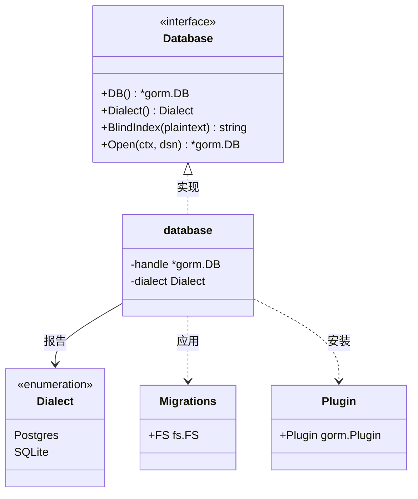
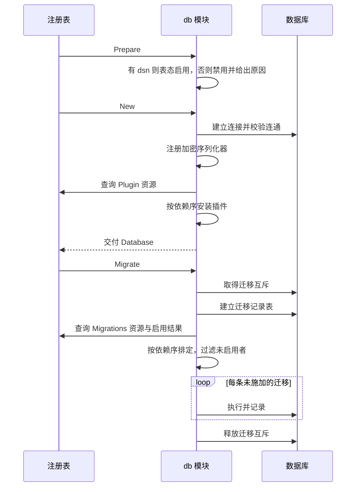

# db

## 职责

- 依据配置建立到数据库的连接，交付给需要访问库的模块。
- 承担不需要上层概念的语句级横切能力：软删除与字段级加密（[ADR-db-scope-2026-09-14](../../adr/adr-db-scope-2026-09-14.md)）。
- 安装各模块声明的 GORM 插件，装完才交付连接。
- 收齐各模块声明的迁移集，在 `Migrate` 阶段按依赖序应用，并记录已施加的部分使重复启动幂等。
- 提供自建额外连接的途径，供访问配置给出的那个库之外的库。
- 关闭连接，释放连接池中的全部连接。

本发布单元由接口包与实现子包组成：`pkg/db` 根包提供功能接口、资源类型与各子包共用的逻辑，自身不注册模块；`pkg/db/postgres` 与 `pkg/db/sqlite` 各注册一个模块，模块名为 `db.postgres` 与 `db.sqlite`，交付同一个功能并各自声明排他。模块名是它在诊断输出与启用结果查询中的身份，与它的配置命名空间同名。下文的"本模块"指其中被启用的那一个。

本发布单元是 GORM 的封装，接口面直接用 `*gorm.DB` 表达（[ADR-module-packaging-2026-09-14](../../adr/adr-module-packaging-2026-09-14.md)）。查询构造、模型映射、关联加载与事务 API 都由 GORM 提供，本模块不在其上另加一层。

### 非职责

一种横切能力落在本模块之内还是之外，判据是它除了这条语句本身，还需不需要一个产生于依赖图上层的概念（[ADR-db-scope-2026-09-14](../../adr/adr-db-scope-2026-09-14.md)）。

- **不认识租户，不按租户过滤。** 按租户过滤要知道当前是哪个租户，而租户标识产生于本模块之上。租户隔离由租户模块实现，它定义自己的模型约定并声明相应的插件，经本模块的插件扩展点接入。
- **不提供审计捕获。** 它要知道操作者是谁、记录写到哪里去，两者都产生于本模块之上，同样经插件扩展点接入。
- **软删除不记录删除者。** 删除时间本模块自己就能给出，删除者是操作者身份，落在判据的另一边；需要它的宿主在自己的插件里补。
- **不定义事务传播机制。** 事务由调用方用 GORM 自己的 API 开启，本模块不提供跨模块传递事务句柄的通道。
- **不承载运行期可变的参数。** 判据是该值是否在数据库可用之前就被需要；连接信息在其列，随后可调的参数不在（[ADR-config-scope-2026-09-13](../../adr/adr-config-scope-2026-09-13.md)）。
- **额外的连接不进装配面。** 经 `Open` 建立的连接不由本模块持有、不施加迁移、不参与依赖定序，也无法被别的模块按功能取用；它是调用方自己的东西（[ADR-db-multiplicity-2026-09-14](../../adr/adr-db-multiplicity-2026-09-14.md)）。
- **不编写任何迁移。** 表属于声明它们的模块，本模块只应用。
- **不提供反向迁移。** 迁移只有前进方向。撤销一次已施加的变更，由声明它的模块写一条新的前进迁移完成，本模块不认识"回退到某个版本"这件事。

## 外部接口契约

**交付的功能**。功能标识的元素类型必须是接口，而 `*gorm.DB` 是具体类型，因此交付的是一个窄接口，由它给出句柄：

```go
type Dialect string

const (
    Postgres Dialect = "postgres"
    SQLite   Dialect = "sqlite"
)

type Database interface {
    DB() *gorm.DB
    Dialect() Dialect
    BlindIndex(plaintext string) string
    Open(ctx context.Context, dsn string) (*gorm.DB, error)
}

func Close(*gorm.DB) error
```

`DB` 返回的句柄已装好全部已声明的插件。`Dialect` 供调用方在原生 SQL 上按方言分支——占位符写法与函数名在方言之间有差异，GORM 的查询构造器屏蔽了这部分，绕过它写的语句没有。方言的取值同时是迁移集中子目录的名字，新增一种方言即在这个集合里增加一个取值。

实现子包的交付声明写作 `Provides: []core.Provision{{Token: (*Database)(nil), Exclusive: true}}`，排他即由此而来。

取用写作 `core.Resolve[db.Database](reg)`。访问库的模块在 `Requires` 中声明 `(*db.Database)(nil)`，因而必然排在本模块之后构造，也排在迁移之后。

**额外的连接**。配置给出的那个库经模块机制交付，是唯一能被 `Requires` 声明和 `Resolve` 取用的；访问别的库——只读副本、另一个系统的库、一次性的数据来源——用 `Open` 自建。

自建的连接与交付的那个装配一致：同一个方言，同样装好已声明的插件与加密序列化器。换一个库不会因此失去它们，代价是连不了另一种引擎的库——那要求那个引擎的实现也被启用，而排他不允许。

它沿用同一份连接池参数：`max-open-conns` 这些输入项作用于本模块建立的每一个连接，不只是交付的那个。需要别的池形状的调用方，这里没有旋钮。

它不施加任何迁移。迁移集是各模块声明给配置那个库的，第二个库的 schema 由调用方保证，缺表的表现是运行期的查询失败。

它也不由本模块持有：自建的连接有自己的连接池，与交付的那个互不相干，调用方在自己的 `Close` 阶段用包级的 `Close` 释放它。`Close` 是包级函数而不是 `Database` 的方法，因为关闭一个句柄用不到本模块的任何状态；它可重入，重复调用不报错。漏关就是连接泄漏，本模块无从代为释放。

**软删除**。GORM 自带软删除：模型带 `gorm.DeletedAt` 字段即生效，查询自动排除已删除的行，`Delete` 改为写入删除时间而不是物理删除，`Unscoped()` 绕过这层过滤。本模块封装 GORM，这件事因而随句柄一并交付，模型按 GORM 的约定声明即可；本模块不另造一套标记接口，也不在其上加一层。

物理删除仍然是 `Unscoped().Delete`，本模块不对它设门槛——谁可以物理删除是权限问题，由认识操作者的那一层决定。

**字段级加密**。模型字段标注 `gorm:"serializer:encrypted"` 即落库前加密、读出后解密，密钥来自配置。序列化器由本模块注册到 GORM，时机与插件安装相同：建立连接之后、交付句柄之前。

加密字段参与不了等值查询——同一明文每次加密的结果不同，`WHERE col = ?` 匹配不上。需要按这样的字段查找时，模型另带一个盲索引列，存放明文的确定性摘要，查询针对那一列。

摘要由 `BlindIndex` 算出。它是 `Database` 的方法而不是包级函数，因为它要用到密钥，而密钥随实例而来——包级设值被架构不变量排除。

**盲索引列由写入方自己填。** 序列化器作用于单个字段，写不了第二列，本模块因此不会替模型填上它。漏填不报错：那一列留空，按它做的等值查询查不到任何行，而行本身已经正常写进去了——失效的形态是查不到，不是报错。

`BlindIndex` 对传入的字符串原样计算，不做任何规范化。大小写、空白、电话号码的写法这类差异因而必须由调用方在写入与查询两侧以同样的方式抹平；两侧不一致时，摘要不同，查询同样是查不到而不是报错。

字段加密与盲索引不共用密钥，两者各自使用从配置的那一份根密钥确定性派生出的子密钥；宿主因而只管一个根密钥，用途之间互相隔离。

密钥轮换时，退役的根密钥继续用于解密，旧密文因而仍然可读。盲索引没有这条退路：一列摘要只在一个密钥下匹配得上，换了根密钥就要把每一行重算一遍，这件事不由本模块触发。

**迁移集资源**。带表的模块声明它：

```go
type Migrations struct {
    FS fs.FS   // 按方言分子目录，每个子目录内是该方言的迁移文件
}
```

子目录名即方言名。不含当前方言子目录的声明视为该方言下零条迁移，不是错误——一个只支持某一种方言的模块由此表达它不支持另一种。

声明的类型是一个结构体，而不是 `fs.FS` 本身。资源查询按可赋值性匹配：`embed.FS` 满足 `fs.FS`，而国际化资源、模板资源这类声明大多也是 `embed.FS`，以 `fs.FS` 为资源类型会把它们一并收成迁移集。

**插件资源**。承担语句级横切能力的模块声明它：

```go
type Plugin struct {
    Plugin gorm.Plugin
}
```

本模块原样安装，不解释其内容。

同样包一层结构体，理由与 `Migrations` 相同而强度不同：`gorm.Plugin` 要求 `Initialize(*gorm.DB) error`，无关声明不易意外满足它，包装在这里主要是让资源的声明形态一致。

**稳定性承诺**。`Database`、`Migrations` 与 `Plugin` 是本模块与其他模块之间的契约。`*gorm.DB` 出现在契约面上，GORM 的不兼容升级因此直达依赖方，这是封装型模块接受的代价（[ADR-module-packaging-2026-09-14](../../adr/adr-module-packaging-2026-09-14.md)）。

**配置**。输入项由各实现子包模块声明，**各自挂在自己的命名空间下**：`db.postgres` 与 `db.sqlite`。互斥的实现必须划分各自的输入项路径——清单收集自全部已注册模块，包含本次不会启用的那些，同一路径上的两份声明只要都被 import 就是冲突，且这个冲突在收集阶段检出，早于排他消解（见 [config](design-config.md)）。分开之后，同时 import 多个实现是合法形态：只提供其中一个的连接信息，其余表态禁用，用哪个方言由配置选定。

每个命名空间下的输入项相同：

| 键 | 作用 | 默认值 |
|---|---|---|
| `dsn` | 连接定位符，标为敏感 | 无 |
| `max-open-conns` | 连接池的最大连接数 | 25 |
| `max-idle-conns` | 连接池保留的空闲连接数 | 5 |
| `conn-max-lifetime` | 一条连接的最长寿命 | 30 分钟 |
| `encryption-key` | 派生加密与盲索引子密钥的当前根密钥，标为敏感 | 无 |
| `encryption-retired-keys` | 仍用于解密的退役根密钥，标为敏感 | 空 |

需要跨进程互斥的实现另有一项 `migration-lock-timeout`，默认 5 分钟，含义见迁移的应用一节；不需要互斥的实现不声明它。

`dsn` 不写入日志，帮助输出也不回显——它承载凭据。各方言的 `dsn` 形态本就不同，服务器地址与文件路径不是一回事，键名随实现分开与此一致。

`encryption-key` 未提供时序列化器照常注册，此后任何一次加解密都失败。本模块无从在启动时判断这是不是缺陷：哪些模型带加密字段，GORM 要到第一次用到那个模型才解析，而那发生在启动之后。

`dsn` 未提供时本模块表态禁用并给出原因，而非启动失败：是否需要数据库由装配决定。此时若有模块在 `Requires` 中声明了数据库功能，它在依赖解析中得到 `ErrMissingProvider`，错误指向本模块被禁用的原因（见 [core](design-core.md)）。

## 依赖

`pkg/db` 根包 import GORM、`pkg/core` 与 `pkg/config`：GORM 出现在接口面上，`core` 用于资源与实例查询，`config` 用于声明输入项。

实现子包 import 根包与自己那个方言的驱动，`pkg/db/postgres` 与 `pkg/db/sqlite` 互不 import。驱动不出现在接口面上，换一个实现子包不改变任何依赖方的代码。

迁移的应用与插件的安装是各实现子包共用的逻辑，位于根包，由各子包在自己的阶段回调中调用；方言特定的部分限于驱动的打开与连接池的设置。

方向满足架构不变量：本发布单元位于 `core` 与 `config` 之上、全部访问库的模块之下，不 import 其中任何一个。承担插件能力的模块 import 根包，根包不反向 import 它们——它不认识任何一种插件实现的能力。

## UML 图

下图给出交付面与资源类型的关系。`Database` 是唯一被取用的功能，`database` 代表实现子包中满足它的类型，每个子包各有一个；`Migrations` 与 `Plugin` 由别的模块声明、由本模块消费，箭头方向因而与取用相反。图中画不出的约束是时机：插件在 `New` 内安装完毕，迁移在 `Migrate` 中应用，两者都早于任何依赖方开始工作。



下图给出装配期的次序。它要固定的是：连接建立与插件安装同在 `New` 内完成，取用方不存在拿到未装插件句柄的路径；迁移在全部产物构造完成之后才施加，失败的构造不会改动库结构；访问库的模块依赖本模块的功能，因而排在它之后，它们自己的 `Migrate` 回调都在迁移施加之后运行。只声明迁移集、自己不访问库的模块没有这条依赖，其回调与本模块的相对次序不保证——它的表照常建立，因为建表由本模块统一完成，与该模块自己是否有回调无关。



## 核心数据结构

**迁移记录表**。一行记录一条已施加的迁移，主键是声明它的模块名与文件名两列的组合。模块名从资源查询结果中取得——资源是被动数据，无法自报身份，归属由查询结果携带。

该表自身用一条无条件可重入的建表语句创建，每次应用迁移之前执行，不经由任何模块的迁移集。它没有能被自己追踪的时机：读它才能知道哪些迁移已施加，而它得先存在（[ADR-db-migration-2026-09-14](../../adr/adr-db-migration-2026-09-14.md)）。建表语句不使用任何方言特有的语法，因而不分方言。

**方言**。取值是一个封闭集合，每个实现子包固定其中一个。运行时用哪一种由可用集与配置共同决定：import 了哪些子包决定有哪些可选，提供了其中谁的连接信息决定启用哪个。只 import 一个子包时，两者退化为同一件事。

## 核心算法与流程

### 本模块自身的阶段行为

以下是实现子包模块的阶段行为，各子包相同。

`Prepare` 表态：自己命名空间下的 `dsn` 已提供则启用，没有则禁用并给出原因。

`New` 建立连接，随后注册加密序列化器并安装插件，都在本阶段内完成。本阶段只建立连接，不读写数据：其余模块的构造仍可能失败，而失败的启动不该已经改动过库结构。连接的建立与连通性校验绑定到本阶段收到的 `ctx`，宿主要给它设时限就设在传给 `Run` 的那个 `ctx` 上；本模块不另立一个连接超时的输入项，驱动自己的超时参数写在 `dsn` 里。

`Migrate` 应用迁移集。

`Close` 关闭连接池。`Stop` 无动作——排空是各模块对自己在途工作的责任，连接在 `Close` 中统一释放。`Close` 可重入：回滚路径会在一个从未走到 `Init` 的实例上调用它。

### 插件的安装

从 `core.Resources[db.Plugin](reg)` 取得全部声明。资源查询按模块名字典序返回，而安装次序影响 GORM 回调链的次序，因此按声明它们的模块的依赖序重排：依赖序由各模块 `Requires` 构成的偏序给出，从 `reg.Modules()` 得到。同层之间没有依赖关系，仍按模块名字典序，使结果在各次构建之间稳定。

注册到同一处理器的多个插件，其相互次序由它们所属模块之间的依赖声明决定；没有这条声明就没有次序保证。

### 迁移的应用

建立记录表，读出其中已施加的条目。

从 `core.Resources[db.Migrations](reg)` 取得全部声明，按声明模块的启用结果过滤——`reg.Enablement` 报告未启用的模块，其表不建。

按依赖序排定模块，模块内按迁移文件名的字典序排定。文件名因此是模块内顺序的唯一依据，`0001_` 这样的前缀是让字典序与预期顺序一致的手段。

只读取与当前方言同名的子目录。逐条比对记录表，未施加的执行并记录，已施加的跳过。一条迁移的执行与它的记录落在同一个事务里，"执行了但没记上"因而不会发生。

**这条保证依赖方言把 DDL 纳入事务**，PostgreSQL 与 SQLite 都如此。不具备这一点的方言，DDL 在事务之外生效而记录随事务回滚，留下一条已施加却没有记录的迁移；下一次启动重做它，重做一条已经生效的建表语句会失败，失败暴露在那一次启动而非施加的当时。方言是否把 DDL 纳入事务，因而是实现子包的准入条件。

**整个应用过程在一次跨进程互斥之下进行**，从建立记录表起，到最后一条迁移施加完毕为止。多副本部署首次启动时，多个进程同时走到这一步：没有互斥，它们各自读记录表都得到"未施加"，随后第二个进程的建表语句因对象已存在而失败，该副本启动不起来。互斥把它们排成队列，后到的进程等前一个做完，此时它读到的记录表已是完整的，无事可做。

互斥由方言实现提供，取得与释放都在应用过程的两端，不在任何一条迁移自己的事务里面——它协调进程之间的次序，不改变一条迁移执行与记录的原子性。等待是有界的：超过 `migration-lock-timeout` 仍未取得即 `ErrMigrationLockTimeout`，而不是无限等下去，一个卡住的副本因此不会让其余副本一起挂起。

不出现在多副本部署中的方言不需要互斥。多个进程共享一个 SQLite 文件不是它的部署形态，为它加一道互斥，防的是这个方言在受支持的装配里够不到的风险。

## 错误与失败语义

启动期的失败一律终止启动。本模块自己判定的失败对应以下哨兵错误，每条都保持穿过它的错误链完好，包裹一律用 `%w`：

| 哨兵错误 | 触发条件 |
|---|---|
| `ErrConnectFailed` | 驱动打开失败，或连通性校验未通过 |
| `ErrPluginFailed` | 一个已声明的插件安装失败 |
| `ErrMigrationFailed` | 一条迁移执行失败，或迁移记录表读写失败 |
| `ErrMigrationLockTimeout` | 超时仍未取得迁移互斥 |

每条错误的文本给出修复动作所需的信息。`ErrConnectFailed` 点名方言与失败的环节，**不回显定位符**：它承载凭据，且会出现在诊断输出中。这一条同样用于 `Open` 在运行期建立连接失败——补救动作与启动期相同，都是检查那个定位符与它指向的服务，因而不另立一条。`ErrMigrationFailed` 落在某一条迁移上时，点名声明它的模块与文件名——要修的是声明它的那个模块，而本模块无从知道该怎么改它；落在记录表的读写上时没有这样一条可点名，文本给出失败的操作。两者共用一条哨兵，因为宿主的补救动作相同。`ErrMigrationLockTimeout` 单列，是因为它的补救动作不同：要查的是另一个副本为何迟迟没有做完，或者这个时限给得是否太短，而不是去改哪一条迁移。

以上都是启动期的失败。加解密在运行期发生：密钥缺失、密文损坏、密钥与密文不匹配都在那时暴露，由 GORM 把序列化器的错误带回调用点。本模块不为它们另立哨兵——启动期的哨兵表供宿主在启动失败时分类，而运行期的错误落在具体那一次查询上，由发出它的代码处理。

`Migrate` 中途失败会留下已施加的部分。该部分不在回滚范围内，也无法回滚：注册表的回滚只驱动 `Stop` 与 `Close`，而数据变更不因此撤销。这是迁移这件事本身的性质。

未启用模块的表不建，而一个已启用模块的迁移可能引用它们。这类引用在启动时表现为 `ErrMigrationFailed`，不在声明时暴露——本模块不解析迁移文件的内容，无从预先判断一条语句引用了什么。

## 并发与事务边界

`*gorm.DB` 底层持有连接池，可被多协程并发使用，本模块不在其上另加锁。加密序列化器同样会被多协程并发调用，它不持有可变状态：密钥在注册时取得，此后只读。

装配期的建立连接、安装插件与应用迁移都发生在生命周期驱动的单协程中，此后句柄只读。

本模块不定义事务传播机制。事务由调用方用 GORM 自己的 API 开启，事务句柄在调用方内部传递；跨模块传递一个进行中的事务不在本模块的契约内。声明了插件的模块要自己保证其回调在事务内外行为一致——本模块不区分句柄当前是否处在事务中。

迁移的事务边界见迁移的应用一节：一条迁移的执行与记录同属一个事务，条与条之间不是。进程之间的协调也在那里——同一个库上同时启动的多个进程，其迁移过程互斥。

## 扩展点

**插件。** 语句级的横切能力经此接入：声明一条 `Plugin` 资源，本模块在交付句柄之前安装它。这是租户隔离、审计捕获这类需要上层概念的能力作用于本模块所交付句柄的唯一途径，也是本模块把它们排除在自身职责之外的前提（[ADR-db-scope-2026-09-14](../../adr/adr-db-scope-2026-09-14.md)）。

本模块不校验插件装对了：它不认识插件的内容，一个声明了却对某类模型不生效的插件，在这里表现为安装成功。这一层的校验属于声明该插件的模块。

**方言实现。** 新增一种方言即新增一个实现子包，绑定该方言的驱动，交付 `Database`；接口包在此只增加 `Dialect` 的一个取值，功能接口与资源类型都不变。各模块的迁移集增加一个同名子目录即支持该方言，不增加则视为不支持。方言必须把 DDL 纳入事务，否则迁移的执行与记录不再原子；出现在多副本部署中的方言还要提供跨进程互斥。两者都见迁移的应用一节。

## 实现状态

| 能力 | 状态 | 代码 |
|---|---|---|
| 连接的建立与关闭 | 未实现 | — |
| 额外连接的自建 | 未实现 | — |
| 软删除 | 未实现 | — |
| 字段级加密与盲索引 | 未实现 | — |
| 插件的安装 | 未实现 | — |
| 迁移的收齐与应用 | 未实现 | — |
| 迁移的跨进程互斥 | 未实现 | — |
| PostgreSQL 实现子包 | 未实现 | — |
| SQLite 实现子包 | 未实现 | — |
