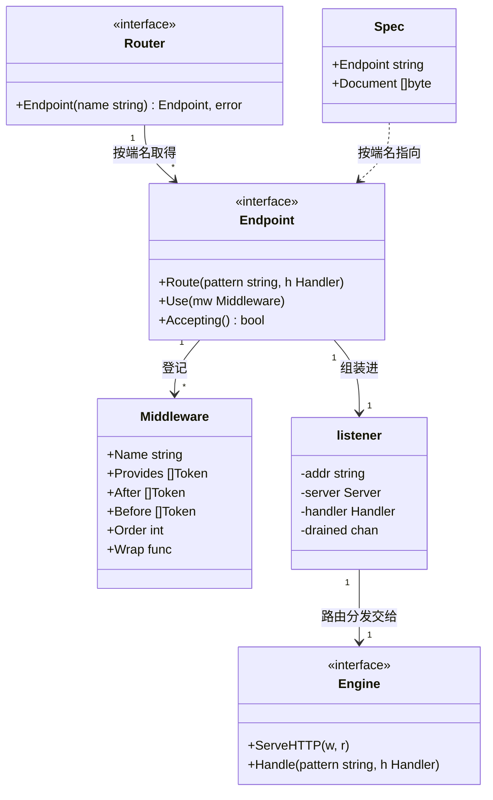
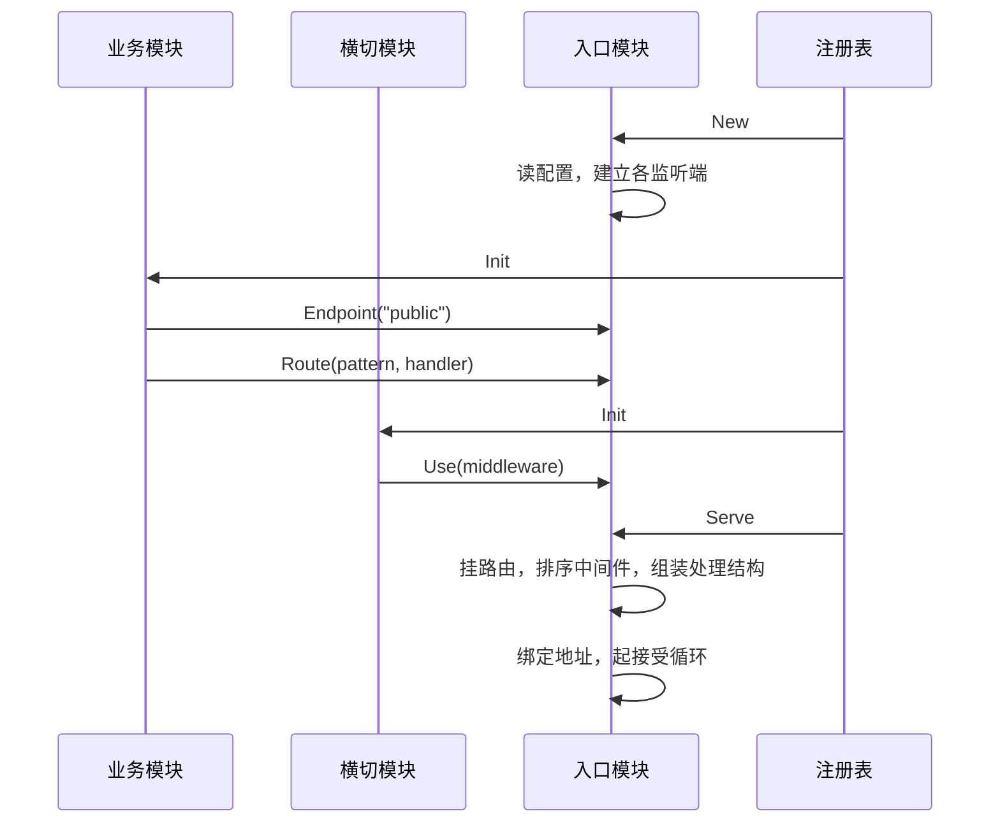
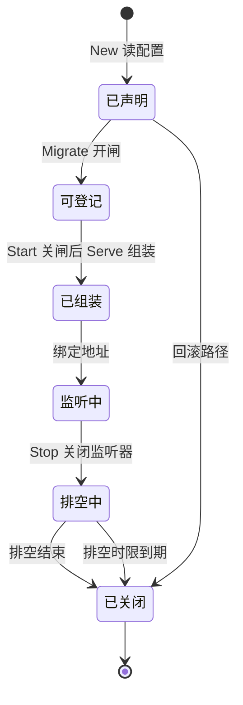

# http

## 职责

- 依据配置打开各监听端，在 `Serve` 阶段绑定地址并开始接受请求。
- 提供路由与中间件的登记面，只在 `Init` 阶段接受写入。
- 按各中间件声明的约束与数值组装每个监听端的链。
- 建立请求上下文，把日志模块的 logger 注入其中，供链上各层与 handler 取用。
- 按两拍停机：`Stop` 停止接受新请求，`Close` 等待在途请求排空。
- 报告各监听端是否仍在接受请求。
- 定义资源类型 `Spec`，供模块声明自己的 OpenAPI 文档片段，并在启动时校验其形状。
- 提供请求体解码、校验与 JSON 响应的工具，供 handler 取用。

登记面用 `net/http` 的类型表达，中间件写作 `func(http.Handler) http.Handler`。**本模块的接口包不暴露任何第三方类型**：路由引擎由实现子包绑定，它的类型到不了登记面，取用本模块的宿主因而不承受任何路由库的依赖（[ADR-http-surface-2026-09-14](../../adr/adr-http-surface-2026-09-14.md)）。

### 非职责

- **不提供声明式的校验规则。** 工具调用类型自身的校验，规则由该类型自己实现。
- **不提供 JSON 之外的请求体格式。** 别的格式由 handler 自己解析，工具不设格式协商。
- **不认识任何具体功能。** 认证、租户、限流是各自模块的事，本模块只按它们声明的约束排序，不知道任何一层做什么（[ADR-http-middleware-2026-09-14](../../adr/adr-http-middleware-2026-09-14.md)）。
- **不定义统一的错误响应形状。** 响应体的约定属于 API 的设计，由提供该 API 的模块决定；本模块不拦截 handler 的输出。
- **不决定哪些路由免于认证。** 路由的准入策略归实现准入的那个模块，它以中间件的形式接入。
- **不提供路由级中间件。** `Use` 登记的层作用于该端的全部路由。只对一部分路由生效的层，由那些路由的 handler 自己包，或者把它们分到另一个监听端。
- **不判定监听端是否健康。** 本模块报告它是否仍在接受请求，把这个事实解读成健康与否归读取方，本模块不定义健康的含义，也不提供探活路由。
- **不合并 OpenAPI 片段，也不发布它们。** 本模块保存各模块声明的片段并校验其形状，把它们合成一份完整规格、或挂一条路由把它提供出去，都归读取方。
- **不签发或轮换 TLS 证书。** 监听端的配置承载证书的位置，证书从哪里来、何时更换不在本模块范围内。
- **不承载运行期可变的参数。** 判据是该值是否在数据库可用之前就被需要；监听地址与超时在其列（[ADR-config-scope-2026-09-13](../../adr/adr-config-scope-2026-09-13.md)）。

## 术语表

| 术语 | 英文 | 含义 |
|---|---|---|
| 监听端 | endpoint | 本模块配置中具名的一个监听地址，连同它自己的中间件链与路由表。本文档中这个词指一个监听的套接字，不指一条 API 路径。 |

## 外部接口契约

本模块交付一个功能，定义一种资源类型供其他模块声明，另有一组供 handler 取用的工具。

**交付的功能**。功能标识的元素类型必须是接口，取用写作 `core.Resolve[http.Router](reg)`：

```go
type Router interface {
    // Endpoint 取得一个已声明的监听端。任何阶段都可以调用。
    Endpoint(name string) (Endpoint, error)
}

// Endpoint 是一个监听端上的登记面。
type Endpoint interface {
    Route(pattern string, h nethttp.Handler)
    Use(mw Middleware)
    Accepting() bool
}
```

`nethttp` 是 `net/http` 在本包内的别名——本包自身叫 `http`，引用标准库时要区分开。

`Endpoint` 在端名未声明时返回错误，因为端的集合来自配置这份数据。`Route` 与 `Use` 不返回错误：登记不上的只有调用点的编程错误，它们当场 panic，与 `core` 对非法功能标识、对重名登记的处理同类（见 [core](design-core.md)）。`Wrap` 为 `nil`、`Provides`、`After` 与 `Before` 中出现非法的功能标识、以及路由引擎判为非法的模式，都属于这一类——模式是代码里写死的字符串，写错它与数据无关。登记时用一台独占的引擎单独试挂即可把它与冲突分开。

同一个端上的模式**冲突**不属于这一类：登记只记录声明，两条模式是否冲突要到 `Serve` 组装时才谈得上，那时报出的是启动失败。

功能标识是否合法，判据与 `core` 的同一条（元素类型必须是接口）。`core` 未导出它的判定，本模块自建一份，并以一条测试比对两者的结论——拿 `core` 的公开行为当基准，两份规则漂移时那条测试会红。

**`core` 不会导出这个判定**：它导出的包级函数受架构不变量约束，限于注册表的构造函数、进程级注册表变量、哨兵错误与需要类型参数的泛型封装，判定函数不在其中。本模块这份判定与那条比对测试因而是常设的，不是等上游补齐的临时措施。

本模块排他地交付 `(*Router)(nil)`：两个入口实现同时启用时，登记方无从知道自己登记到了哪一个，而"只能整体取出"对登记没有意义。

**排他声明多数时候并不是冲突真正暴露的地方。** 两个实现子包共用 `http` 这个配置命名空间，同名输入项在 `config` 收集清单时就会失败，走不到消解阶段；同名登记更早，`core.Register` 在 `init` 期即 panic。排他声明因而是一条契约陈述，它在两个实现各自声明了不相交输入项这种情形下才是实际的拦截点。

**登记只在 `Init` 阶段成立**，此外的写入一律 panic。最终 handler 在 `Serve` 阶段组装一次，此后不变（[ADR-http-routing-2026-09-14](../../adr/adr-http-routing-2026-09-14.md)）。

读不受这道闸门限制：`Accepting` 报告该端此刻是否仍在接受请求，任何阶段都可以调用，绑定之前与停机之后都返回 `false`。

**中间件**。一层中间件连同它对自身位置的声明：

```go
type Middleware struct {
    Name     string       // 只用于诊断：panic 文本与启动时列出的链
    Provides []core.Token // 本层在链上代表哪些功能，供他人指向
    After    []core.Token // 本层位于这些功能的中间件之内
    Before   []core.Token // 本层位于这些功能的中间件之外
    Order    int          // 约束未定之处的偏好，小者靠外
    Wrap     func(nethttp.Handler) nethttp.Handler
}
```

`After` 与 `Before` 是硬约束，`Order` 只在硬约束未定的自由度内起作用，两者因而不会冲突（[ADR-http-middleware-2026-09-14](../../adr/adr-http-middleware-2026-09-14.md)）。

**`Provides` 是约束能够落地的前提**：`After` 与 `Before` 指向功能，而链上哪一层代表哪个功能，只能由那一层自己声明。登记面拿不到登记方的身份——`Endpoint` 不带它，`core` 不提供「当前正在 `Init` 的模块」这样的查询，而本模块允许在协程里登记，调用栈也就不成立。`Provides` 为空是合法的，代价是无人能指向这一层。

**本模块不校验 `Provides` 与登记方描述符里 `Provides` 的一致性**，同样因为它不知道登记方是谁。一层因此可以声称代表一个它所属模块并不交付的功能。

声明写成：

```go
// 追踪模块：本层代表追踪，位于恢复层之内，此外不关心
ep.Use(http.Middleware{
    Name:     "trace",
    Provides: []core.Token{(*tracing.Tracer)(nil)},
    After:    []core.Token{(*recovery.Recovery)(nil)},
    Wrap:     trace,
})

// 恢复模块：不点名任何功能，只要求最外层
ep.Use(http.Middleware{
    Name:     "recover",
    Provides: []core.Token{(*recovery.Recovery)(nil)},
    Order:    -100,
    Wrap:     catchPanic,
})
```

**引擎接缝**。实现子包把自己的路由引擎交进来的席位，只出现 `net/http` 的类型：

```go
type Engine interface {
    nethttp.Handler
    Handle(pattern string, h nethttp.Handler)
}
```

它是接口包与实现子包之间的契约，不是给登记方用的：业务模块经 `Endpoint` 登记，不碰 `Engine`。

**接缝要求实现子包把挂载的拒绝归因到一对模式**：被拒的那一条，以及已挂载的哪一条与它冲突。根包只看得见"挂载被拒"这一个事实，引擎按什么判定它无从知道；归因只有绑定引擎的那一层做得了。标准库那一支可以把已挂载的每条与被拒的那条两两放到一台独占的引擎上复现，别的引擎用它自己的途径。

**归因不出来时错误要说明这一点，不退化成只点名被拒的那条。** 那不是正常路径，而是实现子包没有满足接缝的要求。`Engine` 存在的理由就是换实现，一条只对某一个引擎成立的诊断承诺，换了实现就会悄悄失效。

**这条义务由一个可选接口承载**：实现子包的引擎**可以额外满足**下面这个方法，根包在挂载被拒时用类型断言取用，取不到就走上一条路径。

```go
type refusalAttributor interface {
    // AttributeRefusal 返回被拒的模式与哪一条已挂载的模式冲突，答不出时 ok 为假
    AttributeRefusal(refused string, mounted []string) (conflicting string, ok bool)
}
```

语义三条：

- 实现了它，就由它把拒绝归因到一对模式——被拒的那条，以及已挂载的哪一条与它冲突——根包据此点名两条；
- 没实现，或实现了但答不出（`ok` 为假），根包说明归因失败本身，不退化成只点名被拒的那条；
- 它是**可选**的：`Engine` 上不出现这个方法。

**归因不进 `Engine`，也不作为接缝之外的第二个参数。** `Engine` 必须继续被 `*nethttp.ServeMux` 原样满足——标准库那一支正是这条接缝存在的意义的直接体现，往 `Engine` 上加一个方法，等于把标准库的 `ServeMux` 判成不合法的引擎。改 `Module(name, newEngine)` 的签名、再挂一个归因参数同样不行：入口工厂的签名要为一件事改动，而这件事只对成对判定的引擎谈得上。在接缝之外单独传一个归因器，则让归因器与它所描述的引擎成为两个可以各自漂移的东西——归因对不对，只有绑定引擎的那一层知道。

**承载形态的残余代价是它只能写在散文里**：把 `Engine` 的代码块读一遍看不到这个方法。兜底在于根包**在归因缺失时会说出来**，所以这条要求的失效形态是「报出归因失败」，不是静默。

**API 声明资源**。模块声明自己那一份 OpenAPI 文档，本模块保存供查询：

```go
type Spec struct {
    Endpoint string // 这份文档描述哪个监听端上的 API
    Document []byte // OpenAPI 文档片段，JSON
}
```

`Document` 是片段而非完整的规格：它描述声明它的那个模块提供的 API，一个进程的完整规格由读取方把各片段合并得出。模块通常以 `//go:embed` 把自己的 `openapi.json` 读进来。

`Spec` 不参与路由。它供文档合并、网关配置与权限清单这些发生在装配之外的用途读取，与实际登记是两份各自维护的事实（[ADR-http-routing-2026-09-14](../../adr/adr-http-routing-2026-09-14.md)）。读取方用 `core.Resources[http.Spec](reg)` 取得全部片段，每一份都带着声明它的模块名，合并冲突因而能点到来源。

一个 `Spec` 对应一个端，API 分布在多个端的模块把多个 `Spec` 放进自己的 `Resources`。`Spec.Endpoint` 指向一个未声明的端时本模块不报错：资源是静态声明，本模块只保存并供查询，不解释它描述的内容。

**本模块校验文档的形状，不校验它的内容。** 空的 `Document`、不是合法 JSON、顶层没有 `openapi` 字段，各是一类启动失败。完整的 OpenAPI 语法校验要引入解析库，而本模块的接口包不暴露任何第三方类型；这里挡住的是会让下游的合并在启动之后才崩掉的那一类。

**配置**。本模块以 `config.Schema` 资源声明自己的输入项。每个监听端各有地址、各项超时、请求体上限与可选的 TLS 证书位置；排空时限也按端配置，`Close` 以它为界等待在途请求走完。端的集合由配置给出，本模块据此决定启用与否：一个端都没有声明时表态禁用，理由进入启动诊断。

**时长项的零值不统一，判据是关掉它的后果由谁承担。** 多数时长项显式 0 表示关闭该项，后果限于配置者自己那个端。两项例外，显式 0 一律拒绝并给出理由：读取请求头的时限关掉之后，一个不发完头部的连接可以无限占住资源；排空时限关掉之后 `Close` 会无限等一个卡不动的在途请求，而此时 context 已被剥掉取消、注册表也不施加停机超时，宿主阻塞在 `Run` 里再无可打断的途径——排空时限正是 [ADR-http-shutdown-2026-09-14](../../adr/adr-http-shutdown-2026-09-14.md) 指定用来满足「回调必须有界」的那一项。

**请求处理工具**。handler 里重复出现的解码、校验与响应写出，由本包的一组函数承担。它们不参与装配，取用它们不必经注册表：

```go
// Decode 解析 JSON 请求体，随后在 dst 实现了 Validator 时调用它。
// 未知字段一律拒绝。
func Decode(r *nethttp.Request, dst any) error

// Validator 由请求体类型自己实现。
type Validator interface {
    Validate() error
}

// WriteJSON 以给定状态码写出 JSON 响应。
func WriteJSON(w nethttp.ResponseWriter, status int, v any) error

// StatusFor 把 Decode 返回的错误映射到状态码，其余错误映射到 500。
func StatusFor(err error) int
```

**空请求体归入请求体不合法**，不单设一类：调用 `Decode` 就是声明这个 handler 需要请求体，而调用方对空体与格式错误的补救是同一件事。不需要请求体的 handler 不调用它。

**解码失败映射 400，校验未通过映射 422。** 这个区分对调用方有用：解码失败说的是这段字节不是本 API 能解析的形状，校验未通过说的是形状对而取值不合法，客户端的修法不同。`StatusFor(nil)` 返回 200——`nil` 不是错误，让 `WriteJSON(w, StatusFor(err), v)` 在没有错误时也成立。

**本模块提供校验的机制，不提供任何规则**，与脱敏那一处同构（见 [log](design-log.md)）：`Decode` 保证实现了 `Validator` 的类型一定被校验过，校验什么由该类型自己决定。tag 驱动的规则声明要引入第三方校验库，而本模块的接口包不暴露任何第三方类型（[ADR-http-surface-2026-09-14](../../adr/adr-http-surface-2026-09-14.md)）。

**未知字段一律拒绝，没有开关。** 客户端把字段名拼错时，宽松解码会静默地把它当成没传，而请求看起来是成功的——这正是本项目一贯要避免的失效形态。需要宽松解析的 handler 直接用标准库。

**工具只返回错误，不写错误响应。** 响应体的形状归提供该 API 的模块，`StatusFor` 给出的是状态码而非响应体，本模块因而不定义任何错误响应的结构。

请求体的大小不由 `Decode` 限制：该端配置的上限由链最外层施加，对该端的每个 handler 一律生效，包括不用 `Decode` 的那些。

## 依赖

`pkg/http` 根包 import `pkg/core`、`pkg/config` 与 `pkg/log`：`core` 提供功能标识的类型与资源、实例的查询，`config` 用于声明输入项，`log` 提供可选依赖的功能标识与上下文存取。接口面上只出现 `net/http` 与本包自己的类型。

实现子包 import 根包与自己那个路由引擎。引擎不出现在接口面上，换一个实现子包不改变任何依赖方的代码。

本模块声明对 `Logger` 功能的可选依赖：日志模块在场时注入它的 logger，不在场时不注入。可选依赖的缺失是一种合法配置，模块按文档所载的默认行为继续运行，这是架构允许的唯一降级形态（[ADR-dependency-resolution-2026-09-13](../../adr/adr-dependency-resolution-2026-09-13.md)）。**代价**：没有日志模块时，请求路径上的日志照常写出，但进的是进程根 logger 的目的地即标准输出，而不是配置的目的地，且这不产生任何失败信号（[ADR-log-context-2026-09-13](../../adr/adr-log-context-2026-09-13.md)）。

**这条代价在真实宿主里到不了。** 根包 import `pkg/log`，而它在包初始化时把自己注册进进程级注册表，于是凡 import 了本模块的宿主都传递地拿到一个已登记的日志模块。可选依赖的声明因而是一条契约陈述——它说明本模块不要求日志存在——而"日志不在场"这一支只在手工构造的注册表里成立，那是测试装配它的方式。

方向满足架构不变量：本发布单元位于 `core` 与 `config` 之上、全部登记路由的模块之下，不 import 其中任何一个。中间件的相对位置以功能标识声明，标识由声明方给出，本模块因而不 import 任何贡献中间件的模块。

## UML 图

登记面与其承载的声明：



`Spec` 与 `Endpoint` 之间是虚线：`Spec` 只按端名指向一个监听端，不参与该端的组装。`listener` 未导出，`Serve` 阶段由它持有服务器、组装好的 handler 与排空信号。

一次装配中跨模块的交互：



业务模块与横切模块的 `Init` 先后由依赖序给出，图中的次序是其中一种。登记面此刻接受写入，`Serve` 之后不再接受。排序发生在 `Serve` 而非登记时：全部登记齐备才能排出确定的链。

一个监听端的生命周期：



时限到期这条边从"排空中"出发，不从"监听中"：时限度量的是排空，而排空要到 `Stop` 把状态推进"排空中"之后才开始。从"已声明"直达"已关闭"的那条边是回滚路径：任一阶段失败时全部已构造的实例都要走 `Stop` 与 `Close`，因而 `Stop` 与 `Close` 必须容忍一个从未监听过的实例（见 [core](design-core.md)）。

## 核心数据结构

登记面在 `Init` 期积累的是声明，不是成品：每个监听端持有一张按登记先后排列的路由表与一张中间件表。链在 `Serve` 阶段由这两张表算出，此后监听端只持有组装好的 handler。

中间件表的每一项是一个 `Middleware` 值。`After` 与 `Before` 中的功能标识指代功能而非实例，与 `Requires` 中的写法一致（[ADR-capability-token-2026-09-13](../../adr/adr-capability-token-2026-09-13.md)）。本模块不解析这些标识的含义，只用它们建图。

## 核心算法与流程

### Serve 阶段的组装

每个监听端各组装一次，自内向外：

1. 该端的路由表挂到路由引擎。同一个端上的模式冲突在此暴露，启动失败并点名冲突的两条模式与它们所在的监听端。是否冲突由路由引擎判定，本模块不自己比对；冲突落在哪两条上，由实现子包按引擎接缝的要求归因。
2. 中间件按下面的排序结果包在引擎之外，因而每一层都作用于该端的全部路由。
3. 请求体上限与请求上下文的建立包在最外层，链上每一层与每个 handler 都能取到 logger，超限的请求体在任何一层读到它之前就被截断。

组装完成后绑定地址。组装与绑定都在 `Serve` 的同步部分完成，其中任何一步失败都是启动失败。

### 中间件的排序

每个监听端各算一次，输入是该端登记的中间件表。

各中间件按其声明的功能标识建图：一条 `After` 边把本层排在提供该功能的那些中间件之内，`Before` 边反之。引用的功能在本次装配中没有提供者时，该边不存在，约束自动满足。

图按拓扑序展开，就绪集合中取出的次序由 `Order` 决定，小者先出、落在外层；`Order` 相同者按登记先后。`Order` 只在就绪集合内选择，因而选不出违反约束的位置。

复杂度为 O(V+E)，V 是该端的中间件数，E 是它们之间成立的约束数。这是启动期各端一次性的开销。

约束成环时排不出序，启动失败并点名环上各成员。

**未落到任何一层的约束要在启动诊断中列出。** 判据是这条约束有没有摆放任何东西：一条 `After` 或 `Before` 在跳过声明它的那一层之后若不再指向任何一层，它就无声地消失了——声明它的那一层以为自己有位置保证，实际没有。这不构成失败（功能缺席是合法配置），但它必须能被看见。

**诊断要分清两种原因，它们的修法不同。** 一种是该功能在本端无人代表：装配里缺了那个模块，或者它在场却漏写了 `Provides`。另一种是该功能只由声明这条约束的那一层自己代表——自指的边按跳过自身丢掉，约束因而什么也没约束到，而这是声明本身写错了，不是谁不在场。**本层之外还有别的层代表该功能时不属于此列**：自指那部分被跳过，其余照常生效。

### 请求上下文的建立

本模块在中间件链之外、早于任何一层取得该端的 logger 并写入请求上下文，链上各层与 handler 此后从上下文取它。注入点的位置决定字段的覆盖范围，链外是唯一能让每一层都取到 logger 的位置。

首次注入归产生上下文的这一方，不归中间件：注入是产生上下文那一步的一部分，放进中间件意味着同一条路径上可能有多个模块各自认为自己该兜底，而它们注入的 logger 带的模块名各不相同（[ADR-log-context-2026-09-13](../../adr/adr-log-context-2026-09-13.md)）。

日志模块缺失时不注入，下游的 `log.FromContext` 回落到进程根 logger。

### 阶段行为

| 阶段 | 行为 |
|---|---|
| `Prepare` | 读配置。一个监听端都没有声明时表态禁用，理由进入启动诊断；启用时校验各模块声明的 `Spec` 的形状。 |
| `New` | 按配置构造各监听端的状态，不绑定地址。登记面此时尚不接受写入。 |
| `Migrate` | 打开登记面的写入闸门。 |
| `Init` | 登记面接受写入。本模块自身不在此阶段登记任何东西。 |
| `Start` | 关闭写入闸门。 |
| `Serve` | 逐端组装、绑定地址、起接受循环的协程。 |
| `Stop` | 逐端关闭监听器，随即返回。 |
| `Close` | 等待各端排空结束，以该端配置的排空时限为界。 |

**闸门借用 `Migrate` 与 `Start` 两个阶段位**，因为它要框住的是全局的 `Init` 窗口，而不是本模块自己的 `Init` 回调。阶段是逐个推进的：本模块的 `Migrate` 回调执行时全局尚未进入 `Init`，本模块的 `Start` 回调执行时全局的 `Init` 已经结束，两者恰好是该窗口的两侧。挂在本模块自己的 `Init` 与 `Serve` 上做不到这件事——那样排在本模块之前的模块在 `Init` 里的合法登记会撞上假的拒绝，而整个 `Start` 阶段里的登记又会静默成功。本模块不迁移任何东西，也没有自身的服务要启动，这两个阶段位没有别的用途。

`Serve` 的回调不阻塞：绑定地址同步完成，接受循环在独立协程中进行。绑定失败即启动失败，进程不会带着一个没有入口的监听端跑起来。

### 排空的界

`Stop` 与 `Close` 收到的 context 去掉取消、保留值：正常停止的触发就是宿主取消 `ctx`，原样递下去会让任何遵守 context 的排空立刻返回（见 [core](design-core.md)）。排空的界因而来自本模块配置的排空时限，不来自 context。

各端的排空并行进行，`Close` 等待全部结束。一个端的排空超时不缩短其余端的等待，逐端的失败聚合后一并返回。

**时限从 `Stop` 起算**，即从关闭监听器、排空真正开始的那一刻，而不是从 `Close` 被调用起算。它限的是排空这件事本身；从 `Close` 起算会让停机的总时长变成其余模块 `Stop` 的耗时加上这个时限，不再由这一个配置项决定。

停机分两拍的形态与理由见 [ADR-http-shutdown-2026-09-14](../../adr/adr-http-shutdown-2026-09-14.md)。

## 错误与失败语义

启动期的失败一律终止启动。本模块为自己判定出的每一类失败提供哨兵错误，调用方以 `errors.Is` 判别，错误文本承载定位所需的信息：端名未声明、同一个端上的路由模式冲突、中间件约束成环、链组装失败、`Spec` 的文档形状不合法、监听端绑定失败各是一类。包裹一律用 `%w`，底层的 `net` 错误链保持完好。

哨兵表对本模块自己产生的失败是封闭的：新判定出一类确定失败，要么并入既有哨兵，要么补一条。经由本模块返回的其他失败不在此列——handler 与中间件的失败由它们自己定义，本模块不为它们发明名字。

每一类启动期失败给出修复动作：端名未声明时点名可用的端，路由模式冲突时点名冲突的两条模式与它们所在的端，约束成环时点名环上各成员并给出它们各自的声明，链组装失败时点名那一层，文档形状不合法时点名声明它的模块与不合法之处，绑定失败时带上地址与底层原因。

**冲突报错不点名登记者**：登记面不知道调用它的是谁，这一点与中间件的 `Provides` 同源。模式本身是代码里写死的字符串，足以定位到登记它的地方。

**TLS 证书装载失败并入监听端绑定失败**，不另设哨兵。判据是宿主的补救动作：证书路径写错与地址被占用，补救都是改配置重启，而具体原因由错误文本承载。

**某一层的 `Wrap` 返回 `nil` 是链组装失败**，不是 panic。`Wrap` 字段本身为 `nil` 在登记时就 panic，而返回值要到 `Serve` 组装时才看得到——那里 panic 会绕过注册表的回滚，让已经建立的连接与协程无人释放。做成启动失败则走正常回滚，暴露程度不因此降低。

**运行期的失败由本模块自己定义行为**，启动期不降级这条规则到此为止。

- **接受循环异常退出**：记入日志，该端此后不再接受请求，`Accepting` 随之返回 `false`。绑定已在 `Serve` 的同步部分成功，此后的退出不再有终止启动这条路；`Run` 此刻阻塞等待宿主取消，本模块没有唤醒它的途径（[ADR-lifecycle-stages-2026-09-13](../../adr/adr-lifecycle-stages-2026-09-13.md)）。本模块不判定这是否构成不健康，那归读取 `Accepting` 的一方。**接受的代价**：进程活着但该端不再接受请求，察觉它要靠有人去读这个状态，而不是靠进程退出。
- **排空时限到期**：仍在途的请求被切断，失败在 `Close` 阶段报出。
- **工具返回的错误**：`Decode` 为请求体不合法、超出上限、校验未通过各提供一条哨兵，调用方以 `errors.Is` 判别，或交给 `StatusFor` 得到状态码。校验未通过时，类型自己的 `Validate` 返回的错误以 `%w` 包在其中，调用方能取到它。
- **handler 的 panic**：本模块不接住它。接住 panic 是恢复中间件的职责，它以中间件的形式接入，不装它的进程按 `net/http` 的默认行为处置。

## 并发与事务边界

登记面在 `Init` 阶段接受写入，`Serve` 之后只读。写入侧有互斥保护：`Init` 按依赖序逐个驱动，但登记方可以在自己的回调里起协程，本模块不假设写入来自单一协程。

组装好的链此后结构不变，可被多协程并发调用。每个请求的上下文各自派生，链上各层绑定的属性落在派生出的上下文里，不共享。

监听端的可变状态是它的监听与排空：绑定由 `Serve` 写入，关闭由 `Stop` 写入，排空结果由后台协程写入并经一个通道通知 `Close`。`Accepting` 读的正是这份状态，调用可能来自任何协程、任何时刻，它与各写入点之间因而要有同步。`Stop` 可能在从未监听过的实例上被调用，也可能被重复调用，两者都不产生失败。

本模块不为 handler 与中间件的调用加锁，也不保证它们的调用来自单一协程：每个请求各占一个协程，这是 `net/http` 的形态。

## 扩展点

**路由引擎**以实现子包接入。接口包定义登记面与生命周期行为，子包提供路由的匹配与分发，对外以 `nethttp.Handler` 收口。

| 子包 | 路由引擎 | 第三方依赖 |
|---|---|---|
| `http/stdmux` | 标准库 `ServeMux` | 无，标准库 |

实现子包登记的模块名形如 `http.stdmux`，即发布单元名加子包名。标准库的 `ServeMux` 支持方法匹配、路径参数与明确的优先级规则，是零依赖的那一支。需要路由分组与子路由挂载时，另一个子包可以换用别的引擎，登记面不变。

**中间件**由各模块自己贡献，经登记面接入。新增一种横切机制不修改本模块：它声明自己相对哪些功能的位置，本模块按声明排序而不认识它做什么。

## 实现状态

| 能力 | 状态 | 代码 |
|---|---|---|
| 登记面与写入闸门 | 未实现 | — |
| 中间件排序与链组装 | 未实现 | — |
| 监听端的绑定与两拍停机 | 未实现 | — |
| 请求上下文的建立 | 未实现 | — |
| `Spec` 资源、形状校验与查询 | 未实现 | — |
| 请求处理工具 | 未实现 | — |
| 标准库路由引擎子包 | 未实现 | — |
