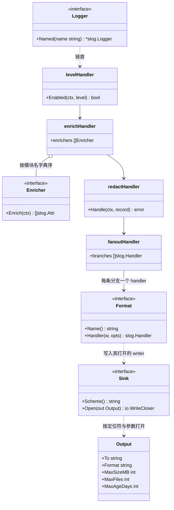
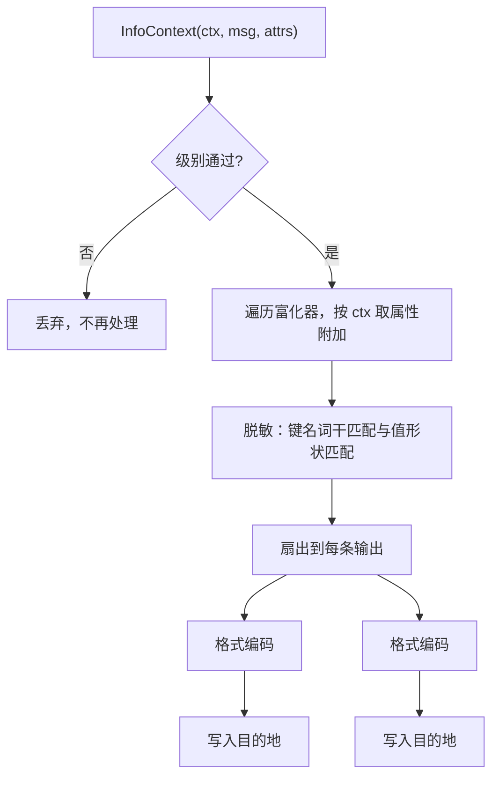
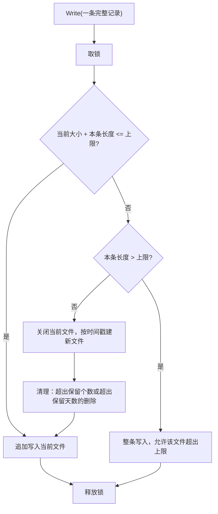

# log

## 职责

`pkg/log` 承载结构化日志：

- 定义模块之间取用的日志功能，调用面是标准库的 `*slog.Logger`（[ADR-log-api-2026-09-13](../../adr/adr-log-api-2026-09-13.md)）。
- 定义格式、目的地与富化器这些扩展点，遍历注册表收齐它们。
- 按配置组装处理链：级别过滤、上下文富化、脱敏，再扇出到各输出。
- 内置脱敏，位于扇出之前，对每一种目的地一致生效（[ADR-log-redaction-2026-09-13](../../adr/adr-log-redaction-2026-09-13.md)）。
- 提供引导期 logger：本模块构造之前唯一可用的那个，固定写标准输出。

根包定义扩展点接口，并实现处理链、脱敏与配置解读。具体的格式与目的地位于子包。

### 非职责

- **不定义自己的日志 API。** 调用点使用标准库类型，本模块不包装它们（[ADR-log-api-2026-09-13](../../adr/adr-log-api-2026-09-13.md)）。
- **不认识任何领域字段。** `trace_id`、`tenant_id` 这类关联字段由富化器贡献，根包不知道它们的存在（[ADR-log-enrichment-2026-09-13](../../adr/adr-log-enrichment-2026-09-13.md)）。
- **不接管启动诊断。** 启动诊断固定写 `os.Stderr`，且发生在本模块构造之前，见[启动诊断与日志的分界](#启动诊断与日志的分界)。
- **不提供追踪与指标。** 本模块只承担日志这一种信号。
- **不提供运行期修改级别。** 级别来自配置，配置是启动时的快照（[ADR-config-lifecycle-2026-09-13](../../adr/adr-config-lifecycle-2026-09-13.md)）。
- **不实现任何具体的格式与目的地。** 文本、JSON、控制台、文件均位于子包，其依赖不落入根包。

## 术语表

以下术语的含义限于本模块。

| 术语 | 英文 | 定义 |
|---|---|---|
| 处理链 | handler chain | 一条记录从调用点到目的地依次经过的各层 `slog.Handler`。 |
| 输出 | output | 配置中的一条：一个目的地、一种格式，以及该目的地的参数。 |
| 目的地 | sink | 回答"字节写到哪里"的扩展点，由定位符的 scheme 选定。 |
| 格式 | format | 回答"记录怎么编码为字节"的扩展点，由格式名选定。 |
| 富化器 | enricher | 从上下文取出属性、附加到记录上的扩展点。 |
| 引导期 logger | bootstrap logger | 本模块构造完成之前可用的 logger，固定写标准输出。 |
| 滚动 | rotation | 当前文件达到大小上限时改写到一个新文件。 |
| 清理 | pruning | 删除既有的滚动文件，条件是超出保留个数或超出保留天数。 |

## 外部接口契约

模块之间取用的功能，按模块名取 logger：

```go
type Logger interface {
    Named(name string) *slog.Logger
}
```

本模块排他地交付 `(*Logger)(nil)`。`Named` 返回的 logger 带一个标识调用模块的属性，其处理链是共享的，调用方可以长期持有它：富化按每条记录的上下文执行，持有不会让字段过期（[ADR-log-enrichment-2026-09-13](../../adr/adr-log-enrichment-2026-09-13.md)）。

**调用点必须使用带上下文的方法**：

```go
lg, err := core.Resolve[log.Logger](reg)
logger := lg.Named("cache")

logger.InfoContext(ctx, "connected", "addr", addr)   // 富化生效
logger.Info("connected", "addr", addr)               // 传入 Background，富化缺席
```

不带上下文的方法不报错，只是拿不到任何富化字段。

引导期 logger 是包级函数，不接收注册表：

```go
func Bootstrap() *slog.Logger
```

它固定写标准输出，文本格式，级别 `Info`，经过脱敏，**不经过富化**——富化器要从注册表取，而这个函数没有注册表可取。它不随配置改变，也不在本模块构造完成后切换为配置出来的处理链：切换要求用包级变量把本模块的实例递给其他模块，架构不变量禁止以全局变量传递实例。落在它上面的是 `Prepare` 阶段的日志、本模块自身构造过程中的日志，以及未声明日志依赖的模块的日志，它们只进标准输出，配置的文件中没有。

格式扩展点，一个实现对应一种格式：

```go
type Format interface {
    Name() string
    Handler(w io.Writer, opts *slog.HandlerOptions) slog.Handler
}
```

目的地扩展点，一个实现对应一个 scheme：

```go
type Sink interface {
    Scheme() string
    Open(out Output) (io.WriteCloser, error)
}
```

富化扩展点：

```go
type Enricher interface {
    Enrich(ctx context.Context) []slog.Attr
}
```

**格式、目的地与富化器都以资源声明交付，不作为功能取用。** 子包在自己的 `init` 中注册一个只含 `Resources` 的模块，把实现放进去：

```go
core.ProcessRegistry.Register(core.Module{
    Name:      "log.sink.file",
    Resources: []any{fileSink{}},
})
```

本模块在 `New` 中用 `core.Resources[Format](reg)`、`core.Resources[Sink](reg)` 与 `core.Resources[Enricher](reg)` 收齐它们。走资源而非功能取用，是因为这些实现都是无状态的编码器、写入器与取值器，没有生命周期需求；资源在 `Run` 之前即确定，收集的结果不依赖构造顺序。

格式与目的地正交：格式回答记录怎么编码，目的地回答字节往哪写。同一种格式可以供多个目的地使用，同一个目的地也可以在另一条输出里搭配另一种格式。

子包按种类分置，避免只从包名分不清它是格式还是目的地：

| 子包 | 提供 | 第三方依赖 |
|---|---|---|
| `log/format/text` | `text`，`slog.TextHandler` 的键值风格 | 无，标准库 |
| `log/format/json` | `json`，`slog.JSONHandler` | 无，标准库 |
| `log/sink/console` | `stdout:`、`stderr:` | 无 |
| `log/sink/file` | `file://`，含滚动与清理 | 无 |

**稳定性承诺**：`Logger` 是本模块与其他模块之间的契约；`Format`、`Sink` 与 `Enricher` 是子包作者与根包之间的契约。新增一种格式、目的地或富化器都不修改根包。

## 依赖

`pkg/log` 依赖 `pkg/core`（注册、资源收集、功能交付）与 `pkg/config`（声明并读取自己的配置）。

根包不含第三方依赖：处理链、脱敏与配置解读都在 `log/slog`、`io`、`os` 这些标准库范围内完成。子包同样零依赖——文本与 JSON 格式由标准库的同名 handler 承担，滚动与清理由 `os` 的文件操作实现。

依赖方向自上而下收敛于 `core`，本模块不 import 任何产生关联字段的模块，富化扩展点正是为此存在。

## UML 图

处理链的结构。级别过滤排在最前，被它挡下的记录不进入富化与脱敏；脱敏排在扇出之前，因而每条记录只脱敏一次，而不是每个输出各脱敏一次。



一条记录的处理路径。富化排在脱敏之前，因此富化器附加的属性同样经过脱敏检查。



文件目的地的写入决策。判断发生在写入调用的边界上，因而一条记录不会被劈到两个文件里。



## 核心数据结构

配置声明本模块接受的输入项：

```go
type Config struct {
    Level   string     `json:"level"`     // debug / info / warn / error
    Outputs []Output   `json:"outputs"`
}

type Output struct {
    To     string   `json:"to"`       // 定位符，scheme 选定目的地
    Format string   `json:"format"`   // 格式名

    MaxSizeMB  int   `json:"max_size_mb"`   // 单文件大小上限，0 表示不滚动
    MaxFiles   int   `json:"max_files"`     // 保留个数上限，0 表示不按个数清理
    MaxAgeDays int   `json:"max_age_days"`  // 保留天数上限，0 表示不按天数清理
}
```

滚动与清理的参数是输出的平级字段，不认识它们的目的地忽略它们：控制台目的地拿到 `MaxSizeMB` 不做任何事。代价是通用结构上带有只对部分目的地有意义的字段，新增一种带参数的目的地会继续扩大这个结构。

滚动与清理的参数都可以关闭，取值 `0` 即关闭该项。承载结构体的字段预填默认值，配置中未出现的键保持默认，出现的键覆盖它，因而"未设置"与"显式设为 0"是可区分的：

| 字段 | 默认 | 关闭 |
|---|---|---|
| `MaxSizeMB` | 100 | `0`，文件无限增长 |
| `MaxFiles` | 10 | `0`，不按个数清理 |
| `MaxAgeDays` | 30 | `0`，不按天数清理 |

配置示例：

```yaml
log:
  level: info
  outputs:
    - to: "stdout:"
      format: text
    - to: "file:///var/log/app.log"
      format: json
      max_size_mb: 100
      max_files: 10
      max_age_days: 30
```

## 核心算法与流程

### 处理链的装配

本模块在 `New` 中读配置、收资源、逐条打开输出，自内向外建起处理链：

每条输出取其格式名匹配的 `Format`、取其定位符 scheme 匹配的 `Sink`，由 `Sink.Open` 得到 writer，再由 `Format.Handler` 包出该分支的 handler。全部分支交给扇出层，其上依次是脱敏层、富化层与级别层。

**分支 handler 自身不做级别过滤**：它们的 `slog.HandlerOptions.Level` 取最低级，过滤已经由链首的级别层完成一次。在分支上重复过滤只会让同一个判断执行与分支数量相同的次数。

复杂度与输出条数成线性关系，是启动时的一次性开销。

### 一条记录的处理

级别过滤经由 `Handler.Enabled` 完成，它在 `slog.Logger` 构造记录之前被调用，因而被挡下的记录不付出属性求值、富化与脱敏的任何代价。

通过级别的记录依次经过：

1. **富化**：按声明富化器的模块名字典序遍历，各自从该次调用的上下文取属性，依次追加到记录上。重名属性不去重也不覆盖。富化器在上下文不含相关值时返回 `nil`。
2. **脱敏**：遍历记录的全部属性，递归进入属性组。键名逐段匹配敏感词干的整条替换；字符串值与错误文本按凭据形状就地遮蔽。关联字段按精确名豁免，豁免先于键名规则判定。
3. **扇出**：记录交给每条分支。各分支的写入相互独立，一条分支失败不影响其余分支。

脱敏排在扇出之前，每条记录因而只遍历一次属性，无论有多少条输出。

### 文件的滚动

`Sink` 的写入契约是**一次调用即一条完整记录**。标准库的文本与 JSON handler 都是在内部缓冲区拼出完整的一行再一次写出，满足该契约。文件目的地据此在调用边界上决定是否滚动，一条记录因而不会跨越两个文件。

当前文件大小加上本条记录长度超过上限时，先关闭当前文件、按时间戳命名建立新文件，再整条写入新文件。滚动文件的名字由原名加时间戳构成，形如 `app-20260913-120000.log`，只新建不重命名——序号式命名要在每次滚动时重命名全部既有文件，其代价随保留个数增长，且重命名过程中的中断会留下难以判定的中间态。

**单条记录本身超过上限时，整条写入当前文件并允许该文件超出上限。** 不跨文件优先于不超上限：把一条记录劈开会让两个文件各含一段无法单独解析的残片。

### 文件的清理

清理在每次滚动之后同步执行，扫描该目的地的滚动文件，**删除条件取或**：超出保留个数的删除，超出保留天数的也删除。保留下来的文件既在最新的若干个之内，又未超出保留天数。两项各自可以关闭，都关闭则不清理。

清理与写入在同一把锁下，同步执行。滚动本身不频繁，把清理挪到后台协程会引入与写入路径的并发，换来的时间不足以抵偿。

### 启动诊断与日志的分界

启动诊断是 `core` 与 `config` 在启用消解与配置加载期间写出的信息，固定写 `os.Stderr`，宿主无法重定向。它发生在本模块构造之前，本模块不接管它，也无从接管。

分工是确定的：哪些模块未启用、为什么未启用，由启动诊断负责；进程开始运行之后的一切由日志负责。宿主要把启动诊断接进自己的日志，途径是注册表的启用结果查询，见 [core](design-core.md)。

## 错误与失败语义

装配期的错误一律终止启动：

| 哨兵错误 | 触发条件 |
|---|---|
| `ErrInvalidLevel` | 配置的级别名不可识别 |
| `ErrMalformedLocator` | 输出的定位符不是合法的 URI，或该 scheme 的 `Sink` 不接受这一形态 |
| `ErrUnknownScheme` | 定位符的 scheme 没有匹配的 `Sink` |
| `ErrUnknownFormat` | 输出的格式名没有匹配的 `Format` |
| `ErrSinkUnavailable` | `Open` 失败：目录不存在、权限不足、路径被占用 |

`ErrUnknownScheme` 与 `ErrUnknownFormat` 的文本要列出注册表中现有的 scheme 与格式名：格式与目的地都由子包以资源交付，缺失的原因几乎总是漏了一行 import，而列出现有的即指明了漏掉的是哪一类。

配置中输出列表为空是合法的，含义是不输出任何日志。这一情形写一行启动诊断，因为它与漏配在行为上无法区分。

**运行期的写入失败在调用点不可见。** slog 丢弃 `Handler.Handle` 的返回值，日志调用点因而拿不到任何失败信号（[ADR-log-api-2026-09-13](../../adr/adr-log-api-2026-09-13.md)）。处置落在目的地实现上：

- 各条输出相互隔离，一条写入失败不影响其余输出。
- 失败不静默：目的地在连续失败的**首次**写一行到 `os.Stderr`，恢复后再写一行。中间的重复失败不再写出——磁盘写满时每条日志都会失败，逐条报告会把标准错误刷满，而那正是运维此时最需要读到的地方。

启动之后不再重新打开目的地。文件被外部删除或重命名之后，写入落向已经不可达的文件描述符，本模块不检测也不重建。

## 并发与事务边界

处理链的各层在装配完成后只读，可被多协程并发调用。级别层、富化层与脱敏层都不持有可变状态。

富化器由实现方保证并发安全：它们被每条记录调用，且调用来自任意协程。

文件目的地的写入、滚动与清理在同一把互斥锁下：滚动期间没有其他写入进入，因而不会有记录落进正在关闭的文件；清理删除的是已经关闭的滚动文件，不触及当前文件。控制台目的地直接写 `os.Stdout` 与 `os.Stderr`，单次 `Write` 的原子性由操作系统保证。

`Bootstrap` 返回的 logger 可被并发使用，其处理链同样只读。

## 扩展点

- **`Format`**：新增一种格式。实现位于 `log/format/` 下的子包，以资源声明交付。
- **`Sink`**：新增一种目的地，例如日志收集服务。实现位于 `log/sink/` 下的子包，以资源声明交付。
- **`Enricher`**：新增一种关联字段。由产生该字段的模块以资源声明交付，根包不认识字段本身（[ADR-log-enrichment-2026-09-13](../../adr/adr-log-enrichment-2026-09-13.md)）。

扩展点都不要求修改根包。新增实现对既有输出没有影响：格式由格式名精确匹配，目的地由 scheme 精确匹配，都不是优先级竞争。

**脱敏不是扩展点。** 它是处理链中的固定一层，没有配置开关也没有逐调用豁免，其规则的变更是根包的代码变更（[ADR-log-redaction-2026-09-13](../../adr/adr-log-redaction-2026-09-13.md)）。

## 实现状态

| 功能 | 状态 | 代码 |
|---|---|---|
| 日志功能与按名取用 | 未实现 | — |
| 引导期 logger | 未实现 | — |
| 处理链装配 | 未实现 | — |
| 级别过滤 | 未实现 | — |
| 富化扩展点 | 未实现 | — |
| 脱敏 | 未实现 | — |
| 扇出 | 未实现 | — |
| 格式扩展点 | 未实现 | — |
| 目的地扩展点 | 未实现 | — |
| 文本格式实现 | 未实现 | — |
| JSON 格式实现 | 未实现 | — |
| 控制台目的地实现 | 未实现 | — |
| 文件目的地实现 | 未实现 | — |
| 文件滚动 | 未实现 | — |
| 文件清理 | 未实现 | — |
