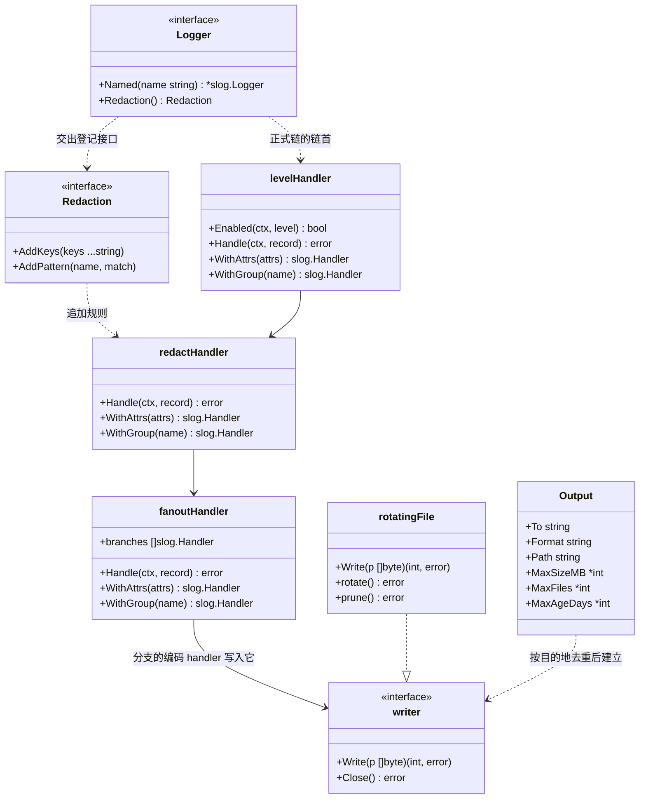
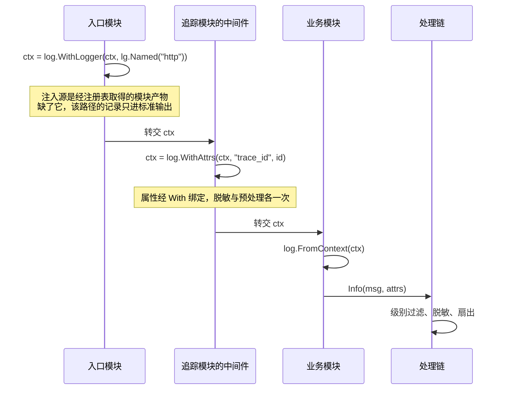
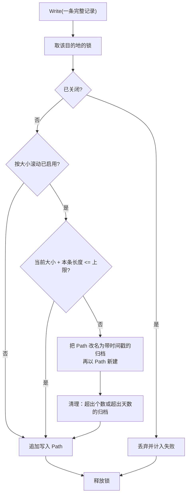

# log

## 职责

`pkg/log` 承载结构化日志：

- 定义模块之间取用的日志功能，调用面是标准库的 `*slog.Logger`（[ADR-log-api-2026-09-13](../../adr/adr-log-api-2026-09-13.md)）。
- 按配置组装处理链：级别过滤、脱敏，再扇出到各输出；每个目的地只建一个写入者。
- 内置格式与目的地，由配置按名选定。
- 内置脱敏的机制，位于扇出之前，对每一种目的地一致生效；规则不预置，由其他模块登记，只可追加（[ADR-log-redaction-2026-09-13](../../adr/adr-log-redaction-2026-09-13.md)）。
- 提供 logger 与 `context.Context` 之间的存取，供产生关联字段的模块绑定自己的字段（[ADR-log-context-2026-09-13](../../adr/adr-log-context-2026-09-13.md)）。
- 提供进程根 logger：没有上下文可取时用它，固定走带脱敏的引导链写标准输出。

全部内容位于根包，没有子包：格式与目的地都只用标准库，没有需要隔离的第三方依赖。

### 非职责

- **不定义自己的日志 API。** 调用点使用标准库类型，本模块不包装它们（[ADR-log-api-2026-09-13](../../adr/adr-log-api-2026-09-13.md)）。
- **不认识任何领域字段。** `trace_id`、`tenant_id` 这类关联字段由产生它们的模块绑定，根包只提供承载它们的存取途径，不知道字段本身的存在（[ADR-log-context-2026-09-13](../../adr/adr-log-context-2026-09-13.md)）。
- **不接受外部提供的格式与目的地。** 格式与目的地都是内置的闭集，按名选定，新增是本模块的代码变更（[ADR-log-api-2026-09-13](../../adr/adr-log-api-2026-09-13.md)）。这与 [config](design-config.md) 的传输和格式扩展点同名而不同类：那边的实现会引入第三方依赖，必须隔离到子包、以资源声明交付；本模块的格式与目的地全在标准库内。
- **不接管启动诊断。** 启动诊断固定写 `os.Stderr`，且发生在本模块构造之前，见[启动诊断与日志的分界](#启动诊断与日志的分界)。
- **不提供追踪与指标。** 本模块只承担日志这一种信号。
- **不提供运行期修改级别的接口。** 引导链的级别在 `Prepare` 依配置设定，正式链的级别在 `New` 依配置确定，此后都不变；配置是启动时的快照（[ADR-config-lifecycle-2026-09-13](../../adr/adr-config-lifecycle-2026-09-13.md)）。

## 术语表

以下术语的含义限于本模块。

| 术语 | 英文 | 定义 |
|---|---|---|
| 处理链 | handler chain | 一条记录从调用点到目的地依次经过的各层 `slog.Handler`。 |
| 输出 | output | 配置中的一条：一个目的地、一种格式，以及该目的地的参数。 |
| 目的地 | destination | 字节写到哪里，取值为内置闭集中的一个名字。 |
| 格式 | format | 记录怎么编码为字节，取值为内置闭集中的一个名字。 |
| 注入点 | injection point | 产生关联字段的模块把字段绑到 logger 上并写回上下文的位置，例如中间件与任务执行器。 |
| 进程根 logger | process default logger | 没有上下文可取时使用的 logger，进程级单例，固定指向引导链。 |
| 引导链 | bootstrap chain | 进程根 logger 固定指向的处理链：级别层、脱敏层与一个写标准输出的文本 handler，由根包在包初始化时建成。 |
| 写入者 | writer | 一个目的地对应的唯一写入对象，持有它的锁、失败计数与关闭状态。 |
| 归档 | archive | 滚动产生的文件，名字带时间戳，是清理的作用对象；当前文件不是归档。 |

## 外部接口契约

模块之间取用的功能，按模块名取 logger：

```go
type Logger interface {
    Named(name string) *slog.Logger
    Redaction() Redaction
}

// Redaction 登记脱敏规则。只追加，不移除。
type Redaction interface {
    AddKeys(keys ...string)
    AddPattern(name string, match Matcher)
}

// Matcher 判定一个字符串值里需要遮蔽的区间，无则返回空。
type Matcher func(value string) []Span

type Span struct {
    Start, End int
}
```

本模块排他地交付 `(*Logger)(nil)`。`Named` 返回的 logger 带 `ModuleAttrKey` 这个属性（值为模块名），其处理链是共享的。模块在 `New` 中取得它并长期持有，用于没有请求上下文的日志。

`Named` 绑定的属性键与脱敏命中后留下的替换文本都导出为常量：

```go
const ModuleAttrKey = "module"
const MaskedText = "[REDACTED]"
```

`ModuleAttrKey` 与 `MaskedText` 都是本模块**可观察面契约的一部分**：运维按模块过滤一个目的地上的记录，读的是 `ModuleAttrKey` 这个键；依赖方断言自己登记的凭据确实被遮蔽，比的是 `MaskedText` 这段文本。这样的字面量承不承认都是契约——改动它就会破坏正读它的一方。未导出因而是最差的一种状态：它改不动（一改就破坏依赖方），又不被承认（没有一方能据此主张违约）；导出之后，取值的变化传到每个引用常量的人手里，而不是先破坏他们。

**保持未导出、并要求依赖方不要断言 `ModuleAttrKey` 与 `MaskedText` 的取值，不构成一条可选读法。** 本模块保证的是"记录一定经过脱敏层"，不是"敏感内容一定被遮蔽"（见[脱敏的判定面](#脱敏的判定面)）；依赖方要验证自己登记的凭据确实被遮蔽，除了比对目的地上的替换文本没有别的途径——只断言凭据的原值不出现是不够的，值可能根本没有到达记录。脱敏是否真的发生因而会成为一条写不出判据的性质，而写不出判据的性质等于不验。

`Redaction` 供其他模块登记自己知道的敏感键名与值形状。哪些键敏感不是本模块能够穷举的——业务模块知道自己的凭据字段叫什么，而这些名字随业务代码增长（[ADR-log-redaction-2026-09-13](../../adr/adr-log-redaction-2026-09-13.md)）：

```go
lg, _ := core.Resolve[log.Logger](reg)
lg.Redaction().AddKeys("stripe-customer-secret", "webhook-signing-key")
```

**只能追加，没有移除或关闭的途径。** 登记可以发生在任意时刻，包括运行期。

`AddPattern` 的 `name` 只用于诊断——登记失败时的 panic 文本、以及将来任何指认规则来源的场合都靠它；它不参与判定，因而同名的两条规则各自照跑，与只可追加一致。

**登记不上的规则当场 panic，不静默忽略。** 空键名会与键路径里的空段比对上，等于把那一段下的一切判为命中；`nil` 判定函数会在第一条到达的记录上崩在热路径里。这类登记都是调用点的编程错误，与数据无关，首次执行即确定地暴露，和 `core` 对非法功能标识的处理同类（见 [core](design-core.md)）。

静默忽略会让登记方以为自己拿到了保护而实际没有——而登记方拿不到返回值，无从察觉。这正是脱敏最不该有的失效形态：它在泄露发生之前不表现出任何差别。

**登记只对此后的判定生效，而判定有两个时刻**：记录自带的属性在写出时判定，经 `With` 绑定的属性在绑定时判定、此后复用结果。一个在登记之前就绑好属性的长命 logger，其绑定属性不受新规则约束，哪怕记录写在登记之后。

模块因而应当在自己的 `New` 中、取得 logger 之前完成登记——`Named` 返回的 logger 带一个模块名属性，那已经是一次绑定。取用顺序是先 `core.Resolve[log.Logger]` 取本模块的产物、再 `Redaction()` 登记、最后 `Named`。这条时机只保证自己的规则早于自己的绑定，跨模块的覆盖没有时机保证，代价见 [ADR-log-redaction-2026-09-13](../../adr/adr-log-redaction-2026-09-13.md)。

登记的规则进入进程级的规则集，引导链与各条正式链共用它：敏感键名是全局事实，不因链而异，`Default()` 写出的日志同样受益于业务模块登记的规则。

上下文存取。关联字段由产生它们的模块绑定，本模块只提供承载的途径：

```go
func FromContext(ctx context.Context) *slog.Logger
func WithLogger(ctx context.Context, l *slog.Logger) context.Context
func WithAttrs(ctx context.Context, args ...any) context.Context
```

`WithAttrs` 是取出、绑定、写回三步的合写，注入点的常用形态：

```go
// 追踪模块的中间件，在自己的注入点绑定自己的字段
ctx = log.WithAttrs(ctx, "trace_id", traceID)

// 请求路径中的日志调用
log.FromContext(ctx).Info("connected", "addr", addr)
```

**带上下文的路径从上下文取 logger**，进程根 logger 不带任何请求字段。属性经 `With` 绑定一次后由 handler 预处理，该请求的全部记录复用它，逐条不重复求值（[ADR-log-context-2026-09-13](../../adr/adr-log-context-2026-09-13.md)）。

**`FromContext` 在上下文中没有 logger 时返回 `Default()`。** 见[取 logger 的途径](#取-logger-的途径)。

没有上下文可取时，取进程根 logger：

```go
func Default() *slog.Logger
```

它是进程级的单例，**固定指向根包构造的引导链**：级别层接脱敏层，再接一个写标准输出的文本 handler。它不随任何日志模块的装配改变，进程生命周期内始终是这一条。

引导链含脱敏层，与正式链同构。`Default()` 贯穿进程的整个生命周期，登记落地之后经它写出的记录照常受规则约束——脱敏层不在链上就享受不到。

这一层在**首次**装配的 `Prepare` 期间遮蔽不了任何东西：登记要经本模块的产物，而产物到 `New` 才存在，那时规则集还是空的。这一段的日志因而不受任何遮蔽，调用点自己负责不把凭据写进去。规则集是进程级的，同进程内后续的装配不重复这一窗口——先前登记的规则仍在。

它的级别由根包持有的一个 `slog.LevelVar` 承载，默认 `Info`，日志模块在 `Prepare` 依配置设定——引导链在本模块构造之前就在写日志，而配置要到 `Prepare` 才读得到，级别因而必须可变。

以下后果由 `Prepare` 的无序性决定：

- **本模块的 `Prepare` 之前发出的记录按默认级别过滤**，配置为 `debug` 时这部分中低于默认级别的记录不会出现。哪些记录落在这一侧取决于各模块 `Prepare` 的执行顺序，而"`Prepare` 阶段内不保证顺序"是架构不变量。
- **多个日志模块并存时，引导链的级别由最后完成 `Prepare` 的那个设定**，结果同样取决于顺序。不设"首个胜出"之类的规则：`Prepare` 无序，先来后到本身就不确定，那样的规则只是把不确定性换个位置，还多一个进程级标志。
- **落选的模块也会设定它。** `Prepare` 先于消解、对全部已注册模块执行，因而一个排他且表态 `StateAuto`、随后被传播禁用的日志模块，其 `Prepare` 已经改写过引导链的级别——一个本次不运行的模块决定了那个值。

常规形态只有一个日志模块，上面两条都不出现；多个模块并存只在另建注册表的测试里，测试若关心引导链的级别，应当只装配一个日志模块。

**`Default()` 写标准输出，不写配置的目的地。** 配置组装出的处理链只经由 `Logger` 功能交付，取用它要经注册表。这条分界的依据是时机：进程根 logger 在任何模块构造之前就要可用，而配置的目的地要到 `New` 才存在，让根 logger 去指向它需要一套运行期换手机制。

由此产生的后果：

- `Prepare` 阶段的日志、本模块自身构造过程中的日志，以及任何经 `Default()` 写出的记录——上下文回退到它的路径在内——都只进标准输出，配置的文件中没有。
- 要让日志进配置的目的地，模块声明对 `Logger` 功能的依赖并经 `Named` 取得 logger。这条要求是显式的，声明与取用各自保一件事，缺哪一边的后果见下。

**声明保的是构造顺序。** 给构造顺序加边的机制只有 `Requires`（`config` 对每个模块的固定前置是它之外的唯一例外，总在最前）；顺序是这些边上的拓扑排序，并列的就绪模块按模块名字典序取最小（`pkg/core/depgraph.go` 的 `planConstruction`）。取 `log.Logger` 的模块排在 log 之后，当且仅当它自己声明、或经别的模块的声明传递地排在 log 之后；否则它排在前还是在后由模块名决定。排在 log 之后：`Resolve` 照常取到产物，模块经 `Named` 写出的记录照常进配置的目的地，漏掉的那一行在这一次运行里毫无迹象。排在 log 之前：日志模块还没有构造出产物，`core.Resolve[log.Logger]` 在它的 `New` 中失败，启动以退出码 1 终止，日志文件根本没建起来。

**守这条要求的只能是描述符层面的断言**：读模块描述符的 `Requires`，不跑宿主。漏声明在运行期没有指向它的观察面——构造顺序的两种结局都不落在漏掉的那一行上——而 `examples/minimal-host/wiring_test.go` 的 `TestEveryModuleThatLogsDeclaresTheLoggingDependency` 正是这种形态。

**这条断言有一处接受的代价**：描述符里没有任何东西表明一个模块会写日志（它取什么在自己的 `New` 里），名录因而只能写死在测试里，新模块若既漏声明、又漏登记名录，照样静默通过。替代做法都补不上这处缺口：扫源码找 `core.Resolve[log.Logger]` 的调用点会让日志模块变成源码分析器、越过模块边界；让 `core` 在 `Resolve` 时校验调用方声明，要 `core` 持有调用方身份，它没有也不该有；给描述符加一个"会写日志"位，由同一个作者自报，与漏声明同源，不构成兜底。

**`Named` 保的是记录的去向**：经它取得的 logger 写配置的目的地；`Default()` 写出的记录只进标准输出，与声明与否无关（见上）。

### 取 logger 的途径

**从上下文取是常规操作。** 请求、任务这些带上下文的路径都走它，关联字段也只在这条路径上：

| 调用点 | 途径 |
|---|---|
| 有请求上下文 | `FromContext(ctx)` |
| 模块自己写、没有上下文 | 在 `New` 里经 `Logger` 取得并长期持有的 `Named` logger |
| 两者都不适用 | `Default()` |

**把"没有上下文"整档判给 `Default()` 不成立。** `Start`、`Stop`、`Close` 这些阶段回调与构造过程中写出的记录都没有请求上下文，但它们要走配置的目的地，途径是模块在 `New` 里取得并长期持有的 `Named` logger；`Default()` 固定走引导链、写标准输出（见上），这个判法会让它们全部离开配置的目的地。本模块另外两处结论与此一致：模块在 `New` 中取得 `Named` 的结果并长期持有，用于没有请求上下文的日志；要让日志进配置的目的地，模块声明对 `Logger` 功能的依赖并经 `Named` 取得 logger。表与它们冲突时以它们为准。

`core.Resolve` 取到的是**本模块的产物**，它实现 `Logger` 接口；logger 对象是 `*slog.Logger`，不实现该接口。产物与 logger 对象是不同的东西，取用的含义也不同。声明对 `Logger` 功能的依赖，作用是让本模块排在依赖方之前构造——依赖方因而能确定自己 `New` 时日志已按配置就绪——以及经 `Named` 取得一个带模块名的 logger。日常记日志不经由这条路径。

**`FromContext` 在上下文中没有 logger 时返回 `Default()`**，不报错也不中断调用方。日志调用因而在任何上下文上都成立，记录不丢、照常经过脱敏层。

但它走的是引导链：**写标准输出而非配置的目的地，按引导链的级别过滤而非本次装配配置的级别**。漏了首次注入的后果因而是整条路径的日志离开配置的目的地，修法是在产生上下文的那一步补 `WithLogger`。

这与注入点漏绑某一个字段不是同一类失败：漏绑只少几个属性，记录仍在配置的目的地。

`WithAttrs` 的第一步是 `FromContext`，在没有 logger 的上下文上取到的是 `Default()`；绑定属性后写回上下文，下游从此取到带属性的那一个，链路后续的绑定照常累积——属性不丢，但整条路径仍在引导链上。

### 首次注入的归属

带上下文的路径要能取到写进配置目的地的 logger，其上游必须有人做过第一次 `WithLogger`，**注入源是经注册表取得的产物的 `Named` 结果**，不是 `Default()`——`Default()` 写标准输出，用它注入等于让整条路径的日志离开配置的目的地。

这件事归产生上下文的一方：HTTP 入口在建立请求上下文时注入，任务执行器在从空上下文起一条任务上下文时注入。它们都声明了对 `Logger` 功能的依赖，取得实例没有额外成本。

此后链路上的各方只做 `WithAttrs` 绑定自己的字段，不再关心 logger 从哪来。**中间件不负责首次注入**：注入是产生上下文那一步的一部分，放到中间件里就意味着同一条路径上可能有多个模块各自认为自己该兜底，而它们注入的 logger 带的模块名各不相同。

## 依赖

`pkg/log` 依赖 `pkg/core`（注册、功能交付）与 `pkg/config`（声明并读取自己的配置）。

不含第三方依赖：处理链、脱敏、上下文存取、配置解读、文本与 JSON 编码、滚动与清理，全部在 `log/slog`、`context`、`io`、`os` 这些标准库范围内完成。

依赖方向自上而下收敛于 `core`，本模块不 import 任何产生关联字段的模块，上下文存取正是为此存在。

## UML 图

正式链的结构，引导链把扇出层换成一个写标准输出的编码 handler，其余相同。级别过滤排在最前，被它挡下的记录不再进入后续各层；脱敏排在扇出之前，因而每条记录只脱敏一次，而不是每个输出各脱敏一次。绑定到 logger 上的属性由脱敏层在绑定时处理，此后不再重复检查。



关联字段的注入与取用。产生字段的模块各自在自己的注入点绑定，根包不认识其中任何一个字段。



文件目的地的写入决策。判断发生在写入调用的边界上，因而一条记录不会被劈到两个文件里。



## 核心数据结构

配置声明本模块接受的输入项：

```go
type Config struct {
    Level   string   `config:"level"`     // debug / info / warn / error
    Outputs []Output `config:"outputs"`
}

type Output struct {
    To     string `config:"to"`       // stdout / stderr / file
    Format string `config:"format"`   // text / json
    Path   string `config:"path"`     // To 为 file 时的文件路径

    MaxSizeMB  *int `config:"max-size-mb"`   // 单文件大小上限
    MaxFiles   *int `config:"max-files"`     // 保留个数上限
    MaxAgeDays *int `config:"max-age-days"`  // 保留天数上限
}
```

级别在数据库可用之前就被需要，因而属于配置（[ADR-config-scope-2026-09-13](../../adr/adr-config-scope-2026-09-13.md) 的划界判据）。

**级别取值的来源按链划分。** 引导链的级别由根包持有的 `slog.LevelVar` 承载，`Prepare` 设定——它在本模块构造之前就在写日志，级别必须可变，读出的配置值才能对已经发出去的 logger 立刻生效。正式链的级别在 `New` 中依本模块自己的配置确定，此后不变；多个日志模块并存时，各自的正式链因而各按自己的配置过滤。

本模块不导出修改级别的方法，`Prepare` 与 `New` 之外没有改动它的途径。

目的地与格式都是闭集：

| 目的地 | 写向 | 用到的参数 |
|---|---|---|
| `stdout` | 进程的标准输出 | 无 |
| `stderr` | 进程的标准错误 | 无 |
| `file` | `Path` 指定的文件 | `Path`、`MaxSizeMB`、`MaxFiles`、`MaxAgeDays` |

| 格式 | 编码 |
|---|---|
| `text` | `slog.TextHandler` 的键值风格 |
| `json` | `slog.JSONHandler` 的每行一个 JSON 对象 |

目的地与格式正交，任意组合成立：同一种格式可以供多条输出使用，同一个目的地也可以在另一条输出里搭配另一种格式。

路径与滚动清理的参数是输出的平级字段，用不到它们的目的地忽略它们：标准输出拿到 `MaxSizeMB` 不做任何事。代价是这个结构上带有只对部分目的地有意义的字段，新增一种带参数的目的地会继续扩大它。

### 可选参数的表达

`Outputs` 是结构体列表，在 `config` 的覆盖规则里属于容器叶子：**主配置源整体替换它，不逐叶合并**，因为容器内部的键不在输入项清单里（[config](design-config.md)）。承载结构体上预填的那条默认输出因而在宿主写出 `outputs:` 的瞬间被整体换掉，新元素按目标类型解码，未出现的键取零值。

这使得值类型的字段无法同时表达"有默认值"与"可以关掉"：零值既是"没写"也是"写了 0"。指针把这两种情形分开：

| 取值 | 含义 |
|---|---|
| 键未出现（`nil`） | 取默认 |
| 显式写 `0` | 关闭该项 |
| 显式写正数 | 按该值 |

默认值因此由本模块在解码之后补齐，而不是由承载结构体铺进配置数据：

| 字段 | 默认 | 关闭的含义 |
|---|---|---|
| `MaxSizeMB` | 100 | 不按大小滚动 |
| `MaxFiles` | 10 | 不按个数清理 |
| `MaxAgeDays` | 30 | 不按天数清理 |

同一条规则带来一处无法消除的代价：容器叶子内部的键不参与未知键校验，`max-szie-mb` 这样的拼写错误不会被判为未知键，对应字段保持未设置、取默认值。本模块也补不上这道校验——`config` 对模块暴露的只有按路径解码，解码之后原始键集合已经不存在，拿不到可供比对的东西。配置里一个拼错的滚动参数因而静默退化为默认值，这一点由使用者在配置评审中把关。

`outputs` 只接受主配置源。字符串列表之外的容器类型不能声明环境变量与命令行来源，声明了即 `ErrInvalidSchema`（[config](design-config.md)），因而输出集合只能在配置文件或远程配置中心里改，不能用环境变量覆盖。`level` 是标量，三种来源都接受。

未配置 `log` 段时的默认是一条写标准输出的文本输出，级别 `Info`。日志因而不需要任何配置即可工作，与本模块构造之前的行为一致。

这条默认依赖 `config` 对容器叶子默认值的处理：承载结构体上预填的那条输出要经基础层流出，本模块才拿得到它。**这是两个模块实现之间的隐式耦合**——`config` 若改动容器叶子的默认流向，本模块的默认输出会随之改变而不报任何错。改动那一侧的人无从从本模块的代码看出这层依赖，因而在本模块与端到端各留一条用例钉住它。

配置示例：

```yaml
log:
  level: info
  outputs:
    - to: stdout
      format: text
    - to: file
      format: json
      path: /var/log/app.log
      max-size-mb: 100
      max-files: 10
      max-age-days: 30
```

## 核心算法与流程

### 本模块自身的阶段行为

`Prepare` 读配置的级别并据它设定引导链的 `LevelVar`，随后表态 `StateEnabled`。正式链的级别不在此时确定。

每条链各有自己的级别层：级别层的下游在它构造时就定死了——引导链的下游是脱敏层接文本 handler，正式链的下游是脱敏层接扇出层——因而不可能是同一个实例。级别取值的来源见[核心数据结构](#核心数据结构)。

表态取 `StateEnabled`。消解的传播只禁用声明排他且表态 `StateAuto` 的提供者（见 [core](design-core.md)），本模块因而不可能被传播禁用：要么它启用，要么第二个仍然启用的提供者把该功能判为 `ErrExclusiveViolated`，启动失败。

这与本模块交付的功能实现唯一这一裁定一致（[ADR-log-api-2026-09-13](../../adr/adr-log-api-2026-09-13.md)）：第二个提供者出现时应当响亮失败，而不是把本模块静默替换掉——被替换之后，声明了依赖的模块取到的是另一份实现，而配置里的目的地、格式与滚动清理参数全部失去承接者。

`New` 组装处理链并交付 `Logger` 功能。`Close` 释放本次装配对各写入者的引用。关停期仍有在途写入这一情形见[关停期的写入](#关停期的写入)。

### 处理链的装配

本模块在 `New` 中读配置，逐条输出自内向外建起处理链：

每条输出按 `To` 选定目的地并打开它的 writer，按 `Format` 选定编码并包出该分支的 handler。全部分支交给扇出层，其上依次是脱敏层与级别层。目的地与格式都在闭集内按名匹配，匹配不上即启动失败。

**扇出层不逐分支询问 `Enabled`**：级别过滤在链首完成一次，扇出把通过的记录直接交给每条分支。分支自身因而不带级别门槛，它们的 `slog.HandlerOptions.Level` 取最低级。

这条约束的是扇出层，不是分支。给分支挂一个级别在标准库的编码 handler 上没有任何后果——它们在 `Handle` 中不复查级别，记录照常写出；只有扇出逐分支询问 `Enabled` 才会让分支的级别产生后果，而那正是让同一个判断执行与分支数量相同的次数。"分支不带自己的门槛"因此是一条结构规定：它由装配之后的断言承担，行为观察看不见它。

复杂度与输出条数成线性关系，是启动时的一次性开销。

### 一条记录的处理

级别过滤经由 `Handler.Enabled` 完成，`slog.Logger` 在构造记录之前调用它，被挡下的记录因而不付出 `slog.Record` 的构造、调用栈取址与脱敏的代价。

**它省不掉属性求值。** 传给日志方法的实参在进入该方法之前就已由 Go 求值完毕，`Enabled` 无从干预。`logger.Debug("dump", "body", serialize(x))` 里的 `serialize` 在任何级别下都会执行，要避免它只能由调用点自己先判级别。

通过级别的记录依次经过：

1. **脱敏**：遍历记录的全部属性，递归进入属性组，键路径含 `WithGroup` 打开的组名。判定规则见[脱敏的判定面](#脱敏的判定面)。
2. **扇出**：记录逐分支复制后交出。各分支的写入相互独立，一条分支失败不影响其余分支。复制是必需的：`slog.Record` 的副本共享底层数组，而 `slog.Handler` 的契约不禁止实现改写收到的记录——标准库自己的多路 handler 在分发记录时同样逐分支复制。复制只是裁剪一次切片，代价不随属性数量增长。

脱敏排在扇出之前，每条记录因而只遍历一次属性，无论有多少条输出。

### 脱敏的判定面

**本模块提供判定的机制，不提供任何规则。** 规则集初始为空，全部内容来自 `Redaction` 的登记。

判定按序进行：

1. **键名**：键路径逐段比对已登记的键名，命中即把该属性的值整条替换为 `MaskedText`。路径由 `WithGroup` 打开的组名、内联 `slog.Group` 的名字与属性自身的键拼成，`billing.stripe-customer-secret` 与 `WithGroup("credentials")` 下的任意属性因而被同等对待。
2. **值形状**：字符串值与错误文本逐个交给已登记的判定函数，命中区间替换为 `MaskedText`，周边文本保留。

**本模块保证的是"记录一定经过脱敏层"，不是"敏感内容一定被遮蔽"**：经过脱敏层由处理链的结构保证，与装配无关；遮蔽什么取决于登记了什么，登记方同时承担漏登记与登记过宽的后果。不预置规则的理由与这一分界的代价，见 [ADR-log-redaction-2026-09-13](../../adr/adr-log-redaction-2026-09-13.md)。

**判定面的边界由规则的作用对象划定**：键名规则作用于属性的键路径，值形状规则作用于解析后的字符串值与错误文本。不落在这些对象上的内容，判定面够不到，登记也补不上——这是判据，落在界外的情形不限于下面列举的这些（[ADR-log-redaction-2026-09-13](../../adr/adr-log-redaction-2026-09-13.md)）。

- **记录的消息**：它不是属性，两条规则都施加不上。凭据写进消息是调用点的错误，本模块察觉不到。
- **不带延迟求值的包装值，其内部字段**：字段要到编码那一步才展开，不成为独立属性，键路径只有外层属性自己的名字。实现了延迟求值的值不在此列——脱敏层解析它，解析结果若是属性组则照常递归进入。
- **键名与组名自身承载的内容**：键是比对的对象，不是被检查的内容。把请求头、表单或映射逐项摊成属性时，秘密可能出现在键上，而未知的键无从预先登记。
- **字符串与错误之外的值**：底层类型为字符串的自定义类型、字节切片、经包装交出的任意值，都不进入值形状判定，只按它们的键名判定。值形状规则本是为兜住未知键名而设，这条盲区恰好打在它的用途上。

应对都在调用点：敏感内容作为独立属性、以字符串或错误的形态写出，键名用固定的名字，不写进消息、不塞进包装值。

这条约束是本模块不认识任何领域字段的前提。它换来的代价记在 [ADR-log-redaction-2026-09-13](../../adr/adr-log-redaction-2026-09-13.md)。

`slog.Handler` 的 `WithGroup` 与 `WithAttrs` 都由脱敏层实现并向下传递（与包级函数 `log.WithAttrs` 同名而不同物，那一个存取的是上下文里的 logger）：`WithGroup` 把组名压入本层记录的键路径前缀，`WithAttrs` 在属性绑定时脱敏。少了任何一个，经它派生的 logger 就会绕开本层。空组名按标准库的契约返回接收者本身，不压入任何前缀。

**脱敏层自己解析属性值，不依赖下游。** `slog` 的值解析发生在终端 handler，而脱敏层位于扇出之前：不自行解析，它看到的就是未解析的值——一个实现了 `slog.LogValuer` 的属性，其真实内容要到编码那一步才成形，既过不了值形状规则，也过不了键名规则（解析结果可以是一个属性组，键路径在解析后才存在）。凭据藏在这类属性里即可整条绕过脱敏。

脱敏层因而在遍历时先解析再判定。以下实现细节由标准库的契约决定，写在这里因为它们都是易错点：

- **解析与递归交替进行。** 一个值解析成属性组时，组内成员的值不会被一并解析。必须解析、进组、组内每个成员再解析，逐层如此；先整体解析一遍再遍历会漏掉嵌套组里的内容。
- **记录不能就地改写。** `slog.Record` 的副本共享底层数组，改写一份会波及其他副本，标准库对此有明确禁止。脱敏后的记录由重建得到：以原记录的时间、级别、消息与调用位置新建，再添加脱敏后的属性。调用位置必须原样保留，否则输出的源码位置会错位。

解析后的值随重建的记录交给下游，下游再次解析是幂等的：解析只对延迟求值的那一类生效，其余原样返回。

标准库对同一个值的延迟求值有连续调用次数上限，超限与求值 panic 都会被转成一个承载错误信息的值：超限那条只含被求值的类型名，panic 那条只含函数名与文件行号，两条都不携带被求值的内容。这类值以普通值的形态进入脱敏，照常经过键名与形状两道规则。

判定在解析后的值上进行，意味着解析与记录重建的开销落在每条通过级别过滤的记录上，即便它最终不含任何敏感内容。这是"记录一定经过脱敏层"这条保证的必要代价（[ADR-log-redaction-2026-09-13](../../adr/adr-log-redaction-2026-09-13.md)）。

### 上下文中的关联字段

经 `WithAttrs` 或 `WithLogger` 绑定的属性进入 handler 的状态：脱敏层在 `WithAttrs` 被调用时就地处理它们，此后该请求的每条记录复用处理结果，不再重复检查。这是绑定相对逐条附加的差别所在——属性求值与脱敏各发生一次，而不是每条记录各发生一次。

注入点的位置决定字段的覆盖范围：在中间件链中位置靠后的注入点，其字段对更外层已经产生的日志不生效。

### 文件的滚动

文件目的地的写入契约是**一次调用即一条完整记录**。标准库的文本与 JSON handler 都是在内部缓冲区拼出完整的一行再一次写出，满足该契约。滚动因而在调用边界上决定，一条记录不会跨越两个文件。

**当前文件始终是 `Path`。** 滚动时把当前文件改名为带时间戳的归档名（形如 `app-20260913-120000.log`），随即以 `Path` 新建并继续写入。活动文件的路径因而是固定的，`tail -f` 与外部采集器跟得上，重启后打开的也正是当前文件。只改名当前这一个文件，既有归档不动。

归档名的时间戳精确到秒。同一秒内发生第二次滚动时，在时间戳后追加递增序号，避免覆盖已有归档。

当前文件大小加上本条记录长度超过上限时，先滚动，再把该记录整条写入新建的文件。

**单条记录本身超过上限时，先滚动，再把它整条写入一个新文件，允许该文件超出上限。** 不跨文件优先于不超上限：把一条记录劈开会让两个文件各含一段无法单独解析的残片。追加到当前文件则会让已经写满的文件继续膨胀，超大记录因而独占一个归档。

### 文件的清理

清理**不只依附于滚动**：打开目的地时执行一次，每次滚动之后执行一次，此外按固定间隔在后台执行。只挂在滚动之后是不够的——不按大小滚动的配置（`MaxSizeMB` 关闭）永远不会触发它，而超龄归档正需要在没有新记录的时段被删除；只在打开时执行，则长期运行的进程要到下次启动才清理本次产生的归档。滚动之后那一次不改变可达的最终状态，它让个数上限在归档刚产生时即刻生效，不必等到下一个后台周期。

清理扫描该目的地的归档文件，**删除条件取或**：超出保留个数的删除，超出保留天数的也删除。保留下来的文件既在最新的若干个之内，又未超出保留天数。保留个数与保留天数各自可以关闭，都关闭则不清理，此时后台清理不启动。

保留天数按归档文件名里的时间戳判定，不按文件系统的修改时间——修改时间会被复制、备份与同步工具改写，而归档名里的时间戳是本模块自己写下的，与它记录的内容对应。名字不合归档命名规则的文件不在清理范围内，本模块不删除自己没有产生过的文件。

当前文件不参与清理：它是 `Path`，不带时间戳，不落在归档的匹配面里。

后台清理的间隔固定为一小时，不可配置：它只影响超龄归档被删除的及时性，而保留天数的粒度是天。

清理与写入、滚动共用该目的地的同一把锁。后台清理取同一把锁，因而与写入互斥。写入者关闭时先停止它的后台清理并等待该次清理返回，再释放底层资源——否则协程会在写入者关闭之后继续取锁并删除文件，进程停机路径上也无人等它结束。

### 启动诊断与日志的分界

启动诊断是 `core` 与 `config` 在启用消解与配置加载期间写出的信息，固定写 `os.Stderr`，宿主无法重定向。它发生在本模块构造之前，本模块不接管它，也无从接管。

分工是确定的：哪些模块未启用、为什么未启用，由启动诊断负责；进程开始运行之后的一切由日志负责。宿主要把启动诊断接进自己的日志，途径是注册表的启用结果查询，见 [core](design-core.md)。

这条分工只覆盖启动成功的情形。**消解判失败时查不到启用结果**：写诊断与记录启用结果都排在消解之后，那一次消解的结论因而按名取不到，标准错误上只有消解之前写出的行——诊断是边发生边写的，配置加载那部分已经在了。消解之后的阶段失败不受此限，启用结果照常可查。

无论哪种装配失败，本模块此时都尚未构造，日志接不上；失败的诊断能力归 `core`，不在本模块的职责内。

## 错误与失败语义

装配期的错误一律终止启动：

| 哨兵错误 | 触发条件 |
|---|---|
| `ErrInvalidLevel` | 配置的级别名不可识别 |
| `ErrUnknownDestination` | `To` 不是内置的目的地名 |
| `ErrUnknownFormat` | `Format` 不是内置的格式名 |
| `ErrMissingPath` | `To` 为 `file` 而 `Path` 为空 |
| `ErrInvalidFileParam` | `MaxSizeMB`、`MaxFiles` 或 `MaxAgeDays` 为负 |
| `ErrConflictingOutput` | 指向同一目的地的两条输出给出不一致的滚动或清理参数 |
| `ErrOutputUnavailable` | 打开目的地失败：目录不存在、权限不足、路径被占用 |

`ErrUnknownDestination` 与 `ErrUnknownFormat` 的文本要列出全部合法取值。取值都在闭集内，列出它即给出了修复动作。

负值单列一条哨兵而不并入既有的：宿主要改的是取值，与改名字、改路径的补救动作都不同。零是合法取值，含义是关闭该项。

显式写 `outputs: []` 是合法的，含义是不输出任何日志。它与不写 `outputs` 不同——键缺席时保持默认的那条标准输出。本模块在这一情形下向 `os.Stderr` 写一行说明，因为一个不产出任何日志的日志模块从外部看与故障无法区分。

**此时链首一律判不启用**：装配时已知扇出没有分支，级别层据此让 `Enabled` 恒返回假，记录不再构造、不经脱敏。空与不空在装配时就已确定，因而不需要在运行期逐次询问下游——那会给正常配置也加上一次调用。这一行出自本模块的 `New`，不是启动诊断——启动诊断是 `core` 与 `config` 在本模块构造之前写出的那些（见[启动诊断与日志的分界](#启动诊断与日志的分界)）。

两条输出指向同一个目的地不是错误：它们共用一个写入者，见[并发与事务边界](#并发与事务边界)。但共用的写入者只能有一套参数，参数不一致时即 `ErrConflictingOutput`，错误文本点名该目的地与冲突的字段。

比较只针对该目的地**实际使用**的参数：标准输出与标准错误不使用滚动与清理参数，两条 `to: stdout` 的输出即便在这些字段上取值不同也照常共用。

比较的范围是写入者的存活期，与去重一致：一条输出指向的目的地在进程内已有存活的写入者时，本次的参数要与已有的那套一致，否则同样是 `ErrConflictingOutput`。写入者被关闭并注销之后，另一次装配可以用不同的参数重新打开它。后来的装配静默沿用先到者的参数会让同一份配置在不同装配顺序下产生不同的滚动行为。

**运行期的写入失败在调用点不可见。** slog 丢弃 `Handler.Handle` 的返回值，日志调用点因而拿不到任何失败信号（[ADR-log-api-2026-09-13](../../adr/adr-log-api-2026-09-13.md)）。处置落在写入侧：

- 各条输出相互隔离，一条写入失败不影响其余输出。
- 失败不静默：在连续失败的**首次**写一行到 `os.Stderr`，恢复后再写一行。中间的重复失败不再写出——磁盘写满时每条日志都会失败，逐条报告会把标准错误刷满，而那正是运维此时最需要读到的地方。

**日志调用不产生错误，也不中断调用方。** 两类失败都不报告（[ADR-log-context-2026-09-13](../../adr/adr-log-context-2026-09-13.md)）：注入点漏绑一个字段，记录少几个属性、仍在配置的目的地；上下文里没有 logger，记录完整但落在引导链上、进标准输出。

**本模块不因外部变动重新打开目的地。** 文件被外部删除或重命名之后，写入落向已经不可达的文件描述符，本模块不检测也不重建。滚动是本模块自己发起的重开，不在此列。

## 并发与事务边界

**处理链本身在装配完成后结构不变**，可被多协程并发调用。持有可变状态的有：引导链的级别（一个 `slog.LevelVar`，读写各自原子）、脱敏的规则集、写入者的关闭状态与失败计数、文件写入者的当前文件与大小，以及下面列出的进程级状态。它们各自的同步规则分别给出。

**脱敏的规则集是进程级的，在热路径上被读。** 它由一个原子指针指向一份不可变的快照：登记时在根包互斥量下构造出含新规则的新快照、整体替换指针；脱敏层在每次判定——逐条记录一次，属性绑定时一次——原子读一次指针，此后只读该快照。读侧因而无锁，登记侧的开销落在登记那一刻，与登记频率成正比而与记录量无关。一条记录在判定途中看到的始终是同一份快照，不会读到半更新的规则集。

登记的判定函数在每条记录的每个字符串值上执行，本模块不校验它的复杂度与终止性：一个低效或不终止的实现拖慢的是全进程的日志路径。

上下文存取不引入共享状态：`WithLogger` 与 `WithAttrs` 各自返回新的 `context.Context`，原上下文不变，派生出的 logger 与原 logger 共享同一条处理链。

**每个目的地只有一个写入者，由本模块在进程内按目的地去重后建立。** 两条输出指向同一个目的地是允许的——同一个 `stdout` 搭配两种格式，或两条输出写同一个 `Path`——此时它们共用该目的地的那一个写入者与它的锁。

不去重会让每条输出各持一把锁并发写同一个文件描述符：标准库的每个 handler 自建互斥量，只保护它自己的一次 `Write`，而单次 `Write` 的原子性并非普遍成立——写向管道时仅在不超过 `PIPE_BUF` 时原子，容器里的标准输出正是管道，一条超出该长度的 JSON 记录会与另一条交错。写同一个文件的两个独立滚动器还会各自滚动、各自清理，互删对方的归档。

**去重的范围是进程，不是单次装配。** 同一份配置里两条输出指向同一目的地是常规形态下就会遇到的；多个日志模块并存的测试里，不同装配的输出也可能指向同一个目的地，去重只在本次装配内进行，交错与互删会从另一个注册表回来。写入者因而按目的地的标识登记在进程内并带引用计数，各装配在 `Close` 中释放自己的引用，计数归零时才真正关闭。

**引导链不例外。** 它的标准输出写入者与正式链里 `to: stdout` 那条输出取的是同一个，fd 1 上因而始终只有一个写入者、一把锁。引导链的那份引用由根包持有且永不释放，计数因此不会归零，`Close` 关不掉它——`Default()` 在任何时刻都可用。

给引导链单开一个写入者则做不到这一点：两个写入者各持一把锁写同一个 fd，而未配置 `log` 段时的默认恰好是一条 `to: stdout` 的输出，这一情形在常规装配里就会遇到，不限于测试。

**目的地的标识**：`stdout` 与 `stderr` 各是一个固定标识；文件目的地取 `Path` 求值后的绝对路径，符号链接按其指向的路径计。求值失败时按原样字符串比较，此时两个实际相同的路径可能被当成两个目的地——这一残余以文档记明，不额外引入文件系统探测。

文件目的地的写入、滚动与清理在该目的地的同一把锁下：滚动期间没有其他写入进入，因而不会有记录落进正在改名的文件；清理删除的是归档文件，不触及当前文件。

`Default` 返回的 logger 可被并发使用。它的处理链在包初始化时建成，此后结构不变，唯一可变的是级别层读取的那个 `LevelVar`。

### 进程级状态

本模块持有若干进程级的可变状态，它们跨注册表共享。装配进程级注册表的常规形态下只有一个驱动者，这些状态不会被并发访问；但并发执行的测试各自驱动一个注册表时会，`core` 对生命周期驱动的单协程保证是单个注册表内的顺序保证，不覆盖这一情形。本模块因而按可以并发访问来设计：

| 状态 | 读写时机 |
|---|---|
| 写入者登记表与各自的引用计数 | 包初始化、`New` 与 `Close` |
| 脱敏规则集 | 包初始化与任意时刻的登记 |
| 引导链的级别 | 包初始化与各日志模块的 `Prepare` |

**它们由根包的一把互斥量保护**，登记与注销写入者、构造脱敏规则集的新快照，都在这把锁下完成。引导链的标准输出写入者在包初始化时就登记进去，因而这张表的访问不限于装配与关停；但它始终不在日志写入的路径上，一把粗粒度的锁足够，常规形态下从不争用。

引导链的 `LevelVar` 不由这把锁保护，它自身的读写是原子的；脱敏规则集的**读**同样不取这把锁，锁只覆盖登记时的快照构造与指针替换。

**锁的次序固定为先根包互斥量、后目的地锁**，同时需要时不得反向获取。`Close` 会先后触及它们：在根包锁下注销写入者，随后关闭它时要取该目的地的锁停后台清理。写入路径与后台清理都不取根包互斥量，因而不存在反向的获取链。

### 关停期的写入

`Close` 释放本次装配对各目的地写入者的引用，计数归零的那些真正关闭。**关闭不构成屏障**：经 `Named` 取得并长期持有的 logger 直接绑在链上，正停在写入途中的协程不受任何同步约束。逆依赖序保证声明了日志依赖的模块先于本模块关闭，但它保证不了进程内不再有日志调用——尚未退出的协程、在途的请求都可能还在写。

因此关闭写入者不是直接关，而是先置为**已关闭状态**再释放底层资源：此后到达的记录被丢弃并计入失败计数，不写向已经关闭的文件描述符。这一步是必需的，否则该描述符一旦被进程内别的打开操作复用，日志字节会写进不相干的文件。

### 写入失败的上报

**每个目的地的写入者持有自己的失败计数与上报状态**，受该目的地的锁保护。这是"连续失败首次上报、恢复后再上报一行"所需状态的落点：标准输出与标准错误的写入者同样是本模块建立的对象，不是裸的 `os.Stdout`，因而有地方存它。

上报固定写 `os.Stderr`，不经本模块的写入者。本模块直写标准错误的还有输出列表为空时的那一行说明（见[错误与失败语义](#错误与失败语义)），两处都是"每个目的地只有一个写入者"的例外：它们要在写入者本身缺席或出问题时仍然可用，取那个写入者的锁就可能卡在同一处故障上。代价是配了 `to: stderr` 时 fd 2 上有两个写入方——上报是短单行，管道下不超过 `PIPE_BUF` 仍然原子，交错的风险限于超长的单条记录。

失败的目的地本身就是标准错误时，上报与它同向、可能同样失败——这一情形不再递归上报。

## 实现状态

| 功能 | 状态 | 代码 |
|---|---|---|
| 日志功能与按名取用 | 已实现 | `pkg/log/log.go` `Logger`、`pkg/log/module.go` `logger` |
| 脱敏规则的登记 | 已实现 | `pkg/log/log.go` `Redaction`、`pkg/log/rules.go` `ruleSet`、`AddKeys`、`AddPattern` |
| 上下文存取 | 已实现 | `pkg/log/context.go` `FromContext`、`WithLogger`、`WithAttrs` |
| 进程根 logger 与引导链 | 已实现 | `pkg/log/bootstrap.go` `Default`、`newBootstrapChain` |
| 配置声明与解读 | 已实现 | `pkg/log/config.go` `Config`、`Output`、`schema` |
| 模块描述符与阶段行为 | 已实现 | `pkg/log/module.go` `Module`、`prepare` |
| 处理链装配 | 已实现 | `pkg/log/chain.go` `newChain`、`encoderFor` |
| 级别过滤 | 已实现 | `pkg/log/level.go` `levelHandler`、`newSilentLevelHandler` |
| 脱敏的键名判定 | 已实现 | `pkg/log/redact.go` `redactHandler` |
| 脱敏的值形状判定 | 已实现 | `pkg/log/redact.go` `redactHandler`、`pkg/log/rules.go` `pattern` |
| 扇出 | 已实现 | `pkg/log/fanout.go` `fanoutHandler` |
| 写入者去重与引用计数 | 已实现 | `pkg/log/writer.go` `destinationWriters`、`writerEntry`、`destWriter` |
| 文本格式与 JSON 格式 | 已实现 | `pkg/log/chain.go` `encoderFor` |
| 标准输出与标准错误目的地 | 已实现 | `pkg/log/writer.go` `sink` |
| 文件目的地 | 已实现 | `pkg/log/file.go` `rotatingFile`、`openRotatingFile` |
| 文件滚动 | 已实现 | `pkg/log/file.go` `shouldRotate`、`rotate` |
| 文件清理 | 已实现 | `pkg/log/prune.go` `prune`、`backgroundPrune`、`parseArchive` |
| 写入失败上报 | 已实现 | `pkg/log/writer.go` `destWriter`、`pkg/log/prune.go` `notePruneFailure` |
| 哨兵错误 | 已实现 | `pkg/log/errors.go` |
| 可观察字面量 | 已实现 | `pkg/log/module.go` `ModuleAttrKey`、`pkg/log/rules.go` `MaskedText` |
