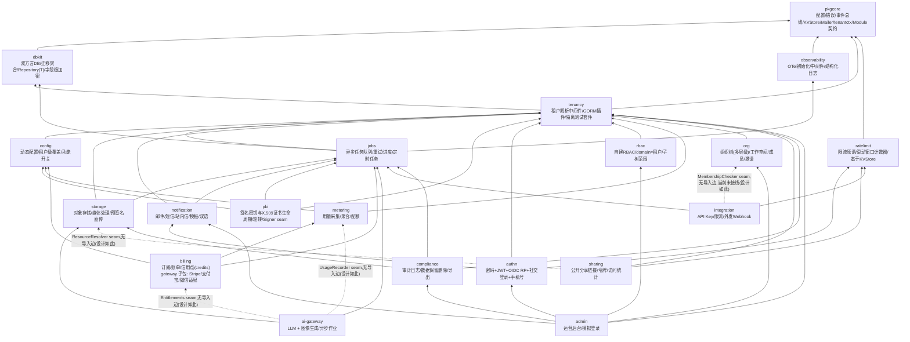

# 整体架构

> 模块划分、依赖方向、以及模块如何被装配进一个应用。前端包的分层见 [12 前端架构](12-frontend.md)。

## 架构风格：Modular Monolith
各能力是独立发布的 Go module，但在具体产品里编译进**同一个二进制**，模块间是进程内接口调用。不引入服务发现、服务网格等 K8s 风格设施——与 Docker Compose 小规模部署的约束匹配。异步解耦统一走事件总线（`EventBus` seam 有多套常驻实现——进程内 channel、Redis Streams 消费组等，装配时按 [03 部署模式与实现组装](03-deployment-modes.md) 选择，都不是 MVP 占位）。

## 后端模块依赖图



图中虚线边（`-.->`，带 seam 标注）表示两个模块之间存在真实的能力协作，但**刻意、永久不建立 import 关系**——协作方在自己包内声明一个结构化类型的接口（无导入方向的 seam），由宿主装配时注入具体实现，与 `org.FeatureGate`/`rbac.SubtreeResolver` 同一手法；这是设计决策，不是尚未补上的依赖。`ai-gateway`→`billing`/`metering`（`Entitlements`/`UsageRecorder` 两个 seam）、`sharing`→`storage`（`ResourceResolver` seam）、`integration`→`org`（`MembershipChecker` seam）三条都是这一类——`go/ai-gateway/module.go`、`go/sharing/resolver.go`、`go/integration/seams.go` 各自的文档注释明确记录这一点为永久性质。这三条虚线边并不等重：`ai-gateway` 的两个 seam 各自的文档注释指名道姓地把 `*billing.EntitlementsService`/`go/metering` 点为宿主该注入的实现，`sharing` 的 `ResourceResolver` 在 `examples/reference-app/cmd/server/server.go` 里确有真实接线（`sharing.WithResourceResolver(&storageSharingResolver{...})`）；`integration` 的 `MembershipChecker` 不同——`go/integration/seams.go` 自己的文档注释只说明"谁维护租户成员关系"这件事本身应当模块无关（"whichever module actually tracks who belongs to a tenant"），本代码库里恰好是 `go/org` 的名册，但注释原话明确"nothing requires that"；而且全仓搜索 `WithMembershipChecker(` 只命中该接口自身的定义处，没有任何宿主代码调用它——图上这条边因此画向 `org` 只是"本代码库里唯一现成的候选实现"，不是像另外两条那样已经写死、已经接线的设计目标，读图时不应把它和另外两条一视同仁。这与图上其余的实线边不同：实线边是真实的 Go import（对应各模块 `go.mod` 的 `require`），一个模块与另一个模块之间画不出边，单纯意味着当前版本没有依赖，不代表刻意的边界——`admin` 尚未落地的 `billing`/`metering`/`cfg` 依赖（D9 用量看板等 round 2 工作）就是这种情况，属于尚未建设而非刻意不建，图上因此不画任何形式的边，包括虚线。

**四条必须写进文档并由 code review 强制执行的纪律：**
1. `rbac` 不依赖 `authn`。授权只认 `Subject{TenantID, UserID}`，由认证方自行拼装 Subject 后调用授权。
2. 业务模块之间禁止 import 对方的 struct 做数据库关联，一律用 **ID 引用 + 领域事件**。例：`authn` 发布 `UserCreated`，`org` 订阅后建默认工作空间；而不是 `org` import `authn.User`。这是多模块独立发版下避免版本耦合地狱的关键。
3. **编译期引入哪些实现，由应用组装者决定，框架不代劳。** 纪律 2 管源码层面，这一条管打包层面：Go 按**包**而非按符号解析依赖，所以一套后端实现只要与接口同包，任何 import 该包的模块就继承它的全部依赖——哪怕一个实现都没用到。确定只用 SQLite 的应用不该被迫编译进 PostgreSQL 驱动；需要运行期在两者间切换的应用，两个驱动包都 import 即可，能力一分不减。现实后果可实测：`go/ratelimit` 非测试代码里零第三方 import，消费者却要背 24 个 indirect 依赖，其中含 S3 SDK——它没做错任何事，是它依赖的包替它做了决定。详见 [03 部署模式与实现组装](03-deployment-modes.md) 的"实现注册表"节与约束 6。
4. `authn` 不 import `pki`。图上没有 `authn --> pki` 这条边是刻意的：`authn` 在自己这边声明 `KeySource` 接口，由 `pki` 的服务结构化满足，宿主在装配时注入——与 `org`/`rbac` 之间那套无 import 接缝同一手法。`pki` 因此是**装配层面**的必需依赖（不注入则 `NewModule` 失败），不是编译层面的依赖。此外 `authn` 不得触及 `pki` 的 X.509 层：JWT 验签只要公钥和 kid，证书链对它没有价值，只会引入证书解析与链校验的攻击面。详见 [22 密钥与证书生命周期](22-pki.md)。

---

## 模块接入契约

每个后端模块实现统一的 `Module` 接口，由 Kernel 装配。**模块需要向宿主注册的东西远不止路由**——配置、文案、开关、任务、通知、权限、审计动作各有一套注册表，如果不在接口里一次定义清楚，后续每加一类注册机制就要改一次核心接口，而 lockstep 版本下改核心接口是破坏性变更。

```go
type Module interface {
    // 身份与依赖
    Name() string
    DependsOn() []string          // 模块开关的依赖闭包解析依据

    // 资产声明（全部用 embed.FS，与模块代码同版本）
    Migrations() embed.FS         // 双方言迁移文件，由 dbkit.MigrationRegistry 聚合执行；
                                   // 类型故意用标准库的 embed.FS 而非任何 dbkit 自定义类型——
                                   // Module 接口定义在 pkgcore，pkgcore 是 dbkit 的依赖底座，
                                   // 若这里引用 dbkit 的类型会让 pkgcore 反过来依赖 dbkit，成环
    Locales() embed.FS            // zh-CN / en-US 资源
    OpenAPISpec() []byte          // 该模块的 API 契约片段

    // 注册（由 Kernel 在装配阶段依次调用）
    Register(reg *Registry) error
}

// Registry 汇总所有注册面，新增一类注册只改 Registry，不动 Module 接口
type Registry struct {
    Routes        RouteRegistrar        // HTTP 路由（实现由 spec 生成的 server interface）
    Config        ConfigSchemaRegistrar // 引导配置结构体片段 + 动态配置项 schema
    Features      FeatureRegistrar      // 功能开关：key、默认值、依赖
    Permissions   PermissionRegistrar   // 该模块定义的 resource:action 清单
    Jobs          JobHandlerRegistrar   // 异步任务处理器
    Notifications NotificationRegistrar // 通知类型：分组、默认渠道、是否可退订
    Events        EventRegistrar        // 发布的领域事件 + 订阅
    AuditActions  AuditActionRegistrar  // 该模块产生的审计动作枚举
}
```

**为什么用一个 `Register(reg *Registry)` 而不是 8 个方法**：新增一类横切机制（比如将来加"数据导出器"）只需在 `Registry` 加一个字段，已有模块不受影响、无需重新实现接口；如果每类都是接口方法，加一个方法就会让所有模块都编译失败——这在 lockstep 发布下是破坏性变更。

**声明式注册带来的三个副产品**（都在别处被依赖，不是为了好看）：
- 权限清单自动汇总 → 运营后台的角色配置页面自动渲染，无需手工维护权限列表
- 配置与开关 schema 自动汇总 → 配置文档自动生成（见 [13 文档规范](13-documentation-standards.md)）
- 通知类型自动汇总 → 用户的通知偏好矩阵页面自动渲染（见 [07 平台服务](07-platform-services.md)）

**中间件链固定顺序**（写进文档，禁止随意调整）：
`recover → request-id/log-context → 可观测性埋点 → tenancy.Middleware → authn.Middleware → rbac.RequirePermission → billing 权益校验(可选) → handler`

> **实现状态注记（2026-09-03，authn 轮）——本注记不是设计正文，设计正文保持原样。**
>
> `go/authn` 落地时发现上面这条顺序在 `tenancy.Resolver` 现有签名下无法成立：`Resolve(r *http.Request) (pkgcore.TenantID, error)` 只返回一个 tenant，不返回 context，如果 `tenancy.Middleware` 先跑，等 `authn.Middleware` 再验一次 token 时，验证结果没有地方可以传给前面已经决定过 tenant 的那次解析——等于同一个凭证要被验两遍，而且两条验证路径可能分叉，最终谁说了算是"没有做鉴权决策的那一路"，这本身就不安全。
>
> 因此 `examples/reference-app/cmd/server/server.go` 实际接的顺序是 `authn.Middleware(verifier) → tenancy.Middleware(authn.NewPrincipalResolver())`——先验一次 token，`authn.NewPrincipalResolver` 再把已验证的 Principal 读出来交给 `tenancy.Middleware` 做 tenant 注入，`tenancy.Middleware` 仍然是唯一调用 `pkgcore.WithTenant` 的地方，失败即关闭（fail-closed）的语义不变：未认证请求只有落在 `tenancy.WithAllowlist` 白名单里才会放行（登录、注册、token 刷新、社交回调等 pre-auth 路由），其余路由一律要求一个已验证的 Principal。`rbac.RequirePermission` 尚未实现，链条到 `authn.Middleware` 为止；`billing` 权益校验同样未实现。完整推理见 `go/authn/AGENTS.md`"The middleware chain is authn, then tenancy" 一节与 `go/authn/middleware.go`'s `PrincipalResolver` 文档注释。当前实现状态以根目录 CLAUDE.md 的 Repository Status 为准。

**依赖注入用 google/wire**（编译期生成）而非 uber/fx：脚手架会被很多不同团队阅读修改，显式生成的装配代码比运行时反射更容易被陌生团队理解和调试。

**事件总线是给可观测性与审计留的统一缝隙**：`observability` 与 `compliance` 只需订阅同一总线即可拿到全部领域事件，业务模块无需耦合它们的具体实现。

前端骨架的 Provider 组装顺序：
`QueryClientProvider → AppThemeProvider → AuthProvider → RouterProvider`

