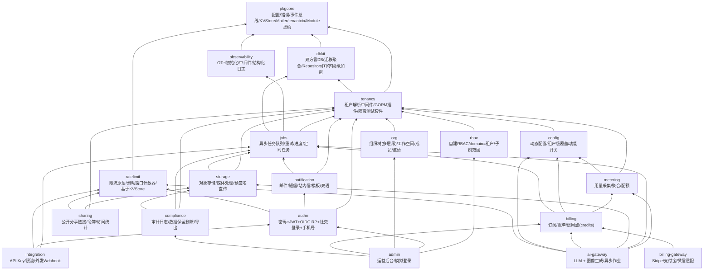

# 整体架构

> 模块划分、依赖方向、以及模块如何被装配进一个应用。前端包的分层见 [12 前端架构](12-frontend.md)。

## 架构风格：Modular Monolith
各能力是独立发布的 Go module，但在具体产品里编译进**同一个二进制**，模块间是进程内接口调用。不引入服务发现、服务网格等 K8s 风格设施——与 Docker Compose 小规模部署的约束匹配。异步解耦统一走事件总线（`EventBus` seam 有多套常驻实现——进程内 channel、Redis Streams 消费组等，装配时按 [03 部署模式与实现组装](03-deployment-modes.md) 选择，都不是 MVP 占位）。

## 后端模块依赖图



**两条必须写进文档并由 code review 强制执行的纪律：**
1. `rbac` 不依赖 `authn`。授权只认 `Subject{TenantID, UserID}`，由认证方自行拼装 Subject 后调用授权。
2. 业务模块之间禁止 import 对方的 struct 做数据库关联，一律用 **ID 引用 + 领域事件**。例：`authn` 发布 `UserCreated`，`org` 订阅后建默认工作空间；而不是 `org` import `authn.User`。这是多模块独立发版下避免版本耦合地狱的关键。

---

## 模块接入契约

每个后端模块实现统一的 `Module` 接口，由 Kernel 装配。**模块需要向宿主注册的东西远不止路由**——配置、文案、开关、任务、通知、权限、审计动作各有一套注册表，如果不在接口里一次定义清楚，后续每加一类注册机制就要改一次核心接口，而 lockstep 版本下改核心接口是破坏性变更。

```go
type Module interface {
    // 身份与依赖
    Name() string
    DependsOn() []string          // 模块开关的依赖闭包解析依据

    // 资产声明（全部用 embed.FS，与模块代码同版本）
    Migrations() embed.FS         // 双方言迁移文件，由 dbkit.MigrationRegistry 聚合执行；
                                   // 类型故意用标准库的 embed.FS 而非任何 dbkit 自定义类型——
                                   // Module 接口定义在 pkgcore，pkgcore 是 dbkit 的依赖底座，
                                   // 若这里引用 dbkit 的类型会让 pkgcore 反过来依赖 dbkit，成环
    Locales() embed.FS            // zh-CN / en-US 资源
    OpenAPISpec() []byte          // 该模块的 API 契约片段

    // 注册（由 Kernel 在装配阶段依次调用）
    Register(reg *Registry) error
}

// Registry 汇总所有注册面，新增一类注册只改 Registry，不动 Module 接口
type Registry struct {
    Routes        RouteRegistrar        // HTTP 路由（实现由 spec 生成的 server interface）
    Config        ConfigSchemaRegistrar // 引导配置结构体片段 + 动态配置项 schema
    Features      FeatureRegistrar      // 功能开关：key、默认值、依赖
    Permissions   PermissionRegistrar   // 该模块定义的 resource:action 清单
    Jobs          JobHandlerRegistrar   // 异步任务处理器
    Notifications NotificationRegistrar // 通知类型：分组、默认渠道、是否可退订
    Events        EventRegistrar        // 发布的领域事件 + 订阅
    AuditActions  AuditActionRegistrar  // 该模块产生的审计动作枚举
}
```

**为什么用一个 `Register(reg *Registry)` 而不是 8 个方法**：新增一类横切机制（比如将来加"数据导出器"）只需在 `Registry` 加一个字段，已有模块不受影响、无需重新实现接口；如果每类都是接口方法，加一个方法就会让所有模块都编译失败——这在 lockstep 发布下是破坏性变更。

**声明式注册带来的三个副产品**（都在别处被依赖，不是为了好看）：
- 权限清单自动汇总 → 运营后台的角色配置页面自动渲染，无需手工维护权限列表
- 配置与开关 schema 自动汇总 → 配置文档自动生成（见 [13 文档规范](13-documentation-standards.md)）
- 通知类型自动汇总 → 用户的通知偏好矩阵页面自动渲染（见 [07 平台服务](07-platform-services.md)）

**中间件链固定顺序**（写进文档，禁止随意调整）：
`recover → request-id/log-context → 可观测性埋点 → tenancy.Middleware → authn.Middleware → rbac.RequirePermission → billing 权益校验(可选) → handler`

**依赖注入用 google/wire**（编译期生成）而非 uber/fx：脚手架会被很多不同团队阅读修改，显式生成的装配代码比运行时反射更容易被陌生团队理解和调试。

**事件总线是给可观测性与审计留的统一缝隙**：`observability` 与 `compliance` 只需订阅同一总线即可拿到全部领域事件，业务模块无需耦合它们的具体实现。

前端骨架的 Provider 组装顺序：
`QueryClientProvider → AppThemeProvider → AuthProvider → RouterProvider`

