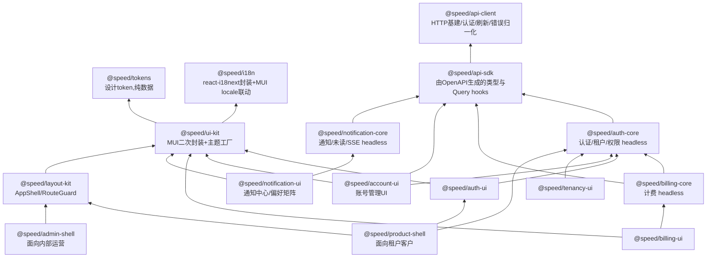

# 前端架构

> npm 包分层、生成式 API 调用（禁止手写）、ui-kit 组件范围、主题与多品牌定制、状态管理选型。

## 包分层

> **图注（边按实际依赖画）**：`layout-kit` 是 auth-agnostic 的（依赖仅 `i18n`/`ui-kit`，`RouteGuard` 只吃 host 注入的 `status` 值，见该包 AGENTS.md），图上没有指向它的 `auth-core` 边；tenancy-ui 的 `src/` 从不 import `ui-kit`（主题 provider 只出现在 `test-utils/` 与 devDependencies——测试树要渲染在真实 host 组合下），其依赖仅 `auth-core`（type-only）与 `i18n`。product-shell 直接依赖 `auth-core` 与 `auth-ui`（`useAuthState` 读会话快照、`auth-ui` 的默认 `SessionEndedScreen`）。正文下段"两者共享 `layout-kit`/`ui-kit`/`auth-core`"按**直接依赖**读为：product-shell 依赖 `layout-kit`/`auth-core`/`auth-ui`（`ui-kit` 与 `i18n` 经这三者间接进入），admin-shell 落地时同理只取所需。`billing-core`/`billing-ui`/`notification-core`/`notification-ui`/`admin-shell` 是尚未实现的规划节点（见 [15 里程碑](15-roadmap.md)）；其余边按实际依赖画。

**product-shell 与 admin-shell 拆成两个包、两个独立部署应用**：客户端权限是"租户内角色"，运营端是"内部员工角色"且能跨租户看数据，混在一起会造成权限逻辑纠缠和跨租户数据泄漏的审计风险。两者共享 `layout-kit`/`ui-kit`/`auth-core`，shell 本身只是薄的组装配置层，重复代码很少。

## API 调用：一律使用生成代码

**前端禁止手写任何后端调用**——包括 `fetch`、`axios`、以及自己封装的 request 函数。所有接口调用只能来自 `@speed/api-sdk`（由 OpenAPI 规范经 orval 生成的 TanStack Query hooks）。完整机制见 [21 API 契约](21-api-contract.md)。

这条规则由 CI 的 ESLint 规则强制，不是靠 review。理由很直接：手写调用是前后端接口漂移的唯一入口，堵住它就从机制上消除了这类问题。

`@speed/api-client` 与 `@speed/api-sdk` 的分工：前者是手写的运行时基建（fetch 实例、认证头注入、401 静默刷新、错误归一化、重试），后者是纯生成物、禁止手改。分开是因为生成物每次发布都会被整体覆盖。

## ui-kit 组件清单

下面第一组是核心组件。组件全部受控、props 驱动、不含任何业务与租户语义，保证在任何项目、任何认证方案下可复用。

**第一组（核心，已交付）**

| 组件 | 说明 |
|---|---|
| `AppThemeProvider` / `createAppTheme` | 主题工厂与三层 token 合并 |
| `DataTable` | 分页、排序、筛选、空态、加载态、行选择 |
| `FormField` / `FormLayout` | 基于 react-hook-form 的表单适配层，统一校验错误展示 |
| `EmptyState` | 空数据、无权限、出错三种语义 |
| `ConfirmDialog` | 危险操作二次确认 |
| `PageHeader` | 标题、面包屑、操作区 |

**第二组（随对应能力交付）**

`FileUploader`（配合 storage，已交付，见下）、`StatCard` / `Sparkline`（用量展示）、`StatusBadge`、`SearchInput`、`ToastProvider`、`LoadingOverlay`、`JobProgress`（配合 jobs 的进度展示）——除 `FileUploader` 外的其余组件尚未实现。

> `FileUploader` 已交付：完全受控的队列组件——队列就是 host 的 `rows` 状态，每行状态与进度按 props 原样渲染，每次 pick/取消/重试/移除经 `onSelectFiles`/`onCancel`/`onRetry`/`onRemove` 回调上报；**上传传输是 host 自己的代码，组件零 HTTP**——host 的传输就是组件的网络边界，大小/类型/数量预校验与并发上限都是 host 传输代码的职责；「组件全部受控」一条没有具名例外，组件与全家的关系见 ui-kit AGENTS.md。storage 的前端调用（api-sdk 生成的 hooks）已就位：合并文档现为十一个平台模块片段（storage、org 与 config 在内；reference-app 自有的 notes、cases、smilesim 归应用自有生成流，并入应用自己的合并文档、生成应用自有 SDK，见 [21 API 契约](21-api-contract.md) 的应用自有生成流节），`storage_createObject`/`storage_uploadObjectContent` 等操作随 orval 生成进 `@speed/api-sdk`（[21 API 契约](21-api-contract.md) 的片段清单与"模块驱动的合并策略"）；尚无工作区页面把这些 hooks 接上传 UI，该消费证明缺口与 ui-kit AGENTS.md 的对应条目同记。

**表单方案**：react-hook-form + zod 校验。zod schema 优先从 OpenAPI 生成的类型推导，避免前后端校验规则各写一套。

> **响应式行为契约**：逐组件记录"响应式"具体指什么（断点走 MUI 主题，见该包文档注释与测试）：
>
> - **layout-kit `AppShell`**：移动端（temporary）抽屉的 paper 宽度有 CSS `min(sidebarWidth, 85vw)` 上限——极窄视口（约 320px 及以下）不会出现贴近满屏或溢出的抽屉；桌面端（permanent）抽屉宽度是纯 `sidebarWidth`。AppBar 的 Toolbar 行与 `headerActions` 分组带响应式 `flexWrap: 'wrap'`，host 塞进多个头部操作时换行而不是被挤压或裁切。均未新增或修改任何 prop，也没有"自动折叠溢出菜单"之类新的 host 面行为。
> - **ui-kit `FileUploader`**：每行的操作按钮组（上传中的取消按钮；已完成/失败行的重试/移除按钮）带响应式 `flexWrap: 'wrap'`，长文件名加多个按钮不会溢出窄队列卡片。
> - **ui-kit `PageHeader`**：标题/操作区行原有 flexWrap 换行，有一条回归测试钉住该行为。
> - **ui-kit `FormLayout`**：可选 `columns?: 1 | 2` prop，默认 `1`（无条件单列纵向流，省略该 prop 的消费者零行为变化）；`columns={2}` 切到响应式 CSS Grid：`sm`（600px）以下单列、`sm` 及以上两列等宽轨道，操作区在 grid 模式下跨满全部列轨道。断点选 `sm` 而非 `md`：两字段一行（如姓名/邮箱并排）跨过手机/平板竖屏分界线后字段宽度已足够可读；需要整行宽度的字段无论视口如何都传 `columns={1}`。
> - **ui-kit `DataTable`**：横向溢出由 `TableContainer` 自带的 `overflow-x: auto` 处理，列数或列宽如何都会在容器内横向滚动而非撑破页面——该契约声明在组件文档注释并有回归测试钉住。按优先级隐藏/重排列的响应式布局未实现（README 的 Deferrals 记录）。
> - **reference-app 三个页面视图**（home-view.tsx、notes-view.tsx、account-view.tsx）：移动视口边距 16px（`p: { xs: 2, sm: 3 }`）；sign-in-view 用 `width: 1` + `maxWidth` 写法（其外层容器的固定 `p: 3` 边距与三处视图是同一类遗留问题，尚未一并处理）。
>
> 测试方法：本仓库的 Playwright/真实视口基建在 reference-app 的 e2e 套件（`examples/reference-app/web/e2e`，由 `.github/workflows/e2e.yml` 真实流水线驱动，跑 app 级页面旅程）；组件级断点断言仍走本节的替身/emitted-CSS 层。JS 分支断点逻辑沿用 `AppShell.test.tsx` 的 `window.matchMedia` 布尔替身模式；纯 CSS sx 断点值（FormLayout 的 grid 列、AppShell 移动抽屉宽度上限）——jsdom 既不布局也不求值 `@media` 条件——改读 emotion 注入进文档的实际 CSS 文本（`emittedStyleText()`，`test-utils/emitted-css.ts`，ui-kit 与 layout-kit 两包各有一份）做属性/快照式断言，证明"预期的声明确实被写进了渲染结果"，而不是证明"某个断点侧的布局在真实设备上看起来正确"——这条局限性在测试文件自身的注释与两包的 README/AGENTS.md 里都逐处写明。

## 跨领域 hooks 的归属

避免"这个 hook 该放哪个包"反复扯皮，明确归属规则：**hook 跟随它所属的领域包，而不是集中放在 api-client。**

| Hook | 归属 | 说明 |
|---|---|---|
| `useJob(jobId)` | `@speed/api-sdk` + `ui-kit` 的 `JobProgress` | 查询由 sdk 生成，进度 UI 在 ui-kit |
| `usePermission` / `useCurrentTenant` | `@speed/auth-core` | 权限判定是纯客户端集合查找 |
| `useFeature(api, key)` / `usePublicConfig(api)` | `@speed/api-client` | 公开配置在应用启动时拉取，早于任何领域包初始化 |
| `useUnreadCount` / `useNotificationStream` | `@speed/notification-core` | 含 SSE 长连接管理，是 OpenAPI 覆盖不到的部分 |

> 上表 `useFeature` / `usePublicConfig` 归属 `@speed/api-client` 的决策已按原样落地，实现放在隔离的 `@speed/api-client/react` 子路径下（`src/react.ts`），而非包主入口——主入口保持零依赖，仅这一子路径引入 `react`（作为该子路径的 required peerDependency），做法与 `@speed/i18n` 的 `./mui-locale` 子路径一致。两个 hook 的实际签名都要求显式传入共享缓存所依据的 `RequestFn`：`usePublicConfig(api)` 与 `useFeature(api, key)`（不是上表为省略 `api` 参数所写的简化形态），共享一份按 `RequestFn` 引用键控的缓存。详见 `web/packages/api-client/README.md`。

## 运营后台的权限模型

`admin-shell` 面向平台内部员工，权限 domain 是 `system` 而非某个租户。`auth-core` 的 `usePermission` 对两者用同一套接口，差别只在 `/me` 返回的权限集来自哪个 domain——前端不需要两套权限逻辑，但**必须在 UI 上明确区分当前处于"平台视角"还是"租户视角"**，尤其在模拟登录期间要有持续可见的醒目标识，防止误操作。

## 状态管理与数据请求选型
- **服务端状态 TanStack Query + 客户端状态 Zustand**（不引入 Redux）。
- Query key 强制按租户命名空间：`['tenant', tenantId, resource]`。切换租户后 key 天然变化，旧数据自动失效；`switchTenant` 成功后显式 `removeQueries(['tenant', oldId])` 清理缓存，避免运营后台频繁切租户导致内存堆积。
- `currentTenantId` 放 Zustand 而非 Context：高频读低频写，selector 按需订阅避免大范围 re-render；且**可在组件树外读取**（如构造 query key 时）。

  **实施精确化：** 真实落地的机制不是 Zustand——`web/` 全部 `package.json` 与 pnpm lockfile 里都没有 `zustand` 这个依赖。`currentTenantId` 走的是 `@speed/auth-core` 的 `useCurrentTenant`：`session.ts` 里一份内存态，`hooks.ts` 用 React 18 原生的 `useSyncExternalStore` 订阅（`src/hooks.ts`），效果和上面两条列的取舍一致——高频读、按需订阅、组件树外可读（`session` 闭包本身就是那个组件树外的读取点）——只是不经过 Zustand 这个第三方库。上面两条按"当初设想的方案"读，不按"现状"读。
- **注意：前端不把 `tenantId` 作为请求头发送。** 租户上下文由 access token 携带，服务端只信任令牌（见 [04 数据层与多租户](04-data-and-tenancy.md) 的信任边界）。前端这份 `currentTenantId` 只用于三件事：query key 命名空间、UI 展示、调用切换租户接口时的入参。切换租户成功后拿到新令牌，随后所有请求自动带上新租户。
- Token 存储：refresh token 走 httpOnly+Secure+SameSite Cookie，access token 只存内存，不落 localStorage。
- **主题三层覆盖**：`defaultTokens`（包内置）→ `projectTokens`（业务项目 `theme/tokens.ts`，构建期）→ `tenantOverrides`（运行时从后端拉取，支持白标 SaaS 按租户换 Logo/主色）。业务项目只写差异部分，深合并回退默认值。品牌资产放业务项目 `public/`，包内不打包任何具体品牌资产。
- **计费 UI 配置驱动**：`Plan`/`Feature` 数据结构由后端 `/billing/plans` 下发，前端不硬编码套餐名与价格，同一套 UI 组件适配不同项目的定价模型。

> 本表 `usePermission` / `useCurrentTenant` 归属 `@speed/auth-core` 的决策已按原样落地。`web/packages/auth-core` 交付 `createAuthSession(store)`（内存态会话状态机：匿名/已认证快照、密码与短信登入、登出、切租户、step-up、刷新）与 `useAuthState` / `useCurrentTenant` / `usePermission(domain, permission)`（`attachSession` 绑定一个会话，last-bind-wins）；`usePermission` 的 domain 参数即下节"运营后台的权限模型"所分的 `tenant` / `system` 两域，实现是纯客户端集合查找（UX 便利而非安全边界，服务端独立授权）。
>
> **`/me` 与权限下发的形态**：`/api/v1/authn/me`（`authn_getMe`）只返回 `AuthnPrincipal`（身份：user_id / tenant_id / 会话信息），authn spec 没有任何 permissions 字段；rbac 又不挂 HTTP 路由，权限数据没有服务端下发端点。权限集由 **host 侧 attach**：`session.setPermissionSet('tenant' | 'system', string[] | null)`（`null` 清空该域），会话层执行存活规则——静默刷新与 step-up 保留两域、切租户丢弃 tenant 域并保留 system 域、换用户或登出清空两域、失败的操作不改动任何状态。真实获取流程的落地方案见下文 consumer-shell 对照（"查询即权限获取"）。
>
> **token 传输形态**：上文"Token 存储：refresh token 走 httpOnly+Secure+SameSite Cookie，access token 只存内存"是设计目标；authn API 的实际形态：token 签发响应把 refresh token 放在**响应体**（`AuthnTokenPair.refresh_token`，在 tenant-switch 与 step-up 响应中缺席——两者轮换既有 token 家族），**不设置 refresh cookie**——authn 设置的唯一 HttpOnly cookie 是 social 绑定预授权路径那个（`Path /api/v1/authn/social`）；refresh 端点在请求体里读取调用方持有的 token。`@speed/auth-core` 按此设计：access token 只进内存 store（`@speed/api-client` 每次发送前重读），refresh token 只存在于会话闭包、永不写入任何存储，无 `restore`——刷新页面即回到匿名，需重新登录（见该包 README 的 Known limitations）。refresh cookie 或持久化层未引入。

> **auth-ui 的实现形态**：登录组件家族已落地，"运行时端到端消费"在形态层面兑现（真实 api-client + fetch 替身注入点，见 [21 API 契约](21-api-contract.md)）。`web/packages/auth-ui` 交付受控的登录组件家族，组件全部以 session prop 驱动、零 hooks 消费、成功后只触发一次回调、从不导航或直连网络：`SignInScreen` 以 tab 条组装通道（密码为默认通道，切换即卸载前一表单——刻意重置，通道错误不跨表面残留，社交块只在给了 `social` prop 时出现），`PasswordSignInForm` 单 identifier 字段（邮箱或手机，由后端决定），`SMSSignInForm` 两步 phone→code（请求步唯一的 code 形态失败是 `authn.rate_limited`），`RegisterForm` 以 `'@'` 启发式把 identifier 拆进 spec 的 email/phone 分离形态、trim 可选 display name、locale 在提交时读取；社交一半是 `SocialSignInSection`（每 provider 一个按钮，点击只请求该通道的 authorize URL——纯请求经 `onAuthorizeUrl` 上报，包从不导航）加 host 回调路由上的 `SocialCallbackHandler`（effect 以 `(code, state)` 对为键，StrictMode 双调用只发起一次交换）；会话出口是 `SignOutButton`（成功后刻意静默、失败可重试）与 `SessionEndedScreen`（`ui-kit` `EmptyState` 的 noPermission 变体、全部文本槽从 auth-ui namespace 覆盖——无 session prop、无 hooks、无网络）。全部内置文案来自双语 `auth-ui` namespace；错误答案经可达子集白名单解析（登录/注册与 identifier code、社交端点 code、会话生命周期 code、client 传输 code），白名单外一律落 `unknown` 兜底，包内永远不渲染裸 key。
>
> **组件零 hooks 消费是刻意契约，host 侧会话观察是快照驱动**：session 以 prop 进组件、成功登录只发一次 `onSignedIn`，之后 host 用自己的 `useAuthState` 快照翻转决定渲染什么；`src/usage-example.test.tsx` 的 SessionGate fixture 是 host-router 的迷你模型：认证快照 → app 视图；曾在 app 视图而快照转匿名 → `SessionEndedScreen`；首次认证前 → 登录面。会话结束是**可观察的而非可命令的**：无恢复、无 refresh cookie，服务端会话死亡经 api-client 的 401-刷新腿收敛——`refresh()` 解析 `false` 即本地登出、快照转匿名（api-client 的 Reporter 接口以 `access token refresh failed` 上报那次被拒的刷新），`SessionEndedScreen` 的 action 经 `onSignIn` 把用户交还 host 的登录面。路由级门禁（layout-kit `RouteGuard`、shell 真实路由）是 host 组合的形态（见下文 product-shell 与 consumer-shell 对照）。
>
> **permission-attach 缺口原样存在**："权限集只能由 host 侧 attach、无服务端下发端点"这一缺口在登录组件家族里**没有变化**——auth-ui 只消费身份（会话快照与 `/me` 的 `AuthnPrincipal`），无任何权限集合参数；`usePermission` 的集合仍由 host 在 `attachSession` 后 set（auth-core 的 `setPermissionSet`）。家族刻意停在身份层，不碰授权。
>
> **register ≠ login；绑定 / MFA / 企业 SSO 表面不在本家族**：注册成功不建立会话（spec 的 register 不是会话操作）——`RegisterForm` 靠 `onRegistered`（携带生成的 `AuthnUser`）或成功面板把新账号交还 host 的登录面再登录；绑定 UI（已认证用户给账号加通道）不在本家族——`SocialCallbackHandler` 只按登录面处理回调路由，交换答回 bound-identity 无 token 形态（服务端对已认证调用方的回答）时按 auth-core 的 `completeSocialLogin` 契约以 `client.protocol` 拒绝（绑定流程在账号管理 UI，见下文 account-ui 对照）；step-up 门槛操作与每租户配置的企业 OIDC 在本家族没有表面。服务端不存在通道发现端点（`go/authn` 侧无此类 operation），家族只渲染 host 组合进 props 的通道与 provider——页面上方的品牌、标题与 register 链接同理都是 host 内容，不入包。

> **tenancy-ui 与 product-shell 的实现形态**：consumer-shell 的一半以 `@speed/tenancy-ui` 与 `@speed/product-shell` 两个包落地；门禁作为 host 组合的形态已由套件证明，shell 自持门禁与权限真实获取仍未落地（见下文 consumer-shell 对照）。两个包把 host 义务收进可交付形态：
>
> - **tenancy-ui 交付受控的租户切换控件**：`TenantSwitcher`（session 以 prop 进组件、从不自己 attach/观察/驱动会话、当前租户来自 host 的 `currentTenantId`、切换经 `session.switchTenant`、成功只发一次 `onSwitched`、当前租户行禁用、拒绝的切换渲染白名单码文本且可重试）——它是 `authn.switchTenant` 端点的 in-form 运行时消费证明：`src/usage-example.test.tsx` 用真实 api-client + 以真 `Response` 作答的 fetch 替身钉死一次登录加三次切换尝试（成功切换断言 store 持有新令牌、请求携带 `authorization` 与 `{tenant_id}` body；拒绝尝试断言码文本呈现、会话状态不变）。文案为双语、错误白名单（`authn.*` 会话生命周期 + `client.*` 传输）+ `unknown` 兜底，与 auth-ui 共享码的文案逐字同源（同层包互不 import 目录，两版文案以套件双向钉死配对）。
> - **product-shell 把 SessionGate 形态做成 shipped 三分支视图机**：`ProductShell` 只读 `useAuthState` 快照、从不驱动会话——认证快照 → `layout-kit` `AppShell` 框架包 children；匿名且本 mount 到达过 app → host 的 `sessionEnded` 槽或默认 `auth-ui` `SessionEndedScreen`（仅默认屏内连"回登录视图"action）；匿名且从未到达 → host 的 `signIn` 槽或空（刻意不设默认登录面，通道组合是 host 产品决策）。分支二先于分支三判定：登出过的用户绝不回落到新访客登录面。壳本身零文案（无 namespace、无 locale、无错误白名单），全部 chrome props 原样透传给 `AppShell`。`src/usage-example.test.tsx` 编译并执行 README 组合：四 namespace 引导（ui-kit/layout-kit/auth-ui/tenancy-ui）+ `attachSession` + userMenu（`TenantSwitcher` 与 `SignOutButton` 并列），旅程走完整圈——登录 → 框架 → 切租户 → 登出 → 默认会话结束屏 → 再登录回框架，请求与 body 钉死。
> - **门禁与权限 attach：host 组合形态已证明，shell 自持仍延期**。"路由级门禁（layout-kit `RouteGuard` 的 `status` prop）"以 `src/gated-journey.test.tsx` 的 fixture 兑现为 host 组合形态：`children` 里的 view-id mini-router 每个目的地挂 `RouteGuard`，status 由 `usePermission` 在 host attach 的列表上派生，切租户 commit 后按 auth-core 存活规则 re-attach（fixture 以 role-load 替身扮演权限下发，因为真实获取流程仍无服务端形态）。旅程覆盖 pending→allowed 的列表重载、denial 期间刷新保持门禁稳定（`onDenied` 恰好一次）、被拒切换与会话死亡收敛。即：**门禁与 re-attach 是 host 在 `children` 里的组合，不是任何包代码**——product-shell 的 deferral 表明文不消费 `RouteGuard`/`usePermission`/`setPermissionSet`。

> **account-ui 的实现形态**：账号管理组件家族已交付（auth-ui 家族留给"账号管理 UI"的绑定流程在此兑现）。`web/packages/account-ui` 交付四个账号面区块 + 一个回调组件：`SessionsSection`（会话列表：服务端答 `is_current` 标记当前设备、行内单设备下线、双确认的一键下线其他设备、`revoked_count` 以 role=status 播报；revoked 会话留在列表灰显，当前会话不可从列表下线）、`LoginHistorySection`（最新登录历史，method/result/failure_reason 裸 token 走组件内已知清单渲染，清单外渲染通用文案）、`SocialBindingsSection`（已绑定身份列表 + 行内解绑 + 每 provider 一个按钮的 add 区，点击只请求该通道 authorize URL 并经 `onAuthorizeUrl` 上报、包从不导航）+ `BindingCallbackHandler`（host 回调路由上完成绑定：effect 以 `(code, state)` 对为键防 StrictMode 双交换，按应答形状分派——绑定形答 `{bound, identity}` → 刷新绑定列表 + `onBound` 一次；登录形答带 tokens → 渲染"已在别处登录"面板且不回调——`SocialCallbackHandler` 以 `client.protocol` 拒绝的 bound-identity 形态在本包是正常路径）、`MfaSection`（step-up 门控的 TOTP 注册/更换 + 恢复码再生成，见下）。家族全部文案来自双语 `account-ui` namespace；错误答案经白名单解析（会话生命周期、社交绑定、双因子、限流、client 传输 + `unknown` 兜底），其中与登录面同义的 code 逐字复用 auth-ui bundle 文案。runtime 端到端消费在形态层面兑现：`src/usage-example.test.tsx` 编译并执行 README quick start（真实 api-client、scripted fetch 答真实 `Response`、请求按序 pinned、逐请求断言 authorization 头）。
>
> **读走生成 react-query hooks 是与 auth-ui 零-hooks 契约的刻意对照；host 多一个 QueryClientProvider**：账号面读的是**可缓存的列表状态**（会话、登录历史、绑定身份），每次写后要失效重取——这正是 sdk 生成 hooks 层（shared-QueryClient 契约，见 [21 API 契约](21-api-contract.md)）的适用面；而登录表单的答案是 one-shot、不是缓存，所以 auth-ui 组件零 hooks 消费的契约不被破坏，两层各自成立。包内只消费生成 hooks 与导出的 query-key 构造器（`getAuthnListIdentitiesQueryKey` 等），失效从不手写 query key，组件也不自建 QueryClient（宿主拥有）；hooks 消费意味着 host 树在 auth-ui 所需 provider 之外**多一个 `QueryClientProvider`**（test-utils 的 `renderWithProviders` 同步多这一层）。连带效应：`@speed/api-sdk` 在本包是**运行时 dependency**（hooks、query-key 构造器、`authnSocialCallback` 直呼都在这里执行）——包成为 sdk 生成面继 auth-core（compile consumer）之后第二个 in-workspace 消费证明，且是第一个把 hooks 真正渲染进组件树的包。
>
> **MFA 面没有"状态"只有"行为"；step-up 验证是包内 dialog 而非页面路由**：authn spec 没有 factor-status operation 也没有 disable operation，`MfaSection` 因此永不声明"已启用/未启用"——状态经行为发现：注册请求 200 ⇒ 无激活因子、挂起向导（secret + provisioning URI 纯文本，包不引入 QR/剪贴板依赖）；403 `authn.step_up_required` ⇒ 存在激活因子，包内 step-up dialog 打开、经 `session.verifyStepUp(code)` 验证成功后再重跑被门控的操作（更换向导因此只在 step-up 后显示替换警告；恢复码再生成无条件走 step-up，重试后 200 ⇒ 面板、404 `authn.mfa_not_enrolled` ⇒ 引导文案指向注册入口）。验证成功只把新因子落进新 access token 的 `amr`，dialog 不承诺 token 轮换后不再询问——"step-up 只活在单个 access token 寿命内"在组件层原样呈现。恢复码只显示一次、离开即弃、包内永不缓存或再取。
>
> **auth-ui 不 import；provider 词汇 copy-sync；session prop 的边界是 session operation 的边界**：绑定面与登录面共享同一批 provider（authn spec 的通道清单），同层包互不 import 的规则成立——`SocialProvider`/`SocialProviderConfig` 在本包为自有定义、与 auth-ui 的副本逐字一致，由同一份 authn spec 保持同步；社交绑定回调与登录回调是同一 spec 端点的两种调用方形状，不需要 auth-ui 的任何类型。session prop 的边界守则：**有 session operation 才给 prop**——add 区的 authorize URL 请求（`session.socialAuthorizeUrl`）与 step-up 验证（`session.verifyStepUp`）是生成面表达不了的两个点，其余表面无 prop（读经绑定 client 的 access token 身份）。家族四区块是 section 不是页面：空/错态隐藏区块标题、渲染 ui-kit `EmptyState`，标题层级不跳级；导航、登入登出、密码修改（spec 无 change-password op，见 [05 身份与访问](05-identity-and-access.md) 的对照）都不是本包形状。

> **reference-app 的 consumer shell**（`examples/reference-app/web`）：`web/` pnpm workspace 的外部成员、与交付项目同位置、永不版本化。它兑现了前文对照留下的 deferral 项：auth-core 对照的"权限数据真实获取流程"、auth-ui 对照的"跨路由门禁（`RouteGuard`、shell 真实路由）"、product-shell 对照的"shell 自持门禁与权限真实获取"；浏览器页面腿的归属见末段。
>
> 门禁数据源决定（权限数据真实获取流程的落地方案）：**查询即权限获取，不补服务端权限端点**。notes 列表查询就是真实权限请求——服务端 rbac 中间件按 HTTP 方法 gate notes 路由（读 `notes:read`、写 `notes:write`；`DemoRouteRules` 是每条模块路径的全量声明，未声明路径启动即失败），无权限者答 403 `rbac.permission_denied`；`RouteGuard` status 由该查询一对一派生——有数据 `allowed`、`isError` 则 `denied`（读拒绝即权限答案，fail closed）、未答 `pending`；refetch 失败但旧列表在手保持 `allowed`（陈旧列表继续渲染），只有无数据的查询才可能 pending/denied（notes-view 的注释逐条展开）。"无服务端权限下发端点（rbac 无 HTTP 路由）、权限集只能 host-attach"的缺口**原样保留**——壳不消费 `/me` 派生列表、不调用 `usePermission`/`setPermissionSet`；`setPermissionSet` 的 host-attach 路径与设计正文的显式 `removeQueries` 清理（运营后台内存纪律）留给将来有运营后台时行使。写门禁同理不前置探测：创建经 mutation 探真实服务端答案，被拒（同一 403）留在页面渲染码文本；表单的必填与长度规则只是镜像服务器同一条约束的体验层。Query key 按设计正文命名空间化：`['tenant', tenantId, ...getNotesListNotesQueryKey()]` 覆盖生成的裸 key，创建成功只失效该命名空间 key；切租户即换 key，旧租户缓存不可能被读到。
>
> 宿主组合的最终形态：壳的 bootstrap（`src/main.tsx` 的 `bootstrapReferenceApp`，导出纯函数、无模块级副作用，套件与未来 harness 可安全 import）注册六个 namespace——ui-kit/layout-kit/auth-ui/tenancy-ui/account-ui 五个出 namespace 的包族加应用自身的 reference-app——内存 access-token store 喂 auth-core 会话状态机并 `attachSession`，单一 `createClient` 以环境自身的 fetch 构建（构造时捕获 `globalThis.fetch`；api-client 的注入接口在此即依赖注入点）并把 `session.refresh()` 接成 401 静默刷新腿，`bindRequestFn` 恰好一次，provider 顺序 I18next → 主题 → QueryClient → AppServices → product-shell 三分支视图机（AppShell 框架内以 hash 路由分派 notes/账号/home 面，不引入路由依赖）。浏览器页面腿与驱动它的浏览器自动化均已落地：`index.html` 把该 bootstrap 挂进 vite 生产构建，reference-app 服务器经 `APP_WEB_DIST` 伺服该构建（Dockerfile 打进镜像）；驱动腿在 `examples/reference-app/web/e2e` 的 Playwright 套件——默认与 `@budget` 层驱动 dev-server 页面，`@deployment` 门在指向真实部署时（需 `E2E_BASE_URL`）驱动该部署的伺服页面。
>
> 演示身份层把设计正文"前端不把 `tenantId` 作为请求头发送"的服务端镜像钉进代码：demo subject resolver 的**租户半边只读 `tenancy.Middleware` 解析进 request context 的值**，绝不来自调用方可控输入（X-Demo-User 头只可能影响用户半边）；用户半边先读 `X-Demo-User` 头（authn 落地前就存在的演示通道，保留其优先是刻意的——它是 pre-auth 流程的 affordance），其次读已验证 Principal，两者皆无则拒绝（fail closed → 403）。`APP_DEMO_USERS_PASSWORD` 门控三个真实账号（demo-owner@example.com / demo-reader@example.com / demo-acme-only@example.com）经真实 register 路由种入，成员与角色在各租户自己的 context 内授予（浏览器全程无 header）——owner 账号持内置 owner 角色（一切权限）、两个 reader 账号持自定义 note-reader 角色（`notes:read`，一个在所有演示租户、一个只在 tenant-acme，角色是 (tenant, user) 对的事实而非关于用户的）；对着已种入账号的数据库重启只 warn 不补授（成员 store 不跨重启存活，fail closed）。leg 归属：真实路由与门禁已随本 shell 落地——门禁背后是真实策略（内置角色 + 自定义角色按 (tenant, user) 对生效）；真实组成的服务器（真实注册/登录/授权路由、真实策略）由 Go 侧套件（`cmd/server/demo_users_test.go`、`cmd/server/demo_subject_test.go`）驱动钉住，壳的 vitest 套件则以脚本化 demo-server 替身（`src/test-utils/demo-server.ts`——按真实服务器的方式作答，镜像事实逐条引用 Go 侧钉住的行号）驱动同一组合树。浏览器页面腿已落地——`examples/reference-app/web/e2e` 的 Playwright 套件以真实浏览器驱动真实启动的服务器；壳内组件旅程测试与 Go 侧套件（`cmd/server/demo_users_test.go`、`cmd/server/demo_subject_test.go`）仍是各自那半的既有形态。

