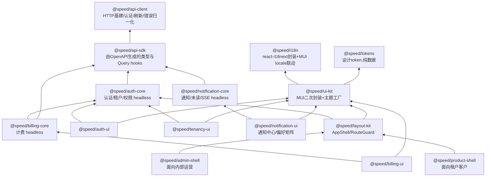

# 前端架构

> npm 包分层、生成式 API 调用（禁止手写）、ui-kit 组件范围、主题与多品牌定制、状态管理选型。

## 包分层

**product-shell 与 admin-shell 拆成两个包、两个独立部署应用**：客户端权限是"租户内角色"，运营端是"内部员工角色"且能跨租户看数据，混在一起会造成权限逻辑纠缠和跨租户数据泄漏的审计风险。两者共享 `layout-kit`/`ui-kit`/`auth-core`，shell 本身只是薄的组装配置层，重复代码很少。

## API 调用：一律使用生成代码

**前端禁止手写任何后端调用**——包括 `fetch`、`axios`、以及自己封装的 request 函数。所有接口调用只能来自 `@speed/api-sdk`（由 OpenAPI 规范经 orval 生成的 TanStack Query hooks）。完整机制见 [21 API 契约](21-api-contract.md)。

这条规则由 CI 的 ESLint 规则强制，不是靠 review。理由很直接：手写调用是前后端接口漂移的唯一入口，堵住它就从机制上消除了这类问题。

`@speed/api-client` 与 `@speed/api-sdk` 的分工：前者是手写的运行时基建（fetch 实例、认证头注入、401 静默刷新、错误归一化、重试），后者是纯生成物、禁止手改。分开是因为生成物每次发布都会被整体覆盖。

## ui-kit 组件清单

M0 的"核心组件"指下面第一组。组件全部受控、props 驱动、不含任何业务与租户语义，保证在任何项目、任何认证方案下可复用。

**第一组（M0 必须）**

| 组件 | 说明 |
|---|---|
| `AppThemeProvider` / `createAppTheme` | 主题工厂与三层 token 合并 |
| `DataTable` | 分页、排序、筛选、空态、加载态、行选择 |
| `FormField` / `FormLayout` | 基于 react-hook-form 的表单适配层，统一校验错误展示 |
| `EmptyState` | 空数据、无权限、出错三种语义 |
| `ConfirmDialog` | 危险操作二次确认 |
| `PageHeader` | 标题、面包屑、操作区 |

**第二组（随对应能力交付）**

`FileUploader`（M2，配合 storage）、`StatCard` / `Sparkline`（M2，用量展示）、`StatusBadge`、`SearchInput`、`ToastProvider`、`LoadingOverlay`、`JobProgress`（M1，配合 jobs 的进度展示）。

**表单方案**：react-hook-form + zod 校验。zod schema 优先从 OpenAPI 生成的类型推导，避免前后端校验规则各写一套。

## 跨领域 hooks 的归属

避免"这个 hook 该放哪个包"反复扯皮，明确归属规则：**hook 跟随它所属的领域包，而不是集中放在 api-client。**

| Hook | 归属 | 说明 |
|---|---|---|
| `useJob(jobId)` | `@speed/api-sdk` + `ui-kit` 的 `JobProgress` | 查询由 sdk 生成，进度 UI 在 ui-kit |
| `usePermission` / `useCurrentTenant` | `@speed/auth-core` | 权限判定是纯客户端集合查找 |
| `useFeature(api, key)` / `usePublicConfig(api)` | `@speed/api-client` | 公开配置在应用启动时拉取，早于任何领域包初始化 |
| `useUnreadCount` / `useNotificationStream` | `@speed/notification-core` | 含 SSE 长连接管理，是 OpenAPI 覆盖不到的部分 |

> **已落地**（config-web round）：上表 `useFeature` / `usePublicConfig` 归属 `@speed/api-client` 的决策已按原样落地，实现放在隔离的 `@speed/api-client/react` 子路径下（`src/react.ts`），而非包主入口——主入口保持零依赖，仅这一子路径引入 `react`（作为该子路径的 required peerDependency），做法与 `@speed/i18n` 的 `./mui-locale` 子路径一致。两个 hook 的实际签名都要求显式传入共享缓存所依据的 `RequestFn`：`usePublicConfig(api)` 与 `useFeature(api, key)`（而不是上表为省略 `api` 参数所写的历史设计形态），共享一份按 `RequestFn` 引用键控的缓存。详见 `web/packages/api-client/README.md` 与 `AGENTS.md`。

## 运营后台的权限模型

`admin-shell` 面向平台内部员工，权限 domain 是 `system` 而非某个租户。`auth-core` 的 `usePermission` 对两者用同一套接口，差别只在 `/me` 返回的权限集来自哪个 domain——前端不需要两套权限逻辑，但**必须在 UI 上明确区分当前处于"平台视角"还是"租户视角"**，尤其在模拟登录期间要有持续可见的醒目标识，防止误操作。

## 状态管理与数据请求选型
- **服务端状态 TanStack Query + 客户端状态 Zustand**（不引入 Redux）。
- Query key 强制按租户命名空间：`['tenant', tenantId, resource]`。切换租户后 key 天然变化，旧数据自动失效；`switchTenant` 成功后显式 `removeQueries(['tenant', oldId])` 清理缓存，避免运营后台频繁切租户导致内存堆积。
- `currentTenantId` 放 Zustand 而非 Context：高频读低频写，selector 按需订阅避免大范围 re-render；且**可在组件树外读取**（如构造 query key 时）。
- **注意：前端不把 `tenantId` 作为请求头发送。** 租户上下文由 access token 携带，服务端只信任令牌（见 [04 数据层与多租户](04-data-and-tenancy.md) 的信任边界）。前端这份 `currentTenantId` 只用于三件事：query key 命名空间、UI 展示、调用切换租户接口时的入参。切换租户成功后拿到新令牌，随后所有请求自动带上新租户。
- Token 存储：refresh token 走 httpOnly+Secure+SameSite Cookie，access token 只存内存，不落 localStorage。
- **主题三层覆盖**：`defaultTokens`（包内置）→ `projectTokens`（业务项目 `theme/tokens.ts`，构建期）→ `tenantOverrides`（运行时从后端拉取，支持白标 SaaS 按租户换 Logo/主色）。业务项目只写差异部分，深合并回退默认值。品牌资产放业务项目 `public/`，包内不打包任何具体品牌资产。
- **计费 UI 配置驱动**：`Plan`/`Feature` 数据结构由后端 `/billing/plans` 下发，前端不硬编码套餐名与价格，同一套 UI 组件适配不同项目的定价模型。

> **已落地（auth-core round）：本表 `usePermission` / `useCurrentTenant` 归属 `@speed/auth-core` 的决策已按原样落地。** `web/packages/auth-core` 交付 `createAuthSession(store)`（内存态会话状态机：匿名/已认证快照、密码与短信登入、登出、切租户、step-up、刷新）与 `useAuthState` / `useCurrentTenant` / `usePermission(domain, permission)`（`attachSession` 绑定一个会话，last-bind-wins）；`usePermission` 的 domain 参数即下节"运营后台的权限模型"所分的 `tenant` / `system` 两域，实现是纯客户端集合查找（UX 便利而非安全边界，服务端独立授权）。
>
> **同轮机制注记：上节"/me 返回的权限集来自哪个 domain"所依赖的机制未被落地 API 支撑，需要修正**——shipped 的 `/api/v1/authn/me`（`authn_getMe`）只返回 `AuthnPrincipal`（身份：user_id / tenant_id / 会话信息），authn spec 中没有任何 permissions 字段；rbac 模块又刻意不挂 HTTP 路由，权限数据当前没有服务端下发端点。因此权限集只能由 **host 侧 attach**：`session.setPermissionSet('tenant' | 'system', string[] | null)`（`null` 清空该域），会话层执行存活规则——静默刷新与 step-up 保留两域、切租户丢弃 tenant 域并保留 system 域、换用户或登出清空两域、失败的操作不改动任何状态；权限数据的真实获取流程（含 `/me` 派生列表）留给 consumer-shell round 的设计注记。本表归属行不受影响：hook 归 `auth-core` 的决策按原样落地，`tenant` / `system` 的 domain 语义也未变。
>
> **token 传输现实注记（同一轮）**：上文"Token 存储：refresh token 走 httpOnly+Secure+SameSite Cookie，access token 只存内存"是设计目标；shipped 的 authn API 走的是另一条现实：token 签发响应把 refresh token 放在**响应体**（`AuthnTokenPair.refresh_token`，在 tenant-switch 与 step-up 响应中缺席——两者轮换既有 token 家族），**不设置 refresh cookie**——authn 设置的唯一 HttpOnly cookie 是 social 绑定预授权路径那个（`Path /api/v1/authn/social`）；refresh 端点在请求体里读取调用方持有的 token。`@speed/auth-core` 按此现实设计：access token 只进内存 store（`@speed/api-client` 每次发送前重读），refresh token 只存在于会话闭包、永不写入任何存储，无 `restore`——刷新页面即回到匿名，需重新登录（见该包 README 的 Known limitations）。是否引入 refresh cookie 或持久化层，留待 M4 发布基线与安全评审。

> **已落地（auth-ui round）：登录组件家族落地，上一注记留给 consumer-shell 的"运行时端到端消费"在形态层面兑现（真实 api-client + fetch 替身 seam，见 21-api-contract.md 的同一轮注记）。** `web/packages/auth-ui` 交付受控的登录组件家族，组件全部以 session prop 驱动、零 hooks 消费、成功后只触发一次回调、从不导航或直连网络：`SignInScreen` 以 tab 条组装通道（密码为默认通道，切换即卸载前一表单——刻意重置，通道错误不跨表面残留，社交块只在给了 `social` prop 时出现），`PasswordSignInForm` 单 identifier 字段（邮箱或手机，由后端决定），`SMSSignInForm` 两步 phone→code（请求步唯一的 code 形态失败是 `authn.rate_limited`），`RegisterForm` 以 `'@'` 启发式把 identifier 拆进 spec 的 email/phone 分离形态、trim 可选 display name、locale 在提交时读取；社交一半是 `SocialSignInSection`（每 provider 一个按钮，点击只请求该通道的 authorize URL——纯请求经 `onAuthorizeUrl` 上报，包从不导航）加 host 回调路由上的 `SocialCallbackHandler`（effect 以 `(code, state)` 对为键，StrictMode 双调用只发起一次交换）；会话出口是 `SignOutButton`（成功后刻意静默、失败可重试、渲染不区分是否已认证）与 `SessionEndedScreen`（`ui-kit` `EmptyState` 的 noPermission 变体、全部文本槽从 auth-ui namespace 覆盖——无 session prop、无 hooks、无网络）。全部内置文案来自双语 `auth-ui` namespace（每语言 57 键）；错误答案经 25-code 可达子集白名单解析（11 个登录/注册 code、6 个社交端点 code、5 个会话生命周期 code、3 个 client 传输 code），白名单外一律落 `unknown` 兜底，包内永远不渲染裸 key。浏览器 + 真服务器 leg 与跨路由门禁仍留待 reference-app shell / e2e。
>
> **同轮机制注记一（组件零 hooks 消费是刻意契约，host 侧会话观察是快照驱动）**：auth-ui 的组件契约是 auth-core round 的 host-gate 形态倒推的——session 以 prop 进组件、成功登录只发一次 `onSignedIn`，之后 host 用自己的 `useAuthState` 快照翻转决定渲染什么；`src/usage-example.test.tsx` 的 SessionGate fixture 就是 host-router 的迷你模型：认证快照 → app 视图；曾在 app 视图而快照转匿名 → `SessionEndedScreen`；首次认证前 → 登录面。会话结束是**可观察的而非可命令的**：无恢复、无 refresh cookie，服务端会话死亡经 api-client 的 401-刷新腿收敛——`refresh()` 解析 `false` 即本地登出、快照转匿名（api-client 的 Reporter seam 以 `access token refresh failed` 上报那次被拒的刷新），`SessionEndedScreen` 的 action 经 `onSignIn` 把用户交还 host 的登录面。跨路由门禁（layout-kit `RouteGuard`、shell 真实路由）不是本轮的形状，属 consumer-shell。
>
> **同轮机制注记二（permission-attach 缺口原样保留并指向 shell）**：auth-core round 注记记录的"权限集只能由 host 侧 attach、无服务端下发端点"这一缺口在 auth-ui round **没有变化**——登录组件家族只消费身份（会话快照与 `/me` 的 `AuthnPrincipal`），auth-ui 无任何权限集合参数；`usePermission` 的集合仍由 host 在 `attachSession` 后 set（auth-core 的 `setPermissionSet`），路由级门禁（layout-kit `RouteGuard` 的 `status` prop）仍是 consumer-shell round 的事。家族刻意停在身份层，不碰授权。
>
> **同轮机制注记三（register ≠ login；绑定 / MFA / 企业 SSO 表面未交付；`client.protocol` 拒绝 bound-identity 形态；channels 全是 props）**：注册成功不建立会话（spec 的 register 不是会话操作）——`RegisterForm` 靠 `onRegistered`（携带生成的 `AuthnUser`）或成功面板把新账号交还 host 的登录面再登录；绑定 UI（已认证用户给账号加通道）不在本家族——`SocialCallbackHandler` 只按登录面处理回调路由，交换答回 bound-identity 无 token 形态（服务端对已认证调用方的回答）时按 auth-core 的 `completeSocialLogin` 契约以 `client.protocol` 拒绝，绑定流程留给账号管理 UI；step-up 门槛操作与每租户配置的企业 OIDC 在本家族也没有表面。服务端不存在通道发现端点（`go/authn` 侧无此类 operation），家族只渲染 host 组合进 props 的通道与 provider——页面上方的品牌、标题与 register 链接同理都是 host 内容，不入包。

