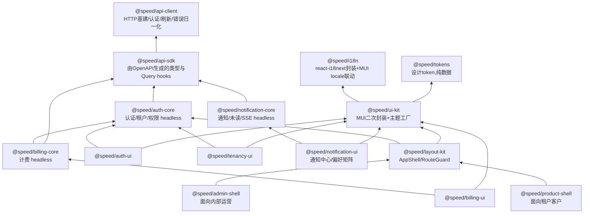

# 前端架构

> npm 包分层、生成式 API 调用（禁止手写）、ui-kit 组件范围、主题与多品牌定制、状态管理选型。

## 包分层

**product-shell 与 admin-shell 拆成两个包、两个独立部署应用**：客户端权限是"租户内角色"，运营端是"内部员工角色"且能跨租户看数据，混在一起会造成权限逻辑纠缠和跨租户数据泄漏的审计风险。两者共享 `layout-kit`/`ui-kit`/`auth-core`，shell 本身只是薄的组装配置层，重复代码很少。

## API 调用：一律使用生成代码

**前端禁止手写任何后端调用**——包括 `fetch`、`axios`、以及自己封装的 request 函数。所有接口调用只能来自 `@speed/api-sdk`（由 OpenAPI 规范经 orval 生成的 TanStack Query hooks）。完整机制见 [21 API 契约](21-api-contract.md)。

这条规则由 CI 的 ESLint 规则强制，不是靠 review。理由很直接：手写调用是前后端接口漂移的唯一入口，堵住它就从机制上消除了这类问题。

`@speed/api-client` 与 `@speed/api-sdk` 的分工：前者是手写的运行时基建（fetch 实例、认证头注入、401 静默刷新、错误归一化、重试），后者是纯生成物、禁止手改。分开是因为生成物每次发布都会被整体覆盖。

## ui-kit 组件清单

M0 的"核心组件"指下面第一组。组件全部受控、props 驱动、不含任何业务与租户语义，保证在任何项目、任何认证方案下可复用。

**第一组（M0 必须）**

| 组件 | 说明 |
|---|---|
| `AppThemeProvider` / `createAppTheme` | 主题工厂与三层 token 合并 |
| `DataTable` | 分页、排序、筛选、空态、加载态、行选择 |
| `FormField` / `FormLayout` | 基于 react-hook-form 的表单适配层，统一校验错误展示 |
| `EmptyState` | 空数据、无权限、出错三种语义 |
| `ConfirmDialog` | 危险操作二次确认 |
| `PageHeader` | 标题、面包屑、操作区 |

**第二组（随对应能力交付）**

`FileUploader`（M2，配合 storage）、`StatCard` / `Sparkline`（M2，用量展示）、`StatusBadge`、`SearchInput`、`ToastProvider`、`LoadingOverlay`、`JobProgress`（M1，配合 jobs 的进度展示）。

**表单方案**：react-hook-form + zod 校验。zod schema 优先从 OpenAPI 生成的类型推导，避免前后端校验规则各写一套。

## 跨领域 hooks 的归属

避免"这个 hook 该放哪个包"反复扯皮，明确归属规则：**hook 跟随它所属的领域包，而不是集中放在 api-client。**

| Hook | 归属 | 说明 |
|---|---|---|
| `useJob(jobId)` | `@speed/api-sdk` + `ui-kit` 的 `JobProgress` | 查询由 sdk 生成，进度 UI 在 ui-kit |
| `usePermission` / `useCurrentTenant` | `@speed/auth-core` | 权限判定是纯客户端集合查找 |
| `useFeature(api, key)` / `usePublicConfig(api)` | `@speed/api-client` | 公开配置在应用启动时拉取，早于任何领域包初始化 |
| `useUnreadCount` / `useNotificationStream` | `@speed/notification-core` | 含 SSE 长连接管理，是 OpenAPI 覆盖不到的部分 |

> **已落地**（config-web round）：上表 `useFeature` / `usePublicConfig` 归属 `@speed/api-client` 的决策已按原样落地，实现放在隔离的 `@speed/api-client/react` 子路径下（`src/react.ts`），而非包主入口——主入口保持零依赖，仅这一子路径引入 `react`（作为该子路径的 required peerDependency），做法与 `@speed/i18n` 的 `./mui-locale` 子路径一致。两个 hook 的实际签名都要求显式传入共享缓存所依据的 `RequestFn`：`usePublicConfig(api)` 与 `useFeature(api, key)`（而不是上表为省略 `api` 参数所写的历史设计形态），共享一份按 `RequestFn` 引用键控的缓存。详见 `web/packages/api-client/README.md` 与 `AGENTS.md`。

## 运营后台的权限模型

`admin-shell` 面向平台内部员工，权限 domain 是 `system` 而非某个租户。`auth-core` 的 `usePermission` 对两者用同一套接口，差别只在 `/me` 返回的权限集来自哪个 domain——前端不需要两套权限逻辑，但**必须在 UI 上明确区分当前处于"平台视角"还是"租户视角"**，尤其在模拟登录期间要有持续可见的醒目标识，防止误操作。

## 状态管理与数据请求选型
- **服务端状态 TanStack Query + 客户端状态 Zustand**（不引入 Redux）。
- Query key 强制按租户命名空间：`['tenant', tenantId, resource]`。切换租户后 key 天然变化，旧数据自动失效；`switchTenant` 成功后显式 `removeQueries(['tenant', oldId])` 清理缓存，避免运营后台频繁切租户导致内存堆积。
- `currentTenantId` 放 Zustand 而非 Context：高频读低频写，selector 按需订阅避免大范围 re-render；且**可在组件树外读取**（如构造 query key 时）。
- **注意：前端不把 `tenantId` 作为请求头发送。** 租户上下文由 access token 携带，服务端只信任令牌（见 [04 数据层与多租户](04-data-and-tenancy.md) 的信任边界）。前端这份 `currentTenantId` 只用于三件事：query key 命名空间、UI 展示、调用切换租户接口时的入参。切换租户成功后拿到新令牌，随后所有请求自动带上新租户。
- Token 存储：refresh token 走 httpOnly+Secure+SameSite Cookie，access token 只存内存，不落 localStorage。
- **主题三层覆盖**：`defaultTokens`（包内置）→ `projectTokens`（业务项目 `theme/tokens.ts`，构建期）→ `tenantOverrides`（运行时从后端拉取，支持白标 SaaS 按租户换 Logo/主色）。业务项目只写差异部分，深合并回退默认值。品牌资产放业务项目 `public/`，包内不打包任何具体品牌资产。
- **计费 UI 配置驱动**：`Plan`/`Feature` 数据结构由后端 `/billing/plans` 下发，前端不硬编码套餐名与价格，同一套 UI 组件适配不同项目的定价模型。

