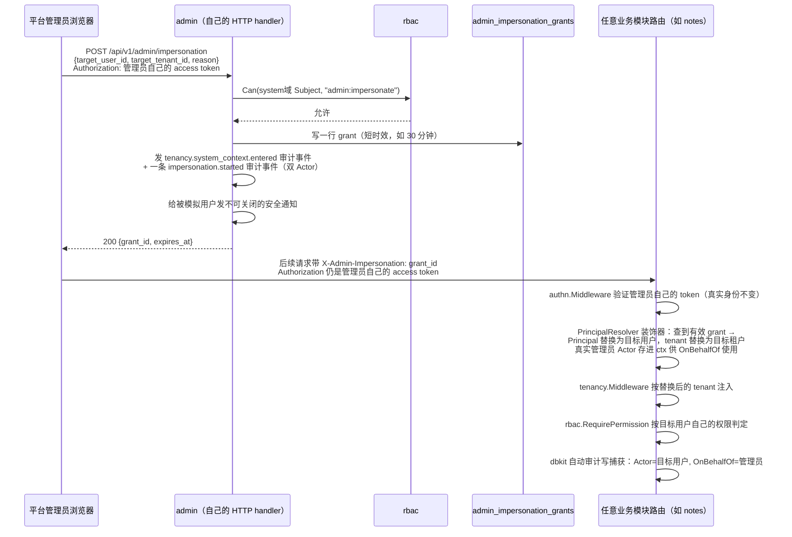

# 运营后台（admin）

> `go/admin` 提供运营后台的后端能力：跨租户检索、模拟登录、审计检索、角色与配置管理、用量与账单汇总。前端对应包是 `admin-shell`（M3，见 [12 前端架构](12-frontend.md)）。本篇是该模块动工前的需求与设计细化，对齐 [15 里程碑](15-roadmap.md) M3 行的出口条件——"运营后台可跨租户检索、模拟登录、查审计"——以及 [10 合规与审计](10-compliance-and-audit.md)、[05 身份与访问](05-identity-and-access.md) 里已经写过、但尚未落地成机制的段落。
>
> **写作时的状态**：`go/admin` 目前只有 `go.mod` + `doc.go` + 占位 `AGENTS.md`，没有一行实现。本篇因此是纯设计文档，不描述任何已落地的代码；凡引用其他模块的方法签名，均已对照当前 `main` 分支的真实代码核实（核实时间见文末）。

## 1. 定位与边界

**admin 不是新的数据源，是既有能力的操作面。** 在模块依赖图里 admin 处于最顶端——没有任何模块反向依赖它——这既是它能放心依赖几乎全部下游模块的原因，也是它唯一的职责边界：**它不得引入任何其他模块必须知道它存在的新概念**。凡是"业务模块需要为了配合 admin 而修改自己一小块既有行为"的情况（本篇第 3、8 节会列出几处），改动都必须是纯增量、对没有装配 admin 的宿主完全透明的可选项——这与 `pkgcore` 每一版新增能力的一贯做法（新增字段/新增可选 seam，不改变默认行为）一致。

admin 复用[01 整体架构](01-architecture.md)里说的"声明式注册的三个副产品"：权限清单、配置/开关 schema、通知类型全部是活的注册表，admin 只是把它们渲染出来、提供编辑界面，从不自己维护第二份清单。

**平台管理员身份不新造。** `go/rbac` 已经落地 `SystemDomain`（`pkgcore.TenantID("system")`，见 `go/rbac/subject.go`）：一个平台运营人员就是 authn 里一个普通 `User`，只是在 `domain="system"` 这个伪租户下持有 `RoleBinding`。这意味着：

- 平台员工的登录、MFA、会话管理、找回密码全部复用 `authn` 现成机制，admin 不新建身份体系；
- 平台员工的授权判定复用 `rbac.Service.Can/DataScope`，把 `Subject{TenantID: rbac.SystemDomain, UserID: staffID}` 传进去，admin 不新建鉴权引擎；
- "谁能进后台"本身就是一条普通权限（例如 `admin:access`），跟其他任何 `resource:action` 一样声明、绑定、判定，没有特殊路径——这正是 `rbac.SystemDomain` 文档注释强调的"不是通配符，不因为持有它就自动获得任何客户租户的数据"。

## 2. 现状盘点：地基 vs. 缺口

下面这张表决定了 admin 轮真正要写的代码量——大部分能力已经在下游模块里，admin 只是加一层 HTTP 外壳；少数几处是全仓库目前完全没有的概念，需要新建。

| 能力 | 现状 | admin 需要做的 |
|---|---|---|
| 平台管理员身份/鉴权 | `rbac.SystemDomain` 已落地，`authn` 登录机制已落地 | 无需新增，直接复用（见 D1） |
| 跨租户读取的审计逃生舱 | `pkgcore.WithSystemContext` + `tenancy.WithSystemContext`（自动发布 `tenancy.system_context.entered` 审计事件）已落地，且 root CLAUDE.md 已把 `admin` 列入四个合法调用者之一 | 声明自己的 `SystemPurpose`，逐租户循环调用下游模块现成的按租户查询方法（见 D2） |
| 审计检索（单租户/跨租户） | `compliance.AuditQuery.Query`/`QueryAcrossTenants`/`Get` 已落地并读 `dbkit/audit.Repository` | 加 HTTP 外壳 + 分页；导出复用 `compliance.ExportService` 已有的"生成清单→经 `sharing` 投递"模式（见 D7） |
| 角色/权限管理 | `rbac.Service.DefineRole/AssignRole/RevokeRole/EnsureBuiltinRoles` 已落地；`rbac` 自己**明确不挂 HTTP 路由**（`go/rbac/AGENTS.md`："角色管理是运营后台的界面"） | 加 HTTP 外壳；需要 rbac 新增一个导出的"完整声明权限清单"访问器（当前 `catalog.permissions()` 未导出，见 D8） |
| 登录历史/会话管理 | `authn.Service.Sessions()/LoginHistory()` 已落地，但都是**按单个 `userID`** 查询 | 需要 authn 新增跨租户的用户检索入口（见 D6），admin 不重新实现登录历史模型 |
| **租户台账**（有哪些租户、状态、创建时间） | **全仓库不存在**。`pkgcore.TenantID` 是不透明字符串，任何模块写第一条带某个 `tenant_id` 的数据就等于"创建"了一个租户，没有任何地方登记、没有存在性校验 | admin 自建（见 D3），这是本设计最大的一块新地基 |
| **模拟登录（impersonation）** | **全仓库不存在**任何机制 | admin 自建（见 D5），本设计第二大的新地基 |
| 通知发送记录检索 | `notification.SendRecordRepository` 已落地，但只有 `ByTenantAndKey`（单租户单 key），没有跨租户/按收件人列出的方法 | 需要 notification 新增一个方法（见 D10） |
| 用量/账单汇总 | `metering`/`billing` 的聚合与信用点余额都是按租户查询 | admin 逐租户拼接展示，不新造聚合表（见 D9） |
| 暂停/限制一个租户 | 无任何强制点——即使 admin 记了"已暂停"，没有任何中间件会因此拒绝请求 | 需要 tenancy 新增一个可选 seam（见 D4） |

## 3. 核心设计决策

按本仓库既有文档的写法：每条给出选定方案、被否决的方案、以及为什么。

### D1：平台管理员身份 = `rbac.SystemDomain`，不新建身份体系

**选定**：如第 1 节所述，直接复用。`admin` 的每个 HTTP handler 从已验证的 `authn.Principal` 组出 `rbac.Subject{TenantID: rbac.SystemDomain, UserID: principal.UserID}`，走 `rbac.RequirePermission`。

**被否决**：给平台员工单独建一套账号表/登录流程。否决理由与 [05 身份与访问](05-identity-and-access.md) 开篇"不自建 IdP"是同一条——平台员工也是人，也需要密码策略、MFA、登录日志，重新做一遍纯粹是重复造轮子，而且会制造"平台员工的会话"和"租户用户的会话"两套并行、容易互相搞混的心智模型。

### D2：跨租户读取 = 逐租户调用 + `tenancy.WithSystemContext`，不开数据库层"上帝视图"

**选定**：admin 读取任意客户租户的数据（组织树、用量、发送记录……）时，永远显式调用

```go
ctx, err := tenancy.WithSystemContext(ctx, bus, pkgcore.SystemReason{
    Actor:   pkgcore.Actor{Type: pkgcore.ActorTypePlatformAdmin, ID: staffID},
    Purpose: purposeAdminCrossTenantRead, // 在 admin.Register 里注册
    Detail:  "tenant=" + targetTenantID,
})
```

再用这个 `ctx` 调用下游模块**已经存在**的、按租户查询的方法（`org.TreeService.Root`、`notification` 的按租户列表、`billing.CreditService.Balance`……）。跨多个租户时在应用层循环，从不要求下游模块开一个"忽略 tenant_id 过滤"的旁路查询接口。

**为什么这样选**：`tenancy.WithSystemContext` 已经把"审计要求"焊死在机制里——每次调用自动发布 `tenancy.system_context.entered` 事件（[10 合规与审计](10-compliance-and-audit.md) 要求的"运营人员操作全量记录，不做读操作豁免"因此不需要 admin 自己再写一遍）。这也是 root CLAUDE.md 明确把 `admin` 列入 `WithSystemContext` 四个合法调用者的理由所在——这条设计在写这份文档之前就已经被主线代码预留了位置。

**被否决**：让每个业务模块的 Repository 都开一个 `ListAcrossTenants` 方法，或者给 admin 单独开一条不受 GORM 租户插件约束的数据库连接直查表。前者是"每个模块都要为 admin 开一个 except-me 的旁路"，随着模块数量增长成本线性上升，且每个旁路都是一个新的隔离绕过点需要单独审查；后者直接违反"不得绕过 Repository 手写查询"的纪律（`tools/semgrep_rules/raw-gorm-bypass.yml`），而且拿不到 `WithSystemContext` 自带的审计。当某个模块的跨租户聚合确实频繁到"循环调用"性能不可接受时（例如未来的跨租户报表），应该是那个模块自己评估要不要开一个专用的、同样经 `WithSystemContext` 门禁的聚合方法——那是它的产品决策，不是 admin 单方面加的旁路。

### D3：租户台账（Tenant Registry）——admin 自建，事件驱动惰性建档，不重构 `tenancy`

这是本设计最大的一块新地基,所以展开写。

**问题**：`pkgcore.TenantID` 是不透明字符串。没有任何地方回答"系统里存在哪些租户""这个租户叫什么名字、什么时候创建的、当前状态如何"。`tenancy.DomainResolver` 把 host 映射到 tenant，但映射表是宿主应用自己维护的静态配置，不是一个可查询的目录；`org` 每个租户恰好有一个根节点（`OrgNode.IsRoot()`），是最接近"租户存在证明"的东西，但 `org` 从未提供"列出所有根节点"的方法，而且把"租户"这个平台级概念绑定在一个业务模块的表上也不合适。

**选定**：`admin` 自己拥有一张平台数据表（`admin_tenants`，见第 5 节），作为**运营台账**而非**权威数据源**——其他模块继续像今天一样把 `tenant_id` 当不透明字符串使用，不需要外键、不需要在写入前查这张表，`admin_tenants` 缺一行从不会让任何业务写入失败。这张表通过两条路径填充：

1. **事件驱动的惰性建档**：`admin` 订阅 `org` 发布的根节点创建事件（一个租户第一次被使用，几乎总是从 `org.CreateRoot` 开始），首次出现的 `tenant_id` 自动落一行 `status=active` 的台账记录，`display_name` 先留空待运营人员补充。这与 `org` 自己"不导入 `authn.User`，只认事件名和 JSON 载荷探针"的解耦方式完全一致——`admin` 也不导入 `org.OrgNode`，只认事件类型字符串。
2. **手工登记**：运营人员也可以在还没有任何业务写入之前，直接在后台新建一条台账记录（例如在给客户开户之前先预注册租户名称与销售负责人）。

**被否决**：把"租户"提升为 `tenancy` 模块里的一等实体（一张 `tenants` 表 + 创建租户的强制入口 + 让 `org`/`authn`/`billing` 在写入前校验 tenant 是否存在），这是概念上更"正确"的答案——`tenancy` 本就是"什么是租户"这个概念的天然归属。但这个方案的代价是：`tenancy` 是几乎所有模块最底层的公共依赖，在 lockstep 发布下改动它意味着**每一个已经发布过的模块**都要在下一个版本里决定"要不要开始校验租户存在性"；而且今天没有任何模块的写路径会先创建租户再写业务数据（`org.CreateRoot` 本身就是事实上的"创建租户"动作，只是从未被这样命名），强推一个前置的"创建租户"步骤会是一次波及全部已交付模块的破坏性改动，用来解决的只是运营后台一个模块的展示需求，不成比例。按本仓库"新增一个内建实现前先测成本"的纪律（见根 CLAUDE.md 架构纪律一节），这个方向被搁置为"未来如果有第二个模块也需要权威租户目录时再重新评估"的候选项，而不是 admin 这一轮要做的事。

### D4：暂停租户要有牙——`tenancy` 新增一个可选的 `TenantStatusResolver` seam

D3 的台账如果只是"记了但没人看"，"暂停租户"这个运营动作就是摆设。选定方案：给 `tenancy.Middleware` 增加一个新的、**默认关闭**的可选依赖：

```go
// tenancy 新增，结构化类型、无导入方向
type TenantStatusResolver interface {
    // Status 返回 tenant 当前状态；resolver 未装配时 tenancy.Middleware 从不调用它，
    // 行为与今天完全一致。
    Status(ctx context.Context, tenant pkgcore.TenantID) (TenantStatus, error)
}

func WithTenantStatusResolver(r TenantStatusResolver) MiddlewareOption
```

`tenancy.Middleware` 在解析出租户之后、把 tenant 注入 context 之前，若装配了 resolver 且返回"已暂停"，直接 403 拒绝（复用 authn 中间件链里"未认证请求 fail-closed"的同一种失败即拒绝语义），不会执行到 handler。`admin` 在自己的 `Register` 里把这个 seam 接到 `admin_tenants` 表上，是这个 seam 唯一的实现者，但接口本身不认识 `admin`——跟 `rbac.SubtreeResolver` 不认识 `org` 是同一个模式。

未装配这个 seam 的宿主（没有引入 `admin` 的项目）行为零变化，这是它能作为一条"可选、纯增量"的低层改动被接受的前提。

### D5：模拟登录——admin 自建授权凭据 + `PrincipalResolver` 装饰器，绝不铸造目标用户的真实会话

这是本设计的核心机制，单独用第 4 节展开。这里先给决策摘要：

**选定**：admin 不给"被模拟的用户"签发一个和真实登录无法区分的 access/refresh token；而是签发一个**绑定在管理员自己已验证会话之上、随时可吊销、只在被模拟用户的租户内有效**的模拟授权凭据，配合中间件链里插入一个 `authn.PrincipalResolver` 装饰器完成身份替换。判定权限时按**被模拟用户自己的权限**走（"看到用户看到的东西"），管理员不会因为模拟登录而获得比该用户更多的权限。

**被否决**：让 `authn` 新增"以管理员身份代表某用户签发一对正常的 access/refresh token"的能力。否决理由：

1. 这样签出的 token 和用户自己登录拿到的 token 在下游任何地方都无法区分，一旦泄露就是对该用户的完整会话劫持，且不像今天的会话一样能在"设备列表"里被用户本人看到并下线；
2. 这会给 `authn`（一个身份认证的地基模块）新增一个只有 `admin` 用得上的概念，`authn` 因此要为一个它的消费者才关心的场景背负永久的 API 面；
3 与 `authn` 现有的"refresh token 单次使用、重放即判定被盗、撤销整个 family"设计冲突——模拟登录期间的行为如果借用真实 refresh 机制，管理员和被模拟用户对同一账号的并发操作会互相触发这条防重放逻辑,产生难以调试的误判。

细节见第 4 节。

### D6：跨租户用户检索——需要 `authn` 新增一个方法（纯新增，无 breaking）

**现状**：`authn.users` 表本来就**不是** tenant-scoped（[04 数据与多租户](04-data-and-tenancy.md) 的四个数据域之一：一个人可以属于多个租户）。但 `authn` 目前只有按 id/email/phone 精确查找（`UserRepository.FindByID/FindByEmail/FindByPhone`），没有任何检索/分页/按显示名模糊匹配的入口——这本来就不是普通业务代码该有的能力（业务代码永远只知道自己租户内的用户，通过 `org.MembershipRepository` 找），只有平台运营需要"不知道具体是哪个租户,先按邮箱/手机号/名字找到人"。

**选定**：请求 `authn` 新增一个专供平台运营使用、需要 `system` 域权限才能调用的方法，例如：

```go
// SearchUsers 是平台运营专用的检索入口：按邮箱/手机号盲索引精确匹配，或按
// DisplayName 做大小写不敏感的前缀匹配。调用方必须已持有 system 域的
// admin:search_users 权限——这条校验在 admin 的 HTTP handler 层做，
// authn.Service 本身不知道 rbac,只是把方法暴露出来。
func (s *Service) SearchUsers(ctx context.Context, q UserSearchQuery) ([]User, error)
```

这是纯新增方法，不改变任何既有签名,不是破坏性变更。`admin` 拿到结果后，再用 D2 的方式逐租户查 `org.MembershipRepository` 拿到该用户在哪些租户里有成员身份，拼出"这个人属于哪些租户"的视图。

### D7：审计检索与导出——直接包装 `compliance`，不重复建设

`compliance.AuditQuery.Query`（单租户）/`QueryAcrossTenants`（system context 门禁，`admin` 是合法调用方）/`Get` 已经是 admin 需要的全部读能力；`compliance.ExportService` 已经落地"生成清单 → 经 `go/sharing` 投递一个限次、短期的分享链接"的导出模式（round 2）。admin 的审计检索页面因此只做：HTTP 外壳 + 分页参数转换；导出报告时复用 `ExportService` 同一套"异步生成 + `sharing` 令牌下发"的路径，而不是自己再造一套"生成 CSV 然后不知道怎么把文件交给用户"的下载机制。

### D8：角色/权限管理 UI 的后端——包装 `rbac.Service`，只缺一个导出的"完整权限清单"访问器

`rbac.Service.DefineRole/AssignRole/RevokeRole/ListPermissions` 已经是 admin 角色管理页面要调用的全部写路径。唯一的缺口：给一个角色分配权限时，UI 需要"系统里声明过的全部权限有哪些"（渲染成勾选列表），而不是"某个 subject 已经被授予的权限"（`ListPermissions(ctx, sub)` 回答的是后者）。`rbac.Service` 内部有 `catalog`，但 `catalog.permissions()` 未导出。

**选定**：请求 `rbac` 新增一个导出的只读访问器，例如 `func (s *Service) DeclaredPermissions() []string`，直接返回 `Attach` 时冻结的 catalog 快照。纯增量、零风险——`catalog` 本来就已经在内存里，只是包一层导出方法。

### D9：用量/账单汇总看板——不新造聚合表，逐租户拼接

`metering` 的聚合/配额、`billing` 的 `CreditService.Balance`、`SubscriptionRepository` 都是按租户查询设计的，且这些模块本身已经承担了"计费级不能丢事件"的可靠性责任，不该为了给 admin 开一张跨租户物化视图而增加自己的复杂度。**选定**：admin 的看板层对每个要展示的租户逐一调用这些既有方法（同样走 D2 的 `WithSystemContext`），在应用层聚合、必要时加缓存/限制并发数。当租户规模大到"逐一调用"在展示层撑不住时，是 `metering`/`billing` 各自的产品决策要不要开一个专用的批量读接口，不是 admin 单方面决定的事——延续 D2 的判断标准。

### D10：通知发送记录检索——需要 `notification` 新增一个方法（纯新增）

`notification.SendRecordRepository` 目前只有 `ByTenantAndKey`（内部按幂等键单条查找,不是给检索页面用的）。[07 平台服务](07-platform-services.md) 明确写过"运营后台可查'这封邀请邮件到底发出去没有'"——这需要按租户 + 时间范围 + 渠道 + 状态过滤的列表查询。**选定**：请求 `notification` 新增一个只读的、类似 `compliance.AuditQuery` 形态的检索方法（单租户 `ListByFilter`，system context 门禁下的跨租户版本视需要再加），纯新增。

## 4. 模拟登录：完整机制

### 4.1 授权凭据而非会话令牌



关键点逐条对应 [10 合规与审计](10-compliance-and-audit.md) 和 [16 验证方式](16-verification.md) 已经写死的要求：

- **双重身份**：请求真正携带的凭据始终是管理员自己的 access token（`authn.Middleware` 验证的是管理员的真实身份，不是伪造的目标用户身份），只是在验证通过后，一个新的 `PrincipalResolver` 装饰器把"这次请求要以谁的名义、在哪个租户内被处理"替换成目标用户/目标租户，同时把管理员的真实身份单独存进 `pkgcore.WithOnBehalfOf`（已落地，独立于 `WithActor` 分层，不会互相覆盖）。这样 `dbkit` 现有的自动审计写捕获**不需要任何修改**就能产出"`Actor`=被模拟用户、`OnBehalfOf`=管理员"的记录——这正是 M1 审计基础设施轮特意把 `Actor`/`OnBehalfOf` 分离设计的原因，模拟登录是它一直在等的消费者。
- **权限不放大**：`rbac.RequirePermission` 判定时用的 `Subject` 是目标用户，不是管理员——管理员不会因为发起了模拟登录就获得比该用户更多的权限，只是"以这个人的视角看系统"，这与真实客服场景里"复现用户看到的问题"的需求吻合，也避免了"模拟登录变成一条绕过权限的后门"的风险。
- **可随时吊销、时效绑定**：grant 是 admin 自己一张表里的一行，有 `expires_at`，管理员或另一个更高权限的运营人员可以随时 `DELETE` 结束它；一旦管理员自己的 access token 失效（登出、被吊销），装饰器查证的仍然是管理员的真实身份先通过验证，所以模拟状态天然跟着管理员自己的会话生死,不会变成一个孤儿凭据。
- **开始/结束都是审计事件 + 强制通知**：`impersonation.started`/`impersonation.ended` 用显式 `audit.Emit`（不是自动写捕获——因为需要同时写双 Actor，自动捕获拿不到 `OnBehalfOf`），且开始时必须给被模拟用户发一条不可退订的安全类通知（[07 平台服务](07-platform-services.md) 的"不可关闭的安全类通知"分类,`notification` 的类型注册表里声明为不可退订）。

### 4.2 中间件链的插入点，不改变既有顺序

[01 整体架构](01-architecture.md) 写死的链路是 `authn.Middleware → tenancy.Middleware(authn.NewPrincipalResolver())`。模拟登录**不重排**这条链——它是往 `authn.NewPrincipalResolver()` 这一步的输入上叠一层装饰器：

```go
tenancy.Middleware(
    admin.ImpersonationAwareResolver(authn.NewPrincipalResolver(), grantLookup),
)
```

`admin.ImpersonationAwareResolver` 先调用被包装的 `authn.NewPrincipalResolver()` 拿到管理员的真实 `Principal`；如果请求带了有效的模拟授权凭据（凭据本身在 `grantLookup` 里查证，从不信任客户端声称的目标身份），就把返回的 `Principal` 换成目标用户/目标租户，并把管理员的真实身份塞进一个独立的 context key（`pkgcore.WithOnBehalfOf`）供下游审计使用。这跟 `org.FeatureGate`、`rbac.SubtreeResolver` 是同一种"结构化类型、无导入方向"的 seam 手法——`authn` 不需要知道 `admin` 存在，也不需要为它新增任何 API。

## 5. 数据模型

admin 新增两张**平台数据表**（`dbkit.AssertNotTenantScoped`，不实现 `TenantScoped`——它们记的是"关于所有租户的元数据"，不属于任何单一租户）：

```go
// admin_tenants：运营台账，非权威数据源（见 D3）。
type Tenant struct {
    TenantID        string // 主键，即 pkgcore.TenantID 的字符串值
    DisplayName     string
    Status          TenantStatus // active / suspended
    SuspendedReason string
    SuspendedAt     *time.Time
    CreatedAt       time.Time
    CreatedBy       string // 惰性建档时为空；手工创建时是运营人员 user id
    Notes           string
}

// admin_impersonation_grants：模拟登录授权凭据（见 D5）。
type ImpersonationGrant struct {
    ID             string // 主键，凭据本体（随机生成，不可猜测）
    AdminUserID    string // 发起的平台管理员
    TargetUserID   string
    TargetTenantID string
    Reason         string // 必填，运营人员必须写明原因——本身也是审计的一部分
    CreatedAt      time.Time
    ExpiresAt      time.Time // 短时效，默认建议 30 分钟，不可无限续期
    EndedAt        *time.Time
    EndedBy        string
}
```

两张表的写入都由 `dbkit.Open()` 的 `*gorm.DB` 直接操作（识别为平台数据，不经 `Repository[T]`，与 `authn.users`/`config.row` 的既有先例一致），并各自跑 `tenancytest.AssertNotTenantScoped`。

`Register` 阶段声明的审计动作：`admin.tenant.status_changed`、`admin.impersonation.started`、`admin.impersonation.ended`、`admin.role.assigned`、`admin.role.revoked`（后两者其实是 `rbac.AssignRole/RevokeRole` 内部已经发布的领域事件——admin 只需要确认自己调用这两个方法时把发起者的 `Actor` 传对，不需要重复 `Emit`）。

## 6. HTTP 面草案

沿用 notes/org/authn/storage/notification 的既有模式：`go/admin/api/openapi.yaml` 是第六个 spec 片段，pinned oapi-codegen 生成 `admin-server.gen.go`，`Handler` 背后有 `var _ api.ServerInterface` 编译期断言，纳入 `api-contract.yml` 与 Taskfile `api:gen`。所有路由都要求 `rbac.RequirePermission(..., domain=system)` 且**不**走常规的 `tenancy.Middleware` 租户解析——这些是平台运营对"跨租户"这件事本身的操作，请求本身没有单一租户可言（除非落到模拟登录场景，见第 4 节）：

| 方法 | 路径 | 对应决策 |
|---|---|---|
| `GET /api/v1/admin/tenants` | 台账检索（按名称/状态过滤） | D3 |
| `PATCH /api/v1/admin/tenants/{id}` | 改名/暂停/恢复 | D3 + D4 |
| `GET /api/v1/admin/users` | 跨租户用户检索 | D6 |
| `GET /api/v1/admin/users/{id}/memberships` | 该用户所属的全部租户 | D6 + D2 |
| `POST /api/v1/admin/impersonation` | 发起模拟登录 | D5 |
| `DELETE /api/v1/admin/impersonation/{id}` | 结束模拟登录 | D5 |
| `GET /api/v1/admin/impersonation` | 当前生效的模拟登录列表（自查/审计） | D5 |
| `GET /api/v1/admin/audit-events` | 审计检索（单/跨租户） | D7 |
| `POST /api/v1/admin/audit-events/export` | 异步导出，经 `sharing` 下发链接 | D7 |
| `GET /api/v1/admin/roles`、`POST /api/v1/admin/roles`、`POST /api/v1/admin/roles/{id}/bindings` | 角色/权限管理 | D8 |
| `GET /api/v1/admin/notifications/send-records` | 通知发送记录检索 | D10 |
| `GET /api/v1/admin/usage-summary` | 用量/账单跨租户看板 | D9 |

`admin-shell`（前端）与其他消费面一样，只通过 `@speed/api-sdk` 生成的 hooks 调用这些接口，不手写 HTTP。

## 7. 需要下游模块新增的最小接口清单（汇总）

这是 admin 轮启动前需要跟对应模块的负责轮次协调好的、纯新增（非破坏性）的小改动：

| 模块 | 新增内容 | 对应决策 |
|---|---|---|
| `tenancy` | 可选 `TenantStatusResolver` seam + `WithTenantStatusResolver`，未装配时行为不变 | D4 |
| `authn` | `Service.SearchUsers(ctx, UserSearchQuery) ([]User, error)`，平台运营专用检索 | D6 |
| `rbac` | `Service.DeclaredPermissions() []string`，导出已冻结的权限 catalog 快照 | D8 |
| `notification` | `SendRecordRepository` 新增按租户+时间范围+渠道+状态过滤的列表方法 | D10 |

四处都是纯增量方法/可选 seam，不改变任何既有签名或默认行为，可以分别在各自下一次发布里随手带上，不需要专门等 admin 轮。

## 8. 阶段划分建议

对齐 [15 里程碑](15-roadmap.md) M3 的出口条件（"跨租户检索、模拟登录、查审计"三件事），建议拆两轮：

**Round 1（M3 主线，满足出口条件）**：`admin_tenants` 台账（D3，仅事件驱动惰性建档 + 手工 CRUD，暂不做 D4 的强制暂停）、模拟登录全链路（D5，含审计与通知）、审计检索 HTTP 外壳（D7）、跨租户用户检索（D6，需要 authn 那一侧配合新增方法）、`admin` 自己的 `AGENTS.md`/spec 片段/`Registry` 接线、reference-app 作为强制第一消费者跑通"客服模拟登录复现问题→在审计里查到这条操作"的链路。

**Round 2（视排期，可晚于 M3）**：D4 暂停租户的强制力、D8 角色管理 UI 后端、D9 用量看板、D10 通知发送记录检索、审计导出（复用 `compliance.ExportService`）。这几项都不在 M3 出口条件的字面要求里，且都不阻塞 round 1 的验收。

## 9. 已知局限 / 明确不做

- **不做租户创建的强制流程**。D3 已经说明为什么——台账是运营视角的记录，不是权威数据源，"创建租户"在这套体系里仍然是隐式的（第一次业务写入）。如果未来某个模块需要"租户必须先存在才能写入"的强约束，需要重新评估把台账提升为 `tenancy` 的一等实体（D3 被否决方案里记录的候选项）。
- **不做管理员操作的二次确认/审批流**（例如"暂停租户需要两名管理员共同批准"）。这是权限模型之上的工作流能力，比本轮范围大得多，留给需要它的业务项目自己在 `admin` 之上叠加。
- **不做平台层面的操作限流/异常行为检测**（例如"一个管理员一小时内模拟登录了 50 个不同用户"应该告警）。这类风控能力如果要做，应该是 `observability`/`compliance` 更适合的家，本轮不涉及。
- **审计检索的性能**：`compliance.AuditQuery` 自己的文档已经说明"当前实现是应用层过滤，没有专门的索引/分区优化"——admin 直接继承这个已知限制，不在本轮重复解决。

---

*核实基线：`main` 分支，`git log` 最新提交 `f142caa`（2026-09-04）。文中引用的所有方法签名、类型名均已用 `grep`/`Read` 对照当时的源码核实；若后续下游模块的实际签名与本文有出入，以代码为准，本篇需要相应更新。*
