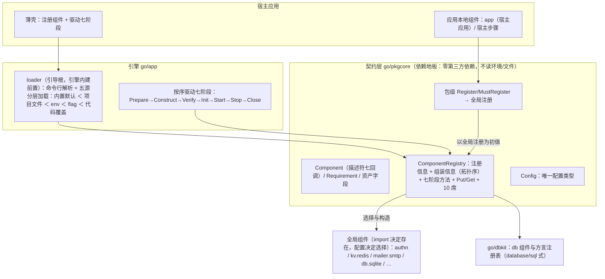
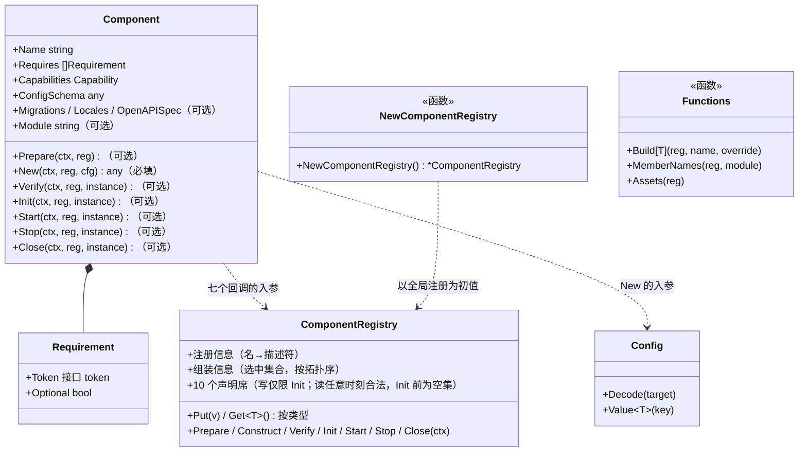
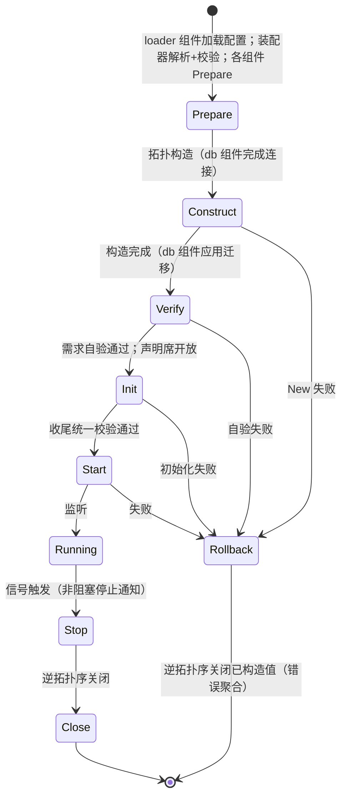
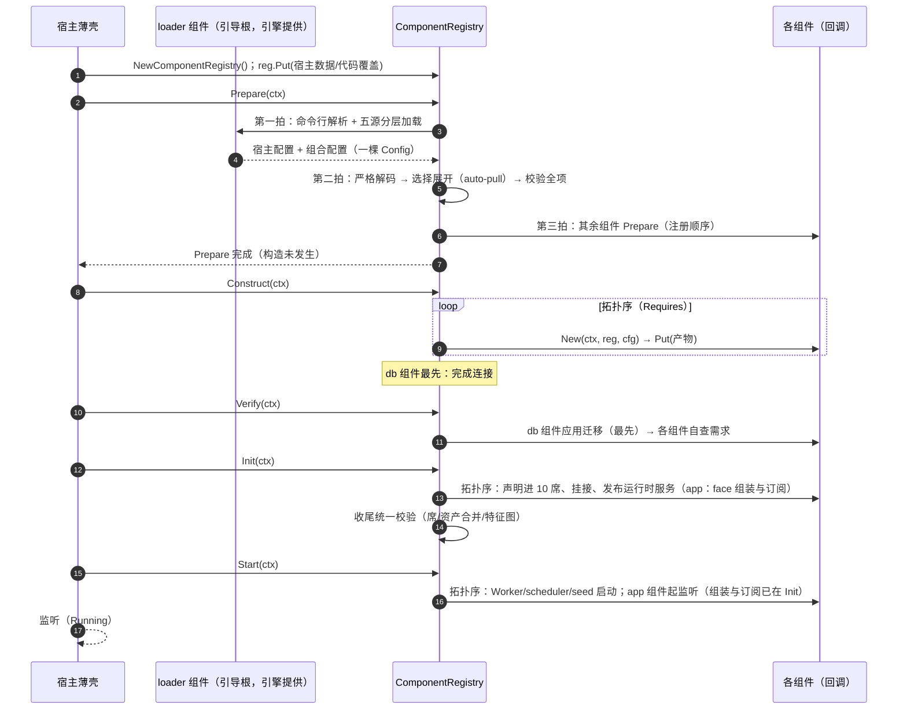
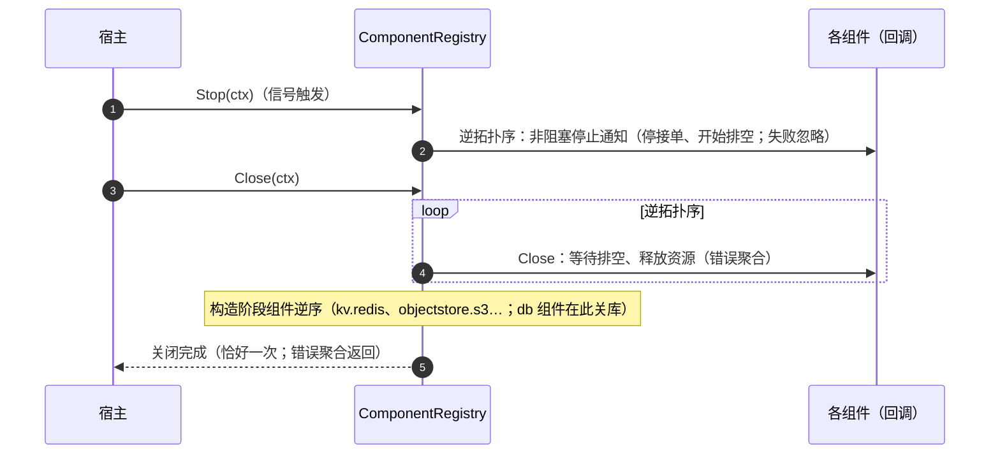
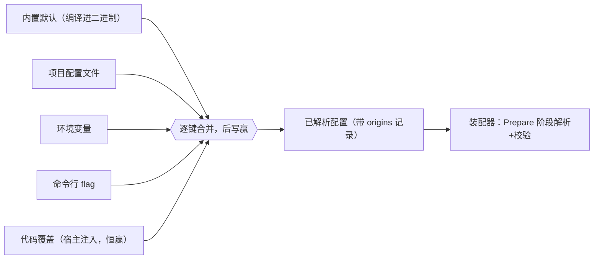

# 29 配置驱动的组件装配

> 本文定义应用的组装模型与生命周期：统一的组件抽象、核心数据结构 `ComponentRegistry`、组合配置与七阶段生命周期。全文为终态设计，代码块为接口示意；术语与对象声明以本文为准，**各模块实现以本文为准进行适配**。

## 1 目标与范围

- **配置驱动**：应用装配哪些组件、每个组件采用哪个具体实现、各接收哪些参数，由配置决定；配置文件只是配置的来源之一。
- **统一抽象**：业务模块、基础设施实现与宿主步骤同为一个 `Component`；一套生命周期覆盖全部组件，没有第二套机制。
- **单一核心结构**：`ComponentRegistry` 同时回答“系统中有哪些组件”“应用由哪些组件组成”“装配进行到哪一步”。
- **启动期闭环**：依赖、歧义、配置键、能力位与资产全部在构造之前校验；失败即终止，并按已构造量逆序回滚。

不在本文范围：具体模块的功能设计、前端架构、部署拓扑（见 01、03、12 等）。

## 2 术语

| 术语 | 含义 |
|---|---|
| **组件（Component）** | 装配的最小单位：某个模块的一个实现，或一个装配期步骤。 |
| **模块（Module）** | 组件提供的接口/契约。`kv` 模块即 `KVStore`，`mailer` 模块即 `Mailer`。 |
| **绑定式模块** | 恰选一个实现的模块（`mailer`、`kv`、`signer`）；多选即歧义错误。 |
| **目录式模块** | 允许多个实现共存的模块（`gateway` 三条支付渠道、`chat`/`image` 多家厂商）；运行时按名构造。 |
| **组合配置** | 一棵 `ComponentConfig` 值（键为 `deployment`、`strict`、`components`）：选谁、用什么实现、各给什么参数。 |

命名约定：单实现模块的组件与模块**同名**（`authn`）；多实现模块的组件用 `owner.thing`（`mailer.smtp`、`seed.demo`）。

## 3 总体架构



## 4 核心模型

### 4.1 Component 描述符

描述符承载全部数据与行为；产物只是值（任意类型，从 `*gorm.DB` 到 `*authn.Module`）。**声明哪个回调，就参与哪个阶段**——没有第二种规则。

```go
// go/pkgcore/component.go

type Component struct {
    Name string // 组合配置里的选择键："authn"、"mailer.smtp"、"seed.demo"

    // 生命周期：七个回调；除 New 外皆可选。Verify 起的回调接收 New 构造的实例（instance）。
    Prepare func(ctx context.Context, reg *ComponentRegistry) error // 一切构造之前（loader 在此加载配置；authn 在此自建 cipher、注册 serializer）
    New     func(ctx context.Context, reg *ComponentRegistry, cfg ComponentConfig) (any, error) // 构造产物——唯一必填
    Verify  func(ctx context.Context, reg *ComponentRegistry, instance any) error // 数据库可达后的需求自验
    Init    func(ctx context.Context, reg *ComponentRegistry, instance any) error // 声明、挂接、发布运行时服务
    Start   func(ctx context.Context, reg *ComponentRegistry, instance any) error // 开始对外服务
    Stop    func(ctx context.Context, reg *ComponentRegistry, instance any) error // 停止通知，非阻塞
    Close   func(ctx context.Context, reg *ComponentRegistry, instance any) error // 释放资源

    Requires     []Requirement // 依赖（可选）
    Provides     []any         // 产物将满足的接口 token（类型化 nil 指针；与消费方 Requires 同词表）——选前解析、auto-pull 与歧义校验、构造后的产物断言都读它
    Capabilities Capability    // 能力位（可选；部署模式校验用）
    ConfigSchema any           // 类型化 nil 指针（可选；nil = 不吃配置）
    BootstrapKeys []BootstrapKey // 启动期配置声明（键路径＋Format）；loader 在 Prepare 拍① 按 Format 直接解析取值——不要求任何宿主/引擎结构体字段绑定，先于一切构造，不受 Init 席门禁；机制见 30 号文
    SystemPurposes []SystemPurpose // 系统用途声明；装配器在 Init 阶段**入口**统一汇总注册（先于任何 Init 回调——声明数据先于使用；重复/冲突 fail-closed）
    Migrations   embed.FS      // 资产（可选；零值 = 不携带）
    Locales      embed.FS      // 资产（可选；zh-CN/en-US 键集契约）
    OpenAPISpec  []byte        // 资产（可选）
    Module       string        // 本组件实现的模块名（可选；"mailer"、"kv"…）
}
```

### 4.2 依赖：接口 token

```go
type Requirement struct {
    Token    any  // 消费方定义的接口 token，如 (*authn.KeySource)(nil)
    Optional bool // 缺失不失败（消费方对零值 fail closed）
}
```

- 依赖**只对着产物解析**，不表达组件身份；顺序与 auto-pull 都由此推导。
- **提供面声明（`Provides`）**：组件声明其**产物**将满足哪些接口 token（与消费方的 `Requires` 同词表，类型化 nil 指针）。静态声明让选择解析、auto-pull 与单值歧义校验在 Prepare 拍② 完成；构造后装配器逐产物断言 `Provides` 全部成立——声明与实现不符即构造失败（fail-closed），声明因此不能与产物脱节。
- 需要“Init 期服务”的组件改为依赖**提供者的产物**以获得次序，取值发生在使用时刻（`Get`）；依赖数据里没有阶段字段——阶段是程序流程，不是数据。
- 可选依赖缺失时不阻断装配，消费方以零值运行并自行 fail closed。

### 4.3 能力位

```go
type Capability uint8

const (
    MultiReplicaSafe Capability = 1 << iota
    SurvivesRestart
    Stateless
    KeyNeverLeavesBoundary
)
```

部署模式声明其要求（如 `distributed` 要求 `MultiReplicaSafe`），装配器在解析时逐组件比对；缺失即启动失败并点名组件、缺失位与模式。仅缺 `SurvivesRestart` 时打印警告横幅、照常启动。**模式约束实现，不选择实现**：单进程部署不排除任何实现，多副本部署排除进程内实现。

### 4.4 ComponentRegistry：核心数据结构

一个实例承载三个职责，没有第二个状态对象：

1. **注册信息**——名 → 描述符，回答“系统中有哪些组件”；
2. **组装信息**——选中组件及已解析配置，**按拓扑序存储**，回答“应用由哪些组件组成”；
3. **生命周期**——七个阶段方法，外加运行上下文（按类型的值、10 个声明席）。

```go
type ComponentRegistry struct { /* 注册信息 + 组装信息 + 生命周期状态 */ }

// 创建：以全局注册（init 自注册）为初值，拷贝描述符引用。
func NewComponentRegistry() *ComponentRegistry

// 注册（实例）：加入宿主本地组件。
func (r *ComponentRegistry) Register(c Component) error

// 生命周期：引擎按序调用。
func (r *ComponentRegistry) Prepare(ctx context.Context) error   // config 加载 → 选择/拓扑/校验 → 组件 Prepare
func (r *ComponentRegistry) Construct(ctx context.Context) error // 拓扑构造产物；db 组件完成连接
func (r *ComponentRegistry) Verify(ctx context.Context) error    // db 组件应用迁移；组件自查需求
func (r *ComponentRegistry) Init(ctx context.Context) error      // 声明 / 挂接 / 发布服务；收尾统一校验
func (r *ComponentRegistry) Start(ctx context.Context) error     // 开始对外服务
func (r *ComponentRegistry) Stop(ctx context.Context) error      // 非阻塞停止通知
func (r *ComponentRegistry) Close(ctx context.Context) error     // 逆拓扑序关闭，恰好一次

// 运行上下文：按类型存取，结构匹配——唯一 assignable 即返回；零个点名缺失；多个报歧义。
func (r *ComponentRegistry) Put(v any)
func Get[T any](r *ComponentRegistry) (T, error) // 泛型不可为方法，保持自由函数

// 声明席（共 10 席）：**写入仅限 Init 阶段**（构造期与 Init 之后的写入均被拒绝
//   并点名阶段——声明由此冻结）；**读取任意时刻合法**（Init 前为空集，冻结后
//   只读——收尾校验与 Init 后的全目录校验即靠它）。Routes、Config、Features、Permissions、Jobs、
//   Notifications、Events、AuditActions、Retention、Schedules
// 注意：启动期密钥材料（BootstrapKeys）与系统用途（SystemPurposes）是描述符静态
//   字段——二者先于席门禁存在，不经席位。

// 组装信息的公共读法（自由函数；组装信息本身不导出）：
func Build[T any](r *ComponentRegistry, name string, override ComponentConfig) (T, error) // 按名构造选中成员；override=nil 用已解析配置
func MemberNames(r *ComponentRegistry, module string) []string                   // 某模块已选中成员的名字（稳定序）
func Assets(r *ComponentRegistry) []Asset                                        // 选中组件资产（拓扑序；db 组件在 Verify 应用迁移）
```

### 4.5 ComponentConfig：结构化组件配置

```go
type ComponentConfig struct{ /* 有序键值；值层不可变 */ }

func (c ComponentConfig) Decode(target any) error          // 严格：未知键 = 错误，并在错误里给出已接受键集
func (c ComponentConfig) Get(key string) (any, bool)       // 原始读取（标量与嵌套块）
func Value[T any](c ComponentConfig, key string) (T, error) // 类型化标量；嵌套块经 Decode（或 Get）
```

同一个 `ComponentConfig` 类型贯穿两级：整体组合配置是一棵 `ComponentConfig`，每个组件在 `New` 里收到的是 `components.<name>` 子树。

**命名消歧**：`ComponentConfig` 与旧 seam 的扁平 `Config` 类型（存于 `pkgcore`、F 轮退役）、`Config` 声明席、`config` 模块及 `pkgcore/config` 子包均不重名——`Component` 前缀即为此而设。

**与注册表的分工**：配置按**键**寻址（组件私有、来源分层、origins 与 sensitive 校验）；注册表按**类型**寻址（活对象、注入、全体共享）。活句柄不可能来自文件，配置的覆盖与来源性质只对数据成立——两者不可合并。

### 4.6 注册与实例

- **自注册写全局**：`init()` 调用 `pkgcore.MustRegister(c Component)`（宿主手写用 `Register`），写入全局注册（包级）。**import 决定二进制包含什么，配置决定选择什么。**
- **装配实例由全局派生**：`NewComponentRegistry()` 以全局注册为初值创建可装配实例（描述符是不可变数据，拷贝引用即可）；宿主本地组件随后经 `reg.Register` 加入。
- **实例隔离**：测试与同进程的多次装配各自一个实例，互不污染；测试可注册唯一命名组件构造所需场景。

### 4.7 对象模型（UML）



## 5 生命周期

### 5.1 七阶段总览



| 阶段 | 回调 | 行为 | 执行顺序 | 失败处理 |
|---|---|---|---|---|
| Prepare | `Component.Prepare` | loader（引导根，引擎内建）命令行解析、加载配置；装配器解析选择、拓扑排序、依赖验证；其余组件执行各自 Prepare（如注册 serializer） | 引导组件先行，其余按注册顺序 | 直接报错 |
| Construct | `Component.New` | 构造产物；db 组件完成连接（不迁移） | 图拓扑序 | 逆序关闭 |
| Verify | `Component.Verify` | db 组件**应用数据库迁移**；各组件校验自身前提（只做校验，不做初始化） | 图拓扑序 | 逆序关闭 |
| Init | `Component.Init` | 声明席开放：声明进 10 席、挂接、发布运行时服务；全部完成后装配器做收尾统一校验 | 图拓扑序 | 逆序关闭 |
| Start | `Component.Start` | 开始对外服务（Worker / scheduler / seed；宿主应用组件起监听——face 组装与订阅已在 Init） | 图拓扑序 | 逆序关闭 |
| Stop | `Component.Stop` | 非阻塞停止通知（停接单、开始排空） | 逆拓扑序 | 忽略 |
| Close | `Component.Close` | 等待排空、释放资源 | 逆拓扑序 | 错误聚合返回 |

表中 `Verify` 起的回调带第三个参数——`New` 构造的实例（`instance`）：回调直接作用于自己的实例，不再从注册表取回产物；`Prepare` 先于实例存在、`New` 负责创建实例，故二者不带。

### 5.2 逐阶段

**Prepare——一切构造之前。** 内部三拍：① loader（引导根：引擎内建的前置步骤，零依赖、必然执行）做命令行解析与五源分层加载，把宿主配置、组合配置写入注册表；同时按全部已注册组件声明的 `BootstrapKeys`（键路径＋Format）直接解析取值——Format 驱动 flag/env/file 解析与 `hexkey` 派生，不要求声明键映射到任何宿主或引擎结构体字段——把结果作为**按键路径（等价地，按 purpose）寻址的材料源**（`pkgcore.BootstrapMaterial`）发布进注册表；解析失败——Format 闭集校验、`Sensitive` 与 `Description` 配对、跨组件重复键——即四要素错误、启动失败（机制见 30 号文）。② 装配器对组合配置严格解码，完成选择解析、拓扑排序与依赖验证（见 §7）。③ 其余组件执行各自 Prepare——需要“先于开库”的行为都在这里：如 authn 经材料源取自己的密钥材料、自建 PII cipher 并注册 serializer。

**Construct——构造产物。** 按 Requires 图拓扑序执行 `New`；每个产物 `Put` 进注册表，组装信息随之写入。db 组件零依赖、最先构造：`New` 只完成连接——构造期尚不知全部组件是否构造成功，且构造失败不应先动库。失败语义见 §5.3。

**Verify——数据库可达后的自验。** db 组件先应用迁移（全部构造已完成，迁移集合完整；零依赖使其在本阶段序最先），随后各组件校验自身前提（如 schema 与模型一致、依赖的外部条件成立）。只做校验，不承担初始化。需要“全目录”的领域级校验（如权限目录快照、配置 schema 冻结）放在相应组件的 `Start` 回调——进入 Start 的条件是 Init 全部完成，彼时声明集合完整。

**Init——声明、挂接与服务发布。** **进入本阶段即汇总注册各选中组件的 `SystemPurposes`（先于任何 Init 回调——声明数据先于使用，任何 Init 回调都可能开启系统上下文；重复/冲突 fail-closed、全量校验通过后一次性注册）**——注册为进程级、幂等、不可撤销，同进程多次装配的接受集是历次并集（装配按「一进程一次」使用；测试的否定用例须用私有 purpose 名保证前提）；随后声明席开放，按拓扑序执行各组件 `Init`：声明束进 10 席、挂接依赖、发布运行时服务（含 app 组件的 face 组装与订阅——它拓扑序最后，彼时声明齐备，且订阅先于一切 Start）。全部完成后装配器做收尾统一校验（席一致性、资产合并、特征图）。**值进构造、服务进 Init**：能进构造图的是值，进不了的是服务（见 §5.4）。

**Start——开始服务。** 在 Init 收尾校验通过之后：`jobs` 的 queue 组件先 wire（Jobs/Schedules 席已完整——全部 Init 已毕），再按自身配置启动 worker 与 scheduler（“本副本不启 worker”即该组件的配置，如 `worker: false`）；seed 执行；对外监听由**宿主应用组件**承担——face 的组装与订阅已在 Init 完成（订阅须先于任何 Start，运行期事件不致丢失），本阶段只起监听。引擎不含任何 HTTP 组装或监听逻辑。

**Stop——停止通知。** 逆拓扑序发出停止信号，非阻塞：停接单、开始排空；失败忽略，不阻断后续阶段。

**Close——关闭。** 逆拓扑序等待排空、释放资源（含实现值如 `kv.redis`、`objectstore.s3`…，db 组件在此关库）；恰好一次；错误聚合返回。

### 5.3 冷启动时序



### 5.4 失败与关闭

- Prepare 失败：直接返回（尚无已构造值）。
- Construct 之后发生失败或退出（Verify/Init/Start 阶段失败，或运行中收到退出信号）：对全部已构造组件按**逆拓扑序** `Close`（恰好一次），错误聚合返回。构造失败返回 `ErrComponentFailed`，携带阶段、组件、原因与已回滚清单。
- **关闭拆两拍**：`Stop` 只发信号（非阻塞、失败忽略），`Close` 真正等待与释放（错误聚合）——scheduler 停在 Stop，queue 排空在 Close 完成。

### 5.5 关闭时序



### 5.6 值与服务

- 能进构造图的是**值**（`New` 产物，如 pki 的 `Service()`）；进不了的是**运行时服务**（需等声明齐备后构建，如 config/rbac 的 Service）——后者在 `Init` 阶段 `Put` 发布。
- 需要运行时服务的组件依赖**提供者的产物**获得次序保证；取值发生在使用时刻 `Get`——此时提供者的 `Init` 已在拓扑序中执行过。
- 声明席的**写入**仅在 Init 开放：构造期与 Init 之后的写入均被拒绝并点名阶段——“构造 ≠ 声明”由阶段门禁保证；**读取**任意时刻合法（Init 前为空集，冻结后只读）。

## 6 组合配置

### 6.1 结构与选择语义

组合配置是一棵 `ComponentConfig` 值，内部键为 `deployment`、`strict`、`components`；严格解码、未知键即错误。**承载格式不在本设计的约定内**：它来自文件、环境变量、flag 还是代码覆盖，以及各来源如何映射到这三类键，均由加载实现定义。

- `components.<name>:` 为 `nil` 或 `{}` → 选中并用默认；`false` → 显式关闭；映射 → 该组件的配置块（组件收到 `components.<name>` 子树）。
- **歧义规则（按单值读法）**：同一模块或同一单值 token 被多个选中组件提供 → 启动失败，报“取消其一”的写法。目录式模块的多选合法——成员经组装信息取用、不走单值读法。
- 换实现 = 改配置，代码零改。

### 6.2 auto-pull 与 strict

若某组件的依赖指向的 token 无选中提供者、且唯一可解析（按其 `Provides` 声明判定）的已注册组件可满足 → 自动选中，并在启动日志声明；找不到或存在歧义 → 启动失败并列候选。`strict: true` 关闭 auto-pull（用于以显式清单钉死装配集的场景）。

### 6.3 来源分层



- **加载者是 loader 组件（引擎提供）**，不在 pkgcore：pkgcore 只提供加载设施（`pkgcore/config` 子包），不主动读环境/文件；loader 负责五源优先级、来源追踪（origins）与嵌套键的环境变量拼写约定。
- 代码覆盖层由宿主在 `Prepare` 前 `reg.Put` 注入，合并时视为最高层。
- 文件来源可由加载实现读一个或多个文件、在同层内合并；文件的数量与布局不是设计约定。
- 环境变量拼写示例（映射由加载实现定义）：`APP_COMPOSITION__COMPONENTS__MAILER_SMTP__HOST=…`。

### 6.4 秘密边界

组合配置决定形状（选谁、用什么实现、非敏感标量）；**秘密的值**从环境或密钥库进入同一条加载链。`ConfigSchema` 标记为 `sensitive` 的键若来自**文件**且在 `distributed` 部署下 → 拒绝启动，点名键、来源文件与补救拼写。

### 6.5 组合配置内容示例

```yaml
deployment: standalone

components:
  # 模块组件：选中即装配；块内是组件参数
  pki: {}
  authn:
    revocation_mode: immediate
    trusted_proxies: []
    sms_code_ttl: 5m
  org:
    mail_from: invitations@example.com
  config: {}
  rbac: {}
  storage: {}
  notification: {}
  billing: {}
  metering: {}
  compliance: {}
  admin: {}
  audit: {}

  # 实现组件：选中即“这个模块用这套实现”
  eventbus.memory: {}
  kv.memory: {}
  mailer.console: {}
  objectstore.local:
    directory: /var/lib/app/objects
  queue.standalone: {}
  signer.local: {}
  sms.console: {}

  # 目录式模块：多实现同时选中
  gateway.stripe: {}
  gateway.alipay: {}
  gateway.wechat: {}

  # 应用本地组件：宿主步骤与种子
  demo.hosts: {}
  authn.channels: {}
  seed.demo: {}
```

以上是组合配置的内容形状；它在各来源中的承载方式（放在哪个文件、哪一节、什么前缀）由加载实现定义。

## 7 解析与校验

### 7.1 算法

装配器在 Prepare 的第二拍完成，全部无副作用、失败即止：

1. 严格解码组合配置 → 展开选择（`false` 覆盖、auto-pull），收集 auto-selected 清单；未知组件名报拼写建议。
2. 校验全项：依赖完整性（单值 token 在选中组件的 `Provides` 声明中恰好一个匹配；构造后对产物断言）、歧义、配置键（对 `ConfigSchema` 严格解码）、能力位（对照部署模式）、资产（Locale 键集奇偶、迁移集结构、方言匹配、OpenAPI 可解析）、图（Requires 建图，DFS 拓扑，环路径点名）。
3. 有序计划（成员、已解析配置、拓扑序）写入注册表——构造不在此。

### 7.2 错误目录

每条错误具备四要素：阶段 / 组件 / 原因 / 补救。

| sentinel | 触发 | 示例要点 |
|---|---|---|
| `ErrUnknownComponent` | 配置点了未注册组件名 | `component "authnn" is not registered; did you mean "authn"?` |
| `ErrMissingRequirement` | token 无提供者 | `"authn" requires authn.KeySource; candidates: pki; add "pki: {}"` |
| `ErrAmbiguousProvider` | 单值读法遇多个提供者 | `two selected components provide pkgcore.Mailer: mailer.smtp, mailer.console; deselect one` |
| `ErrUnknownConfigKey` | 组件配置块有未声明键 | `"mailer.smtp": unknown config key "prot" (accepted: host, port, …)` |
| `ErrComponentFailed` | New 失败，或产物不满足其 `Provides` 声明（携带回滚清单） | `"queue.standalone" failed (dial tcp …); rolled back: signer.local, objectstore.local` |
| `ErrDuplicateComponent` | 重复注册 | 注册期 panic/错误，点名名字 |
| `ErrDependencyCycle` / `ErrCapabilityUnsatisfied` | 环 / 能力位不满足 | 环路径点名；能力位点名组件、缺失位与模式 |

### 7.3 确定性与可观测性

- 顺序确定性：图拓扑序为主；并列按配置书写顺序，再按 Name 字典序。
- 启动信息行：各模块的解析结果（实现与能力位）、auto-selected 清单、拓扑序摘要。
- 装配摘要（golden）从组装信息渲染：按拓扑序列出每个选中组件——`name`、`module`、能力位、已解析配置（sensitive 键脱敏）；另含绑定式模块的实现绑定与 auto-selected 清单。渲染为稳定序文本（或 JSON），供配置变更审计与 CI 对照；无独立函数或对象。

## 8 资产（Migrations / Locales / OpenAPISpec）

- **归属**：谁拥有被建与其渲染的东西，谁携带资产。业务表、文案与 API 片段归各自组件；方言实现携带自己的支撑表（如 `eventbus.postgres` 的 outbox、`kv.postgres` 的条目表）。实现若要把失败送达终端用户，自带 `Locales` 并用 `apperr` 码，路径与任何组件零差别；operator 诊断（启动/连接/配置失败）不进消息目录。
- **合并范围**：只并选中集合的资产——绑定式模块恰选一个实现，目录式成员各带各的资产，切换实现即切换其资产。
- **校验时机**：解析阶段完成（Locale 键集奇偶、迁移结构、方言匹配、OpenAPI 可解析）——任何构造/连接之前失败。
- **消费**：Locales 合并进消息目录，**id 前缀取组件所实现的模块名**（单实现模块与组件名等价；多实现模块的各实现共享模块前缀——消息语义属于模块的契约，实现只提供译文，重命名/覆写注册不改归属）；合并时对选中集合做 **id 重复检测，重复即四要素启动失败**（go-i18n 对重复 id 是静默覆盖，必须显式拒绝——这是不相交保证的直接实现，替代按名点前缀的间接规则）。Migrations 由 db 组件在 Verify 阶段应用（顺序按 Requires 图，带 `schema_migrations` ledger，**台账键取组件所实现的模块名**——与 Locales 同归属：资产归属模块契约，组件名可被宿主前缀化/覆写而模块名不可，重命名不得在台账上分叉、与既有台账兼容；**携带 Migrations 的组件必须声明 `Module`；选中集合内同一台账键只允许一个迁移集**——资产校验 fail-closed）；OpenAPISpec 由宿主合并。
- **位置**：三样都是描述符字段，在组件注册时静态给出；`component.go` 与其资产子包同包，方向为子包 → 父包（永不反向）。

## 9 目录式模块的取用

- 消费方经 `MemberNames(reg, module)` 取某模块已选中成员的名字（稳定序），经 `Build[T](reg, name, override)` 按名构造成员；`override = nil` 时使用已解析的静态配置。
- 两种典型形态：**一次构建**（Init 阶段枚举成员、构建映射，如支付渠道表）；**按调用构造**（每请求以租户凭据作 `override` 构造，如 AI 厂商 provider）。
- 目录式成员不在单值读法的歧义校验范围内；它们的存在只影响各自模块的组装信息。
- **v1 收编范围**：billing 的 `gateway.{stripe,alipay,wechat}` 与 ai-gateway 的 `{chat,image}.*` 厂商收编为目录式组件；signer 实现（`signer.local`/`vault`/`aws-kms`）为**绑定式**组件；authn 的 `SocialProvider` 集合行为含宿主代码，经应用本地组件以 token 供给，不进配置目录。

## 10 标准组件（一切皆组件）

`loader`、`observability`、`config`、`db`、`app` 与业务组件零差别：同一注册、同一配置选择、同一生命周期；引擎只负责“按序调用阶段方法”与相间的宿主步骤。

- **loader（引导根，引擎内建）**：引擎驱动的**前置步骤**——先于注册与选择（不存在“选中与否”的语义，故不以组件描述符注册；它是装配器自身的组成部分，不是被装配的组件）。零依赖、必然执行。`Prepare` 第一拍做命令行解析与五源分层加载，产出宿主配置与组合配置（一棵 `ComponentConfig`），并按各组件 `BootstrapKeys` 声明的 Format 直接解析取值、发布材料源（见 §5.2 拍①，机制见 30 号文）——宿主不必自带加载器，也不必为声明键准备匹配字段；加载设施来自 `pkgcore/config` 子包。
- **observability**：标准组件（引擎提供、默认参与）：`Prepare`（拍③首位）初始化 OTel（配置经 loader 同路装载）、`Close` 关停并 flush——引擎不再在装配之前自行初始化观察面。
- **config（配置服务）**：`go/config` 模块的组件，只承担运行期配置服务。依赖 db（存在 Sensitive 项时还需 cipher）与 tenancy 的解析数据；`Init` 发布配置服务；`Start` 做 schema 冻结校验。
- **db**：模块 `db`，实现 `db.sqlite` / `db.postgres`（方言注册表，database/sql 式）。`New` 完成连接；`Verify` 应用选中组件的迁移（零依赖 → 序最先）；`Close` 关库；产物 `(*gorm.DB)`。
- **app（宿主应用，宿主提供）**：`New` 产出应用对象；**`Init` 组装 face——从 10 席收集路由并完成订阅**（拓扑序最后，彼时声明齐备；订阅先于一切 Start，运行期事件不致丢失）；`Start` 起监听（异步）；`Stop` 停接单；`Close` 等待排空、释放监听。对外 HTTP 服务是组件行为。引擎（`go/app`）的边界：**只做编排**——提供 `Run` 糖（创建注册表、按序驱动七阶段、信号等待与两拍关闭），路由组装与监听生命周期全部属于 app 组件。
- **模块组件**（如 authn）：`Requires` 声明 db、pki 等依赖；`BootstrapKeys` 声明密钥材料、`Prepare` 经材料源自建 cipher 并注册 serializer；`Init` 声明与发布服务；`Verify` 校验自身前提；示例见附录 B。
- **cipher 不设共享句柄**：各组件经材料源读取自己的密钥材料、在需要时自建——密钥分离天然成立。

## 11 验证策略

| 层 | 内容 |
|---|---|
| 契约一致性 | `componenttest.AssertWellFormed`：Name 约定、ConfigSchema 可解码、Requires 可解析、New 非空；全局组件 golden 清单（防误删） |
| 解析/合并 | 来源分层逐层覆盖、`false`/`nil` 语义、auto-pull 与 strict、父子键合并 |
| 失败路径 | 错误目录逐条断言四要素（阶段/组件/原因/补救）；构造失败回滚恰好关闭一次；Stop 失败不阻断 Close |
| 成功路径 | 解析 golden（选中集合、绑定、拓扑序）与阶段调用序 golden |
| 端到端 | 应用流测试原样运行；配置翻转测试（更换实现零代码改动） |
| 不变量 | pkgcore 依赖零第三方新增；业务模块不 import go/app |

## 12 关键决策

1. **依赖用接口 token，不用每模块 typed 结构体**——一套机制覆盖模块与实现，装配器可推导依赖图，与 database/sql 式自注册同构。
2. **七阶段**：声明与挂接/服务发布并入 `Init`；`Verify` 独立承载“迁移应用 + 需求自验”；`Stop` 与 `Close` 拆分，把“通知”与“等待释放”分开。
3. **生命周期回调放描述符七字段，而非产物实现接口**——零分支、一个结构，产物为纯值；代价是回调中的类型断言从编译期移到装配期（`Get` 失败点名组件）。
4. **核心结构合一**：注册信息、组装信息与生命周期同属 `ComponentRegistry`；隔离由实例承担（每次装配一个新实例）。`Get[T]` 因泛型不可为方法而保持自由函数。
5. **auto-pull 默认开启**，歧义一律显式报错；`strict` 提供钉死装配集的手段。
6. **组件配置结构化**（`ComponentConfig`：键寻址、严格解码、类型化 Value），替代扁平字符串边界。
7. **声明保持为注册表字段（10 席；`BootstrapKeys`/`SystemPurposes` 例外，为描述符字段）而非压平为值**——席位保留注册表语义，收尾校验依赖它。

## 13 架构不变量

- 租户隔离三重防护（GORM 插件 / `Repository[T]` / RLS）不变。
- 模块边界纪律：跨模块只存 ID 并以领域事件协作；`rbac` 不依赖 `authn`；业务代码不 import 具体基础设施实现。
- 部署模式与能力位语义：模式约束实现、不选择实现；能力校验覆盖全部组件。
- pkgcore 零第三方依赖、不主动读环境/文件；读文件是 loader 组件（引擎提供）的职责。
- 声明动作（10 席写入）不做 I/O；阶段是程序流程，不是数据。
- 组件多实例（如两个 storage root）v1 不支持，留扩展位。

## 附录 A 对象声明（Go）

```go
// ── 描述符 ────────────────────────────────────────────────
type Component struct {
    Name         string
    Prepare      func(ctx context.Context, reg *ComponentRegistry) error
    New          func(ctx context.Context, reg *ComponentRegistry, cfg ComponentConfig) (any, error) // 必填
    Verify       func(ctx context.Context, reg *ComponentRegistry, instance any) error
    Init         func(ctx context.Context, reg *ComponentRegistry, instance any) error
    Start        func(ctx context.Context, reg *ComponentRegistry, instance any) error
    Stop         func(ctx context.Context, reg *ComponentRegistry, instance any) error
    Close        func(ctx context.Context, reg *ComponentRegistry, instance any) error
    Requires       []Requirement
    Provides       []any // 产物将满足的接口 token；与 Requires 成对
    Capabilities   Capability
    ConfigSchema   any
    BootstrapKeys  []BootstrapKey  // 启动期配置声明；loader 拍① 按 Format 直接解析（不经宿主/引擎结构体绑定，不受 Init 席门禁；机制见 30 号文）
    SystemPurposes []SystemPurpose // 装配器 Init 入口汇总注册（先于任何 Init 回调）
    Migrations     embed.FS
    Locales      embed.FS
    OpenAPISpec  []byte
    Module       string
}

type Requirement struct {
    Token    any
    Optional bool
}
// 无 Phase 类型：依赖一律对着产物解析；Init 期服务在使用时 Get。

type Capability uint8
const (
    MultiReplicaSafe Capability = 1 << iota
    SurvivesRestart
    Stateless
    KeyNeverLeavesBoundary
)

// ── 核心数据结构 ──────────────────────────────────────────
type ComponentRegistry struct { /* 注册信息 + 组装信息（拓扑序） + 生命周期状态 */ }

func NewComponentRegistry() *ComponentRegistry // 以全局注册为初值
func (r *ComponentRegistry) Register(c Component) error

func (r *ComponentRegistry) Put(v any)
func Get[T any](r *ComponentRegistry) (T, error)
// 声明席（写仅限 Init；读任意时刻合法——Init 前为空集；共 10 席）：Routes、Config、Features、
//   Permissions、Jobs、Notifications、Events、AuditActions、Retention、Schedules

func (r *ComponentRegistry) Prepare(ctx context.Context) error   // 阶段 0
func (r *ComponentRegistry) Construct(ctx context.Context) error // 阶段 1：db 组件连接
func (r *ComponentRegistry) Verify(ctx context.Context) error    // 阶段 2：迁移 + 自验
func (r *ComponentRegistry) Init(ctx context.Context) error      // 阶段 3：声明/挂接/服务
func (r *ComponentRegistry) Start(ctx context.Context) error     // 阶段 4
func (r *ComponentRegistry) Stop(ctx context.Context) error   // 阶段 5：非阻塞
func (r *ComponentRegistry) Close(ctx context.Context) error     // 阶段 6：恰好一次

// ── 配置 ─────────────────────────────────────────────────
type ComponentConfig struct{ /* 有序键值；值层不可变 */ }
func (c ComponentConfig) Decode(target any) error
func (c ComponentConfig) Get(key string) (any, bool)
func Value[T any](c ComponentConfig, key string) (T, error)

// ── 注册与读法 ────────────────────────────────────────────
func Register(c Component) error // 写全局注册
func MustRegister(c Component)   // 重复名 panic

func Build[T any](r *ComponentRegistry, name string, override ComponentConfig) (T, error)
func MemberNames(r *ComponentRegistry, module string) []string
type Asset struct{ Name string; Migrations embed.FS; Locales embed.FS; OpenAPISpec []byte }
func Assets(r *ComponentRegistry) []Asset
```

## 附录 B 组装示例

```go
// ── 引擎侧：一次完整装配 ─────────────────────────────────
// 宿主薄壳只做三件事：注册本地组件（含 app 组件）、创建注册表、按序驱动七阶段。
func Run(ctx context.Context) error {
    reg := pkgcore.NewComponentRegistry() // 以全局注册为初值
    reg.Register(appComponent())          // 宿主提供的应用组件：组装路由、监听、停接单、排空
    reg.Put(hostOverrides)                // 宿主自有数据与代码覆盖

    if err := reg.Prepare(ctx); err != nil { return err }   // config 加载 → 解析/校验 → 组件 Prepare
    if err := reg.Construct(ctx); err != nil { return err } // 拓扑构造；db 组件完成连接

    // 构造已完成：此后任何失败都走同一条逆序关闭（恰好一次、错误聚合）
    fail := func(err error) error { return errors.Join(err, reg.Close(ctx)) }

    if err := reg.Verify(ctx); err != nil { return fail(err) } // 迁移应用（最先）+ 需求自验
    if err := reg.Init(ctx); err != nil { return fail(err) }   // 声明/挂接/发布服务 + 收尾校验
    if err := reg.Start(ctx); err != nil { return fail(err) }  // app 组件在此起监听

    <-ctx.Done()          // 等待退出信号
    _ = reg.Stop(ctx)     // 非阻塞停止通知（app 停接单、scheduler 停）
    return reg.Close(ctx) // 逆拓扑序等待排空、释放资源（错误聚合）
}
```

```go
// ── 组件侧：db（连接在 New，迁移在 Verify）────────────────
pkgcore.MustRegister(pkgcore.Component{
    Name: "db.sqlite", Module: "db", // 另一实现 db.postgres 同形
    ConfigSchema: (*dbConfig)(nil),  // dialect、dsn
    New: func(ctx context.Context, reg *pkgcore.ComponentRegistry, cfg pkgcore.ComponentConfig) (any, error) {
        var c dbConfig
        if err := cfg.Decode(&c); err != nil { return nil, err }
        db, err := dbkit.Open(ctx, c.Dialect, c.DSN) // 只连接，不迁移
        if err != nil { return nil, err }
        return db, nil // 产物 (*gorm.DB)；零依赖 → 各阶段序最先
    },
    // 全部构造已完成，迁移集合完整；资产取自 Assets(reg)，按 Requires 图排序
    Verify: func(ctx context.Context, reg *pkgcore.ComponentRegistry, instance any) error {
        return dbkit.ApplyMigrations(ctx, reg) // instance 即 *gorm.DB；此处无需自用
    },
    Close: func(ctx context.Context, reg *pkgcore.ComponentRegistry, instance any) error {
        return dbkit.Close(instance.(*gorm.DB)) // 直接作用于构造实例
    },
})

// ── 组件侧：authn（完整生命周期）──────────────────────────
pkgcore.MustRegister(pkgcore.Component{
    Name: "authn", Module: "authn",
    Requires: []pkgcore.Requirement{
        {Token: (*gorm.DB)(nil)},                        // db 的产物
        {Token: (*pki.Module)(nil)},                     // 构造依赖：取得 KeySource
        {Token: (*pkgcore.SMSSender)(nil), Optional: true},
    },
    ConfigSchema: (*authnConfig)(nil),
    Migrations:   migrations.FS,
    Locales:      locales.FS,

    // 一切构造之前：自建 cipher（读自己的密钥材料）、注册 serializer
    Prepare: func(ctx context.Context, reg *pkgcore.ComponentRegistry) error {
        c, err := dbkit.NewCipher(hostKeyMaterial(reg))
        if err != nil { return err }
        return authn.RegisterPIISerializer(c)
    },

    // 构造产物：自己的块走 cfg，依赖走 token
    New: func(ctx context.Context, reg *pkgcore.ComponentRegistry, cfg pkgcore.ComponentConfig) (any, error) {
        var c authnConfig
        if err := cfg.Decode(&c); err != nil { return nil, err }
        db, err := pkgcore.Get[*gorm.DB](reg); if err != nil { return nil, err }
        ks, err := pkgcore.Get[authn.KeySource](reg); if err != nil { return nil, err }
        return authn.NewModule(db, authn.WithKeySource(ks), authn.WithRevocationMode(c.RevocationMode))
    },

    // 数据库可达：校验自身前提（只校验，不初始化）
    Verify: func(ctx context.Context, reg *pkgcore.ComponentRegistry, instance any) error {
        return instance.(*authn.Module).CheckSchema(ctx)
    },

    // 声明束进 10 席（席仅此阶段开放）
    Init: func(ctx context.Context, reg *pkgcore.ComponentRegistry, instance any) error {
        return instance.(*authn.Module).Register(reg)
    },
})
```
