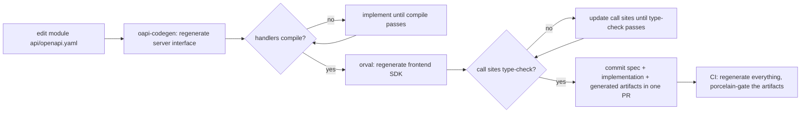

# The API contract

Every REST API in the platform starts from an OpenAPI document, and
every line of code that speaks HTTP — handler on the backend, call on
the frontend — is generated from it. The goal is not "documented
APIs". It is the stronger claim that frontend and backend cannot drift
apart, because the mechanisms that would let them agree to disagree
have been removed: **spec-first, never code-first**, and the order is
non-negotiable. Editing the spec comes first; editing the
implementation first is equivalent to going back to code-first and
loses the whole point.

Why spec-first rather than generating the spec from code comments?
Comments are not bound to code: change a handler and forget the
annotation and nothing notices — the classic documentation-rot path.
The reverse direction binds mechanically. The spec generates the Go
server interface every handler must implement, so a spec change with
no matching implementation change stops compiling. The spec generates
the TypeScript client every call site must satisfy, so a contract
change with no frontend update fails type checking. The drift that
conventions and reviews cannot stop, the compiler does.

## Fragments, the merge, and ownership

Each module keeps its own fragment at `api/openapi.yaml` next to its
migrations and locale files — a module asset, owned by the module that
implements it. The fragments share naming conventions — path prefix
`/api/v1/<module>/`, operationId `<module>_<action><Resource>`,
schema names `<Module><Type>` — because the merged document and the
generated names depend on them: the operationId literally becomes the
generated function and hook names, so the conventions are enforced by
redocly lint rules, not by etiquette.

The merged document is `contracts/speed.yaml`, produced by pinned
redocly `join` (the `api:merge` task) from the eleven platform-module
fragments, and committed as a release artifact. Membership is
module-driven: every platform module with an HTTP fragment joins the
merge and the platform SDK, whether or not any in-workspace page
consumes it. Speed is a library platform, so the SDK covers the
platform, not whatever the demo application happens to call — and an
uncalled generated surface cannot rot, because the consistency gates
pin it exactly like a called one. Whether a surface has a real consumer
is a separate question, answered by the reference-app rule, not by the
merge policy.

The reference app's own notes, cases and smilesim fragments are
deliberately not members: they are the app's API, not the platform's.
They regenerate through the app-owned leg (`api:gen:app`), which joins
them into the app's own merged document
(`examples/reference-app/web/app-openapi.yaml`) and generates the
app-owned SDK the app web host imports — the shape a delivered consumer
project uses for its own fragments. The two SDKs (platform and
app-owned) ride the same binding and the same QueryClient.

## Compilation is the gate

Every handler implements its fragment's generated interface behind a
`var _ api.ServerInterface` compile-time assertion. Add an operation to
the spec and regenerate: the interface grows and every handler that
has not kept up stops compiling — the failure names what is missing.
That is the whole mechanism, and it is why the generated artifact is
committed rather than produced on demand: the compile check runs in
the ordinary build, on every commit, with no pipeline required.

The frontend half works the same way in the other direction.
Regenerating the SDK changes types; type-check failures then enumerate
every call site the contract change touches. The generated SDK ships
no HTTP of its own: every generated call adapts through the package's
single hand-written binding (`runtime.ts`'s `bindRequestFn`), which the
host binds once at bootstrap to its `@speed/api-client` instance —
last bind wins — so generated code inherits the client's
authentication, retry and error handling without knowing any of it
exists. Separating the generated package from the hand-written runtime
is an overwrite-boundary decision: the SDK's entry is regenerated
wholesale and marked DO NOT EDIT, so the hand-written machinery must
live where regeneration never reaches.

## Consistency gates: regenerate and compare

The API-contract pipeline (`api-contract.yml`) runs whenever a
spec-side file changes — a fragment, a generator config, the merge
tooling — on pull requests and on direct pushes alike. It repeats
every generation step of the `api:gen` task (backend fragments,
merged document, frontend SDK, each with pinned generator versions),
and after each step runs a consistency gate implemented as
`git status --porcelain`, deliberately never `git diff --exit-code`:
a regeneration that *creates* a file would pass a diff gate silently,
while porcelain reports untracked files too. Any committed artifact
that is not what its spec generates fails the job. Finally the
pipeline builds the reference app, which imports every platform
module, so a spec whose generated interface outgrew its handlers —
any platform fragment's — cannot compile; the authn fragment gets its
own regeneration-and-build leg so that answer does not wait on the
slower full matrix. Spec, implementation and regenerated artifacts are
committed in the same PR; the gate then verifies they agree.

## What the contract deliberately does not carry

Two design decisions keep the contract clean across the whole
platform. First, **no tenant header exists anywhere.** Tenant context
travels inside the access token, and the server resolves it from the
token's claims — never from a header, parameter or body a caller
controls. Generated code therefore has no tenant concept, and query
keys are bare spec paths; tenant namespacing is a host discipline on
top. Second, **the contract ships no i18n resources.** Every error
response uses one shared envelope — `code`, `traceId`, optional
`params` and `details` — and the `message` field is explicitly marked
as never to be rendered: display text is the frontend's job, looked up
by code in the consuming packages' bilingual catalogs (the error-code
index covers the same codes server-side). The unified envelope is what
lets the generated client handle 401 refresh, 429 backoff and error
mapping once, instead of per endpoint.

The contract also records its own boundaries rather than pretending
OpenAPI covers everything: server-sent events are not an OpenAPI 3.0
media type, so the notification stream endpoint is hand-mounted and
its omission documented in the fragment's header; outbound webhooks
and payment-channel callbacks are requests this platform *sends* or
receives in foreign formats, documented separately, never in the
spec. File uploads needed no exception: uploads stream through the
server as an ordinary three-step protocol, fully expressible.

## Source

- [Taskfile api:gen/api:merge tasks](https://github.com/vislake/speed/blob/main/Taskfile.yml) —
  the pinned generation commands.
- [api-contract.yml](https://github.com/vislake/speed/blob/main/.github/workflows/api-contract.yml) —
  the pipeline and its porcelain gates.
- [contracts/speed.yaml](https://github.com/vislake/speed/blob/main/contracts/speed.yaml) —
  the merged platform document.
- [redocly.yaml](https://github.com/vislake/speed/blob/main/redocly.yaml) —
  the merge and naming-lint rules.
- [api-sdk runtime binding](https://github.com/vislake/speed/blob/main/web/packages/api-sdk/src/runtime.ts) —
  the single hand-written binding.
