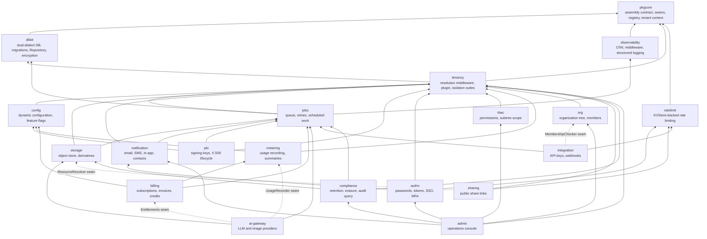
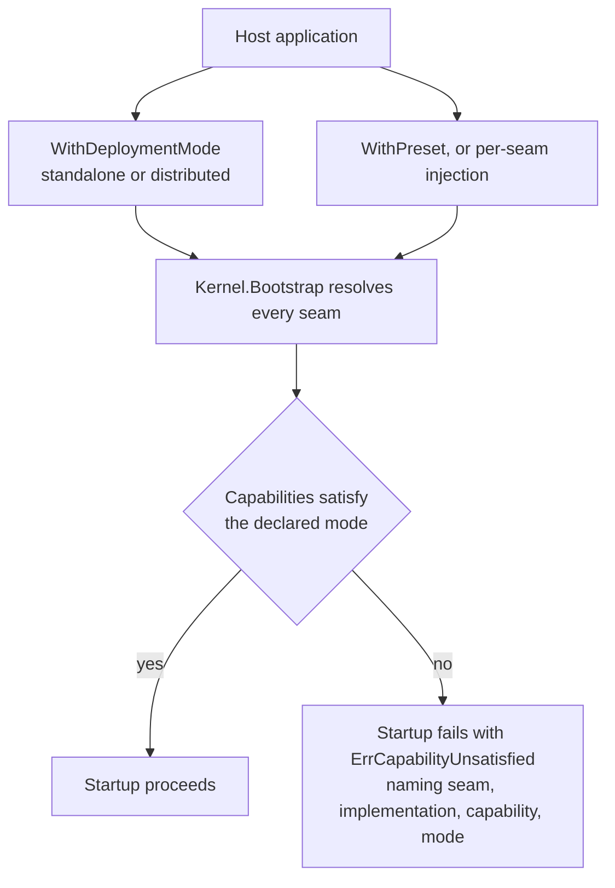

# Architecture

Building on speed? Start with the [user guide](/docs/user-guide/);
this page answers the questions it raises — what the modules are, how
they fit, and what the framework does and does not decide.

## One shape: a modular monolith, distributed as libraries

speed is **not an application** — nothing here runs by itself. It is
independently released Go modules and npm packages that a business
project pulls in with `go get` / `npm install` and assembles into its
own binary. It is **not a microservice architecture**: the modules
compile into that binary and call each other in-process — no service
discovery, no network hops. And it is deliberately **not a framework
in the framework sense**: it does not make the assembling
application's decisions. Only a minimal starter skeleton is generated
by the CLI (`saasctl new`), freely editable — a real project's glue
code belongs to the project.

Why does this shape come first? Because *distribution* drives most
design decisions here:

- **Every exported signature change propagates to every delivered
  project.** Public API is frozen unless a breaking change is
  intentional — which is why adding a cross-cutting mechanism never
  touches the core interfaces (see the wiring contract).
- **Every dependency added here lands in someone else's `go.sum` or
  bundle.** Adding one needs justification in the pull request, with a
  measured cost — steepest near the dependency floor, where it
  compounds into every module above.
- **Implementation details belong under `internal/`** so consumers
  cannot import them. What a module exposes is a considered boundary.
- **All modules and packages release together under one lockstep
  version.** Only same-version combinations are supported, removing
  the compatibility matrix entirely at the cost of upgrading
  everything at once (`saasctl upgrade` performs that rewrite).
- **Every module API must have a real consumer in the reference
  app.** An API no real consumer exercises is not considered done —
  the guard against design-in-a-vacuum, each module proven in a
  composed, running system before it ships.

## Module dependency direction

Dependencies flow strictly bottom-up:

Solid edges are real Go imports. Dotted edges are the opposite of a
half-built dependency: real collaboration that is **deliberately,
permanently import-free**. The consuming module declares a
structurally-typed interface (stdlib types only); the host injects
the concrete implementation at assembly time — the technique behind
`org`'s `FeatureGate`, `rbac`'s `SubtreeResolver`, and `authn`'s
`KeySource`, which `pki` satisfies without `authn` ever importing it.
Two rules keep this graph independently releasable (detailed in the
[design principles](/docs/developer-docs/design-principles/)):

- `rbac` never imports `authn` — authorization knows only
  `Subject{TenantID, UserID}`, assembled by the authenticating side.
- Business modules never import another module's structs for database
  relations — cross-module relationships are ID references plus
  domain events (`authn` publishes `authn.user.created`, `org`
  subscribes); no cross-module foreign keys exist.

`admin` sits on top as the one sanctioned exception: an operations
console is by nature the compositor of everything below, so it may
import the concrete packages beneath it.

The web packages mirror this shape as a layered npm workspace —
design tokens and i18n at the bottom, the generated API client and
headless session layer in the middle, composed UI shells at the top —
documented in the
[frontend domain page](/docs/user-guide/domains/frontend-building/)
and per-package pages under [modules](/docs/user-guide/modules/).

## Deployment mode and implementation composition: two orthogonal axes

Two things are independent; conflating them is a design error:

- **Deployment mode** — how many replicas this runs as, and which
  external facilities it may rely on.
- **Implementation composition** — which implementation each
  infrastructure seam uses.

The counter-example: a single-process deployment talking to real
Stripe, real SMTP and real S3 is the ordinary production shape of a
small-customer install, while a distributed deployment can hang off
Mailpit and a payment sandbox in staging. Real or fake is an
environment-and-credentials question, not a replica-count question.

Consequently, **the deployment mode does not select implementations —
it only constrains them.** Every infrastructure seam in `pkgcore`
(`KVStore`, `EventBus`, `Mailer`, `ObjectStore`) is an interface with
N implementations, N ≥ 1 — never a fixed two. Each implementation
declares capabilities: `MultiReplicaSafe` (several replicas can share
this state), `SurvivesRestart` (state outlives a restart), and
`Stateless` (nothing a restart could lose — the console mailer skips
a warning that would be empty for it). Each deployment mode declares
what it requires; `Kernel.Bootstrap` resolves every seam and compares
the sets. A composition that cannot run in the declared mode **fails
startup** with `ErrCapabilityUnsatisfied`, naming the seam, the
implementation, the missing capability and the mode — never a generic
"missing distributed implementation" error, a sentence that stops
meaning anything once N implementations exist. A missing
`SurvivesRestart` alone is a loud startup banner, not a failure: the
operator must know exactly which data will not survive a restart.

The constraint is one-directional: a multi-replica deployment excludes
in-process implementations, while a single-process deployment excludes
**nothing**. The framework ships no "production" or "test" preset —
the assembling application judges which composition counts as
production.

Because Go resolves dependencies per *package* rather than per
symbol, the same stance extends to packaging: **which implementations
a binary contains is the application assembler's decision.** Each
implementation lives in its own subpackage (`go/pkgcore/kv/redis`,
`go/jobs/queue/asynq`, …), self-registering from its own `init()`;
an application certain it only wants SQLite imports one dialect
package — `database/sql` is the model. The accepted cost is
`database/sql`'s too: an implementation nobody imported is a startup
error whose message names the import that fixes it.

Business code never sees either axis — no `if mode == "standalone"`
in module logic, because module logic never holds the mode; mode and
implementation live only in kernel wiring. (The in-process
implementations double as test doubles, so most unit tests need no
containers.)

## The module wiring contract

Every backend module implements one `pkgcore.Module` interface and
registers everything it contributes — routes, config schema, feature
flags, permissions, job handlers, notification types, events, audit
actions — through a **single `Register(reg Registrar)` call**. The
declaration face is the `Registrar` view: one registration seat per
mechanism, answered by both the kernel's module `Registry` and the
component assembly's `ComponentRegistry`.

**Why one `Register` call instead of eight interface methods?**
Under lockstep versioning, changing the `Module` interface is a
breaking change that breaks every module at once. A new cross-cutting
mechanism becomes a new seat on the declaration face — a `Registrar`
accessor plus the registrar behind it; existing modules do not change
and do not recompile. The declaration face exists precisely so that
adding a mechanism never changes the `Module` interface.

Registration is declarative, which pays dividends elsewhere:
permission lists feed the admin console's role surface, config and
feature schemas feed generated configuration documentation,
notification types feed the user-facing preference matrix. Each
module ships its assets — dual-dialect SQL migrations, `zh-CN`/
`en-US` locale bundles, its own OpenAPI fragment — with its code, so
version and assets never drift apart.

The kernel is assembled from options, not a mode argument —
`NewKernel(opts...)` with `WithDeploymentMode`, `WithPreset`, and the
per-seam injectors. `Bootstrap` walks the module graph, resolves and
validates every seam, and installs the merged message catalog; a
module declares during `Register` and reads resolved state
afterwards.

The HTTP middleware chain has one fixed, non-negotiable order, and
`go/app/chain` is its one implementation:
`authn.Middleware(verifier)` wraps the whole composition and dispatches
the two structurally exempt branches first — admin's console (behind
neither tenancy nor impersonation, because its permissions are judged
against the caller's own unsubstituted principal), then authn's own
subtree (no tenant exists before sign-in). The fallthrough runs the
optional impersonation decorator, then
`tenancy.Middleware(authn.NewPrincipalResolver())` with the pre-auth
allowlist, into the host's protected handler. Authentication precedes
tenant resolution because it is the only order that verifies a token
exactly once — the tenant resolver reads the already-verified principal
out of the context. Permission gating is not a chain element: rbac's
route-authorization table (`rbac.GuardRoutes`) is applied at mount time,
above this chain. The
[identity and access domain page](/docs/user-guide/domains/identity-access/)
walks the chain operationally.

## Multi-tenancy: isolation is a platform property

Tenants share one database, isolated by `tenant_id` and guarded
three ways: a GORM plugin auto-injecting the tenant filter into every
query, a mandatory generic `dbkit.Repository[T]` base that business
repositories for tenant-owned data must embed, and PostgreSQL
row-level security in distributed deployments. Every repository of
tenant-owned data runs `tenancytest.AssertIsolated`; identity and
platform tables run `AssertNotTenantScoped`, asserting the *reverse*
— that a globally visible table is never wrongly filtered. Both
suites are CI-enforced.

Which tables carry `tenant_id` is decided before any table is
designed:

| Domain | Meaning | Tenant-scoped? |
|---|---|---|
| Tenant data | Owned by one tenant, invisible to others | Yes |
| Identity data | Owned by a natural person, spans tenants | No |
| Platform data | Globally shared, tenants read-only | No |
| Link data | Connects identities to tenants | Yes |

`users` is deliberately **not** tenant-scoped — one person can belong
to several organizations — and a user's tenants come from the
`memberships` link table, never from the user record. Identity data
is isolated by *permission*; writing platform data requires the
audited system-context path. Two rules are absolute, since violating
them is the classic horizontal-privilege hole: the server never
accepts a caller-supplied `tenant_id` — the tenant comes from the
access token's claims — and no cross-module foreign keys exist, only
ID references, since modules release and migrate independently.

## Where the design lives

The user guide tells you *how* — install modules, wire the kernel,
shape the org tree, operate a generated project. This Developer docs
section tells you *why*. The
[design principles](/docs/developer-docs/design-principles/) page
is this page's companion: the discipline list every module obeys,
each rule with its reason and where it is enforced.

## Related pages

- [Developer docs](/docs/developer-docs/) hub, [user guide](/docs/user-guide/)
