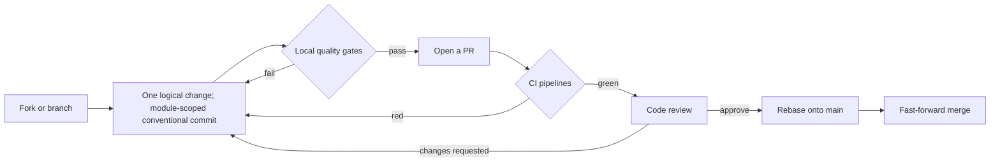

# Contributing

speed is built as independently released Go modules and npm packages,
so contributing means working on one of those units in this repository
— or the shared layer: the API contract, repository guidance, CI
pipelines, this site. Public APIs are frozen — every exported
signature change propagates to delivered consumer projects, and a
dependency you add lands in someone else's `go.sum`. Significant
design changes are recorded first (see
[Design decisions](/docs/developer-docs/design-decisions/)).

## Set up your environment

`task setup` installs the pinned toolchain via mise and syncs the Go
workspace:

```sh
task setup
```

Versions are pinned per tool, each mirroring an authoritative source
(Go in `go.work`, Node in `web/.nvmrc`, pnpm in `web/package.json`,
golangci-lint and Hugo in the CI actions that install them), with the
root `.mise.toml` the local mirror under a drift gate — bump source
and mirror together. `task` and `mise` may be absent from a fresh
checkout's `PATH`; the wrapped commands (`go test ./...`,
`go vet ./...`, `golangci-lint run ./...`) stay runnable.

Two workspace roots never overlap: the Go workspace at the repository
root (`go.work`) and the pnpm workspace under `web/` — run Go commands
from a module directory or with full import paths, and web commands
from `web/`. The reference app under `examples/reference-app/` is the
mandatory first consumer of every module — an API it does not use is
not done — and the place end-to-end development happens:

```sh
go run ./cmd/server   # from examples/reference-app/
```

Other entries: `task test` (unit tests), `task test:full` (full
matrix), `task lint`, `task api:gen` (regenerate API-contract
artifacts), `task docs:serve` (preview this site; init the hugo-book
theme submodule first). There is no hot-reload loop — `task dev` is a
stub that prints what one would need — so the command above is the
real way to run the app; frontend work happens in
`examples/reference-app/web`.

## Branches and merging

Development is trunk-based — short-lived branches, `main` always
releasable — and history on `main` stays linear, enforced by branch
protection: rebase onto the target before merging and merge
fast-forward only (`git merge --ff-only`); merge commits are rejected.
Linear history matters beyond aesthetics: under lockstep
versioning, locating which commits a version contains and bisecting
both depend on it.

`pkgcore`, `dbkit` and `tenancy` are the dependency floor — a change
there ripples through every module and project — so CODEOWNERS gives
those directories, and the release pipeline, dedicated owners whose
review is required.

## Write commits

Messages follow [Conventional Commits](https://www.conventionalcommits.org/):
`<type>(<scope>): <imperative summary>`, in English, header ideally
under 72 characters. One logical change per commit; each compiles and
passes its own tests.

| Type | When to use |
|---|---|
| `feat` / `fix` | New functionality / bug fix |
| `docs` | Documentation only (design docs, ADRs, AGENTS.md) |
| `test` | Adding or updating tests |
| `api` | OpenAPI spec change with regenerated artifacts |
| `i18n` | Adding or updating zh-CN / en-US resources |
| `chore` | Build, tooling, dependencies, CI |
| `style`, `refactor`, `perf` | Formatting / restructuring / performance |

The scope names the touched unit: a Go module or npm package name
(`pkgcore`, `billing`, `auth-ui`), the cross-cutting `reference-app`,
`openapi`, `deps`, `ci`, `compose`, `templates`, `adr`, `release`, or
repository-level `internal` (the design docs), `repo` (root guidance)
and `site` (this site). A breaking change — for delivered libraries,
any exported-signature change — adds `!` after the scope and a
`BREAKING CHANGE:` footer. Summaries and bodies say why, never
narrating process artifacts.

## Quality gates

A pull request clears the checklist before merging — the
[design principles](/docs/developer-docs/design-principles/) list,
enforced by code review and, where tooling exists, by CI.

- **A bug fix ships with a reproduction test** — failing before the
  fix. If one cannot be added, the PR says why and names the follow-up,
  confirmed by the reviewer.
- **Warnings are first-class.** Compiler, lint, deprecation, console,
  accessibility and race-detector warnings are never silently ignored
  or suppressed — fix them or state the reason and follow-up.
- **User-facing text is bilingual**, zh-CN and en-US in the same
  commit, key-set parity CI-checked.
- **Interface changes are spec-first.** The spec changes first; the
  regenerated interfaces and frontend SDK are committed in the same
  change, the implementation after. A spec change nobody implemented
  cannot compile.
- **New repositories prove isolation.** Tenant-data repositories run
  the `tenancytest.AssertIsolated` suite; identity and platform tables
  run `AssertNotTenantScoped`. Neither class bypasses through a raw
  `*gorm.DB`.
- **New infrastructure dependencies bring implementations.** A new seam
  ships at least one implementation with zero external dependencies;
  every implementation declares its capabilities and passes the seam's
  contract test suite.
- **External-contact messaging goes through consent.** Sending to
  unverified addresses is refused; the verification message is the sole
  exception, rate limited.
- **Dependencies carry justification and measured cost.** A new
  third-party dependency needs a reason and alternatives evaluation in
  the PR; a built-in seam implementation also reports the
  `// indirect` count a bare consumer pays.

## Documentation duties

Documentation travels with code in the same PR: a new public
API ships usage docs, a compilable example and an AGENTS.md entry — Go
`Example`s and each package's usage-example test are compiled and run
by CI. Language follows the repository rule: code and module-facing
docs are English, the internal design docs are Chinese, and this site
is bilingual — a new page ships a real zh-CN translation. Pages in
this column carry a Source section pointing at related material, so
every claim can be checked against its origin.

## What CI runs when

| Pipeline | Runs | What it does |
|---|---|---|
| `fast-check.yml` | every PR and push to `main` | per-module Go matrix (lint, vet, race tests, builds) over `go.work`; per-package web matrix (lint, typecheck, tests, build); repo-wide checks (CJK, drift gates, semgrep) |
| `full-check.yml` | `full-ci`-labeled PRs, every push to `main` | the module matrix, Docker-backed PostgreSQL/Redis/RustFS integration tiers, the reference app's composed-HTTP suites |
| `docs-check.yml` | PRs touching docs or i18n resources | i18n key-set parity, markdown-example compilation, this site's structural check against a real Hugo build |
| `api-contract.yml` | PRs touching the API-contract toolchain, matching pushes to `main` | regenerates backend interfaces and the frontend SDK from the specs, consistency-gates committed artifacts, rebuilds the reference app |
| `security.yml` | every PR, plus a daily schedule | dependency audits, gitleaks secret scan, CodeQL, license scan |
| `scaffold-verify.yml` | daily schedule | materializes, builds, migrates and boots a starter project in both deployment modes |
| `docs-site-deploy.yml` | pushes to `main` touching `docs/site/**`, manual dispatch | builds and deploys this site |
| `release.yml`, `docker-image-ci.yml` | manual dispatch | offline lockstep release-plan verification; container image build |

`e2e.yml` and `nightly.yml` are gated stubs, never triggering on pull
requests.



## Source

- [Commit-convention skill](https://github.com/vislake/speed/blob/main/.claude/skills/commit-convention/SKILL.md)
