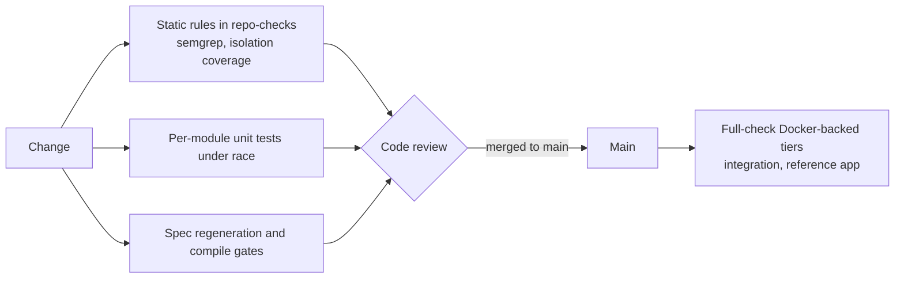

# Design principles

The [architecture page](/docs/developer-docs/architecture/) explains
the shape of speed; this page explains the rules that keep it intact:
what each forbids or requires, why, and where it is enforced. These
are not style suggestions — code that violates them should not be
merged. Enforcement is named at the class level — a semgrep rule, an
ESLint rule, a conformance suite — and the
[repo and release page](/docs/developer-docs/repo-and-release/)
records what each pipeline runs today.

## Module boundaries

- **`rbac` never imports `authn`.** Authorization knows only
  `Subject{TenantID, UserID}`, assembled by the authenticating side.
  Every authentication change would otherwise ripple into the
  permission engine. Enforced by review; the import graph is itself
  the documentation.
- **No business module imports another's structs for database
  relations.** Cross-module relationships are ID references plus
  domain events: `authn` publishes `authn.user.created`, `org`
  subscribes. A struct import chains schemas across modules; an
  event can be ignored, delayed or replayed. Enforced by review.
- **Business code depends on the `pkgcore` interfaces, never on
  concrete infrastructure imports** — `billing` uses `KVStore`, not
  `go-redis`. Enforced by review and depguard rules that confine each backend
  SDK to its own implementation package.
- **Interfaces are designed against the weakest registered
  implementation.** `KVStore` exposes no Redis-specific capability;
  the atomic primitives it does expose (`IncrByFloat`,
  `CompareAndSwap`) are semantics every implementation can satisfy.
  Enforced by review.
- **An implementation never shares a package with its interface.**
  Because Go resolves dependencies per package, an inline
  implementation lands its SDK in every consumer's build. Implementations live
  in own subpackages and self-register; which ones a binary contains
  is the application assembler's decision (`database/sql` is the
  model), and a PR adding one measures its cost to a bare consumer.
  Enforced by review and packaging-aware builds.

## Multi-tenant isolation

- **Business repositories for tenant-owned data must embed
  `dbkit.Repository[T]`; holding a raw `*gorm.DB` is forbidden.**
  The three bypass entry points (`db.Table`, `db.Model`, `db.Raw`)
  are caught by a CI semgrep rule. Identity and platform tables (which
  must *not* be tenant-scoped) use the plain `*gorm.DB` — a
  deliberate, documented exception.
- **Never hand-write `WHERE tenant_id = ?`** — tenant filtering is
  injected by the GORM plugin; writing it by hand bypasses the guard.
- **The API layer never accepts a caller-supplied `tenant_id`** —
  not from headers, parameters or bodies. The tenant comes from the
  access token's claims; accepting a supplied one is the classic
  horizontal-privilege hole. Enforced by review.
- **Every repository runs its isolation suite.** Tenant-owned data
  passes `tenancytest.AssertIsolated`; identity and platform data
  pass `AssertNotTenantScoped`, asserting the reverse — that a
  globally visible table is never wrongly filtered. CI-enforced by
  the isolation-coverage checker.
- **The only legitimate cross-tenant path is the audited system
  context.** Cross-tenant widening is restricted to the platform's
  own compositors (`admin`, `compliance`, `jobs`, `authn`), each
  grant entering through `tenancy`'s audited wrapper, which publishes
  an audit record and fails closed on publish failure; platform-row
  write gates are a narrower, separate use. Business code never
  widens. Enforced by review; the whitelist is documented at the
  `WithSystemContext` functions themselves.

The four data domains and why `users` is not tenant-scoped are on the
[architecture page](/docs/developer-docs/architecture/) and the
[tenancy domain page](/docs/user-guide/domains/tenancy-and-org/).

## Spec first

The API contract has one source of truth, each module's own OpenAPI
fragment, and the toolchain makes drift a compile error.

- **Change the spec before the implementation, never the other way
  around**: edit the fragment, regenerate, let compilation failures
  reveal every handler to fix, implement, update the frontend, commit
  together. The generated server interface participates in
  compilation, so a spec change without an implementation change
  cannot compile. CI-enforced: the api-contract pipeline regenerates
  every fragment and fails when any committed artifact is not what
  its spec generates — a porcelain check, since a regeneration that
  *creates* a file would pass a diff gate silently — then builds the
  reference app.
- **The frontend never hand-writes backend calls.** `fetch` and
  `axios` live only inside `@speed/api-client`; application code uses
  the generated hooks of `@speed/api-sdk`. CI-enforced by the
  `no-direct-http` ESLint rule.
- **Generated code is never hand-edited** — the SDK and the
  `*.gen.go` interfaces are overwritten wholesale on regeneration.
  CI-enforced by the same consistency gates.

The mechanism-level detail — merged platform document, app-owned
generation leg — belongs to the API-contract design page in this
section.

## Asynchronous work

- **Never assume a worker has tenant context** — a job handler
  rebuilds `tenantctx` explicitly from the job's own data, or the
  Repository fails closed. Enforced by review; the fail-closed
  behaviour is pinned by tests.
- **Business compensation does not live in the queue layer.** The
  queue's `OnFailure` hook is for bookkeeping; refunding credits
  belongs to the business module that owns the ledger. Enforced by
  review.
- **Long-running operations go through the jobs queue and report
  progress** — never synchronously inside an HTTP request. Enforced
  by review.

## Deployment discipline

- **Business code never branches on the deployment mode.** No
  `if mode == "standalone"` in module logic — mode and
  implementation live only in kernel wiring, and module code never
  holds the mode. Enforced by review.
- **A new infrastructure dependency ships at least one
  zero-external-dependency implementation** (usable in a
  single-process composition and as a test double), **and every
  implementation declares its capabilities and passes that seam's
  contract test suite** (`eventbustest.AssertConforms`,
  `kvstoretest.AssertConforms`, …) — the only defence against
  semantic drift between N implementations, a surface that grows as
  N²; the CI matrix is contract-suite × implementation, not "the
  same tests twice". CI-enforced for every shipped implementation.

## Logging and security

- **Use structured logging only** — logger from the context
  (`obs.FromContext(ctx)`), constant message strings (never
  concatenated or `fmt.Sprintf`-built), variable data in snake_case
  attributes; no `fmt.Println`/`log.Printf`/`console.log`.
- **No plaintext PII, secrets or tokens in logs, traces or API
  responses** — redaction is on by default with no per-call opt-out.
- **`tenant_id` is never a Prometheus metric label** — high
  cardinality takes Prometheus down; tenant dimensions belong in
  span attributes and log fields.
- **Outbound webhooks must not reach internal addresses.** SSRF
  protection is mandatory and includes DNS-rebinding protection — a
  dial-time re-check, not just a creation-time refusal.
- **Never send messages to unverified phone numbers or email
  addresses.** External contacts complete consent verification
  first; the verification message itself is the only exception and is
  rate limited.
- **Never merge social login accounts on matching email alone.**
  Auto-link only on a verified provider email *and* a trusted
  provider (enterprise SSO adds active membership in the configuring
  tenant); otherwise require sign-in first, then binding.
- **Audit records of impersonated actions carry both identities** —
  the impersonated user as `Actor`, the real administrator as
  `OnBehalfOf`.
- **No hardcoded user-facing text, in any language.** UI code has no
  bare text nodes; the backend returns structured error codes. New
  text ships with both `zh-CN` and `en-US` resources — key-set
  parity enforced at compile time by the catalog builder and over
  the raw files by CI — and backend-generated content renders in the
  recipient's locale, never the operator's. Codes are documented in
  the [error codes](/docs/user-guide/error-codes/) reference.

## Testing

- **Unit tests are defined by tier, not by file mapping** — a unit
  test is the same-package, no-external-dependency test a plain run
  executes, one file per target (`registry_test.go` beside
  `registry.go`); in-package behaviour suites are named for the
  behaviour, never `misc` or `extra`.
- **Every non-unit test class lives in a purpose-named dedicated
  directory, never a source directory** — real-backend integration
  in `integration_test/`, browser end-to-end in `e2e/`, composed
  HTTP/assembly flows in an app-level test directory,
  cross-implementation contract suites in their own support package.
  The in-package exceptions Go forces are explicit and named (godoc
  `Example*` functions, white-box benchmarks); shared helpers live in
  a dedicated `internal/testutil` package or `test-utils/` directory,
  never duplicated across test files.
- **Every bug fix ships with a test that reproduces the bug** —
  failing before the fix, passing after. A test that passes on the
  unfixed code does not count; where that is impossible, the reason
  and follow-up are stated.
- **The dual matrices run in CI**: each seam's contract suite against
  each implementation, and each module's migrations and repositories
  against both SQL dialects. The unit tier needs no containers — the
  in-process implementations double as test doubles.

## Source

- [Architecture](/docs/developer-docs/architecture/), [Developer docs](/docs/developer-docs/) hub
