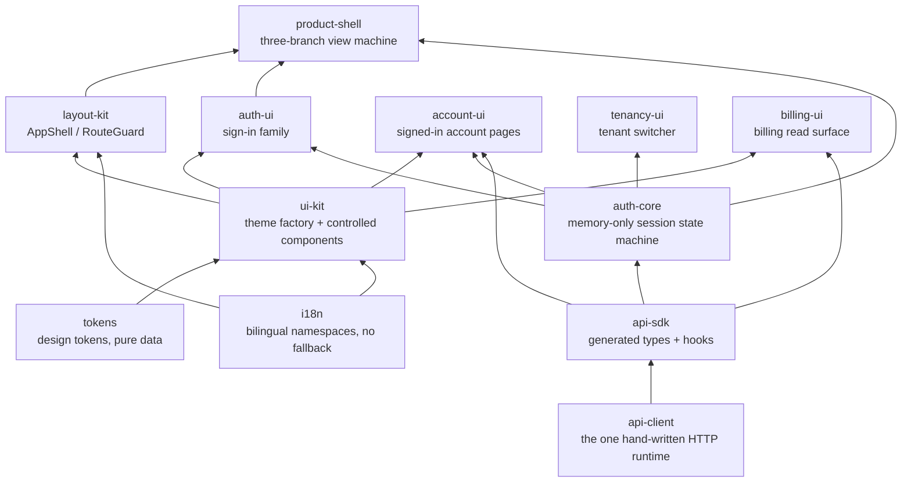

# Frontend architecture

The backend of speed is a modular monolith distributed as libraries.
The frontend is the same decision taken for the browser: not one
application, but twelve `@speed/*` npm packages under `web/packages`
that a product host composes into its own app — libraries with
deliberately narrow contracts, sharing the platform's single lockstep
version. The [web packages](/docs/user-guide/modules/web/) usage pages
cover what each package is for and how to wire it; this page explains
the architecture behind the set: why the layers sit where they do, why
the boundaries are enforced by tooling rather than review, and how the
packages line up against the Go modules behind the API.

## The package layers

Edges read bottom-up: a lower package is a dependency of the one
above it. The layers:

- **Foundation, auth-agnostic.** `@speed/tokens` is the design-token
  tree as dependency-free data; `@speed/i18n` wraps react-i18next
  with the no-fallback missing-key discipline; `@speed/ui-kit` maps
  tokens onto an MUI v9 theme and ships seven controlled components;
  `@speed/layout-kit` provides the shared app chrome (`AppShell`,
  `RouteGuard`). None of these knows what authentication or a tenant
  is — `RouteGuard` gates on a host-injected `allowed | denied |
  pending` value — because chrome and components must be reusable
  under any product, identity scheme and permission model.
- **One HTTP client.** `@speed/api-client` is the single home of
  hand-written HTTP; `@speed/api-sdk` is the generated typed surface
  of the merged API document and calls through that client.
- **Session and identity.** `@speed/auth-core` is the headless session
  state machine over the generated authn surface; `auth-ui`,
  `account-ui` and `tenancy-ui` render the sign-in, account and
  tenant-switch surfaces against it.
- **Assembly.** `@speed/product-shell` composes the frame, the sign-in
  family and the session hooks into the three-branch view machine
  (signed out, signed in, dead session).
- **Business read-only.** `@speed/billing-ui` renders the billing
  documents the generated billing operations expose — the pattern a
  domain read surface follows.

## Controlled components, no data fetching

Every component package obeys one contract: **state flows in through
props, events report out through callbacks, and the component never
fetches, stores, navigates or decides a tenant.** A form's submit goes
through a session operation or a mutation the host wired; a list
renders the rows the host passes; `FileUploader` renders the host's
queue state and reports picks, cancels, retries and removals — the
upload transport is host code, never package code.

The reason is structural: package code cannot know the product's data
flow, routing or identity provider — those are the host's composition
decisions. Rendering only given state keeps a component correct in
every host and testable without a server. Where the generated surface
cannot express a session operation (an authorize-URL request, a
step-up verification), the session arrives as a prop; nowhere does a
package attach to, observe or drive session state itself.

## One hand-written HTTP home

All frontend HTTP is generated traffic except the traffic inside
`@speed/api-client`: injectable `fetch` (captured at construction,
never an implicit global), a memory-only access-token store, a silent
single-flight 401 refresh, per-request timeouts, conservative
transient retries on idempotent methods, and every failure normalized
into one `ApiError`. The workspace ESLint rule `speed/no-direct-http`
makes the single-home claim structural: a direct `fetch`,
`window.fetch`, `XMLHttpRequest`, or an `axios`/`node-fetch` import in
any other package's `src` is an error, with `api-client` the one
config-level whitelist.

The rule exists because hand-written calls were the only entry point
for frontend/backend drift — conventions do not survive deadlines, CI
enforcement does. The same logic separates `api-client` from
`api-sdk`: the SDK's generated entry is overwritten wholesale at every
regeneration (its header says DO NOT EDIT), so the hand-written
runtime must live in its own package that regeneration never touches.
Generated code performs no HTTP of its own: every call adapts through
the package's single hand-written seam (`bindRequestFn`), which the
host binds once at bootstrap to its own client, last bind wins — one
binding gives every generated call the same authentication, retry and
error semantics. The reference app's web host proves the composition
works; the generation machinery is the
[API contract](/docs/developer-docs/api-contract/) page's subject.

## Session state: memory only

Two credentials exist in a signed-in frontend, and both stay out of
every storage API. The access token lives in the caller-supplied
memory store and is re-read before every send, so a retry after a
refresh always carries the fresh token. The refresh token exists only
inside the session closure: never written to `localStorage`, never to
a cookie, no `restore` — a page reload starts anonymous.

Why so strict? `localStorage` is readable by any script running on the
page, so a refresh token there would make one XSS the permanent key to
the account. Memory confines the exposure to the page's lifetime, at
the cost of a reload signing the user out — accepted and deliberate.
The design also reflects the authn API's actual shape: it returns the
refresh token in token-issuing response bodies and sets no refresh
cookie, so no HttpOnly storage exists for the session to rely on.

The session layer is observable, not commandable: hooks read the
state-machine snapshot through `attachSession` (last bind wins) and
never drive it — login and logout come from event handlers — and every
hook fails closed before attach and after logout. Refresh is
single-flight per held token, silent, and generation-guarded so a
completed logout always wins over a refresh resolving after it; a
server-side refresh failure signs the session out locally. Permission
checks are pure set lookups over per-domain lists the host attaches
(`tenant` and `system`), with survival rules applied on principal
change. The host attaches them because the backend ships no
permission-download endpoint: `/api/v1/authn/me` returns identity only
and rbac mounts no HTTP routes, so authorization stays entirely
server-side and the frontend lists are a UX convenience, never a
security boundary.

One transport decision follows from the same trust model: there is
**no tenant header anywhere**. Tenant context travels inside the
access token and the server reads it from there; the frontend's idea
of the current tenant only namespaces query keys
(`['tenant', tenantId, ...]`), renders, and serves as the argument of
a tenant switch — which returns a fresh token and therefore
renamespaces every subsequent query.

## Bilingual text, never inline

User-facing text obeys the same rule on both sides of the platform:
no hardcoded strings. Every rendering package ships one `zh-CN` and
one `en-US` bundle with identical leaf key sets under its own
namespace; `registerNamespace` validates parity before any mutation,
and the no-fallback discipline means a missing key renders as the key
itself — never another language's text. The workspace's
`speed/no-literal-text` rule refuses inline user-facing text in
package `src`, and backend codes map to bilingual copy in the
consuming packages' catalogs, never to strings the API sends down —
the mirror of the backend catalog (`pkgcore/i18n`), where a module
whose language files disagree fails registration.

## How the packages map to the backend

The frontend never sees a Go module — it sees contracts. Every backend
module with an HTTP surface contributes an OpenAPI fragment, and the
frontend consumes the merged document only as generated types and
react-query hooks (`@speed/api-sdk` for platform operations; the
app-owned SDK for a product's own operations — the
[API contract](/docs/developer-docs/api-contract/) page explains the
split). By surface:

- the **authn** module's operations back the `auth-core` session and
  the `auth-ui`/`account-ui`/`tenancy-ui` families — see the
  [authn usage page](/docs/user-guide/modules/identity/authn/);
- **config**'s two pre-auth endpoints back `fetchPublicConfig` and
  `useFeature` in `api-client`'s isolated react subpath;
- **billing**'s read operations back `billing-ui`, the generated-hooks
  read surface.

The [building the frontend](/docs/user-guide/domains/frontend-building/)
domain guide covers the composition steps; the reference app's web
host (`examples/reference-app/web`) composes every host contract at
once — namespaces, session, client, seam binding, view machine — and
the app's suites pin the result.

## Source

- [Frontend design notes (internal)](https://github.com/vislake/speed/blob/main/docs/internal/12-frontend.md) —
  the internal design document this page distills.
- [web/README.md](https://github.com/vislake/speed/blob/main/web/README.md) —
  the workspace layout and the two-roots rationale.
- [api-client README](https://github.com/vislake/speed/blob/main/web/packages/api-client/README.md)
  and [auth-core README](https://github.com/vislake/speed/blob/main/web/packages/auth-core/README.md) —
  the runtime and session contracts.
- [web/eslint-rules](https://github.com/vislake/speed/blob/main/web/eslint-rules/) —
  the `no-direct-http` and `no-literal-text` rules and their tests.
- [reference-app web bootstrap](https://github.com/vislake/speed/blob/main/examples/reference-app/web/src/main.tsx) —
  the first real composition of every host contract.
