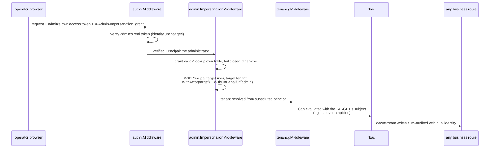

# admin

go/admin is the operations-console backend: the platform-staff-facing
surface over capabilities that already live in every other module. The
user guide's [admin page](/docs/user-guide/modules/capabilities/admin/)
covers the surface; this page covers what admin is *not* allowed to
become, and why.

## Responsibility and boundary

**admin is not a new data source — it is an operations face over
existing capabilities.** It sits atop the module dependency graph;
nothing depends on it. That position gives it the
freedom to reach almost everything below, and it is also its one
hard boundary: it must not introduce any concept other modules would
have to know about to coexist with it. Whatever admin needs downstream
is a pure, additive increment — an optional seam or a new method —
that changes nothing for a host without admin. It renders
the declarative registries other modules already maintain —
permissions, configuration schema, notification types — never a second
copy. And it does not invent a platform-staff
identity: a platform operator is an ordinary `authn` user holding
`RoleBinding`s under rbac's `SystemDomain` pseudo-tenant — staff
logins, MFA and sessions ride authn's existing machinery, and "who may
enter the console" is an ordinary `admin:*` permission like any other
`resource:action`, never a special path.

This is also the module whose shape is the group's one sanctioned
exception: it imports the concrete packages of every module below it
directly, rather than through structurally-typed no-import seams.
Same-tier seams keep sibling modules from coupling; admin has no
siblings — it is the operator's console over everything beneath, and
forcing it through seams would only hide what it is. The exceptions
that *do* hold are the security ones: no cross-module
foreign keys, and every cross-tenant read goes through the audited
system-context wrapper plus the downstream module's own existing
method.

## The tenant ledger: a convenience, never an authority

`pkgcore.TenantID` is an opaque string; nothing in the platform
answers "which tenants exist, and what state are they in" — until
admin builds the ledger. The design question was where "tenant" as a
first-class entity belongs, and the tempting answer — promote it into
`tenancy`, the module that conceptually owns it, with a tenants table,
a mandatory creation entry point and existence checks on every write —
was rejected on cost grounds: tenancy is the floor almost every module
sits on, so under lockstep release changing it forces *every delivered
module* to decide in its next version whether to validate tenant
existence — all to serve one console module's display need. Instead
admin owns a
platform-data `admin_tenants` table that is an **operations ledger,
never the authoritative source**: other modules keep treating
`tenant_id` as an opaque string, no write ever consults the ledger, and
a missing row never fails a business write. It is populated two ways —
event-driven lazy registration (admin subscribes to org's real root
node creation event, so the first appearance of a tenant lands an
active row) and manual operator registration before any business data
exists. The ledger records; it does not gate. What gives it teeth is a
separate, default-off mechanism:

**Suspension works through an optional seam in tenancy, not an admin
route.** `tenancy.Middleware` gained a `TenantStatusResolver` option —
a structurally-typed interface whose default absence changes nothing —
and admin's `TenantService` is its one real implementer. Once a host
wires it, a resolved-but-suspended tenant is refused with a coded
error on the very next request, on every non-allowlisted route behind
the host's middleware, other modules' routes included. The
ledger shares tenancy's own status vocabulary so no translation layer
can silently misread a future third state, and a tenant absent from
the ledger reads as active — the ledger's eventual-consistency lag can
never become a false suspension.

## Impersonation: an authorization credential, never a minted session

The console's most delicate capability is "see what this user sees".
The tempting implementation — minting a normal access/refresh token
pair for the target user — was rejected for three compounding reasons: such
a token is indistinguishable from the user's own and, leaked, is full
session hijacking the user can neither see nor revoke in their device
list; it would add a permanent concept to authn, an identity
foundation, that only one consumer needs; and it collides with authn's
refresh-rotation design, where concurrent use of one refresh token is
treated as theft — an administrator and the target user would trip
each other's anti-replay logic. The shipped
mechanism instead treats impersonation as an **authorization
credential bound to the administrator's own verified session**: a
short-lived (30 minutes, non-renewable), explicitly revocable grant
row in admin's own table, presented on a request header while the
administrator's own access token remains what is actually verified.
Between `authn.Middleware` and `tenancy.Middleware` — the chain's order
never changes — an ordinary net/http middleware swaps the verified
principal for the target user's, and puts the real administrator into
the `OnBehalfOf` context slot. The dual-identity audit records the
design's other half already anticipated: `Actor`/`OnBehalfOf` are
independent context layers, so dbkit's existing automatic write
capture produces "Actor = impersonated user, OnBehalfOf = real
administrator" rows with no modification; and the start and end of an
impersonation are themselves explicitly emitted audit events,
filterable by the on-behalf-of administrator.

Five properties are each pinned by a test. The credential stays the
administrator's own — permission checks run against the *target's*
subject, so impersonation never amplifies the administrator's rights
into a backdoor; an invalid, expired, ended or
foreign grant fails closed and passes the request through untouched; a
target that does not exist or holds no membership in the target tenant
is refused before any grant exists; the impersonated user receives a
mandatory, non-unsubscribable security notification whose copy is
static — it must not leak the operator's free-text reason or identity
to the person under investigation; and a live grant ends the moment
its administrator's `admin:impersonate` permission is revoked — the
service subscribes to rbac's role-revocation events and re-checks the
permission, never trusting the event alone, since a second granting
role must keep the grant alive.

## Reading across tenants: loops through the audited wrapper

Cross-tenant reads — user search, membership composition, audit
queries, send records, the usage dashboard — share one mechanism: enter
`tenancy.WithSystemContext` under a declared purpose naming the
operator, then call the downstream module's **existing per-tenant
method, looped in application code**. The audited wrapper publishes an
event on every entry — even a search that needs no tenant-isolation
escape hatch still leaves the trail, because it returns plaintext
emails and phones — so "record every operator action, no read
exemptions" is welded into the mechanism rather than re-implemented
per endpoint. Every business repository gaining a `ListAcrossTenants`
bypass would linearize cost with module count and mint a new isolation
hole per module, and a dedicated unscoped database connection for
admin is the raw-SQL bypass this codebase bans outright.

The same thin-wrapper posture runs through the whole surface: the
audit shell translates query parameters onto `compliance.AuditQuery`
and its export leg enqueues a jobs task rather than gathering
synchronously in a request; role management wraps `rbac.Service` (the
system domain refused as a target, so a caller holding only
`admin:roles_manage` cannot delegate platform-operator authority to
itself); the usage dashboard stitches `go/metering`'s and
`go/billing`'s per-tenant reads into one view with no aggregate table
of its own. Wiring is honest about necessity: five `With*` options
(`WithAuthn`, `WithOrg`, `WithCompliance`, `WithNotification`,
`WithQueue`) are mandatory and fail `Bootstrap` with named errors when
missing — `WithMetering`/`WithBilling` are optional because a host
without a
metering dimension should not stand up two modules just to boot — and
the rbac seam arrives through a distinct post-`Bootstrap` `AttachRBAC`
call, because rbac's permission catalog may only freeze after every
module has registered. Impersonation grants cannot be born before that
attach runs; until then the service fails closed, loudly rather than
silently.

## The frozen surface

The public API is the ledger, impersonation and search services, the
audit shell and export leg, role management, the usage dashboard and
the notification send-record search behind their spec-generated HTTP
fragment. One honest caveat: its API is deliberately *un*frozen — no production host has yet wired it
and found parameters it could not supply, so the first real
integration may still reshape it.

## Source

- Design: [docs/internal/23-admin.md](https://github.com/vislake/speed/blob/main/docs/internal/23-admin.md)
- Module discipline: [go/admin/AGENTS.md](https://github.com/vislake/speed/blob/main/go/admin/AGENTS.md)

## Related

- [Capabilities group](/docs/developer-docs/modules/capabilities/) — query consumer of [compliance](/docs/developer-docs/modules/capabilities/compliance/)
- Usage: [admin](/docs/user-guide/modules/capabilities/admin/)
- Foundations: [architecture](/docs/developer-docs/architecture/), [design principles](/docs/developer-docs/design-principles/)
