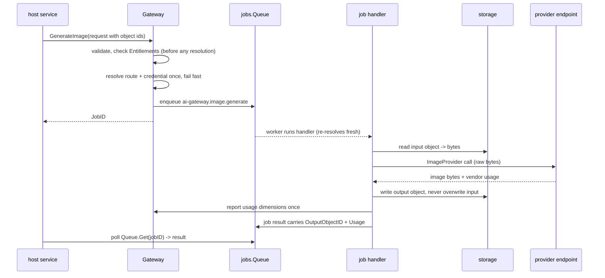

# ai-gateway

ai-gateway is a vendor-agnostic gateway to LLM and image-generation
endpoints. The user guide's
[ai-gateway page](/docs/user-guide/modules/capabilities/ai-gateway/)
covers what the module offers; this page covers why it is shaped the
way it is.

## Responsibility and boundary

The module is a *client* of inference endpoints — it never runs
inference itself, and no self-hosted inference service ships (a local
Ollama/vLLM-style host is reached as a configuration variant of the
OpenAI-compatible providers, since such hosts speak the same wire
protocol; the day one diverges, it becomes one more registry
registration, no interface change). Business code calls the
`Gateway` facade — `Chat`, `ChatStream`, `GenerateImage` — and never
touches a provider, a credential or a vendor SDK. Charging is
deliberately not this module's job: ai-gateway sits on the same
dependency tier as billing and metering, so it cannot import either —
a host that charges for AI usage does so through `go/billing`'s
reserve/confirm lifecycle around the gateway call (the reference
app's smilesim service is the shipped shape), and this module's
usage-reporting seam stays analytics-grade by that same boundary.

## Abstracting every vendor without freezing the abstraction

`ChatProvider` is one narrow interface — `Chat` and `ChatStream` — and
`ImageProvider` is its three-method multimodal twin
(`TextToImage`/`ImageToImage`/`Inpaint`). The escape valve that keeps
the abstraction from freezing is `Params map[string]any`, passed
through verbatim to the vendor: vendor-specific options ride the map,
so a new vendor's idiosyncrasies never force a new interface method.
The default implementations need no vendor SDK at all —
`OpenAICompatibleProvider` and its image twin speak the
OpenAI-compatible wire schema over stdlib `net/http` and
`encoding/json`, which is why they are trivially testable against an
`httptest` endpoint and carry zero third-party dependencies into a
consumer's `go.sum`. Each provider family has its own
`pkgcore.SeamRegistry`, with the built-ins self-registered — the same
`database/sql`-style registry shape every infrastructure seam in this
codebase uses, resolved fresh on every call so a changed credential is
picked up without cache invalidation.

Model routing is a construction-time decision —
`WithModelRoute(logical key, provider, vendor model)` — deliberately
not a dynamic
`go/config` item: routing is an infrastructure-composition choice the
host assembler makes once, not a tenant-tunable runtime value, and an
unrouted key is a coded error, never a silent fallback to a default
model that might bill at a different rate than the caller expects.

## Where the object-reference boundary sits: the job handler

Images travel through storage uniformly; business code's request and
result shapes carry only storage object ids (`InputObjectID`,
`OutputObjectID`), never a byte. The interesting decision is where the
translation between references and bytes happens: **inside the job
handler, never inside `ImageProvider`.** `ImageProvider`'s own methods
trade in raw bytes, because a provider resolved fresh per job comes
out of a registry whose config is a flat string map — it cannot carry a
live storage handle — and because forcing every future third-party
provider to embed its own storage plumbing would couple a simple
vendor adapter (and its tests) to `go/storage`. The handler is the
single place storage I/O happens: translate the reference to bytes,
call the vendor, write the result back as a new object, report usage.
Same reasoning as chat: providers exchange content, not storage
pointers.

## Async by design, jobs as the only mechanism

`Gateway.GenerateImage` has **no synchronous counterpart at all** —
stricter than chat, where synchronous is the default. Image tasks are
asynchronous by design: validate, check entitlements, resolve the
route and credential once to fail fast on a broken configuration, then
enqueue exactly one `jobs` task and return its id. The vendor call,
the storage I/O and the usage report all happen inside the handler,
which re-resolves route and credential fresh — a job may execute long
after, and on a different replica than, the enqueuing call. Callers
retrieve the result through `jobs.Queue.Get`, the same polling shape
storage's own derive task uses — there is no second job-status system
for ai-gateway to maintain. Because a job handler must never bill a
vendor twice, the handler claims its job row before the vendor is ever
called and records "the vendor already answered" before the result
write is attempted; a retry reuses the vendor's prior answer instead
of re-running the call.

## Credentials, BYOK and the SSRF boundary

Credentials live in one scope-tiered table modeled on `go/config`'s
own: platform rows (the operator's default key) and tenant rows
(BYOK), with tenant-override-down-to-platform resolution and the same
empty-string tenant sentinel. Keys are encrypted at rest through a
host-registered dbkit serializer — no blind index, since a credential
is looked up by `(provider, scope, tenant)`, never by its own value.
The platform tier's rows are written through the audited system-context
wrapper under a declared purpose; the HTTP surface that reads and
writes credentials is deliberately write-only in the read direction —
GET answers provider/scope/base URL, never a key, because no response
may echo a secret.

The interesting boundary is the SSRF guard. A tenant admin can point a
BYOK credential at any *public* OpenAI-compatible endpoint; that is a
legitimate capability, deliberately preserved. But the platform's own
network then dials that URL presenting the tenant's key, so the
tenant-influenceable tier gets two checks: creation-time validation
(scheme whitelist, address classification against the same blocked
ranges the webhook SSRF rules use) and a dial-time re-check that pins
the address actually connected — resolve once, refuse a blocked
candidate, dial the validated IP literal, never a second re-resolution
that a rebinding DNS answer could steer. The platform tier is outside
both checks by scope, not by gap: an operator-chosen intranet LLM
gateway is a legitimate platform default. And a refusal reached through
DNS never echoes the resolved address — that would make the refusal an
internal-DNS reconnaissance oracle.

## The structural seams, and why no import is possible

`Entitlements` and `UsageRecorder` are optional, structurally-typed
seams that mirror the real shapes of `billing.EntitlementsService.Check`
and `metering.Recorder.Record` — a host with both wired satisfies them
with a one-line closure. The seams exist precisely
because billing and metering sit on ai-gateway's *own tier*, where an
import edge in either direction is forbidden by the module-boundary
discipline: the same-tier rule that makes compliance's direct
`go/sharing` import legal (see the
[compliance page](/docs/developer-docs/modules/capabilities/compliance/))
is what makes these imports illegal. The entitlement check runs
*before* credential or provider resolution, so a refused caller is
never billed; usage is reported only on success — for a stream, at the
terminal chunk carrying real token counts, never speculatively at
stream start.

## The frozen surface

The module's public API is the two provider interfaces and registries,
the built-in OpenAI-compatible providers, `Gateway.Chat`/`ChatStream`/
`GenerateImage`, the credential service and its three-operation HTTP
surface — all consumed by the reference app end to end (consult for
chat, smilesim for image, the credential routes for both). Dynamic
model routing, key-validation at write time and progress reporting on
image jobs are recorded deferrals, each with its stated reason.

## Source

- Design: [docs/internal/08-ai-gateway.md](https://github.com/vislake/speed/blob/main/docs/internal/08-ai-gateway.md)
- Module discipline: [go/ai-gateway/AGENTS.md](https://github.com/vislake/speed/blob/main/go/ai-gateway/AGENTS.md)

## Related

- [Capabilities group](/docs/developer-docs/modules/capabilities/) — the tier this module shares with [billing](/docs/developer-docs/modules/capabilities/billing/)
- Usage: [ai-gateway](/docs/user-guide/modules/capabilities/ai-gateway/)
- Foundations: [architecture](/docs/developer-docs/architecture/), [design principles](/docs/developer-docs/design-principles/)
