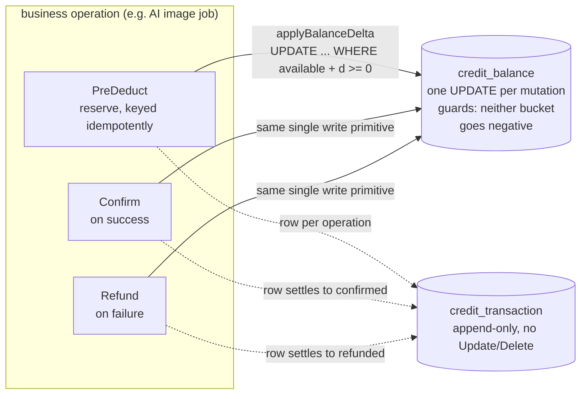

# billing

billing is speed's commerce module: the `Plan`/`Feature`/`Grant`/
`Entitlements` domain model, a channel-agnostic `Subscription`/`Invoice`
lifecycle, and the credits ledger. The user guide's
[billing page](/docs/user-guide/modules/capabilities/billing/) covers
what the module offers; this page covers the design decisions behind
its shape.

## Responsibility and boundary

billing decides *what a tenant is allowed to do and what it owes* — it
never moves money by itself, and that boundary is drawn deliberately.
The module ships real, signature-verifying payment-channel
implementations, but no wired consumer calls them against a live
account: actual money movement needs live channel credentials, which a
library repository cannot hold, and shipping a half-proven money path
would be worse than shipping none. The reference app consumes
billing's two other halves for real — credits around its async AI
simulation job, and `Entitlements.Check` as the judgment gate on every
AI call — and the payment-gateway lifecycle stays the recorded,
honestly named gap. billing's own HTTP surface is deliberately
read-only (two GET operations): the credit consumption this codebase
actually performs is service-side by construction, and shipping write
endpoints nothing calls is the speculative build-ahead the module
declines elsewhere.

## Two billing modes, one ledger discipline

The design starts from a market reality: international and domestic
payment channels differ in what they can do. Stripe supports native
periodic billing; Alipay and WeChat Pay do not offer a reliable
periodic-charge primitive at this tier. The answer is not two domain
models — it is **one channel-agnostic `Subscription`/`Invoice` model
whose lifecycle is driven by a plain Go call**, plus a second,
parallel mode, the credits ledger, that domestic pay-per-use products
actually run on. The UI never sees the channel. Each provider adapter
normalizes its own webhook vocabulary into one `NormalizedEvent`
shape, so differences are confined behind the module.

Two webhook truths shape the payment half. Callbacks are *untrusted*:
their content is only a trigger to go re-query the channel's
authoritative status, never trusted for amounts. And callbacks are
*unreliable* — duplicated by every channel's retries, and possibly
never arriving at all. Duplicates are refused by an insert-first dedup
ledger keyed on the channel's own event id (the processing logic stays
reentrant as a second line of defense); the never-arriving case is
covered by an active-polling `jobs` task that re-queries stuck rows.
Why a durable ledger row rather than an in-memory seen-set? A restarted
replica must still refuse the redelivery — the memory of a processed
event is platform data, not process state.

## The payment-gateway module: mirroring pki's signer components

`PaymentGateway` lives in billing's *root*
package, and the three real implementations live in leaf subpackages
under `go/billing/gateway/{stripe,alipay,wechat}` (each a component
descriptor) — a split that mirrors
`go/pki`'s `Signer`/signer-component split exactly, for the same reason. The
one-way rule is absolute: gateway subpackages may import billing's
root, never the reverse. A caller depends on the interface and the
registry without importing any provider; a provider registers itself
from its own `init()`, and a host blank-imports the one channel it
wants. Only the leaf that imports a provider SDK pays for it — the
dependency isolation reaches `go.mod`/`go.sum` (the measured-cost
discipline of this codebase's subpackage rule), and depguard rules keep
each provider SDK confined to its own leaf, so `stripe-go` cannot
creep into `gateway/alipay` any more than into the root. Why the
interface in the root rather than the subpackage? If the module interface lived
under `gateway`, billing's own domain code would have to import
`gateway` to name it — the exact edge through which
`stripe.Subscription`-shaped types leak into a domain model over time.
The split is the enforcement of "channels are just collection
executors", not a packaging nicety.

## The credits ledger: reserve, confirm, refund

Pay-per-use that might fail needs a two-phase pattern: reserve the
credits before the work, confirm when it succeeds, refund when it
fails — every project would otherwise reimplement it and forget the
refund half. The ledger is `credit_balance` (per-tenant available and
reserved buckets) plus an append-only `credit_transaction` log whose
every row is a reconcilable fact. The append-only repository exposes
`Insert`/`Get`/`ListByTenant` and deliberately **no `Update`/`Delete`
method** — the same shape dbkit's audit ledger uses, since embedding
`dbkit.Repository[T]` would promote exactly the mutability a financial
ledger must never offer.

Concurrency is the ledger's core problem, and the answer is to take
Go-level read-modify-write off the table: every balance mutation
funnels through one `applyBalanceDelta` — a single database-arbitrated
`UPDATE` whose WHERE clause guards both buckets against going negative
in the same statement. Two concurrent deductions are serialized by the
database's own row locking; the second sees the first's applied change,
and the guard evaluates against post-first values. Plain, portable SQL
that runs identically on SQLite and PostgreSQL — no dialect-specific
atomic primitive, no process lock. The one-sentence design rule: **the
database arbitrates the balance; the application never races it.**
Idempotency completes the pattern: a reservation is minted under the
caller's mandatory idempotency key, and a retried `PreDeduct` reads
back its own earlier row instead of double-deducting (the insert runs
as `ON CONFLICT DO NOTHING` — a unique-violation error inside an open
transaction would abort it on PostgreSQL, a divergence only a real
PostgreSQL tier can show, which is why billing carries one).

## Entitlements: one judgment entry point

`Entitlements.Check(ctx, featureKey, requested)` is the single gate
business code calls — no module reads subscription tables or computes
allowances itself. Boolean features ("may this tenant use model X at
all") and quota features ("how many calls this period") ride the same
mechanism, so a per-model access gate needs no second switch system.
A quota decision reads the **real-time counter**, never a summary
table — aggregation delay would let an over-quota request through. The
counter arrives through the small `UsageReader` interface (billing
never imports metering; both sit where a structural module interface is the only
legal connection), and a quota check with no reader wired fails closed
with a coded configuration error — never a panic, never a guessed
allowance that would fail open for an over-quota tenant.

One storage shape deserves its own note: `Plan` deliberately does not
implement `dbkit.TenantScoped`, because a single table carries two
faces — platform-wide rows every tenant's lookup falls back to, and
tenant-custom rows only one tenant may see. No single data-domain
capability spans both; the table adopts `go/config`'s exact answer
(empty-string tenant sentinel, isolation enforced by the store's own
signatures, `AssertNotTenantScoped` as the proof), and reads that
resolve by key are the store's guarded two-step lookup.

## Trade-offs, recorded rather than hidden

Three absences are deliberate and stated. The credit-expiry *sweep* is
not shipped — `CreditService.Expire` exists, keyed and retry-safe, but
which credits expire on what cadence is product policy the ledger's
data model cannot anchor, so the sweep is a `jobs`-wiring host's
decision. Live webhook *reception* is not mounted — verification,
normalization and dedup are shipped and tested; the inbound endpoint
and the transitions it would drive are not, because no caller exists
to prove them against. And `Register` declares **zero config items**:
no knob is read by any shipped code path, and declaring schema with no
code path attached is the speculative pattern this codebase rejects by
precedent.

## The frozen surface

The module's public API is the domain types, `Entitlements.Check`,
`CreditService`'s `Grant`/`PreDeduct`/`Confirm`/`Refund`/`Expire`/
`Balance`/`Transactions`, the `PaymentGateway` module and registry, and
the read-only HTTP fragment — the surface the reference app and the
audit trail pin. What is not frozen is what has no real caller yet:
the payment-gateway lifecycle and the quota/`UsageReader` judgment
path are pre-release shapes that the first real production integration
may still reshape.

## Source

- Module discipline: [go/billing/AGENTS.md](https://github.com/vislake/speed/blob/main/go/billing/AGENTS.md), [go/billing/gateway/AGENTS.md](https://github.com/vislake/speed/blob/main/go/billing/gateway/AGENTS.md)

## Related

- [Capabilities group](/docs/developer-docs/modules/capabilities/) and the [module design story's](/docs/developer-docs/modules/capabilities/ai-gateway/) same-tier module discipline
- Usage: [billing](/docs/user-guide/modules/capabilities/billing/), [ai-gateway](/docs/user-guide/modules/capabilities/ai-gateway/)
- Foundations: [architecture](/docs/developer-docs/architecture/), [design principles](/docs/developer-docs/design-principles/)
