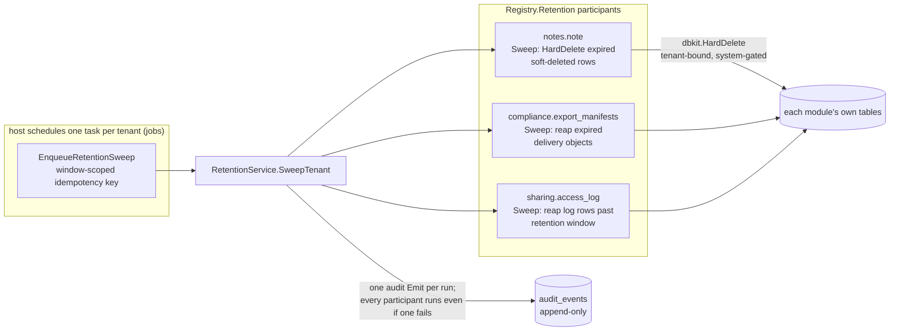

# compliance

go/compliance is speed's governance layer: retention-window sweeping,
right-to-erasure orchestration, data-export gathering and delivery,
and read-only audit querying. The user guide's
[compliance page](/docs/user-guide/modules/capabilities/compliance/)
covers the surface; this page covers why the module is shaped the way
it is.

## Responsibility and boundary

compliance **invents no mechanism** — it orchestrates mechanisms that
already exist. Every physical delete it ever causes runs through a
business module's own `dbkit.Repository[T].HardDelete`, which is
tenant-bound and system-context-gated in `go/dbkit` (mark-delete and
hard-delete are dbkit's mechanisms, not this module's); every audit
record it produces goes through `go/dbkit/audit`'s `Emit`; even the
database-level append-only enforcement on the audit table lives as a
trigger pair in `dbkit/audit`'s own migrations, because that is where
the table lives. The module ships no HTTP surface and no schedule of
its own — it is a Go-level API a host drives, typically from a `jobs`
task it enqueues via `EnqueueRetentionSweep`. Deliberately absent and
recorded as such: an optional hash chain over the audit trail (no
consumer asks for it), time-partitioned archival (its named
prerequisite, append-only enforcement, is in place; the archival
itself is simply not built), and a compliance-owned erasure-request or
sweep-run log table.

## Why compliance owns no table

The module's `Migrations()` returns an empty `embed.FS` by design, and
the reasoning is worth stating because it looks like an oversight. The
durable record of every orchestration run already exists: each
`SweepTenant`/`Erase`/`Export` ends in exactly one `dbkit/audit.Emit`
carrying the per-participant breakdown — an append-only, queryable,
tenant-attributed record. A second compliance-owned table would
duplicate it. Retry state needs no row of its own either: a
participant's callbacks are contractually idempotent, so re-running an
interrupted operation converges to completion — there is no
multi-step state machine to persist. And `dbkit.MigrationRegistry`
documents the empty set as legal, not degraded. What the durable
record must never carry is the raw error text of a failed participant
— that text can name the very subject the erasure exists to remove,
and `audit_events` is the one table nothing can delete from — so audit
records and delivered manifests record classification (participant
name keyed to a "failed" marker), never error text; the text lives in
the returned in-process result maps and the redacted failure-site
logs, its two legitimate homes.

## The registrar: a cross-cutting mechanism that changes no Module

The one change compliance makes to a module below it is a new
registrar on `pkgcore` itself: `Registry.Retention`, with
`RetentionParticipant` (a name plus three callbacks — `Sweep`, `Erase`,
`Export`, each optional except that a participant with neither Sweep
nor Erase is useless) and the `SubjectRef` type erasure takes. The
`Registry` struct exists so a new cross-cutting mechanism does not
change the `Module` interface — under lockstep versioning, touching
that contract would break every module at once. Participants are
registered by their owning business modules (the reference app's notes
module is the real one), and compliance's own code never imports or
queries a business module's table: every callback calls its own
`dbkit.Repository[T]` methods. A participant registered for retention
and erasure but nothing else simply declares `Export` nil — a host
that only wants sweeping and erasure, never export delivery, never
wires a `SharingCreator` at all.

## Partial failure across independent transactions

`SweepTenant`, `Erase` and `Export` each call N independently
registered participants, each backed by its own repository and, in a
distributed deployment, its own connection — N participants' deletes
cannot compose into one cross-module transaction (the same reasoning
behind the no-cross-module-FK rule). The consistent policy: one
participant's failure never stops the others; the failure is recorded
per-participant by name; the operation still audits itself with the
full breakdown; the method returns a specifically coded partial-failure
error whenever any participant failed — a caller checking only
`err != nil` must still learn something needs attention, never mistake
a partial pass for a clean one; and recovery is retry, not rollback —
idempotent callbacks converge the remaining participants without
re-processing what already succeeded. Counts survive errors in both
directions: a participant that hard-deleted rows before failing still
reports them, so an irreversible operation's toll is never understated
in the audit record.

`Erase`'s tenant boundary is enforced before anything else happens:
no tenant in ctx is refused, and a `SubjectRef` naming a different
tenant than ctx carries is refused before any participant runs — the
gate makes it impossible to hard-delete another tenant's rows with a
compliant audit record to show for it, and the cross-tenant
non-erasure property is proven against the same subject id in two
tenants. `Export` is the mirror image: it never enters a system
context at all, because every participant's export callback reads the
same tenant ctx is already scoped to.

## AuditQuery: filtering in application code, honestly

The audit read API has two legal homes — a new compliance-owned type
or an addition to `dbkit/audit` itself — and the latter's own doc
comment already assigns the rich query API to compliance. `AuditQuery`
therefore adds no method to `audit.Repository`; it holds the existing
exported read methods and filters their results in Go. This is a real,
stated trade-off: a query fetches every row the tenant's listing would
return and filters in memory — no pushed-down `WHERE actor = ?`, so a
tenant with a very large trail pays O(all its rows) per query. Why
accept it? The mechanism stays in one place, the honest cost is
documented at the call site (a cross-tenant query names its tenant
list, so its cost is visible rather than hidden), and the alternative
would grow dbkit's surface for a query language only this module's
consumers use. One dimension exists specifically for impersonation
accountability: `OnBehalfOf` — an administrator never appears as
`Actor` on an impersonation-era row, so a filter that could only name
actors would make the impersonated-user rows of each administrator's
sessions unqueryable, and an attribute that can only be written and
never queried does not exist for accountability. The admin module's
audit shell (see the [admin page](/docs/developer-docs/modules/capabilities/admin/))
is the real consumer of this surface.

## Export: gather, store, deliver through sharing

`ExportService.Export` gathers every participant's data into one
manifest, stores it through the ObjectStore seam, and hands it off
through a `SharingCreator` — typically a real `go/sharing.Service` —
which mints a **24-hour, single-view, passwordless** share. The direct
`go/sharing` import is the architectural contrast that makes the
graph's rules visible: compliance sits *above* sharing, so an import
edge is legal — the same-tier no-import rule that governs billing and
ai-gateway does not apply between these two, and the `SharingCreator`
interface exists for test isolation, not to avoid the import. The
delivery shape is chosen deliberately: one tenant's complete data is a
weighty package, so the window is hours, not sharing's general-purpose
30 days; a single-view, 256-bit token is already a credential, so a
password — which would need its own separate delivery channel — adds
moving parts without adding security. The export is created with
`Sensitive: true`, so sharing's own sensitive-resource audit action
fires alongside compliance's request-and-delivery record: one
completed export leaves two audit trails, each owned where the fact
happened.

## The frozen surface

The public API is `RetentionService` (`SweepTenant`, `SweepAllTenants`,
`EnqueueRetentionSweep`), `ErasureService.Erase`, `ExportService.Export`,
`AuditQuery.Query`/`QueryAcrossTenants`/`Get`, and the pure
`RenderAuditReport` — plus the registrar it contributed to `pkgcore`.
The whole module is exercised for real by the reference app's notes
participant and its scheduled retention sweep; what remains unconsumed
(`RenderAuditReport`'s report bytes) is stated plainly with its
compensating runnable example.

## Source

- Module discipline: [go/compliance/AGENTS.md](https://github.com/vislake/speed/blob/main/go/compliance/AGENTS.md)

## Related

- [Capabilities group](/docs/developer-docs/modules/capabilities/) — delivery consumer of [sharing](/docs/developer-docs/modules/capabilities/sharing/), query consumer [admin](/docs/developer-docs/modules/capabilities/admin/)
- Usage: [compliance](/docs/user-guide/modules/capabilities/compliance/)
- Foundations: [architecture](/docs/developer-docs/architecture/), [design principles](/docs/developer-docs/design-principles/)
