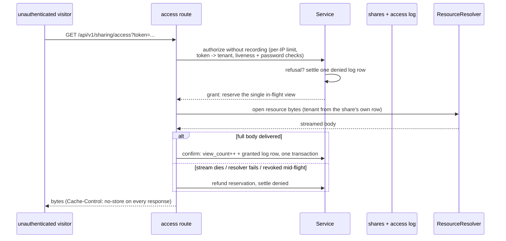

# sharing

go/sharing implements public share links: a controlled entry point
that lets an unauthenticated external visitor view one internal
resource — a patient viewing their own simulation result, a customer
viewing a report. The user guide's
[sharing page](/docs/user-guide/modules/capabilities/sharing/) covers
the module's surface; this page covers why it is shaped the way it is.

## Responsibility and boundary

The module's job is deliberately narrow: resolve a bearer token into
one resource and hand its bytes to a viewer the platform has never
authenticated. Everything else is somebody else's. sharing holds no
resource bytes of its own — the `ResourceResolver` module interface (a
structurally-typed, no-import interface, because the resolver is
typically the host's own `go/storage` composition) turns a granted
share into actual content. It builds no generic sensitivity
classifier — a create call simply declares `Sensitive: true` or not.
It renders no browser-facing password page — the route accepts a
password over a header, and collecting it is presentation-layer work
for a host's frontend. And it cannot enforce "never sit behind a
CDN", the single most common way revocation silently stops working —
it can only set `Cache-Control: no-store` on every response the route
can produce, which it does as the first action of every write path,
binding-error answers included.

## The five mandatory rules, each with its why

The design doc fixes five rules, and each is enforced in code with a
passing test rather than left to convention:

1. **Tokens are cryptographically random, at least 128 bits.** The
   module draws 256 bits from `crypto/rand` — a token is a credential
   for a resource the platform has never authenticated the holder of.
2. **No share lives forever.** A nil expiry resolves to the tenant's
   configured default (30 days when nothing is configured), an
   explicit request for a never-expiring link is refused outright, and
   an explicit date is clamped to a ceiling so `9999-12-31` cannot
   smuggle in effectively-never. A tenant's configured default can
   only *raise* the operative ceiling — the host's own policy is
   honored, never undercut.
3. **Revocation takes effect on the very next access check.** `Access`
   re-reads the row from the database on every call; there is no
   cached share state anywhere in the module. Combined with the
   no-store header, this is what makes revoke real.
4. **Every access is logged.** Each granted *and* denied attempt
   against a known share settles one access-log row (with the attempt's
   outcome and viewer metadata), and the log write is not best-effort:
   an access whose trail did not commit fails the access rather than
   answering as if it had been processed — a granted access with no
   trail is exactly the hole this rule exists to forbid.
5. **The surface leaks nothing about the tenant.** Unknown token,
   revoked, expired, view-exhausted, missing or wrong password all
   answer one outward-identical `ErrNotAccessible` — the same
   existence-disclosure suppression authn applies to account
   enumeration, applied to share enumeration.

Two supporting storage decisions deserve note. The module stores only
the **SHA-256 hash of the token** — a leaked database backup yields no
usable links (the same reasoning org's invitation tokens follow). And
share passwords are argon2id-hashed by a small self-contained hasher
rather than by importing `go/authn` for one function: authn sits
several tiers up the graph with a heavy surface, and importing it for a
single hash would violate the measure-what-a-dependency-costs
discipline.

## Serving an unauthenticated viewer: resolve the tenant from the token

`AccessPublic` is the genuinely unauthenticated entry point — the ctx
carries no tenant at all. The design question: how does a
tenant-scoped lookup run for a caller with no tenant? The answer is a
deliberately narrow platform-data table mapping token hash to owning
tenant; the tenant is resolved from the token *before* any
tenant-scoped query, attached to ctx, and the ordinary `Access` path is
re-entered unchanged. Why not the audited system-context escape hatch?
Its widening whitelist names admin, compliance, jobs and authn —
sharing is not on it, and a second ad-hoc escape hatch inside sharing
would be exactly the uncontrolled proliferation that rule exists to
prevent. Why not a raw-SQL lookup bypassing the tenant filter? The
bypass entry points are banned outright, and the GORM tenant plugin
fails closed on a tenantless ctx by correct design. A platform-data
index table sidesteps the conflict entirely — something that must be
resolvable *before* a tenant is known cannot itself be tenant-scoped,
the identical treatment authn's `users` table already gets. The table
carries exactly two columns (hash, tenant) and answers exactly one
question; every other fact about the share still comes from the
tenant-scoped row.

Because the anonymous surface re-enters `Access`, all five rules hold
for an anonymous caller with no second code path to keep in step — and
the wrong-guess budget (see below) is the one honest, documented
answer difference that surface's own charging introduces.

## A view is consumed on delivery, never on authorization

For an in-process caller, authorization *is* the grant — nothing can
fail between the decision and the content changing hands. For an HTTP
serve, a stream can die partway, so the route runs a three-phase
protocol that mirrors the credits ledger's reserve/confirm/refund: an
authorized serve takes the share's single in-flight reservation,
delivers the body, and only after the full content reached the viewer
commits the view and the granted log row in one transaction. Every
serve shape that does not deliver — a failing resolver, an interrupted
stream — settles as denied, no view consumed, so a `MaxViews=1` share
survives a broken first attempt for a genuine retry. A share that dies
mid-delivery (revoked, expired) refuses the confirm at the database
and is settled denied. The two-direction guarantee: **bytes not
delivered never spend the view; bytes delivered are never given away
unspent.** A serve that crashes between reserve and settle leaves a
stale reservation, presumed interrupted after a 30-minute timeout and
converged by the next access or the expiry sweep's regular pass —
nothing ever auto-converges a reservation younger than the timeout.

Two abuse-facing rate limits complete the picture: per-IP checks in
the prelude (before the token is even resolved) and a per-token
wrong-guess budget on the anonymous surface, charged *after* judgment
so a leaked-link holder cannot exhaust the legitimate password
holder's budget. The spent budget's 429 is a recognized-token-path
answer difference from the uniform refusal — it discloses that the
token exists and the share is password-protected — recorded honestly,
with why it is accepted: a budget that answered indistinguishably
from a wrong credential could not pace the guesser it exists to slow.

## The frozen surface

The public API is `Service.Create`/`Access`/`AccessPublic`/`Revoke`/
`Get`/`List`/`ListAccessLog`, the sweep entry point, the two HTTP
surfaces (the genuinely public access route and the five owner-facing
operations), and the module's own expiry-policy constant. Its one
configuration item and its access-log retention participation connect
it to the modules that govern data — the reference app consumes both
HTTP surfaces end to end, and compliance's export delivery (see the
[compliance page](/docs/developer-docs/modules/capabilities/compliance/))
is a second real consumer of `Create`, clamping its own 24-hour
delivery window against sharing's ceiling.

## Source

- Module discipline: [go/sharing/AGENTS.md](https://github.com/vislake/speed/blob/main/go/sharing/AGENTS.md)

## Related

- [Capabilities group](/docs/developer-docs/modules/capabilities/) — expiry-policy consumer in [compliance](/docs/developer-docs/modules/capabilities/compliance/)
- Usage: [sharing](/docs/user-guide/modules/capabilities/sharing/)
- Foundations: [architecture](/docs/developer-docs/architecture/), [design principles](/docs/developer-docs/design-principles/)
