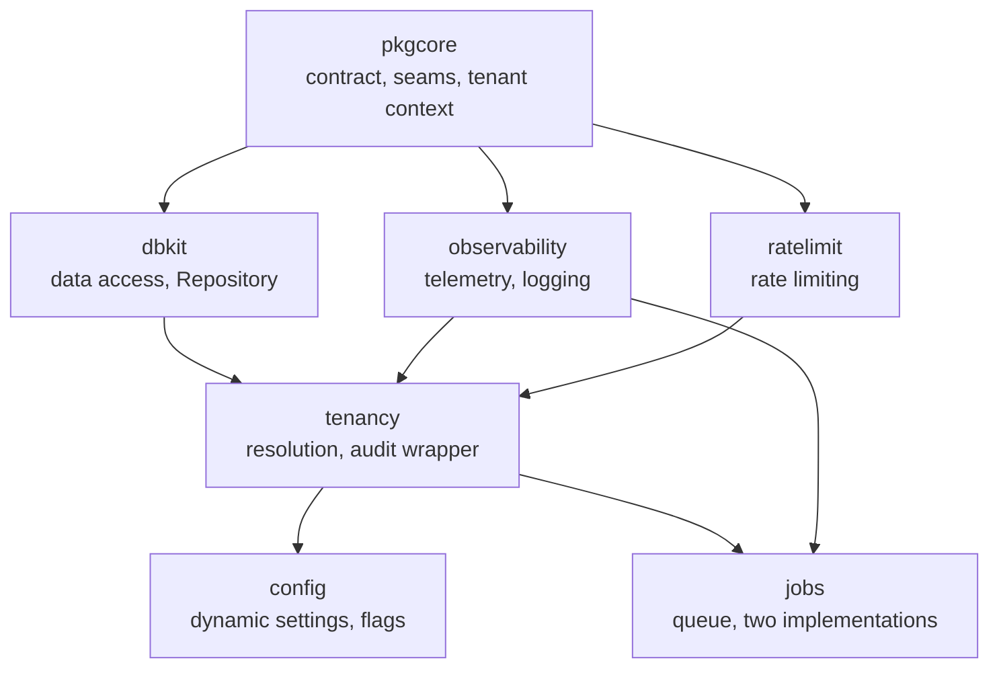

# Core modules — design

The seven modules of the core group are the dependency floor of every
speed-based binary. The division of labour, in one sentence each:

- **pkgcore** — the assembly contract (`Module`/`Registry`/`Kernel`),
  the infrastructure seam interfaces with their N implementations and
  capability declarations, the tenant-context primitives, structured
  errors and the message catalog. It imports no other speed module.
- **dbkit** — the dual-dialect data-access layer: the safety-wrapped
  `Open`, the mandatory generic `Repository[T]` with its mark-delete
  and gated hard-delete semantics, migration aggregation, field-level
  encryption with blind indexes. It enforces tenant isolation once a
  context already carries a tenant.
- **tenancy** — the input side of isolation: deciding which tenant a
  request carries (the resolution middleware), the audited wrapper
  around the system-context escape hatch, and the isolation assertion
  suites every repository must run.
- **observability** — OpenTelemetry wiring whose exporter choice is an
  option, the context-aware structured logger with redaction on by
  default, and HTTP instrumentation with bounded labels.
- **config** — the schema-first, database-backed dynamic settings and
  feature-flag store whose values change hot and take effect hot.
- **jobs** — the asynchronous task queue contract with two
  implementations: `StandaloneQueue` (SQLite-backed, in-process) and
  `queue/asynq` (Redis-backed), both satisfying one frozen
  `Queue`/`Task`/`Job`/`Handler` shape.
- **ratelimit** — the shared KVStore-backed rate limiter, one
  dimension per call, a pure library that implements no module
  contract.

## Two shapes of core module

The seven split into two shapes, and knowing which shape a module has
tells you how you use it:

- **Kernel-assembled modules** — `config` and `jobs` (and every module
  above the core group) implement `pkgcore.Module` and contribute
  routes, config schema, permissions, events and job handlers through
  one `Register` call; the kernel assembles them. `config` additionally
  needs its `Attach` call after bootstrap, because its schema is folded
  from the registry's *combined* declarations.
- **Used directly, not through the kernel** — `tenancy`'s middleware
  guards HTTP entry points, `observability.Init` runs at process
  startup, `jobs` queues are constructed and started by the host (the
  queue seam deliberately has no kernel seat), and `ratelimit` is a
  pure library with nothing to register.

## The design threads that run through the group

Three ideas recur across these seven pages because they originate
here, in the floor:

- **Packaging follows dependency resolution.** Go resolves dependencies
  per package, so no implementation ever shares a package with its
  interface: dbkit's dialect drivers, observability's exporters,
  jobs' Redis queue each live in their own subpackage, and a consumer
  pays only for what it imports. Measured cost, not assertion.
- **Interfaces are designed against their weakest implementation.**
  `KVStore` exposes no Redis-only capability, `Repository[T]` collapses
  "not found" and "not yours" into one answer, the queue contract is
  the intersection of both deployment modes. The anchor is the weakest
  registered implementation, not "the standalone one".
- **Fail closed is the default posture.** No tenant in context — refuse
  the read; resolution fails and the route is not allowlisted — refuse
  the request; a status source is unreachable — refuse, never "assume
  active". Every escape hatch exists but is loud, restricted and
  audited.

Each module page below states what its module owns, what it refuses to
own and why, the trade-offs behind its shape, one key mechanism as a
diagram, and the surface that is frozen for consumers. Read them in
dependency order: [pkgcore](/docs/developer-docs/modules/core/pkgcore/),
[dbkit](/docs/developer-docs/modules/core/dbkit/),
[tenancy](/docs/developer-docs/modules/core/tenancy/),
[observability](/docs/developer-docs/modules/core/observability/),
[config](/docs/developer-docs/modules/core/config/),
[jobs](/docs/developer-docs/modules/core/jobs/),
[ratelimit](/docs/developer-docs/modules/core/ratelimit/).

The user-guide counterpart of this page is the
[core modules usage guide](/docs/user-guide/modules/core/), which
shows the same seven from the consumer's side.
