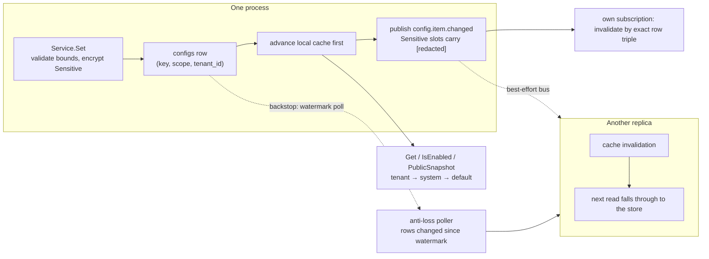

# config: dynamic settings that change hot

config owns speed's runtime configuration layer: the schema-first,
database-backed settings store whose values can change at runtime and
take effect hot — feature-flag enablement, tenant brand items, default
limits, AI-model defaults. Its scope model has three tiers (`system` →
`tenant` → `user`, the last reserved and unimplemented) with reads
falling back from the concrete tier to the wide one, and it also owns
feature flags at runtime: modules declare flags on pkgcore's registry;
this module folds those declarations into its schema, walks flag
dependency chains at runtime, and serves the enablement list to the
frontend. It is among the always-on modules with no off switch.

## Responsibility and boundary

- **Bootstrap resolution is not this module's business.** How to
  reach infrastructure — DSNs, addresses, the deployment mode, the
  composition preset, the master key — is decided once at process
  startup: the keys are declared on `pkgcore`'s bootstrap seat,
  resolved by the general-purpose `pkgcore/config` loader (a separate
  zero-dependency package this module must never import), and their
  key-material derivation convention — one purpose string per declared
  key path (`pkgcore.BootstrapKeyPurpose`), composed with
  `dbkit.DeriveKey` — lives with that seat and toolkit. Mixing the two
  would create the chicken-and-egg of "database connection string
  stored in the database": bootstrap values are immutable at runtime
  by definition; dynamic values exist precisely to be changed.
- **It renders nothing.** `Locales()` returns an empty embed.FS; every
  user-facing string of its endpoints is a structured error code. The
  bilingual catalog renders content, never schemas — item descriptions
  are English prose in code, recorded as a limitation.
- **The module is not the consumer of its own rules.** "A disabled
  feature answers 404, not 403" and "a disabled flag skips route
  registration and background jobs, never migrations" are enforced by
  the modules that consume flags, not by this one — it answers what is
  enabled, nothing more.
- **Tenant resolution is delegated.** The pre-auth endpoints consult a
  host-wired `tenancy.Resolver`; domain-to-tenant mapping belongs to
  the tenancy side.
- **Durable audit rows exist only through the optional compliance
  module.** This module's per-write record is the change event itself;
  it never writes audit rows.

## Design: declaration and freeze are two separate steps

The module's wiring splits into two steps, and the split is load-
bearing. **Register** declares what never needs the assembled
registry — the audited system purpose, the two route paths, the change
event, the audit action. **Attach** happens only after every module
has registered (after `Kernel.Bootstrap` returns), because the
service's schema is folded from the registry's *combined* item and
flag declarations — items owned by other modules are first-class
citizens of it, so the schema cannot exist before registration
completes. Attach demands what registration must not touch: a
migrated `*gorm.DB`, a cipher whenever any registered item is
`Sensitive` (`ErrCipherRequired` otherwise — a host without the key
could never write or read such a value without leaking it), and a poll
interval. It is idempotence-guarded (`ErrAlreadyAttached`), and the
service answers `config.service_not_attached` in the window between
Register and Attach rather than nil-dereferencing — a host wiring bug
surfaces as a coded error, never a crash.

Schema-first is what makes the store safe to administer: every item is
declared with its type, default, bounds, `Sensitive`/`Public` flags,
description and group, validated at declaration time for
self-contradiction and at Attach for what only the whole registry can
see — duplicate keys across modules, a flag depending on a plain item,
flag cycles. The three dividends: the admin surface can render forms
from the schema instead of per-item pages, writes are range-checked,
and documentation is generated.

## Design: scope tiers, and why the row is platform data

A value lives at exactly one scope tier, addressed by the triple
`(key, scope, tenant_id)` — the table's primary key, the system tier
stored under the empty-string tenant sentinel. Reads resolve
narrow-to-wide: tenant tier, then system tier, then the schema
default. Tenant-less contexts never consult the tenant tier. The
service — never the caller, never the HTTP layer — enforces each
tier's entitlement on write: a tenant write is attributed to the
context's tenant, never a caller-supplied id; a system write requires
the audited system context. The `configs` table is therefore platform
data, deliberately never `TenantScoped` — a tenant filter would make
the system tier, which every tenant's fallback reads, invisible —
proven by `AssertNotTenantScoped`, the documented exception among
tenant-data-shaped tables.

## Design: Sensitive items stop at the module boundary

A `Sensitive` item is sealed with the host's `dbkit.Cipher` before it
is stored; the plaintext exists only inside the service's cache and in
the response of an entitled `Get`. It is redacted to the stable
`[redacted]` marker at every boundary it would otherwise cross: the
change-event payload (both value slots carry the marker — plaintext
never leaves the module), `Watch` deliveries, logs and errors. `Public`
and `Sensitive` are mutually exclusive by declaration validation, so
the pre-auth endpoints cannot leak a sensitive value by construction —
one less class of leak to audit.

## Design: hot update is events plus an anti-loss poller

`Set` writes the row, advances the process's own cache *before*
publishing, then publishes the change event carrying key, scope,
tenant, actor and old→new values (redacted for Sensitive items). The
event is also this module's declared audit record for the moment of the
write — it carries everything a compliance record needs — and a failed
publish does not roll the write back: the row and the local cache have
advanced, and `Set` reports `ErrAuditPublishFailed` so a host that
treats audit as mandatory can react.

Subscribers and peer instances keep their caches coherent through the
module's own subscription to the event — invalidation by exact row
triple, never a blanket flush — **plus** a bounded backstop: the
anti-loss poller, because one lost event would otherwise leave a
replica serving stale configuration until the next write happens to
land. Every process polls the table for rows changed since its
watermark on the host-chosen interval (default 30s; zero disables it
for single-instance hosts); the watermark query is inclusive so a row
written during a sweep is guaranteed seen by the next one. A periodic
full cache reconciliation bounds — though cannot eliminate — the
staleness a skewed writer's clock could otherwise make permanent, and
a mutation-generation guard closes the read-through-backfill race (a
reader's pre-write value can never land in the cache past the write
that superseded it). The layered shape is deliberate: events give
immediacy, the poller gives convergence, the reconciliation gives a
bounded worst case.

## Trade-offs and the reasons behind them

- **Dynamic values in a table, bootstrap values in the loader** — the
  separation is what keeps "which database do I talk to" answerable
  before any database exists; the two never share a mechanism.
- **The change event is the audit record** — the module does not
  depend on an audit consumer existing; whoever subscribes gets who,
  when, what, old→new. The cost is recorded: a host that does not
  compose the compliance consumer must treat a failed publish as
  actionable itself.
- **Pre-auth endpoints fall back to platform defaults, never error** —
  an unmatched host, a failing resolver or no resolver at all reads
  defaults with a 200, because a login page that fails to render is
  the worst failure mode; a single unset or undecodable item is
  omitted from the public snapshot rather than taking the endpoint
  down for every tenant.
- **`user` scope is refused, not half-built** (`ErrUserScopeUnavailable`)
  — a third tier needs its own storage, resolution and entitlement
  design, not a validation-list addition.
- **The fragment owns the wire contract; the per-key layer stays
  hand-written** — the two endpoints are declared by `api/openapi.yaml`
  (`config_getPublicConfig` / `config_getSystemFeatures`), and the
  generated operations that fragment produces (`@speed/api-sdk`'s
  `useConfigGetPublicConfig` / `useConfigGetSystemFeatures`) are the
  primary call surface; the public-config body is a record of dynamic
  keys, though, so `@speed/api-client`'s typed wrappers remain the
  per-key mapping layer rather than being replaced by generation.

## Stable surface

The Register/Attach seam (`ErrAlreadyAttached`, `ErrCipherRequired`,
`ErrServiceNotAttached`), `Service`'s read/write surface (`Get`,
`GetTyped`, `Set`, `Watch`, `IsEnabled`, `EnabledFlags`,
`PublicSnapshot`, `Refresh`, `Close`), the scope vocabulary and its
entitlements, the `ConfigItem`/`FeatureFlag` declaration contracts,
the exported `PathPublic`/`PathSystemFeatures` constants, the two
endpoints' OpenAPI fragment (`api/openapi.yaml`), its generated
`api.ServerInterface` and the endpoints' response shapes, the
`config.item.changed` event shape, and
the `config.*` error-code family.

## Source

- Module discipline: [go/config/AGENTS.md](https://github.com/vislake/speed/blob/main/go/config/AGENTS.md)

## Related pages

- [Architecture](/docs/developer-docs/architecture/) — the wiring contract this module's Register/Attach split hangs off
- Core group: [pkgcore](/docs/developer-docs/modules/core/pkgcore/), [dbkit](/docs/developer-docs/modules/core/dbkit/), [tenancy](/docs/developer-docs/modules/core/tenancy/)
- How to use it: [config in the user guide](/docs/user-guide/modules/core/config/)
