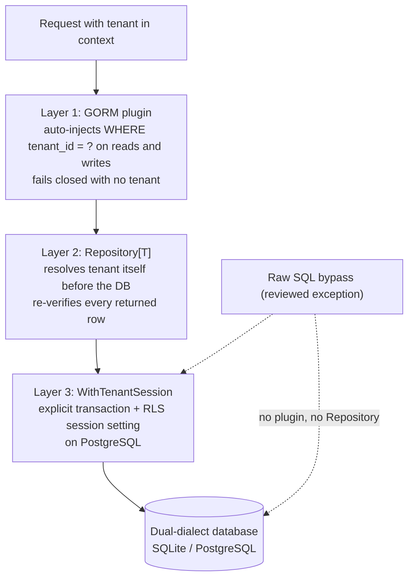

# dbkit: dual-dialect data access with isolation built in

dbkit is speed's data-access layer: the only sanctioned way to obtain a
`*gorm.DB` (`Open`), the mandatory generic `Repository[T]` base every
business module's repository embeds instead of holding a raw
connection, `MigrationRegistry` for aggregating each module's versioned
SQL migrations, and the cryptography the schema needs — field-level
AES-256-GCM encryption, HMAC blind indexes that keep an encrypted
field queryable by exact match, and HKDF key derivation so a host
manages one root secret instead of one secret per column. It sits
directly above pkgcore and implements the Go-side wiring for all three
mandatory tenant-isolation layers.

## Responsibility and boundary

dbkit enforces isolation **once a context already carries a tenant**.
Deciding which tenant that is belongs to tenancy; verifying tokens
belongs to authn. The boundaries are explicit:

- **It cannot import tenancy or observability.** The graph runs
  `pkgcore -> dbkit -> tenancy`; tenancy itself depends on dbkit for
  `Repository[T]` and `TenantScoped`, so an import running the other
  way is a cycle, and observability is unreachable for the identical
  bottom-up reason. dbkit therefore calls `pkgcore.MustTenantFromContext`
  directly and silences GORM's query logger rather than routing it
  through the structured logger.
- **`Repository[T]` is deliberately minimal**: `List` takes no filter
  or pagination — create/read-by-id/update/delete/list-all only.
  Real query shapes belong to the modules above, built on the
  plugin-protected `*gorm.DB`.
- **dbkit does no authorization.** `HardDelete`'s system-context gate
  checks presence only — who may hold a system context at all is a
  caller-side whitelist (admin, compliance, jobs, authn), enforced
  outside the package.
- **The PostgreSQL role and RLS policy that layer 3 depends on are a
  deployment-side responsibility** this package assumes but does not
  create.
- **Identity and platform data are structurally excluded** from
  `Repository[T]` — its generic constraint requires `TenantScoped`,
  which those domains must *not* implement. Such modules use the plain
  `*gorm.DB` from `Open`, which is safe rather than a loophole: the
  isolation plugin ignores any model that does not implement
  `TenantScoped`.

## Design: why three independent isolation layers

"Forgot to filter by tenant" is treated as a security defect, never a
style issue — so it is never left to one mechanism. The three layers
are independent by design; each holds even if the layers below it are
absent, misconfigured or bypassed:

1. **A GORM plugin** — installed automatically by `Open` on every
   connection, so no `*gorm.DB` can exist "unprotected" by accident.
   For any model implementing `TenantScoped` it injects
   `WHERE tenant_id = ?` on reads (both the query and the row
   callback chains, so projection shapes like
   `db.Model(&M{}).Scan(&dtos)` are covered too), forces the
   `tenant_id` column on every create — overwriting whatever the
   caller populated — and fails the statement closed with
   `ErrMissingTenantContext` when the context carries no tenant.
2. **A mandatory generic `Repository[T]`** — resolves the tenant from
   the context itself, *before* touching the database, and does not
   trust layer 1 to catch a missing tenant. It re-verifies the tenant
   on every row it hands back and fails closed identically. Its checks
   are independently complete: it enforces isolation even against a
   plugin-less connection, which is exactly how its own unit tests run
   it. Every method also routes through `WithTenantSession`, which is
   what carries layer 3.
3. **PostgreSQL row-level security** — a restricted role plus a policy
   keyed on a per-transaction session setting (`app.current_tenant`),
   enforced by the database itself, below the Go layer entirely: the
   backstop meant to hold even if layers 1 and 2 are both bypassed by
   raw SQL.

Each layer answers for a different failure. The plugin makes the
ordinary path safe by construction; the Repository makes the mandatory
path independently safe even against a bad connection; RLS makes even
deliberate bypass fail at the database. Layer 3's wiring is
`WithTenantSession`, which every `Repository[T]` method routes its
actual database call through — the explicit transaction is a real,
accepted overhead, bought so layer 3 is reachable through the one
sanctioned data-access path rather than only through code that
remembers to call it. (Its GUC-setting step is a `set_config(...)`
function call, not `SET LOCAL`: PostgreSQL's `SET` grammar rejects a
bound parameter for the value, confirmed against a live server.)

## Design: why the Repository is generic and mandatory

Business modules for tenant-owned data embed `dbkit.Repository[T]`
instead of holding a `*gorm.DB` — the core instrument of the isolation
design. Three properties make it the right instrument:

- **The tenant can never be forged.** `Create` overwrites the model's
  `TenantID` with the context's tenant regardless of what the caller
  set; a caller cannot insert a row under another tenant by populating
  the struct differently.
- **Failure is collapsed, which is itself an isolation property.**
  `FindByID`/`Update`/`Delete` return `ErrRecordNotFound` for both "no
  such id" and "that id belongs to another tenant", deliberately
  indistinguishable — surfacing the difference would be a cross-tenant
  information leak.
- **Fail-closed reads.** No tenant in context means `pkgcore.ErrNoTenant`
  before the database is touched — the shape every worker trap warns
  about: job handlers must rebuild the tenant context explicitly or the
  Repository refuses.

## Design: delete semantics are two phases, not one switch

Two genuine needs conflict: a user who deleted by accident must be able
to recover, and compliance demands deletions that are irreversibly
gone — "deleted but actually still there" does not count. One `Delete`
method carrying both meanings serves neither. dbkit therefore splits
the lifecycle:

- **Mark-delete is a per-model opt-in capability** (`SoftDeletable`:
  the model carries `DeletedAt`/`DeletedBy`). A `T` implementing it
  gets a `Delete` that is one UPDATE, hidden from ordinary reads by a
  query-only auto-scope — with every non-opted-in model's `Delete`
  byte-for-byte unchanged. `Restore` undoes exactly that mark.
- **Hard-delete is a separate, restricted entry point, not a
  parameter.** `HardDelete` is a real physical DELETE, gated on a
  system context of presence only — an ordinary tenant context is
  refused before the database is touched, while the tenant itself stays
  mandatory and binding: a system context never substitutes for a
  tenant and never widens the delete beyond the ctx tenant's rows. The
  gate's long, loud name follows the `WithSystemContext` naming
  principle — an irreversible action must not be reachable through an
  easy-to-type call.

A soft-deleted row remains a real, plaintext-present row (on SQLite —
the standalone dialect — hiding is *entirely* a Go-layer property, as
RLS does not exist there); only a hard delete makes data genuinely
gone, which is why the docs refuse to let any caller-facing text imply
soft-delete satisfies a right-to-erasure request.

## Design: encryption is a data-layer facility, with blind indexes

Encryption must be in place before the first sensitive record lands —
it is a data-layer capability, not a compliance-module attachment.
Fields tagged with a GORM serializer are sealed with AES-256-GCM under
a 32-byte key (fresh random nonce per call, rotation via retired keys).
But encrypted fields cannot be queried, and phone numbers and emails
*are* login identifiers: the answer is a blind index — a separate,
plain, indexed column holding `HMAC-SHA256(key, normalize(value))`.
Equality-only by construction: a deterministic index supports exact
matches and nothing else, because prefix or fuzzy search would leak
the structure the encryption exists to hide. The two sides of a lookup are
bound together in one `BlindIndexer` (column, key, normalizer), so
write and query can never drift apart in canonical form; the built-in
normalizers are the canonical forms the design promises (E.164 for
phones, lowercased emails). A cipher key and a blind-index key must
never be the same bytes; `DeriveKey` (HKDF, purpose-tagged) is how a
host satisfies that with one root secret instead of one per column.

## Trade-offs and the reasons behind them

- **GORM, not ent or sqlc.** ent expects a single schema graph for code
  generation, which fights independent module evolution (a downstream
  module extending `User` becomes near-impossible); sqlc needs per-
  dialect query files and cannot offer a generic `Repository[T]`. GORM
  is plain structs plus tags, embeddable downstream with no generation
  pipeline — and its callback machinery is exactly the hook that makes
  tenant-filter injection possible.
- **Dual-dialect constraints are hard rules, not preferences** —
  application-generated IDs (never `gen_random_uuid()`), `datatypes.JSON`
  (never JSONB operators), no native arrays, no `NOW()`, versioned
  Atlas-generated SQL per dialect instead of `AutoMigrate` (which is
  neither auditable nor reversible). The dialect drivers live in their
  own subpackages (`dialect/sqlite`, `dialect/postgres`), registered
  `database/sql`-style, so a consumer imports the one it needs and
  carries one driver's closure.
- **Raw SQL is a reviewed exception with a backstop.** The plugin
  cannot intercept `db.Raw`/`db.Exec` — the escape hatch exists for
  reporting and bulk queries, must bind the tenant explicitly, and the
  sanctioned pattern runs the statement inside `WithTenantSession` so
  layer 3 catches a mistake in the hand-written WHERE.
- **Errors collapse and never echo values.** `ErrDecryptionFailed`
  deliberately does not distinguish wrong key from tampered data; the
  capture/validation paths never echo a sensitive value into params,
  logs or responses.

## Stable surface

`Open`/`Options` (pool limits deliberately not overridable), the
`TenantScoped`/`TenantModel`/`SoftDeletable`/`Auditable` marker
contracts, `Repository[T]`'s semantics (fail-closed, collapsed
not-found, capability-branching `Delete`, `Restore`, gated
`HardDelete`), `WithTenantSession`, `MigrationRegistry`, the
`Cipher`/`BlindIndexer`/`DeriveKey` contracts, the error-code family
(`dbkit.*`), and the field-name conventions (`ID`/`TenantID` exported
string fields) every model must honour.

## Source

- Module discipline: [go/dbkit/AGENTS.md](https://github.com/vislake/speed/blob/main/go/dbkit/AGENTS.md)

## Related pages

- [Design principles](/docs/developer-docs/design-principles/) — the isolation rules this page's design enforces
- Core group: [pkgcore](/docs/developer-docs/modules/core/pkgcore/), [tenancy](/docs/developer-docs/modules/core/tenancy/), [config](/docs/developer-docs/modules/core/config/), [jobs](/docs/developer-docs/modules/core/jobs/)
- How to use it: [dbkit in the user guide](/docs/user-guide/modules/core/dbkit/)
