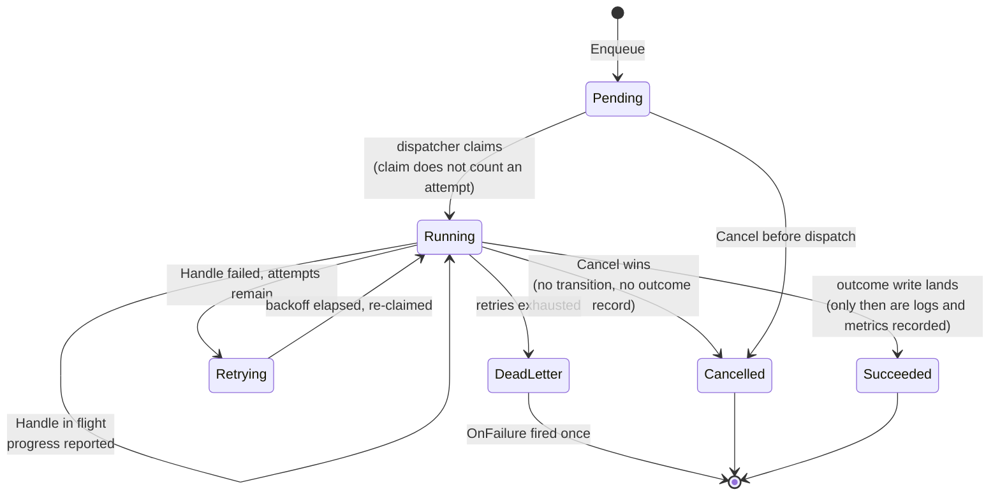

# jobs: one async-work contract, two deployment shapes

jobs is speed's asynchronous task queue: the `Queue`/`Task`/`Job`/
`Handler` contract every deployment mode implements, with two
implementations — `StandaloneQueue`, the standalone mode's in-process
worker pool backed by a SQLite-persisted task table, and
`queue/asynq`'s `Queue`, the distributed mode's Redis-backed
implementation. Every module that must run something asynchronously —
storage derivative generation, notification delivery, billing
invoices, AI generation jobs, webhook delivery — sits on this
contract. The single most important design fact is that a `Handler`
never knows which implementation it runs under.

## Responsibility and boundary

- **No business logic, and no business compensation.** The queue's
  entire involvement in failure compensation is the `FailureHook`
  surface: a handler that needs to refund credits once a job exhausts
  its retries implements `OnFailure`. Neither implementation
  special-cases a task type or knows what "refund credits" means.
- **The queue never decides retry policy shapes beyond the contract** —
  `MaxRetries`, timeout, delay and priority are per-enqueue options;
  backoff arithmetic on the standalone side and asynq's own formula on
  the distributed side both implement the same documented retry
  semantics.
- **`jobRecord` is platform data, never `TenantScoped`.** The
  standalone dispatcher's claim query scans eligible jobs *across every
  tenant at once* — interleaved round-robin by tenant to enforce
  fairness and per-tenant concurrency limits — an access pattern
  `dbkit.Repository[T]` cannot serve and would not compile against.
  The tenant is still a real, indexed column, read explicitly by the
  per-tenant gate and by `Get`/`Cancel`'s access check.
- **`StandaloneQueue` holds no `*gorm.DB` of its own making** — the
  caller passes one from `dbkit.Open`, and the module never calls
  `dbkit.Open` or imports `dbkit.Repository[T]`.
- **The queue has no declaration seat** — nothing declares into it;
  it is an ordinary component (`queue.standalone`, or the distributed
  `queue.asynq`) the composition selects like any other, which is
  exactly why the packaging decision below matters.
- **No asynqmon, no requeue-from-dead-letter API** — recorded
  limitations, not silent gaps.

## Design: why the tenant context is rebuilt inside every worker

This is the trap the whole package is built around: an `Enqueue` call
and the eventual `Handle` call run on completely different contexts,
potentially minutes or hours apart — the enqueue-time
`context.Context` was never persisted, because a context cannot be. A
worker that naively used its own ambient context would execute tenant
business under the wrong — or no — tenant, and any `dbkit.Repository[T]`
call inside the handler would fail closed. The design closes it by
construction rather than by convention:

- **`Task` carries its own `TenantID` field, required non-empty.**
  Unlike an HTTP handler, `Enqueue` is legitimately called from places
  with no single ambient tenant — a platform-level scheduler enqueuing
  one cleanup task per tenant in a loop. The same reasoning shaped
  `pkgcore.Event.TenantID`.
- **One place attaches the tenant per implementation.** On the
  standalone side, `jobContext(tenant)` builds the handler's context
  over `context.Background()` — deliberately *not* derived from the
  dispatcher's lifecycle, so closing the queue never cancels an
  in-flight `Handle`. On the distributed side, the tenant rides in
  asynq's `Task.Headers` (never in the payload, which must stay the
  caller's own opaque bytes) and `processTask` rebuilds it onto the
  per-attempt context asynq itself constructs — which is what makes
  asynq's own timeout enforcement and cancellation reach the real
  `Handle` call.
- **The proof is non-tautological**: both implementations are tested
  end to end with a task enqueued from a context carrying no tenant at
  all, executed by a handler doing a real repository call — a passing
  test can only be explained by the worker's own rebuild.

## Design: two implementations, one contract — and why the Redis one is a subpackage

Both implementations satisfy the same frozen shape — `Queue`
(`Enqueue`/`Get`/`Cancel`), `Task`, `Job`, `Handler`, the
`EnqueueOption`s and their defaults are shared verbatim. The extra
methods a host needs (`RegisterHandler`, `Start`, `Close`,
`DeadLetterJobs`) live outside the portable interface, on each
concrete type. Where the two modes genuinely differ, the difference is
honest and documented rather than papered over: `StandaloneQueue`'s
SQLite rows are kept forever, while a distributed job's visibility is
bounded by asynq's retention windows; `Cancel` does not preempt an
in-flight handler on the standalone side but best-effort interrupts on
the distributed side; priorities are a continuous ordering on the
standalone side and a three-queue collapse on the distributed side;
and the `FailureHook` fires after dead-letter persistence on the
standalone side and before asynq's archival write on the distributed
side — the hook call itself is the one and only "failed for good"
signal on both.

The packaging is the load-bearing half of "one contract": `asynq.Queue`
lives in its own `queue/asynq` subpackage because Go resolves
dependencies per package — had it sat in the root package, *every*
consumer, including one that only ever runs the standalone mode, would
carry asynq, go-redis and their transitive closures in its own
go.mod. The split is measured, not asserted: the `StandaloneQueue`-
only consumer's go.mod loses asynq, robfig/cron, spf13/cast and
x/time entirely. A backend implementation never shares a package with
the interface it implements — and the depguard rules exempt only the
subpackage, so a business file reaching for the SDK fails lint.

The distributed half follows a configure-don't-reimplement rule
throughout: asynq's own retry/archive machinery, backoff formula,
timeout enforcement and `ResultWriter` progress channel are used as
they are; what needed a thin layer was mapped consciously. The layer
exists exactly where asynq's native mechanisms cannot express the
contract: the tenant header, the per-tenant concurrency gate (asynq
has no per-key concurrency semantics — a fast bounce with
`IsFailure` reporting false, so a throttled job never burns retry
budget), the idempotency claim key (asynq's own TaskID dedupe is
scoped per queue, so two same-key enqueues at different priorities
would create two jobs), the cancellation marker (`DeleteTask` would
destroy `Get()`'s visibility contract — a marker plus a pre-dispatch
check that fails closed on an unreadable marker instead), and the
mandatory `Retention` on every enqueue (without it asynq deletes a
succeeded task's record instantly and `Get()` breaks).

On the standalone side the lifecycle is two-phase on purpose: claiming
flips the row to `running` at dispatch time, but an attempt is only
*counted* at the worker handoff — a claimed-but-not-started job
reports honestly through `Get()`, and a crash in the claim-to-handoff
window never consumes an attempt that never ran. A single-writer gate
(`queue_writers` registration with a heartbeating stale moment) is
what makes crash recovery safe: only after the gate proves no live
writer remains does `Start` reset interrupted `running` rows back to
`pending`, so two writers can never double-execute a mid-handle row.
Outcome writes carry the owner token in their WHERE clause, and every
outcome's log line and metric fires only after the conditional write
reports a genuine transition — one truthful record per attempt.

## Trade-offs and the reasons behind them

- **SQLite in-process vs asynq on Redis, never a mode branch** — the
  host chooses its implementation at construction; business code holds
  neither. The in-process form doubles as the test double for the
  contract suite (`queuetest.AssertConforms` runs against both).
- **Mature library over a hand-built Redis queue** — asynq ships
  retry, delay, scheduling and archive machinery not worth
  reimplementing; the cost (its per-queue dedupe scope, its
  no-per-key-concurrency, its record lifetimes) is paid in the thin
  documented layer above rather than in queue machinery.
- **Per-tenant fairness is two mechanisms** — candidate selection
  interleaves round-robin across tenants (a flooding tenant can never
  fill the whole claim window), and the concurrency gate admits
  per-tenant; each closes a gap the other cannot. The distributed side
  needs only the second, since asynq's own dequeue has no batch to
  interleave.
- **Failure hooks fire, never the queue's own compensation** — the
  boundary is enforced by the hook simply having no more surface.

## Stable surface

The portable contract — `Queue`, `Task` (own `TenantID`,
idempotency-key semantics), `Job`, `Handler`/`FailureHook`,
`EnqueueOption`s and defaults (`DefaultMaxRetries`, `DefaultTimeout`)
— is identical across both implementations, and the error family
(`jobs.job_not_found`, `jobs.invalid_task`, `jobs.duplicate_handler_type`,
`jobs.handler_not_registered`, `jobs.queue_writer_active`) is shared.
Each implementation's construction options and lifecycle
(`Start`/`Close` semantics, the fail-closed cancellation rules) are
part of its own stable surface.

## Source

- Module discipline: [go/jobs/AGENTS.md](https://github.com/vislake/speed/blob/main/go/jobs/AGENTS.md)

## Related pages

- [Architecture](/docs/developer-docs/architecture/) and [Design principles](/docs/developer-docs/design-principles/) — the packaging and async-work discipline this page realises
- Core group: [pkgcore](/docs/developer-docs/modules/core/pkgcore/), [dbkit](/docs/developer-docs/modules/core/dbkit/), [tenancy](/docs/developer-docs/modules/core/tenancy/)
- How to use it: [jobs in the user guide](/docs/user-guide/modules/core/jobs/)
