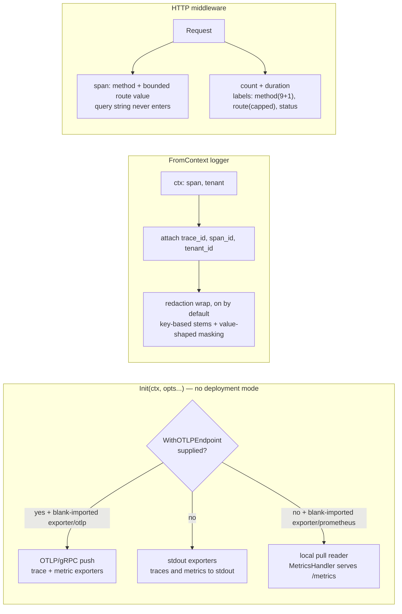

# observability: telemetry wiring, context logging, bounded metrics

observability is the foundational layer for all three observability
signals: `Init`, which wires OpenTelemetry `TracerProvider` and
`MeterProvider` and installs them as the process globals every module's
own `otel.Tracer`/`otel.Meter` calls reach; `FromContext`, the
context-aware structured logger; and the HTTP `Middleware` that opens a
request span and records request-count/duration metrics. It supplies
the wiring, not the content: the must-instrument metrics of each domain
(queue depth, outbox lag, delivery rates) belong to the modules that
own those domains, and each has instrumented its own row.

## Responsibility and boundary

- **It owns no domain metrics.** The per-domain instrumentation table
  of the design document is each owning module's obligation; this
  package never speculatively builds their instrumentation for them.
- **`Init` takes no deployment mode.** Exporter choice is decided by
  one option alone — whether `WithOTLPEndpoint` was supplied — because
  exporter selection is an implementation-composition question, never a
  mode question: a single-process assembly pointing at a real collector
  uses the OTLP exporters no less than a multi-replica deployment does.
- **The log message is never scanned, and API responses are a separate
  mechanism.** Redaction's boundary is the attribute level — and the
  plaintext-PII and full-prompt classes are recorded as class-level
  gaps, because their name space grows with business code and no value
  shape separates them from ordinary identifiers; the caller declares
  what is sensitive in those classes.
- **The root package stays free of the exporter SDKs.** Both exporter
  families live in own subpackages, blank-imported for their `init`
  side effect — the `database/sql` driver pattern applied with a single
  registration slot per module, since this package ships exactly one
  implementation of each. A logger-only consumer never inherits the
  gRPC/protobuf or Prometheus dependency trees, and the depguard rules
  exempt only the owning subpackages, so an edit importing either SDK
  back into the root fails lint immediately.

## Design: why logging is context-derived and redaction is unconditional

Logs are for machines, not stories: a concatenated sentence can be
neither filtered nor aggregated nor joined to its trace. `FromContext`
is therefore the only sanctioned way to obtain a logger inside
request- or job-scoped code — the logger comes from the context, never
a fresh one built in a request path — and it attaches `trace_id` +
`span_id` from the active span and `tenant_id` from the context, each
independently optional, so one log line carries the whole correlation
chain. The message is a constant string; everything variable goes into
snake_case attributes shared across the stack.

Redaction wraps every logger `FromContext` returns, **on by default
with no per-call way to disable it** — the layer sits between the
caller and whatever sink a host plugs in. Two rules operate at the
attribute level. Key-based: an attribute whose key contains a
sensitive stem (`token`, `secret`, `password`, `authorization`,
`credential`, `key`, …) loses its whole value — over-redaction costs
noise, under-redaction costs a breach, so the stems deliberately err
wide, with word-boundary rules keeping legitimate diagnostics like
`prompt_tokens` and correlation fields like `key_id` (never redacted)
readable. Value-shaped: strings are scanned for credential shapes —
`Bearer`/`Basic` headers, JWTs, provider-prefixed keys, URL query
secrets — and matching regions are masked in place, so an error like
`provider auth failed ... with Bearer [REDACTED]` stays readable. The
log *message* is never scanned and non-error struct values are never
introspected: the layer is the backstop for the credential classes,
with its limits recorded rather than papered over.

The span channel is kept clean *by construction* rather than by a
second redaction pass: the query string — where credentials ride —
never becomes a span name or attribute, and the span's route attribute
and name carry the metric side's bounded route value, never the raw
path whose segments carry tenant and resource ids into the tracing
backend. Invalid UTF-8 bytes — which net/http accepts and which would
fail the proto3 marshal of a whole OTLP export batch — are replaced
before any label or attribute is formed.

## Design: every metric label an attacker can reach is bounded

The hard rule is `tenant_id` never becomes a metric label — thousands
of tenants means millions of time series, the classic Prometheus
outage; tenant dimensions belong in span attributes and log fields,
which tolerate high cardinality. But two of the *other* three labels on
the request metrics are fed by inputs an unauthenticated caller
controls verbatim, so each is bounded against the same failure mode
before it can feed an instrument:

- **The route label** is derived from `URL.Path` (the mux's own
  `Pattern` is invisible at this layer — and pre-auth 404s and 403s
  reach it anyway), so a limiter tracks at most `MaxRouteLabelValues`
  distinct values, truncates each to `MaxRouteLabelLength` bytes on a
  UTF-8 boundary, sanitizes invalid bytes, and folds the overflow into
  one fixed sentinel. Hosts seed the limiter at assembly time with
  their real route table (`RegisterMountedRoutes`), so startup garbage
  cannot collapse genuine routes into the overflow bucket before they
  are ever requested.
- **The method label** is collapsed through a pure set-match onto the
  nine standard HTTP methods plus one fixed overflow value — no
  retention of the attacker's token at all, so this dimension is
  bounded with constant memory.

The bounded route value is also the disclosure bound on the span: a
trace is still an exit of the data-protection rule, so the span's route
attribute and name share the metric side's bounded value. The
middleware is mounted *outside* `tenancy.Middleware` per the fixed
chain order, which is why the tenant is not yet known at its layer —
`AnnotateTenant` exists as a separate function handlers call once a
tenant is resolved, because a span, unlike a plain context value,
survives the chain's context fork.

## Trade-offs and the reasons behind them

- **Exporter subpackages over a mode argument** — `Init`'s signature
  takes no deployment mode, so a wrong composition cannot even be
  expressed; whether telemetry leaves the process is decided by
  options, and an unblank-imported exporter fails with an error naming
  the import (or a 404 naming it on `/metrics`), the accepted
  `database/sql`-style cost.
- **Redaction without opt-out** — a per-call disable switch would be a
  foot-gun the security rule exists to remove; the cost (a benign
  field whose key merely contains a stem loses its value) is accepted
  noise, not a defect.
- **Global providers over threaded-through ones** — OTel's global
  `SetTracerProvider`/`SetMeterProvider` is what lets every module
  instrument with bare `otel.Meter` calls and keeps the logger's span
  lookup context-free; `Init` remains repeatable, tearing down the
  previous provider pair so a re-init cannot leak exporters.
- **Seeding the route limiter from the host's route table** — a
  circuit breaker, not a precision fix: folding is at mount-prefix
  granularity, so distinct templates under one mount share one label.
  That is the accepted cost of bounding cardinality without a real
  route-capture mechanism.

## Stable surface

`Init` + `Config`/`Option`s, `MetricsHandler`, the two registration
slots (`RegisterOTLPExporters`, `RegisterLocalMetricsReader`), the
`FromContext`/`WithLogger` logger contract and its redaction
behaviour, `Middleware`/`AnnotateTenant`/`RegisterMountedRoutes` and
the exported bounds (`MaxRouteLabelValues`, `MaxRouteLabelLength`,
the overflow sentinels), the shared snake_case attribute keys, and the
never-a-metric-label rule for `tenant_id`.

## Source

- Module discipline: [go/observability/AGENTS.md](https://github.com/vislake/speed/blob/main/go/observability/AGENTS.md)

## Related pages

- [Design principles](/docs/developer-docs/design-principles/) — the logging and security rules this page's design enforces
- Core group: [pkgcore](/docs/developer-docs/modules/core/pkgcore/), [jobs](/docs/developer-docs/modules/core/jobs/)
- How to use it: [observability in the user guide](/docs/user-guide/modules/core/observability/)
