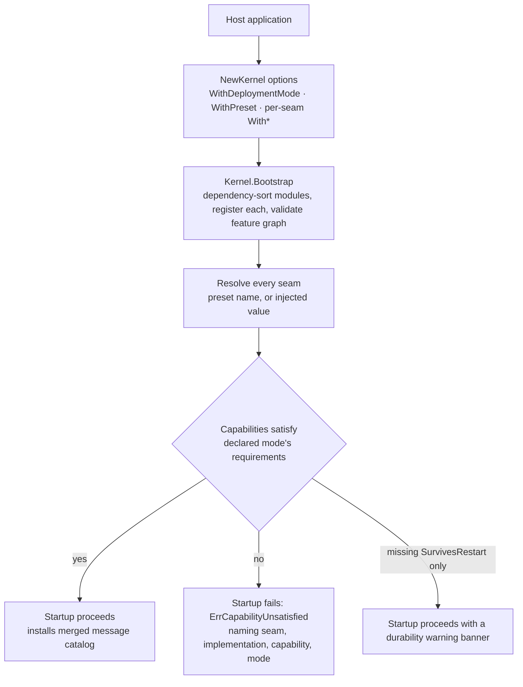

# pkgcore: the assembly contract and the dependency floor

pkgcore is the module every other Go module imports and no other speed
module is imported by. It owns seven concerns and nothing else: the
`Module`/`Registry`/`Kernel` wiring contract, the tenant-context
primitives, the infrastructure seam interfaces (`KVStore`, `EventBus`,
`Mailer`, `ObjectStore`) with each one's in-process or stdlib-backed
implementation, the capability/registry/preset machinery `Bootstrap`
resolves and validates seams through, the merged message catalog, the
`DeploymentMode` enumeration, and the per-seam conformance suites.
Three subpackages (`apperr`, `config`, `i18n`) and a family of
implementation subpackages (the Redis-, PostgreSQL-, NATS-, S3- and
Memcached-backed ones) carry the rest.

## Responsibility and boundary

The floor defines contracts and resolves infrastructure; it implements
no business behaviour. The boundary list is explicit:

- **No database access** (dbkit), **no tenant enforcement in SQL**
  (tenancy), **no logging/tracing** (observability), **no runtime
  configuration** (the config *module*), **no job execution** (jobs).
  The module declares; the kernel decides when anything runs.
- **No import of any other speed module** — dbkit included, and
  observability too, however tempting for structured logging; the
  floor cannot depend on anything above it. That is why
  `Module.Migrations` returns a plain `embed.FS` rather than a dbkit
  type, and why pkgcore's own log calls use `log/slog` directly.
- **No third-party dependency in the root package.** Everything a
  subpackage needs (go-redis, pgx, nats.go, minio-go, gomemcache)
  lives behind that subpackage's own constructor, and no SDK type ever
  crosses a seam interface.
- **One shared transport seam deliberately has no kernel seat**: the
  `SMSSender` seam is injected by each consuming module's own option,
  never kernel-resolved, because no consumer takes its SMS transport
  from the kernel.
- **Out of the seam contract's reach**: presigned URLs, object
  metadata, EXIF stripping, MIME sniffing and retention all belong to
  `go/storage`, the contract's first real consumer — the seam
  deliberately ends at raw bytes, because presigning is a capability
  only the S3-backed store could satisfy and the interface is designed
  against the weaker side.

## Design: why the wiring contract is one `Register` call

Every module implements one `Module` interface (`Name`, `DependsOn`,
`Migrations`, `Locales`, `OpenAPISpec`, `Register`) and contributes
everything it owns — routes, config schema, feature flags,
permissions, job handlers, notification types, events, audit actions —
through that single `Register(reg *Registry)` call. The `Registry`
aggregates one registration seat per mechanism.

**Why one method instead of eight?** Under lockstep versioning,
changing the `Module` interface is a breaking change that breaks every
module at once; a new cross-cutting mechanism becomes a new field on
`Registry`, and existing modules neither change nor recompile. The
same reasoning keeps module assets (migrations, locales, the OpenAPI
fragment) embedded with the module's own code, so version and assets
cannot drift apart.

Registration is declarative, and the declarations pay dividends
elsewhere: permission lists feed the admin console's role surface,
config and feature schemas feed generated configuration reference,
notification types feed the recipient-facing preference matrix. The
`Register`-time rules follow from the shape: no I/O during `Register`
(it declares; the kernel decides when anything runs), no dependence on
registration order (`DependsOn` declares, `Bootstrap` sorts and
reports cycles), no swallowed registrar error (a duplicate key is a
bug across modules, not a merge).

## Design: deployment mode and implementation composition

Two axes are kept rigorously orthogonal, and pkgcore is where the
distinction is enforced. **Deployment mode** declares topology — how
many replicas may run, and therefore which capabilities each seam's
implementation must have. **Implementation composition** decides which
implementation each seam actually uses. The mode never selects an
implementation; it only constrains one. The counter-example that makes
the separation load-bearing: a single-process deployment talking to
real SMTP, real S3 and a real payment gateway is the ordinary
production shape of a small install, while a distributed deployment
may hang off Mailpit and a payment sandbox.

The machinery: every implementation declares what it can do
(`MultiReplicaSafe`, `SurvivesRestart`, `Stateless` — the third added
so a stateless console mailer skips a restart-warning banner that
names no loss for it), each mode declares what it requires
(distributed requires `MultiReplicaSafe` on every shared-state seam;
standalone requires nothing), and `Kernel.Bootstrap` is the one place
that compares the two sets, per seam. A composition that cannot run in
the declared mode fails startup with `ErrCapabilityUnsatisfied`,
naming the seam, the implementation, the missing capability and the
mode — deliberately *not* a family of per-mode sentinels, because
"missing distributed implementation" stops meaning anything once N
implementations exist. A missing `SurvivesRestart` alone is a startup
banner, not a failure: the operator must know exactly which data will
not survive a restart.

The kernel is assembled from options, not a mode argument:
`NewKernel(opts...)` with `WithDeploymentMode`, `WithPreset` (swap the
whole seam→implementation map), and per-seam injectors
(`WithEventBus`, `WithKVStore`, `WithMailer`, `WithObjectStore`) that
always win over the preset, per seam. Two design consequences follow.
First, the framework ships no "production" or "test" preset — which
composition counts as production is the assembling application's
judgement, and a bare `NewKernel()` is a zero-configuration standalone
default. Second, business code never holds the mode at all, so the
"no `if mode == standalone` in business logic" rule is enforced by
there being nothing to branch on.

## Design: implementations register like `database/sql` drivers

Each infrastructure interface has N implementations, N ≥ 1 — never a
fixed two. Which implementations a binary contains is the application
assembler's decision, and the packaging follows Go's per-package
dependency resolution: each implementation lives in its own subpackage
and self-registers from its own `init()` onto the package-level
`SeamRegistry` (`kv.redis`, `eventbus.postgres`, `objectstore.s3`,
…), the in-process built-ins registering from the seam built-in files
in the root package (`kv.memory`, `eventbus.memory`, `mailer.console`,
`mailer.smtp`, `objectstore.local`). A host that wants a preset
composition naming a distributed implementation must import that
subpackage — a blank import suffices — or `Bootstrap` answers
`ErrUnknownImplementation` naming the seam and the implementation:
the accepted `database/sql`-style trade that turns a compile-time
error into a startup error whose message names the import that fixes
it.

Bundling everything is not a trade-off with any upside: running
arbitrary compositions is a property that *survives* splitting, since
an application that wants it imports every implementation and pays
exactly the same. The split merely makes that property optional
instead of forced. This is also why a new implementation is a new
subpackage, never a new module — modules are release units divided by
domain cohesion, and under lockstep each one costs a `go.work` entry,
a CI row and a version tag, none of which a subpackage requires.

Two further rules keep N implementations from diverging into N
dialects. **Interfaces are designed against the weakest registered
implementation**: `KVStore` exposes no server-side scripting, no
pipelines, no data types only Redis could satisfy — the atomic
operations it does expose (`IncrByFloat`, `IncrByFloatWithTTL`,
`CompareAndSwap`) are semantics every backend can make atomic. And
**every implementation must pass that seam's conformance suite**
(`eventbustest.AssertConforms`, `kvstoretest.AssertConforms`,
`mailertest.AssertConforms`, `objectstoretest.AssertConforms`), each
capability-gated — a declaration is a promise the suite verifies: the
factory returns two instances, so `MultiReplicaSafe` is a behavioural
claim checked between two real connections, and restart protocols
verify (or honestly refute) `SurvivesRestart` against a genuine
restart of the state-holding service. The in-process implementations
double as the test doubles — the reason most unit tests across the
platform need no containers.

## Trade-offs and the reasons behind them

- **The raw tenant-context primitives live in pkgcore, not tenancy**
  (ADR 0002). dbkit's repository must fail closed on reads using the
  tenant from context, and dbkit cannot import tenancy (tenancy depends
  on dbkit); the primitives therefore live in the one module both can
  import. tenancy adds the audited convenience wrapper on top.
- **`WithSystemContext` is long, loud and must carry a declared
  purpose and an actor** — an escape hatch that is visible, restricted
  and attributable, because an invisible one would be a hole. pkgcore
  itself bypasses nothing: the marker suppresses nothing by itself, and
  the layers that own filtering decide what a system reason changes.
- **No third-party dependency in the root package, measured, not
  asserted** — each addition's cost to a bare consumer is measured by
  the codebase's prescribed method, because the cost compounds upward
  through the dependency graph.
- **Errors are codes, never text** (`apperr`): machine-readable,
  stable, resolved by the client through its own catalog; params are
  declared known-safe scalars, with a separate `WithSensitiveParam`
  channel for server-side-only diagnostics.

## Stable surface

The frozen contracts consumers build against: the `Module` interface
and the `Registry` seats; the kernel option surface and
`Bootstrap`/`Shutdown` semantics; the seam interfaces and their
observable semantics (TTL expiry rules, `IncrByFloat` never extending
a live key's expiry, capability bits); the built-in implementation
names on the four registries and the two presets; the tenant-context
and actor-context primitives; the `apperr` contract; the config-loader
and i18n contracts; and the module's error-code family. Changes to any
of these are breaking changes under lockstep.

## Source

- Design: [ADR 0002](https://github.com/vislake/speed/blob/main/docs/adr/0002-tenant-context-primitives-live-in-pkgcore.md)
- Module discipline: [go/pkgcore/AGENTS.md](https://github.com/vislake/speed/blob/main/go/pkgcore/AGENTS.md)

## Related pages

- [Architecture](/docs/developer-docs/architecture/) and [Design principles](/docs/developer-docs/design-principles/) — the pages this one hangs off
- The rest of the core group: [dbkit](/docs/developer-docs/modules/core/dbkit/), [tenancy](/docs/developer-docs/modules/core/tenancy/), [observability](/docs/developer-docs/modules/core/observability/), [config](/docs/developer-docs/modules/core/config/), [jobs](/docs/developer-docs/modules/core/jobs/), [ratelimit](/docs/developer-docs/modules/core/ratelimit/)
- How to use it: [pkgcore in the user guide](/docs/user-guide/modules/core/pkgcore/)
