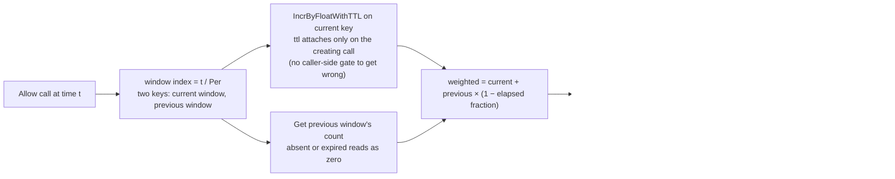

# ratelimit: one dimension per call, backed by the KVStore

ratelimit is speed's shared rate-limiting primitive: a `Limiter` that
decides whether one more hit against a caller-supplied `key` is within
a caller-supplied `Limit`, backed entirely by `pkgcore.KVStore`. Six
otherwise-unrelated business modules independently need rate limiting —
authn's brute-force guard, integration's three-layer API-key
throttling, notification's verification budgets, org's invitation
limits, ai-gateway's per-tenant request frequency, sharing's public
link guard — and re-implementing the same counter six times, slightly
differently each time, is worse than building it once against the one
interface every deployment mode already provides.

## Responsibility and boundary

This is a **pure library**, unlike every other module in the
repository: it implements no `the module contract`, registers no routes, no
config schema, no feature flags, no permissions. There is nothing to
wire into a kernel; a consumer just calls `ratelimit.New`. The
deliberate boundaries follow from "no business semantics", stated
concretely:

- **It does not know what a tenant is.** A caller that wants
  per-tenant limiting builds the tenant into the key itself before
  calling `Allow`; the package never reads `TenantFromContext` or
  anything tenancy-shaped.
- **It does not know what HTTP is.** `Decision` is plain data;
  translating a denial into a 429 with `Retry-After` and quota headers
  is entirely the caller's job — which is also what makes the limiter
  usable outside HTTP (throttling a background dispatcher, say).
- **It does not know what an account, IP, email or API key means.**
  Every one of those is a key string a consumer chose; combining
  several dimensions is composition the *caller* does by calling
  `Allow` once per dimension. There is no multi-key or
  escalation-aware variant, deliberately.
- **It has no dynamic configuration.** `Limit` values are supplied by
  each call site in code — the same reason it implements no module
  contract: it is a library, not a kernel-assembled component.
- **It decides neither fail-open nor fail-closed.** `Allow` returns
  KVStore failures unmodified so each call site makes its own choice
  — a login guard and a cost-limiter may legitimately differ.
- **It keeps no integration-test tier of its own.** A real distributed
  KVStore backend's correctness is that backend's own test
  responsibility; this package's only contract is with the `KVStore`
  interface, which the memory store satisfies fully.

## Design: why the algorithm is a sliding-window *counter*, not a log

The algorithm is forced by `KVStore`'s own contract, not chosen from a
menu. A sliding-window *log* needs an ordered, range-queryable
structure — a sorted set — so individual request timestamps can be
trimmed and counted by range; `KVStore` deliberately offers nothing
beyond opaque byte values plus `IncrByFloat`/`IncrByFloatWithTTL`/
`CompareAndSwap`, because it is designed against the weakest backend
it must run under — an in-memory map in the standalone mode — and
cannot grow a data type only Redis could satisfy without breaking that
symmetry. A counter-per-window needs only "increment" plus "an expiry
that delimits the window":

- time is partitioned into fixed windows of length `limit.Per`, each
  window owning one storage key derived from the caller's key;
- a hit increments the current window's key via `IncrByFloatWithTTL`,
  which attaches the window-delimiting expiry **only on the call that
  creates the key** — collapsing "increment" and "attach the window's
  expiry, but only on the first hit" into one atomic call. The
  two-call alternative (increment, then conditionally attach the TTL)
  carries a real, security-relevant over-admit race on every window
  boundary: a concurrent caller's increment landing in the gap between
  the calls is silently overwritten. The single primitive removes both
  failure modes at once;
- the decision weighs the current window's count plus the previous
  window's count scaled by how far the instant has moved past the
  boundary — the approximation that closes the classic fixed-window
  hole, where a burst timed to straddle a boundary could get up to 2x
  the intended rate through. A boundary-straddling burst test is built
  specifically to fail under a naive fixed window and pass under this
  one;
- every call is a hit: the request that pushes the count over the
  limit is itself denied — never the request after it.

## Design: why it lives outside pkgcore, and why the shape is frozen

Rate limiting is a shared primitive only *some* consumers need; the
dependency floor every module carries should hold only what every
module needs — `KVStore`/`EventBus`/tenant context. ratelimit
therefore sits at the same graph depth as dbkit and observability,
depending on nothing beyond pkgcore, with zero third-party imports. The
shape that keeps it a primitive rather than a product:

- **One dimension per call.** Multi-dimensional limiting (authn's
  IP-plus-account guard, integration's global+tenant+key stack) is
  composition — each dimension one `Allow`, any denial denies. This is
  what stops the primitive's shape from being frozen by whichever
  consumer landed first.
- **Progressive/escalating semantics are business logic.** authn's
  "delay grows with repeated failures, up to a lockout" is built on
  the plain counts `Allow` reports; the package's job ends at "is this
  key over its window's rate, and how much budget is left".
- **`Rate: 1` is refused with a coded error.** Under the weighted
  formula plus every-call-is-a-hit, a sustained client converges to at
  most `Rate − 1` admitted per window — and at Rate 1 that is a
  permanent lockout from the second window on. The natural spelling of
  "once per day" cannot be honoured literally, so it is refused before
  the store is ever touched, in the safe direction, rather than
  delivered as a lockout that appears a day after first use.
- **The whole seam is one interface and one decision.** `Limiter` has
  exactly `Allow(ctx, key, limit)`; every call records a hit; there is
  no "check without recording" mode. `Decision.Remaining` is a
  weighted approximation, documented as not an exact countdown, and
  the one shared conversion (`RetryAfterSeconds`, rounding up so a
  sub-second remainder never reads as "retry immediately") lives here
  so its boundary behaviour has one tested home.

## Trade-offs and the reasons behind them

- **Six consumers share one counter instead of six copies** — the 
  module exists because the alternative (six slightly different
  sliding-window counters, each with its own window/TTL race) is
  strictly worse than one built against the one interface every
  deployment mode already provides.
- **Approximation over exactness** — the sliding-window counter is an
  approximation of a sliding-window log, bought because `KVStore`'s
  weakest-backend contract cannot express an ordered log; the boundary
  burst that a fixed window would admit is the accepted precision loss
  the weighting recovers.
- **Caller-keyed dimensions over built-in ones** — the caller composes
  keys and dimensions, so the primitive never needs to know about
  tenants, accounts or protocols; the price is that a careless key (a
  plaintext address) lands verbatim in the store — which is why the
  documented consumers key by blind indexes, never plaintext
  identifiers.
- **No module contract, no config schema** — tunable thresholds would
  need schema, an admin surface and the kernel; per-call-site code
  values keep the library dependency-free and the decision where the
  caller can see it.

## Stable surface

`Limiter`/`Limit`/`Decision`/`New`, the every-call-is-a-hit and
weighted-count semantics, `RetryAfterSeconds`, and the two error
sentinels (`ErrInvalidLimit`, with `ErrRateOneUnsupported` wrapping
it) — plus the rule that KVStore failures pass through unmodified for
the caller to classify.

## Source

- Module discipline: [go/ratelimit/AGENTS.md](https://github.com/vislake/speed/blob/main/go/ratelimit/AGENTS.md)

## Related pages

- [Design principles](/docs/developer-docs/design-principles/) — the weakest-implementation and packaging rules this page's design follows
- Core group: [pkgcore](/docs/developer-docs/modules/core/pkgcore/), [jobs](/docs/developer-docs/modules/core/jobs/)
- How to use it: [ratelimit in the user guide](/docs/user-guide/modules/core/ratelimit/)
