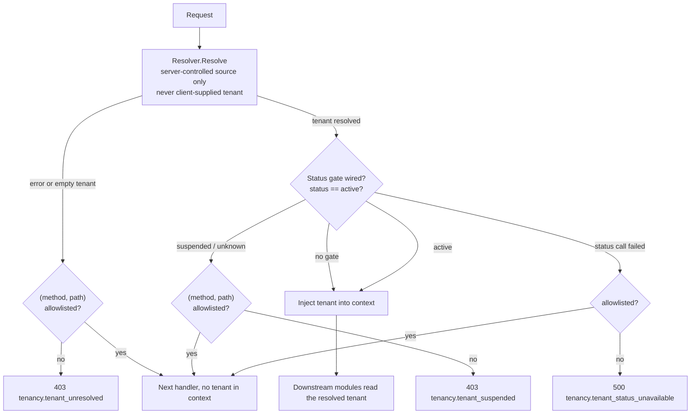

# tenancy: deciding whose tenant a request carries

Where dbkit enforces isolation once a context already carries a
tenant, tenancy decides **which tenant that context carries in the
first place**: the net/http middleware every HTTP entry point runs
behind, plus the audited way for business code to step outside tenant
filtering when one of a small, legitimate set of reasons applies, plus
the isolation assertion suites every other module's repositories must
run. It sits directly above dbkit and depends on it for exactly one
reason: the `tenancytest` subpackage, whose assertions are generic over
dbkit's own types and must live where the dependency direction allows —
above dbkit, never the reverse.

## Responsibility and boundary

- **No `JWTResolver` here, and no token verification anywhere in the
  module.** Verifying a signature, managing signing keys and reading a
  tenant out of claims is authn's job — authn depends on tenancy, not
  the reverse, and an authenticated resolver living here would force
  exactly the import cycle the graph is built to avoid. authn supplies
  its own `Resolver` implementation; nothing in this package changes
  for that.
- **No tenant-filtering machinery.** The GORM plugin and
  `Repository[T]` live entirely in dbkit and are already wired by
  `Open` before tenancy ever enters the picture; tenancy neither
  installs nor wraps them.
- **No authorization.** `DomainResolver` grants no data access — it
  decides what a login page displays before anyone has proven who they
  are.
- **No RLS provisioning** — the deployment-side responsibility both
  packages share the assumption of.
- **The root package imports only pkgcore.** `resolver.go`,
  `middleware.go` and `system_context.go` never touch a database; only
  `tenancytest` imports dbkit and gorm.

## Design: the resolver contract and why the middleware fails closed

`Middleware(resolver, opts...)` consults a `Resolver` exactly once per
request and trusts it completely. The contract every implementation
must uphold is stated as a hard rule, not a description: **the tenant
comes from a source the server itself controls** — a verified token's
claims, a database lookup — never from a header, query parameter or
body the client attached to the request being resolved. There is no
option on `Middleware` that reads a client-supplied tenant hint,
because accepting one is the single most common way multi-tenant
systems suffer a horizontal-privilege breach. The tenant that resolves
is injected into the request context with `pkgcore.WithTenant`; every
module downstream inherits the protection.

The middleware's shape is fail-closed: a request whose tenant cannot be
resolved is refused with `ErrTenantUnresolved` (403) **unless** its
(method, path) pair is allowlisted — in which case the next handler
still runs, but with *no tenant in its context*, so nothing downstream
mistakes it for a resolved tenant. Allowlisting is an exact string
comparison against both method and path: no prefixes, no wildcards, no
GET-implies-HEAD — each (method, path) pair needing an exemption gets
its own. Two further fail-closed details are load-bearing: a resolver
that reports success with an *empty* tenant is treated exactly like a
resolution failure (a custom resolver must not use `("", nil)` as a
way to signal "no tenant needed"), and the resolver's own error never
enters the response body, since an authenticated resolver's internals
may carry detail.

The optional tenant-status gate follows the same discipline: wired via
`WithTenantStatusResolver`, a resolved tenant whose status is anything
other than `TenantStatusActive` is refused with `ErrTenantSuspended`,
and a `Status` call that errors refuses closed with
`ErrTenantStatusUnavailable` — an unreachable status source is an
outage to fix, never "no news is good news". Off by default and
entirely additive: an unwired host's middleware behaves byte for byte
as before. The gate consults nothing cached, so a suspension takes
effect on the very next non-allowlisted request.

## Design: the escape hatch is audited before it is granted

Platform operations legitimately work without a tenant context —
admin searches across tenants, scheduled sweeps, registration flows —
and without an escape hatch those modules could not exist. The design
principle is to let the hatch exist but make it loud, restricted and
traceable, so developers never fall back to the bare `*gorm.DB`
(which is what would truly lose control).

The raw primitive (`pkgcore.WithSystemContext`) lives in pkgcore
because dbkit, below tenancy, needs it — ADR 0002's cycle-breaking
decision, detailed on the [pkgcore page](/docs/developer-docs/modules/core/pkgcore/).
What tenancy adds on top is the accountability half: `tenancy.WithSystemContext`
calls the primitive and **publishes an audit event before returning
the elevated context**, and if that publish fails, the caller receives
the original, unelevated context and an error — an escape hatch granted
with no audit record is exactly the gap this wrapper exists to close.
Three constraints make the hatch meaningful:

- **Every grant carries a declared purpose and an actor.** `Purpose`
  is a required enumeration registered by the calling module
  (`RegisterSystemPurpose`), never free text, so "just anything" cannot
  be invented at the call site.
- **The whitelist is who may hold it.** Cross-tenant widening stays
  restricted to admin, compliance, jobs and authn, enforced by review
  and by the doc comments on the functions themselves — the two
  functions' own documentation is the enforcement point, deliberately
  not a depguard rule, since pkgcore's root package carries legitimate
  importers (dbkit among them) that must stay allowed.
- **A system context widens nothing by itself.** `Repository[T]`
  consults it in exactly one place, as a refusal gate (`HardDelete`),
  never as an amplifier; granting one on a tenant-scoped context does
  not widen reads, and granting one on a bare context does not
  substitute for a tenant — repositories still fail closed. Bypassing
  tenant filtering is not bypassing authorization; the layers that own
  filtering decide what a system reason changes.

The same audited entry is how platform-scope write gates are exercised
(config's system tier, ai-gateway's platform credentials), and it must
never be injected from HTTP middleware — only inside the specific
handler or task, in the smallest possible scope.

## Design: the isolation suites assert both directions

`tenancytest.AssertIsolated` creates two tenants' worth of data
through the caller's own factory and asserts the full contract: list
scoped to the calling tenant, cross-tenant reads, updates and deletes
denied without corrupting the real row or creating phantom rows,
`Create` overwriting a forged tenant id, and no-tenant contexts
failing closed. `AssertNotTenantScoped` asserts the *reverse* — that
identity and platform tables are genuinely not affected by the
tenant-scoping plugin, exercising them under no tenant and two
arbitrary tenants and proving visibility tracks nothing tenant-shaped.
The reverse assertion exists because the failure it catches is
expensive: a globally visible table that got wrongly filtered shows up
in production as data that mysteriously stops appearing, and is far
harder to trace than an isolation leak. Which suite a repository runs
is decided by the data-domain table — tenant and link data run
`AssertIsolated`, identity and platform data run
`AssertNotTenantScoped` — and the isolation-coverage checker in CI
enforces that every tenant-data repository has its suite.

## Trade-offs and the reasons behind them

- **Resolution returns a tenant, never a context** — the `Resolver`
  signature is `Resolve(r) (TenantID, error)`. That narrow shape is
  what makes the middleware order non-negotiable: `authn.Middleware`
  must run first, because a tenant resolver has nothing to read before
  a token is verified.
- **`DomainResolver` falls back to a default tenant, never errors** —
  a deliberate, narrowly documented exception for the unauthenticated
  case: a login page must still render something. No other resolver
  may copy that behaviour.
- **Allowlist exemptions carry no tenant** rather than the resolved
  one — an exempted pre-auth route gets exactly nothing, so a route
  that must work before a tenant is known cannot accidentally inherit
  one.
- **The audited wrapper lives here, not in pkgcore** — audit
  publication depends on machinery (the event bus, eventual consumers)
  that has no reason to live in the dependency floor.

## Stable surface

`Resolver` (and the server-controlled-source rule), `DomainResolver`,
`Middleware` + `WithAllowlist` (exact-match semantics) +
`WithTenantStatusResolver` (the closed status vocabulary), the
`ErrTenantUnresolved`/`ErrTenantSuspended`/`ErrTenantStatusUnavailable`
error family, `WithSystemContext`'s audit-before-grant contract and
the `tenancy.system_context.entered` event, and the two assertion
suites of `tenancytest`.

## Source

- Design: [docs/internal/04-data-and-tenancy.md](https://github.com/vislake/speed/blob/main/docs/internal/04-data-and-tenancy.md) (data domains, trust boundary, the escape hatch), [01-architecture.md](https://github.com/vislake/speed/blob/main/docs/internal/01-architecture.md) (graph position, middleware order), [ADR 0002](https://github.com/vislake/speed/blob/main/docs/adr/0002-tenant-context-primitives-live-in-pkgcore.md)
- Module discipline: [go/tenancy/AGENTS.md](https://github.com/vislake/speed/blob/main/go/tenancy/AGENTS.md)

## Related pages

- [Architecture](/docs/developer-docs/architecture/) and [Design principles](/docs/developer-docs/design-principles/) — the isolation discipline this module operationalises
- Core group: [pkgcore](/docs/developer-docs/modules/core/pkgcore/), [dbkit](/docs/developer-docs/modules/core/dbkit/), [config](/docs/developer-docs/modules/core/config/)
- How to use it: [tenancy in the user guide](/docs/user-guide/modules/core/tenancy/)
