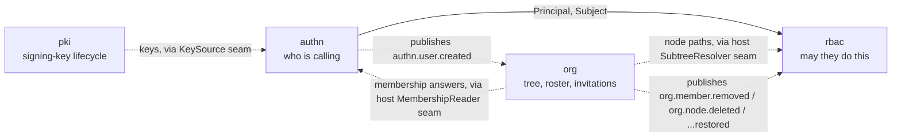

# Identity group design

Three Go modules carry the identity-and-access face of a speed-based
product, and they divide one question three ways: **who is calling**
(`authn`), **may they do this** (`rbac`), and **over which part of
the organization** (`org`). This page is the map of that division —
the relationships between the three modules and the reasons the
boundaries sit where they do. The module pages that follow tell each
design's story: `authn` first (who), then `rbac` (may they), then
`org` (the tree and roster that give grants their scope), an order
that mirrors both the module dependency graph and a request's path
through the middleware chain.

Where the [user guide's identity
pages](/docs/user-guide/modules/identity/) tell you how to wire and
use the modules, these pages tell you why each is shaped the way it
is — every claim traces to the module's own `AGENTS.md` named in
Source.

## Three modules, one question each

| Module | Answers | Owns |
|---|---|---|
| `authn` | Who is calling? | Users, sessions, refresh tokens, login history, external identities, MFA factors, recovery codes, tenant SSO configuration |
| `rbac` | May this `Subject` perform this action, over which slice of the tree? | Roles, role permissions, role bindings, the frozen permission catalog |
| `org` | What does the tenant look like, and who is in it? | The organization tree, memberships, invitations |

The split follows the data domains of the
[tenancy design](/docs/developer-docs/architecture/): a user is
**identity data** — one person belongs to several tenants, so `users`
carries no `tenant_id` and is never tenant-scoped — while the
membership that bridges a person into one tenant is **link data** and
is tenant-scoped like tenant data itself. rbac's three tables are all
tenant data or link data. Every table in the group runs the isolation
suite that matches its domain (`AssertNotTenantScoped` for authn's
identity tables, `AssertIsolated` for org's and rbac's), enforced in
CI.

## Why none of the three imports another

The group's defining property is what it does **not** depend on. No
Go import edge runs between `authn`, `rbac` and `org` — in either
direction — and the absence is the design, not an accident of
packaging. Each missing edge has its own reason, and each
collaboration that the edge would have carried crosses the boundary
through a host-injected seam instead:

- **`rbac` never imports `authn`.** Authorization knows exactly one
  thing about identity — `Subject{TenantID, UserID}` — and whoever
  authenticates a request assembles that Subject and calls in. An
  engine that knew how a user authenticated could not be reused by a
  host that authenticates differently, and could not be tested
  without standing up a login stack. This is the inverse of the
  classic way an access-control layer becomes untestable and
  unreusable.
- **`authn` never imports `org`.** Membership is asked through the
  host-injected `MembershipReader` seam, which org's roster is the
  canonical implementation of. An absent reader means **refuse, never
  allow**: the tenant a token is minted for is the most exploited
  horizontal-privilege entry point in a multi-tenant product, so the
  question is asked at every sign-in and re-asked at every refresh,
  through a seam that fails closed.
- **`org` never imports `authn`.** It learns of a new user through the
  `authn.user.created` event — known by its string name alone, its
  payload probed through a JSON round trip, never its publisher's
  type — and stores nothing but an id string. org does not even
  *declare* the event, since declaring another module's event collides
  at bootstrap the moment both modules boot in one host.
- **`rbac` and `org` have no edge either.** rbac needs a node's
  materialized path at decision time; org's `Scope` interface serves
  it, with every signature built from stdlib types only, so rbac
  declares the identical method set in its own package and accepts
  `*ScopeService` structurally. No `OrgNode` type ever crosses the
  boundary.
- **`authn` reaches `pki` the same way.** Its `KeySource` seam is
  declared here and satisfied structurally by `go/pki`'s `Service` —
  no import edge in either direction; the host wires them at assembly
  (see the authn design page's token section).

The pattern is one technique applied at every edge: a seam interface
whose signatures use only standard-library types, declared by the
consuming module, implemented by the producing one, wired by the
host — the one place two package names appear together. In the
reference app, the demo identity layer fills the same seams a real
consumer fills with the real modules, which is exactly why the seams
exist.

## Events replace imports — the choreography

Two of the three collaborations above are **event-driven**, and the
events flow strictly downward with the module graph:

1. `authn` publishes `authn.user.created` after a registration or a
   just-in-time federation provision. `org` subscribes: it idempotently
   ensures the new user's root and membership exist, so a brand-new
   account gets a workspace. The subscription is resilient — an absent
   publisher is not an error, and a redelivered event creates neither a
   second root nor a second membership.
2. `org` publishes `org.member.removed`, `org.node.deleted`, and their
   restore counterparts. `rbac` subscribes and **reaps**: a removed
   member's role bindings are withdrawn (mark-deleted, restorable),
   bindings dangling on a deleted node are revoked, and a restored
   member or node gets exactly the reaped grants back. A leftover
   authorization row for someone who can no longer enter the tenant is
   latent access, waiting for a bug elsewhere to become real — so
   cleanup belongs to the event, not to a sweep that might never run.

Each subscriber treats the event as a string name plus a
JSON-shaped payload probe. That is the module-boundary rule applied
to messaging: no struct import, no foreign event declaration, and a
four-case resilience contract (absent publisher, unrecognized
payload, no tenant, real work) that never lets one module's ignorance
look like another module's failure.

## The middleware order

The modules meet on the wire in one fixed order, pinned by the
reference app's composed-HTTP tests: `authn.Middleware` verifies a
presented token if there is one and never guesses a tenant;
`tenancy.Middleware` turns the verified principal into the tenant
context; `rbac.RequirePermission` gates the route. authn's own
routes — sign-in happens before any tenant exists — mount straight
from its middleware's output, never downstream of tenant resolution.
The [architecture page](/docs/developer-docs/architecture/) has the
chain; the [identity and access domain
page](/docs/user-guide/domains/identity-access/) walks it
operationally.

## Reading order

- [authn design](/docs/developer-docs/modules/identity/authn/) — who
  a caller is: credentials, tokens, sessions, revocation, federation,
  MFA — and why the module answers uniformly when it refuses.
- [rbac design](/docs/developer-docs/modules/identity/rbac/) —
  whether a `Subject` may act, and over which subtree: the native
  engine, the frozen catalog, the event-invalidated cache.
- [org design](/docs/developer-docs/modules/identity/org/) — the
  tree, roster and invitations that give the other two their data,
  and the storage-model choices that keep subtree queries cheap and
  dialect-identical.

## Source

- [go/authn/AGENTS.md](https://github.com/vislake/speed/blob/main/go/authn/AGENTS.md), [go/rbac/AGENTS.md](https://github.com/vislake/speed/blob/main/go/rbac/AGENTS.md), [go/org/AGENTS.md](https://github.com/vislake/speed/blob/main/go/org/AGENTS.md)
- This page (the group hub); [architecture](/docs/developer-docs/architecture/), [design principles](/docs/developer-docs/design-principles/)
- User guide: [identity modules](/docs/user-guide/modules/identity/), [identity and access domain](/docs/user-guide/domains/identity-access/)
