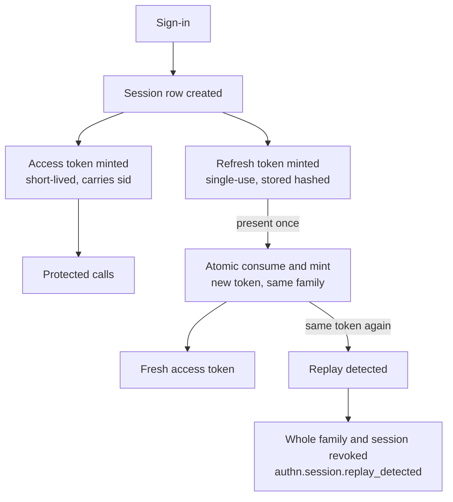

# authn

Authentication: who a caller is. Never what they may do. This page
explains the why behind the module's shape — its data-domain choices,
its token and session mechanisms, and its refusal answers — where the
[user-guide authn page](/docs/user-guide/modules/identity/authn/)
covers the how.

## Responsibility and boundary

authn owns the identity domain: accounts, credentials, sessions and
their revocation, sign-in over password, phone-plus-SMS-code, social
and enterprise channels, MFA and step-up, and tenant switching within
one session. It publishes `authn.user.created` and sends nothing
itself — `notification` and `org` react to the event. The boundary is
drawn with the same discipline on every side:

- **No roles or policy evaluation.** `Principal` deliberately carries
  no permission list — a permission inside a token would freeze for
  the token's whole lifetime. What a caller may do is rbac's
  question.
- **No memberships, no organization tree.** "Is this user an active
  member of this tenant" is asked through the host-injected
  `MembershipReader` seam (org's roster is the canonical
  implementation); an absent reader refuses rather than allows.
- **No messaging beyond verification codes** — the security rules'
  one synchronous exception. SAML, WebAuthn/passkeys and the
  QQ/Weibo/Alipay channels are absent by design: SAML would force
  its dependency on every consumer for scenarios OIDC already
  covers, and the other two await a design decision.

## Identity tables are deliberately not tenant-scoped

The module owns nine tables: eight identity-domain tables (`users`,
`sessions`, `refresh_tokens`, `login_attempts`, `user_identities`,
verification codes, MFA factors, recovery codes) plus one
tenant-domain table, `tenant_sso_configs` (an enterprise connection
is configured per tenant). Every identity table runs
`AssertNotTenantScoped`: a person belongs to several tenants, so
scoping the person to one would make the multi-tenant case
unrepresentable. Identity data therefore cannot use
`dbkit.Repository[T]` (its constraint requires `TenantScoped`), so
authn's repositories hold the documented plain-`*gorm.DB` shape with
the usual compensating rules. `sessions.current_tenant_id` looks like
an exception and is not: it records which tenant the session's tokens
are issued for, and membership is re-verified against it on every
refresh rather than trusted.

## Passwords: argon2id with self-describing hashes

Passwords are argon2id — the current OWASP preference, stronger
against GPU cracking than bcrypt. Two decisions make the choice
durable. **The PHC parameter string travels inside each stored
hash**, never a column the codebase must keep in step with the
verifier: raising the cost is a configuration change, not a
migration, and `Login` upgrades a hash on its owner's next successful
sign-in. **Cost parameters are bootstrap config; policy is dynamic
config.** Parameters depend on the machine, must be identical across
replicas, and must not be tunable from an admin console — an operator
could make sign-in uselessly cheap, or slow enough to be a
self-inflicted denial of service. Policy (minimum length, denylist)
is the opposite — dynamic, NIST-shaped: length first, never forced
symbol salad.

## Access tokens: Ed25519, keyed through a lifecycle

Access tokens are Ed25519 EdDSA-signed, short-lived, carrying
`sub`/`tid`/`sid`/`amr` — and deliberately **no email** (a bearer
credential gets copied into client storage, proxy logs and trace
attributes, where nothing this module controls can redact it) and
**no permissions** (they would freeze at issuance).

- `Signer`/`Verifier` resolve keys on every `Issue`/`Verify` call
  from a `KeySource` seam rather than holding a fixed key set.
  `WithKeySource` is the one, mandatory injection point — the deleted
  static-key `KeySet` API has no back-compat path: a fallback key
  path would be a second way to sign tokens.
- The seam is satisfied structurally by `go/pki`'s `Service`, with no
  import edge in either direction. pki owns the key-lifecycle state
  machine (`pending → active → retiring → retired`) behind it, driven
  by its own expiry scan; authn only consumes keys.

The seam exists because a long-lived signing key is a single point
of failure: leaked, it forges tokens nobody can tell apart. The
lifecycle retires keys on schedule and every replica reads the same
key rows, so rotation needs no coordinated redeploy. Verification
adds a second line of defense: the header's `alg` is checked against
the signing key's own declared algorithm, on top of the parser's
single-EdDSA allowlist.

## Sessions: stateful, because revocation is a requirement

Pure stateless JWTs cannot answer "sign this device out now". The
resolution: every login creates a `sessions` row; the access token
carries the `sid` claim and lives a short default TTL of 15 minutes;
the refresh token is long-lived, session-bound and stored hashed.
**Revoking a session = marking the row revoked**: refresh fails
immediately, outstanding access tokens live out at most one TTL.
Deployments that cannot wait out even one TTL pick immediate mode: a
revocation list in the `KVStore`, checked against `session_id` on
every verified request — one KV read per request. The mode is a
**construction-time option**, never a dynamic-config item: a value
read at request time could not retrofit enforcement onto a manager
built in the other mode.

## Refresh rotation: single-use tokens, replay = theft

Refresh tokens are single-use values stored hashed. Every refresh
consumes the presented token and mints a new one in the same family
in one atomic compare-and-swap. **Presenting a consumed token means a
second copy exists**, so the response is to revoke the whole family
and its session, publishing `authn.session.replay_detected` —
otherwise whoever stole the token stays signed in with the one they
already rotated.

Two consequences follow, stated to consumers rather than hidden:
**two concurrent refreshes with the same token are indistinguishable
from theft and are treated as one** — clients must serialise their
refreshes. And refresh re-verifies membership *between* resolving the
token and committing the rotation, never after: a transient outage
must not spend the caller's token and turn a legitimate retry into a
theft response.

## Every refusal answers the same

Sign-in is where enumeration oracles live, and the design closes them
with uniform answers: unknown account, wrong password, no password
set, suspended account, and a correct password whose account resolves
no membership all return the same `authn.invalid_credentials` with no
parameters. An unknown account still costs one argon2id derivation,
so a stopwatch cannot reopen the oracle the error message closed; the
specific reason goes on the `login_attempts` row instead. The same
discipline covers every existence-disclosing answer, binding
operations and session revocation included, and the attempts table
stores the blind index of the attempted identifier, never the
identifier.

## Rate limiting and federation: the rules that make channels safe

Login, registration, code send, code verify and step-up all sit
behind `go/ratelimit`'s sliding windows plus this module's
**progressive** layer: login failures grow an exponential delay,
saturating at a bounded maximum — the delay *is* the lockout. Every
check fails closed on a `KVStore` error.

Social and enterprise channels share one account-linking rule: an
external identity whose email already belongs to an account is
auto-linked **only when the provider asserts the address verified AND
the channel is on the trusted-provider list** — anything else is
refused and never told which condition failed, since a provider
willing to hand out accounts carrying someone else's verified address
would otherwise hand out that person's account here. Enterprise SSO
adds a third condition: the account must already be an **active
member of the tenant that configured the identity provider** — or its
administrator could allowlist a public domain and sign into any
platform account at that domain. WeChat is keyed on `unionid`, never
`openid` — app-scoped ids would split one person into two accounts
across applications. An account whose last login method is social or
SSO cannot shed that channel.

## MFA and step-up: elevation outlives exactly one token

TOTP is implemented on the standard library alone, pinned to the
official RFC 4226/6238 test vectors; enrollment issues ten recovery
codes shown exactly once. The step-up decision: a completed step-up
mints a fresh access token whose `amr`
gained the factor, but is **never written back to the session row** —
a later natural refresh mints from the session's original
authentication methods, making elevation a periodic re-proof rather
than a permanent unlock. Replacing an already-active factor requires
`principal.AMR` to already carry a completed step-up: a bare — read:
stolen — access token cannot silently seize someone's active factor
by enrolling its own.

## Trade-offs worth knowing

- **No self-built IdP, no mandatory third-party identity
  dependency.** Self-building was rejected for scope and liability;
  hard-wiring Auth0/Ory would force a paid dependency on every
  consumer and move identity out of its own tables. authn is an OIDC
  relying party, not an identity provider.
- **Replay paranoia costs client discipline.** Treating two
  concurrent refreshes as theft is what makes stolen-token detection
  automatic; refresh is therefore a client-serialised operation.
- **Second-factor-at-login is not enforced.** An account with an
  enrolled factor can still sign in on the first factor alone;
  step-up gates only sensitive operations. Full login-time MFA is a
  larger interactive design, recorded as such rather than half-built.

## The frozen surface

What a host composes against is deliberately small and stable:
`NewModule` with its options — `WithKeySource` and `WithBlindIndexKey`
mandatory (no safe default exists for either), `WithMembershipReader`
(absent means refuse), `WithSMSSender` required for a distributed
deployment — the `Principal` type (identity only, never permissions),
the service flows (`Register`/`Login`/`Refresh`/`SwitchTenant`/
`Logout`), and the spec-generated HTTP fragment: twenty operations
under `/api/v1/authn`, mounted straight from `authn.Middleware`'s
output — most operations happen before any tenant exists, and the
tenant some act inside comes from the token's own claim.

## Source

- [go/authn/AGENTS.md](https://github.com/vislake/speed/blob/main/go/authn/AGENTS.md) — Rules, decision surface and Known limitations

## Related pages

- [Identity group design](/docs/developer-docs/modules/identity/) — the group hub; [org design](/docs/developer-docs/modules/identity/org/) — the membership answers behind authn's seam; [rbac design](/docs/developer-docs/modules/identity/rbac/) — the authorization side that never imports this module
- [Architecture](/docs/developer-docs/architecture/) — the middleware order and wiring contract
- User guide: [authn module](/docs/user-guide/modules/identity/authn/), [identity and access domain](/docs/user-guide/domains/identity-access/), [identity modules](/docs/user-guide/modules/identity/)
