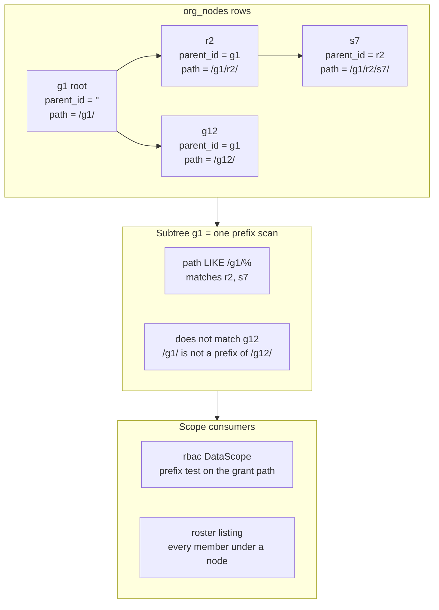

# org

A tenant's organization tree, the memberships bound to its nodes, and
the invitations that create them. `org` is the data behind both
neighbours' questions — authn's membership checks and rbac's
subtree-scoped grants. This page explains the why behind its storage
model and operations; the [user-guide org
page](/docs/user-guide/modules/identity/org/) covers the how.

## Responsibility and boundary

In scope: one root per tenant, arbitrary depth beneath it, nodes
carrying a business-defined `Kind`; creating, renaming, moving and
deleting nodes; the roster — one membership per person per tenant,
bound to a node, the subtree beneath it their data scope; invitations
issued, delivered, withdrawn and accepted; the read-only `Scope`
view; and the subscription that gives a brand-new user a workspace.

Deliberately out of scope, each with its owner and reason:

- `users` beyond an id string — `authn`'s identity data; org learns a
  user id from an event or a subject and stores nothing else.
- Roles on a membership — `rbac`'s policy, keyed by (tenant, user,
  node); a `[]string` column has no portable dual-dialect form.
- Any message but the invitation email — `notification`; business
  modules publish events and let subscribers decide what to send.
- Revoking a removed member's sessions — `authn`; org publishes
  `org.member.removed`, and reaching into session state is what the
  event exists to avoid.
- A real `SubjectResolver` — `authn`; org ships the seam and a
  fail-closed default (401 when unwired).
- Dynamic-config schema — none at all: its bounds are constants,
  overridable through options. Declaring a schema org would silently
  ignore would be a lying schema.

## The tree: adjacency plus materialized path

Each node stores `ParentID` — the authoritative structural edge — and
`Path` — the derived query index — plus `Depth`. `TreeService` writes
both together; a row where they disagree is corrupt, not a supported
state.

Two alternatives were rejected: **a closure table** costs O(depth)
rows per node and rewrites O(subtree × depth) rows per move, buying
ancestor queries a path split in Go already answers; **a recursive
CTE** works on both engines today, but portability here is by
construction — "structurally impossible to diverge" — not "both
happen to support it".

The prefix representation carries two load-bearing properties, both
test-pinned: **the path ends with a separator**, so "self and
descendants" is a plain prefix test for variable-length ids — `/g1/`
is not a prefix of `/g12/`, while `/g1` would be (the `/g1/r2` vs
`/g1/r20` trap is a required test case too); and **the id alphabet
is pinned to `[0-9a-f-]`** — no `LIKE` metacharacter, no uppercase.
That alphabet is what makes the dialect-identity proof hold: SQLite's
`LIKE` is case-insensitive and PostgreSQL's is case-sensitive, but no
two distinct stored paths can differ only by case, so both engines
select identical rows — and an uppercase id scheme would require
re-adjudicating the representation.

Moves rewrite paths **in Go**, never with SQL `replace()`, and
`CreateChild` derives path and depth from the parent's stored path —
a fresh row can never disagree with its parent.

## Two storage decisions that look small and are not

**`parent_id` is an empty-string sentinel, never `NULL`.** The
sibling-uniqueness index is `UNIQUE(tenant_id, parent_id, name)`, and
`NULL` is distinct from itself in a unique index on both engines —
two roots would coexist under `NULL` while the index silently did
nothing. The empty string is an ordinary comparable value, so the index means
what it says — `go/config`'s tenant-scope column set the precedent.

**`memberships` is link data, and link data IS tenant-scoped.**
Because `users` is deliberately not tenant-scoped (one person,
several tenants), the bridging row must be: a membership readable
across tenants would expose one tenant's roster to another.
`Membership` runs `AssertIsolated` and stores `user_id` as a bare
reference — no cross-module foreign key.

## Subtree semantics: what deletion may and may not do

Scope follows the tree, so structural edits are the danger points:

- **Deleting never re-parents orphans.** A node with children reports
  `org.node_has_children` unless the caller explicitly asks for a
  cascade — re-parenting orphans would silently widen every bound
  member's data scope: a privilege escalation performed by a delete.
- **Deleting never takes memberships along.** `TreeService.Delete`
  refuses with `org.node_has_members` when anybody is bound inside
  the subtree, cascade or leaf — a structural edit must not silently
  change who is in a tenant or what they can see. The check runs
  inside the delete's own locked transaction, since a separate
  pre-read would let a concurrent `Add` dangle a membership on a
  deleted node.
- **The tenant root is never deletable**; moving it needs no rule of
  its own — with a second root unconstructible, the cycle check
  already covers every candidate target.

Behind the refusals sits a concurrency discipline: every tree write
that decides something and then writes it is atomic — one transaction
whose first statement takes the row locks it will need (a
dialect-neutral blind `UPDATE`), or one database-arbitrated
conditional statement — closing real, reproduced windows.

## Soft deletion and restore: per-node, never cascading

`OrgNode` and `Membership` implement `dbkit.SoftDeletable`; `Delete`
and `Remove` mark-delete, and both real unique indexes were narrowed
to partial indexes (`WHERE deleted_at IS NULL`) in the same migration
so a deleted row never keeps occupying the slot of a name or seat
the tenant wants back. `org_invitations` was left untouched —
invitations are already single-use and expiring.

The restore design carries the module's discipline visibly:

- **Restore is per-node, never cascading.** A cascading restore could
  only identify a cascade's rows by correlating on the batch's own
  `deleted_at`/`deleted_by` — a heuristic that cannot tell cascade
  rows from earlier deliberate deletions, so restoring the ancestor
  would resurrect a row somebody removed on purpose.
- **Restore refuses a dead parent.** Landing a node under a
  still-mark-deleted parent would make prefix scans and ancestor
  walks disagree about what is visible, and `CreateChild` could grow
  a fresh subtree off an orphaned chain — the
  path-disagrees-with-parent state the representation calls corrupt.
- **Restore re-expresses the row under its parent's current path.**
  A live parent can move while its child is mark-deleted, so
  clearing the markers without re-deriving `Path`/`Depth` would
  resurrect a row whose path names the parent's old position.
  Restore re-derives from the locked live parent inside the same
  transaction, and refuses a slot a live row has since taken.

Both restores publish their own events (`org.node.restored`,
`org.member.restored`) — a restore is its own fact, and the event is
what lets rbac re-instate reaped bindings.

## Invitations: consent by mail, and nothing else

The invitation is the module's one consent-establishing message —
org sends nothing else to someone who never accepts, and a fresh
`Invite` for the same address revokes the previous token. Each
mechanic around it is a small security decision:

- **The token is never stored.** 32 bytes from `crypto/rand`, kept
  only as a SHA-256 hash — a leaked backup yields no usable link.
- **The address is encrypted at rest and blind-indexed** for
  exact-match lookup, under a key that must be a different secret
  from the encryption key. Rate-limit keys use the blind index,
  never the address — an address in a KV key would be a PII leak —
  and delivery is limited per tenant and per recipient.
- **The mail renders in the invitee's locale**, named in the request
  body at invite time, never read from the operator's
  `Accept-Language` header — the invitee has made no request of
  their own.

**Acceptance is tenantless, and the resolution is honest.** A freshly
invited person holds no membership in — and typically no token for —
the inviting tenant; demanding a tenant claim on top of the token
would make the very flow impossible. The accept path resolves the
invitation's own tenant from the token itself, through a narrow,
deliberately non-tenant-scoped `token_hash → tenant_id` index table
written in the same transaction as every invitation, then re-enters
the ordinary tenant-scoped flow unchanged. The index row is never
updated, so revoked or expired tokens still resolve and answer their
coded errors rather than a misleading not-found. Who is accepting is
attested by the host's `SubjectResolver`, which fails closed when
unwired — a mailbox token does not prove ownership of the address
behind it.

## The authn subscription and the no-import seams

`authn.user.created` is org's one coordination point with authn, and
its string name appears in exactly one place. org subscribes —
never declares or publishes a foreign event, which would collide at
bootstrap — and the contract is resilience: an absent publisher is
not an error; an unrecognized payload is dropped without failing the
publisher; a tenantless event does nothing; a real event rebuilds the
tenant context and idempotently ensures a root and a membership.

The same structural trick points outward: `Scope`, `FeatureGate` and
`SubjectResolver` are interfaces whose every signature uses stdlib
types only, so a consumer declares the identical method set in its
own package and accepts org's implementation structurally — rbac
never learns what an `OrgNode` is, since a method returning
`[]OrgNode` would destroy the property. `FeatureGate` is the same
trick pointed at config's `IsEnabled`; `SubjectResolver` is the seam
the authenticating side fills.

## Trade-offs worth knowing

- **A denormalized path bought query simplicity.** `Path` duplicates
  what `ParentID` chains imply, and the two must never disagree — the
  price is the write discipline that keeps the duplication honest.
- **Refusal over silent repair.** Deleting never re-parents, never
  removes members, never resurrects on restore: every structural
  edit that would quietly change who can see what is refused instead,
  and the caller performs the explicit act.
## The frozen surface

`Module.Tree()`/`Members()`/`Invitations()`/`Scope()` are the service
handles; the four declared permissions (`PermissionRead`,
`PermissionManage`, `PermissionInviteMember`, `PermissionRemoveMember`)
name what a host gates org's routes on, accept-invitation the one
route reachable without a standing grant; the eight lifecycle events
(`org.node.*`, `org.member.*`) are the public contract to
subscribers; and the spec-generated HTTP fragment carries eleven
operations under `/api/v1/org` — the tenant always comes from
context, never from the surface.

## Source

- Design: [docs/internal/05-identity-and-access.md](https://github.com/vislake/speed/blob/main/docs/internal/05-identity-and-access.md) — the organization-model section and its implementation-correction notes (materialized path, the sentinel, memberships)
- [go/org/AGENTS.md](https://github.com/vislake/speed/blob/main/go/org/AGENTS.md) — the adjudications, concurrency discipline, soft deletion and Known limitations

## Related pages

- [Identity group design](/docs/developer-docs/modules/identity/) — the group hub; [authn design](/docs/developer-docs/modules/identity/authn/) — the seam org's roster answers; [rbac design](/docs/developer-docs/modules/identity/rbac/) — the grants org's tree scopes and the reaps org's events drive
- [Architecture](/docs/developer-docs/architecture/) — data domains and the no-import discipline
- User guide: [org module](/docs/user-guide/modules/identity/org/), [identity and access domain](/docs/user-guide/domains/identity-access/), [identity modules](/docs/user-guide/modules/identity/)
