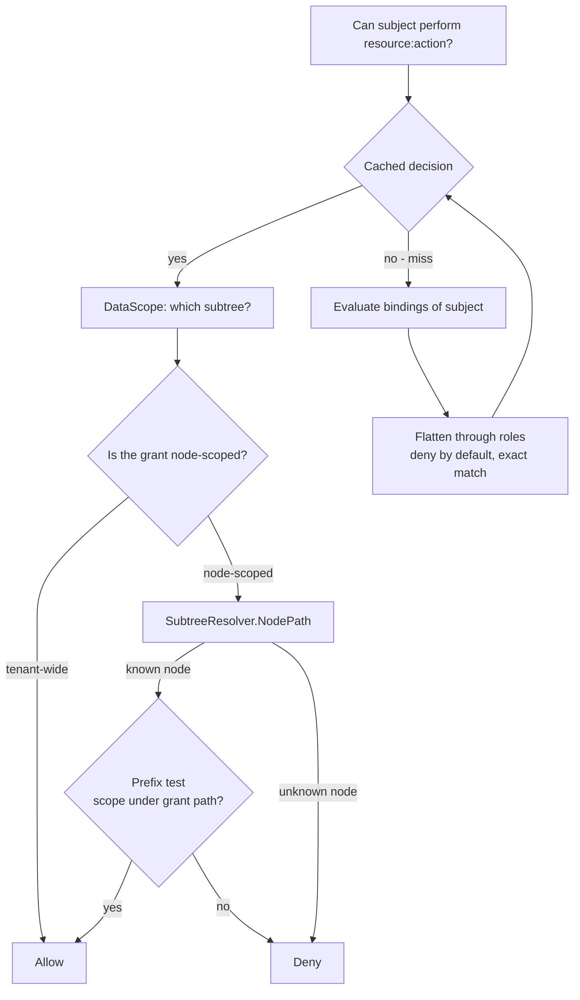

# rbac

Role-based access control: whether a `Subject` may perform an action
on a resource, and over which slice of a tenant's organization tree.
This page explains the why behind its shape — a native engine over
tenant-scoped tables rather than an off-the-shelf policy library, and
each frozen semantic. The [user-guide rbac
page](/docs/user-guide/modules/identity/rbac/) covers wiring and
operations.

## Responsibility and boundary

rbac decides. It does not identify — its defining property is what it
does **not** depend on:

- **No import of `authn`, in source or tests.** Authorization knows
  exactly one thing about identity, `Subject{TenantID, UserID}`, and
  whoever authenticates assembles that Subject and calls in. An
  engine that knew how a user authenticated could not be reused by a
  host that authenticates differently, and could not be tested
  without standing up a login stack.
- **No import of `org`.** The tree is known through two interfaces
  declared here and implemented by the host: `SubtreeResolver`,
  which maps a node id to its materialized path at decision time, and
  `WithSubjectResolver`, through which the authenticating side
  supplies the Subject. A missing or failing resolver **denies** a
  node-scoped binding — an unresolvable narrowing never widens into a
  tenant-wide grant.
- **No HTTP routes of its own.** Role management is an admin-console
  surface (`go/admin` serves it) and `/me` belongs to authn. rbac's
  entire contribution to HTTP is `RequirePermission`/
  `RequirePermissionFunc`, the gate the fixed middleware chain names
  after authentication. No usable Subject, an unparseable permission
  and a plain denial all answer `403 rbac.permission_denied`,
  indistinguishably.
- **No permission wildcards** (`billing:*`): a wildcard grammar is a
  security surface needing its own design decision, not an
  implementation guess. Matching is exact, and `notes:read` does not
  imply `notes:write`.
- **rbac does not authorize its own writes.** `PermissionRead`/
  `PermissionManage` give callers the vocabulary to gate role
  administration; the engine never checks them itself — an engine
  that did would need a special case for "who may grant the first
  role", and special cases in an authorization engine are where the
  holes live.

## Why native, not Casbin

The design's RBAC semantics were originally sketched over Casbin's
`RBAC with domains` model; the implementation lands on a **native
engine over three `dbkit`-managed, tenant-scoped tables**, an
implementation correction with recorded reasons:

1. `casbin_rule` has no `tenant_id` column — the tenant lives inside
   a policy string. The most security-critical table in the product
   would opt out of **all three** tenant-isolation layers at once: no
   plugin filter, no `Repository[T]`, no row-level-security column to
   compare against. Isolation would collapse to "the caller passed
   the right domain string".
2. Casbin's `gorm-adapter` holds its own `*gorm.DB` and issues its
   own queries — exactly the raw-access shape this repository's data
   rules exist to prevent.
3. Casbin's real value — a pluggable `model.conf`, ABAC, RESTful
   matchers — is unused here: the decision chain is
   `subject → bindings → role → permissions` plus one
   materialized-path prefix test. Two third-party dependencies in
   every consumer's `go.sum` for machinery nothing calls was not a
   trade worth making.

## Three tenant tables plus a frozen catalog

`rbac_roles` and `rbac_role_permissions` are tenant data;
`rbac_role_bindings` is link data (user × tenant × role — the
memberships-shaped row of the data-domain table). All three embed
`dbkit.Repository[T]` and run `tenancytest.AssertIsolated` (rbac owns
no identity or platform table — zero reverse-assertion suites,
deliberately); `user_id`/`node_id` are bare id references with no
foreign keys.

The permission **catalog** is platform data **with no table**: a
frozen in-memory snapshot of every `resource:action` every module
declared. `Module.Attach` — exactly once, after `the assembly`
returns — takes the snapshot; a second `Attach` fails
(`ErrAlreadyAttached`): for the set that decides whether a grant is
legal, a different second snapshot is a security difference.

The `"system"` pseudo-tenant carries platform-operations grants, and
it is an **ordinary tenant id** as far as every layer is concerned:
its rows go through the same repositories, the same isolation
plugin, the same code path. Nothing branches on it — which is what
makes it trustworthy — and it is not a wildcard: system-domain
grants gain no customer-tenant access.

## What a decision is

`Can` is the coarse gate: does this Subject hold `resource:action`
**anywhere** in its own tenant? `DataScope` is the row filter: over
**which slice of the tree**? The frozen semantics, each with its
reason:

1. **Deny by default.** No matching grant is a denial, never an error.
2. **A binding grants only inside its own tenant** — structurally
   guaranteed by the tenant-scoped repository; reads use the
   Subject's tenant, never the context's.
3. **Matching is exact.** No wildcard grammar exists.
4. **An undeclared permission denies at check time and is rejected at
   grant time.** Strictness belongs where a typo is still fixable; a
   check must never turn a request into a 500.
5. **`Can` alone does not filter rows.** It ignores tree scope;
   handlers returning tenant data must also call `DataScope` and
   filter with it.
6. **A node-scoped binding that cannot be resolved denies.** No
   resolver wired, or the node gone, means that binding contributes
   nothing to a `DataScope` — never a widening to the tenant. This is
   the one case where `Can` and `DataScope` legitimately disagree.
7. **Assign is idempotent; revoke is strict.** Assignment that finds
   its work done has achieved the caller's goal; revocation that
   finds nothing usually has not — the common cause is a scope
   mismatch, and success would claim access withdrawn while the user
   still holds it.

**Node paths are resolved, never stored.** A binding stores the
node's id, never its materialized path: a member who moves in the
tree must have permissions follow immediately, and a denormalized
path column would be stale at exactly that moment. Which is also why
the decision cache stores node ids, never paths.

## The decision cache: invalidation first

Decisions are cached per subject `(tenant, user)`, holding grants
already flattened through roles. A stale cache that kept answering
"yes" after a revoke would be worse than none, so invalidation comes
first:

1. **Events.** Every assign, revoke and role change publishes on the
   `EventBus`; the service subscribes to its own events, so a local
   write and a remote one converge through one code path. A binding
   change drops one subject; a role change drops the whole tenant
   (grants are stored flattened, with no role-to-subject index).
2. **TTL expiry** (30 seconds by default) bounds the damage of a lost
   event to one TTL — deliberately not a dynamic config item, which
   would add an `rbac → config` edge the dependency graph does not
   have.
3. **A janitor** reclaims expired entries; expiry itself is enforced
   on read.

A publish failure is reported *after* the local cache is invalidated:
the write is committed and this process is already correct, but other
replicas have not been told — the caller decides between retry and up
to one TTL of divergence. Convergence is proven against a real Redis
bus, not assumed.

## Keeping the tables honest: the org-event reaps

A leftover authorization row is latent access: bindings surviving a
member's removal, or scoped to a node the tree no longer has, wait
for a bug elsewhere to become real. rbac therefore subscribes to
org's lifecycle events (`org.member.removed`, `org.node.deleted`,
their `...restored` counterparts), knowing each by its string name
alone and probing payloads with a JSON round trip — never org's type,
never declaring or publishing a foreign event; on a host with no org
module they simply never fire.

The reaps revoke through the **same mark-delete path** an
administrator's `RevokeRole` uses, writing a `revoke_origin` marker
(deliberate, `member-removal`, `node-deletion`) onto each row — so
`RestoreRole` undoes a reaped binding exactly as it undoes a manual
revoke, and the restore-side subscriptions re-instate only the rows
the matching event reaped — never a deliberate revocation. The
member-restore side re-verifies each row's node before un-marking; an
unverifiable row fails closed under its origin. Queue-backed hosts
retry reaps as `jobs` tasks; queue-less hosts run them synchronously,
residue permanent by design.

Soft deletion was adopted **narrowly**: `RoleBinding` alone
implements `dbkit.SoftDeletable`, because it is the module's one real
delete-shaped operation; `Role` and `RolePermission` have no delete
path to retrofit. The unique index `(tenant, user, role, node)` was
narrowed to a partial index (`WHERE deleted_at IS NULL`) in the same
migration, so a revoked-then-reassigned scope is reusable instead of
being reserved forever by a row nobody can see. `RestoreRole` is
idempotent like `AssignRole`, restores the *most recently* revoked
row at a tuple when several share it, and — deliberately unlike
`org`'s dead-parent refusal — tolerates a binding whose node no
longer resolves: a binding is a leaf authorization fact, not a
structural row, and `DataScope` already treats an unresolvable node
as contributing nothing.

## Trade-offs worth knowing

- **Native engine over policy library.** The three-table model buys
  tenant isolation at every layer at the cost of reimplementing
  evaluation — a small cost when the decision chain is short and the
  semantics were already fixed by the design.
- **A cache that trusts events more than time.** TTL is the
  backstop, not the mechanism; event invalidation is what makes a
  revoke converge across replicas in seconds rather than in a TTL.
## The frozen surface

Consumers program against `Authorizer` (`Can`, `DataScope`,
`ListPermissions` — the flat, sorted list authn's `/me` renders
from), the grant lifecycle (`DefineRole`, `AssignRole`, `RevokeRole`,
`RestoreRole`, `EnsureBuiltinRoles`), the `Subject`/`Scope` types,
`RequirePermission` and its `*Func` variant, the route table
(`GuardRoutes` with `RouteRule` -- a host's per-route decisions, with
coverage enforced at startup), the gate's exported splitter and refusal
writer (`SplitPermission` / `WriteAuthzError`), and the errors
vocabulary. The built-in roles encode three product decisions: `owner` holds
every declared permission, `admin` holds everything except
`rbac:manage` (without that exclusion the two roles would be
identical), and `member` holds nothing — ordinary-member permissions
are a product decision, and deny by default applies to seeding too.
Built-in permission sets are a function of the frozen catalog.

## Source

- [go/rbac/AGENTS.md](https://github.com/vislake/speed/blob/main/go/rbac/AGENTS.md) — the frozen semantics, reaps, soft-delete and Known limitations

## Related pages

- [Identity group design](/docs/developer-docs/modules/identity/) — the group hub; [authn design](/docs/developer-docs/modules/identity/authn/) — who assembles the Subject; [org design](/docs/developer-docs/modules/identity/org/) — the tree and events this module's reaps follow
- [Architecture](/docs/developer-docs/architecture/) — the middleware order
- User guide: [rbac module](/docs/user-guide/modules/identity/rbac/), [identity and access domain](/docs/user-guide/domains/identity-access/), [identity modules](/docs/user-guide/modules/identity/)
