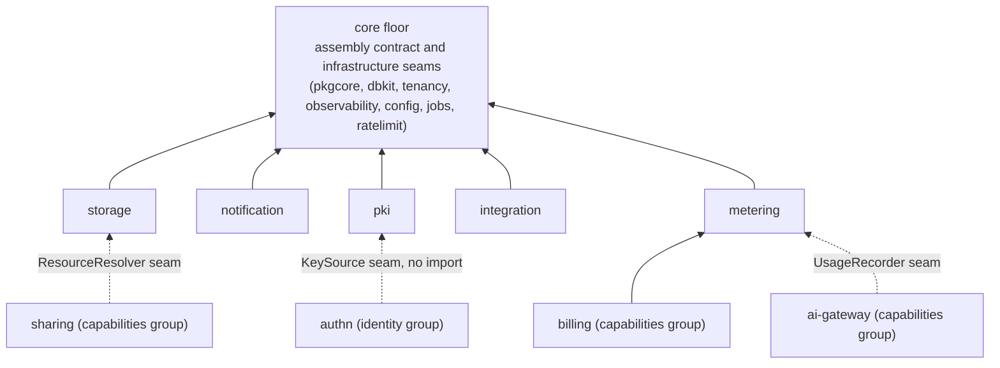

# Platform services

This group covers the design of the five platform modules that turn
speed into product features: `go/storage` (media objects),
`go/notification` (outbound messages), `go/pki` (signing keys and
X.509 certificates), `go/integration` (a tenant's outward-facing API)
and `go/metering` (usage recording). Each page states the module's
responsibility and boundary, the design decisions behind its shape,
its key mechanisms and why they are built that way, and which of its
surface is a stable public API. Every claim traces to the internal
design document and the module's own `AGENTS.md` named in Source.

## The group and its boundary with the core floor

The modules of the core group — the assembly contract (`pkgcore`),
the dual-dialect database and repository layer (`dbkit`), tenant
resolution (`tenancy`), observability, dynamic configuration, the job
queue and rate limiting — are surfaces a consumer project builds
*on*. The services group is what a product actually turns into
features. Where a core module often owns no table and mounts no HTTP
route, every services module ships the full stack of a business
capability: real tables with dual-dialect migrations, an OpenAPI
fragment mounted at `/api/v1/*`, declared permissions, audit actions,
events and job handlers — registered through the one
`Register(reg *Registry)` call of the [module wiring
contract](/docs/developer-docs/architecture/).

The five modules also share the discipline the [design
principles](/docs/developer-docs/design-principles/) state for
business modules: the tenant is read from the request context, never
from the request; long-running work goes through the `jobs` queue
instead of blocking HTTP requests; every decision that can change
between enqueue and execution is re-checked when it matters — at
delivery, at finalize, at verification — not frozen at the call that
started the work; and each module must have a real consumer in the
reference app before it counts as done.

## Where the five sit and how they relate

`storage`, `notification` and `pki` sit on the tier directly above the
queue: each consumes `jobs` for its asynchronous half — thumbnail
derivation and expiry sweeps, message delivery, the expiry scan that
drives key rotation. `integration` and `metering` stand apart by
design: integration lives high in the graph because it turns *other*
modules' domain events into webhooks and cannot import them, and
metering sits low because `billing` — a module above it — reads its
summaries through a structural seam to judge quotas.

None of the five imports another. The collaborations between them, and
with modules of other groups, are deliberately host-wired or
import-free seams:

- `authn` never imports `pki`; it declares the `KeySource` interface
  itself and `pki`'s `Service` satisfies it structurally (see the
  [pki page](/docs/developer-docs/modules/services/pki/)).
- `notification` never imports `authn`, `rbac` or `org`: user
  addresses arrive through a host-supplied `UserAddressResolver` at
  send time, and business modules never import `notification` either —
  they publish domain events, and the host decides which events become
  which notifications.
- `integration`'s webhook mapping is a construction-time option the
  host fills with transform functions, because only the host may see
  across module boundaries; `go/integration` itself imports neither
  the event-emitting modules nor the platform registry.
- `storage`'s queue is host-wired; `metering`'s transport into
  `ai-gateway` is the optional `UsageRecorder` seam, not an import.

The per-page stories below develop why each of these boundaries exists
— the cost of the alternative is the reason, not a style preference.

## The pages

- [storage](/docs/developer-docs/modules/services/storage/) — media
  objects: metadata in tenant tables, bytes in the object store, and a
  transfer protocol whose completion treats the probe of the stored
  bytes as the authority.
- [notification](/docs/developer-docs/modules/services/notification/)
  — outbound messages built on a live type registry rather than a
  template store, a consent ledger for external recipients, and
  send-time rechecks.
- [pki](/docs/developer-docs/modules/services/pki/) — signing keys
  and certificates with a real lifecycle: pending, active, retiring,
  retired, revoked.
- [integration](/docs/developer-docs/modules/services/integration/)
  — the tenant's outward API surface: API keys with forced expiry, and
  webhooks fed by an explicit internal-to-public event mapping.
- [metering](/docs/developer-docs/modules/services/metering/) —
  usage recording in two reliability tiers: fail-open for analytics,
  outbox-guaranteed for billing.

The [user guide's services
section](/docs/user-guide/modules/services/) documents the same five
modules operationally — what you wire and what each call does; these
pages answer the why.

## Related pages

- [Architecture](/docs/developer-docs/architecture/) — the module
  graph, the wiring contract, deployment mode versus implementation
  composition.
- [Design principles](/docs/developer-docs/design-principles/) — the
  discipline every module obeys.
- [API contract](/docs/developer-docs/api-contract/) — how each
  module's OpenAPI fragment becomes generated interfaces and the
  merged document.
