# integration

`go/integration` is a tenant's outward-facing API surface, in two
directions: **inbound**, API keys a tenant issues to its own scripts
and third-party systems, with the rate limiting that protects the
platform, the tenant and the key from one another; and **outbound**,
webhooks that turn a business module's internal domain events into
signed HTTP deliveries. The [integration usage
page](/docs/user-guide/modules/services/integration/) shows the
surface; this page is the design reasoning behind the two halves.

## Responsibility and boundary

The module does not authenticate users and does not authorize
anything itself: `Service.Authenticate` and `AuthMiddleware` resolve a
presented key to its owning tenant, and how a host maps routes to
scopes is the host's own enforcement, built on the scopes the module
returns. What the module *does* own is the credential lifecycle and
the delivery pipeline. It deliberately ships no inbound gateway
product of its own — no request logging, no route-to-scope table — and
no opinion on how a request authenticated by a key is rate-limited
beyond the composable pieces (`LayeredLimiter`, `HTTPGuard`) hosts
wire.

## The API-key half: credentials that cannot go stale silently

The key design decisions are about what a key is attached to and what
happens to it over time:

- **A key belongs to the tenant, never to the person who created
  it.** `CreatedBy` is the responsible party on record, not an
  ownership tie — an integration must not break because someone left
  the tenant. What the design does ask for is *visibility*: the list
  marks a key whose creator has left, through an optional membership
  checker, so the tenant notices it needs a new owner of record.
- **Scopes are frozen at issuance.** The requested scopes are
  validated as a subset of the creator's current permissions at
  create time, and nothing ever rewrites them. A creator's later
  promotion or demotion neither widens nor shrinks an issued key —
  permission drift under the caller's feet is worse than a key that
  needs deliberate rotation.
- **The raw key is never stored.** Only its SHA-256 hash is kept —
  plain hash, not a deliberately slow password hash, because the
  input is 32 bytes of full-entropy randomness with no dictionary an
  attacker could exploit. A plaintext `Prefix` (`sk_...`) lets an
  operator tell keys apart in a list without ever seeing the rest.
- **Expiry is mandatory and ceilinged.** A key that never expires is
  the most common credential-leak surface, so an unspecified request
  defaults to the configured lifetime and a request beyond it is
  refused, never silently clamped. Rotation is create-new plus
  revoke-old; the two writes are deliberately not one transaction
  (there is no cross-call transaction boundary in the repository layer),
  so a mid-way failure leaves two live keys — a safe-direction
  surplus, reported to the caller, never a lockout.

`Authenticate` refuses with **one outward-identical answer** — a key
that does not exist, is revoked, or is expired are deliberately
indistinguishable, the same no-enumeration discipline as the authn
and sharing bearer refusals. Resolving the owning tenant from the key
alone, before any tenant is in context, needs a table that is not
tenant-scoped to query — so a narrow, two-column platform table
(hash, tenant) exists purely for that lookup, written in the same
transaction as the key row. The alternative — reaching around the
tenant-scoped repository with raw SQL — is exactly the bypass the
platform's repository rules exist to prevent.

Rate limiting composes three independent layers — global, tenant,
key — built entirely from `go/ratelimit`'s single-dimension `Allow`
calls, short-circuiting on the first denial, with `HTTPGuard`
translating a denial into a 429 carrying `Retry-After` and
`X-RateLimit-*` headers. The guard belongs **outside** authentication:
a forged key otherwise reaches `Authenticate`'s lookups with no bound
at all, charged against no budget. And the middleware reads its
credential from `X-API-Key`, never `Authorization: Bearer` — in a host
whose outermost layer is the authn middleware, `Authorization` is
already claimed globally, and a present-but-unverifiable bearer is
401'd before the API-key middleware ever runs.

## The webhook half: never forward an internal event raw

The central rule: **internal domain events are not a public API.**
An event carries internal field structure; once forwarded it becomes
a de facto contract, and any later internal refactor breaks every
receiver. So the pipeline starts with an explicit mapping layer.

The `EventMapping` is a construction-time option the host supplies:
one declaration per internal event type, pairing it with a public
type, version, and a transform function that picks the deliberately
exposed fields. The transform must be host code — `go/integration`
cannot import the business modules that emit the events, and widening
the `pkgcore` registry is not one module's decision. The host, which
already imports both sides, is the only place in the program allowed
to see across the boundary. The delivery envelope is versioned
(`{event: {type, version}, data: ...}`), so a breaking schema change
is a new version, never an in-place edit.

From the mapping onward the pipeline is built for at-least-once
delivery without double sends: one delivery row per (subscription,
observed occurrence) under a derived idempotency key — the database
index, not a check, is the backstop against two handlers racing the
same event — and one `jobs` task per subscription. Each attempt is an
HMAC-SHA256-signed POST with the timestamp covered *inside* the
signed content, so a captured pair cannot be replayed under a forged
later timestamp. The row's payload is computed once and never
recomputed on retry: a signature must cover byte-identical content
across every attempt of one delivery.

SSRF protection happens at **two times** because one is not enough.
`ValidateWebhookURL` refuses a blocked destination at subscription
creation; the delivery client re-checks the *connecting* address at
every attempt and dials the IP it just checked — the only defense
against DNS rebinding, where the name resolves differently at
creation and at delivery. Both refusals answer without echoing the
resolved address: that text is served back to the tenant in the
deliveries log, and echoing it would turn the refusal into an
internal-DNS reconnaissance oracle.

Retry and dead-lettering belong to the queue layer's contract: the
module enqueues with a bounded retry horizon and its failure hook
settles the terminal `dead-letter` record. Compensation — here,
simply recording the terminal state — is business code, never queue
machinery. A dead-lettered delivery stays re-deliverable through a
Service-level method that re-enqueues it under a fresh cycle-scoped
key.

```mermaid
flowchart TD
    subgraph Inbound["inbound: API keys"]
        I1["request with X-API-Key"] --> I2["rate-limit guard<br/>global, tenant, key layers<br/>(outside authentication)"]
        I2 --> I3["Authenticate: owning tenant resolved<br/>from the hash alone"]
        I3 -->|"one outward-identical refusal"| I4["refused"]
        I3 --> I5["host API surface"]
    end
    subgraph Outbound["outbound: webhooks"]
        O1["internal domain event"] --> O2["host-supplied EventMapping:<br/>transform to the versioned public envelope"]
        O2 --> O3["match active subscriptions"]
        O3 --> O4["delivery row under an idempotency key<br/>plus one jobs task"]
        O4 --> O5["HMAC-signed POST,<br/>dial-time SSRF re-check"]
        O5 -->|"non-2xx"| O6["retry with backoff,<br/>bounded by the queue"]
        O6 -->|"retries exhausted"| O7["dead-lettered, terminal record"]
    end
```

## Trade-offs that shaped the module

- **Host-supplied transform over registry widening.** The mapping
  could have lived in a `pkgcore` registry field; the host-option
  shape keeps the dependency floor untouched and the transform
  functions where the cross-module knowledge is.
- **Restore lands paused.** Webhook subscriptions implement
  soft-delete, but `RestoreWebhookSubscription` always returns the row
  with `Active = false` — a deliberate divergence from the org/rbac
  restore precedent. Restoring an org membership or a grant resumes
  an internal fact re-evaluated on every read; restoring a webhook
  would silently resume POSTing live tenant event data to a
  third-party URL nobody has looked at since. The unmark and the
  pause land in one guarded write, with no window where the row is
  live and active.
- **A dead-lettered delivery does not say why it died in its
  status.** One terminal status serves three causes (retries
  exhausted, subscription deleted after enqueue, subscription paused);
  the operator reads `LastError` for the why. The module keeps its
  state machine to two terminal states rather than growing a status
  per cause.

## Stable external surface

- Ten operations under `/api/v1/integration`: the four API-key
  operations (create, list, rotate, revoke) and six webhook
  operations under `/webhooks` (subscription CRUD plus restore and
  the deliveries listing), generated from the module's fragment.
- `Service.Authenticate` and `AuthMiddleware` for inbound
  key-authenticated routes; `LayeredLimiter` and `HTTPGuard` for a
  host's own inbound surface.
- Webhook delivery: subscription management, `EventMapping` /
  `WithEventMapping`, signing headers with an exported replay
  tolerance, Service-level redelivery.
- Permissions under `integration:*` (apikey and webhook read/manage
  pairs), audit actions for the create/revoke/rotate and
  subscription lifecycle, error codes in bilingual bundles, four
  tables with dual-dialect migrations.

## Source

- Module discipline: [go/integration/AGENTS.md](https://github.com/vislake/speed/blob/main/go/integration/AGENTS.md)

## Related pages

- [Platform services](/docs/developer-docs/modules/services/) group overview; siblings [storage](/docs/developer-docs/modules/services/storage/), [notification](/docs/developer-docs/modules/services/notification/), [pki](/docs/developer-docs/modules/services/pki/), [metering](/docs/developer-docs/modules/services/metering/)
- [Architecture](/docs/developer-docs/architecture/) — the event bus, the middleware order (why `X-API-Key` cannot ride `Authorization`)
- Usage: [integration in the user guide](/docs/user-guide/modules/services/integration/), and the [jobs queue](/docs/user-guide/modules/core/jobs/) webhook delivery runs on
