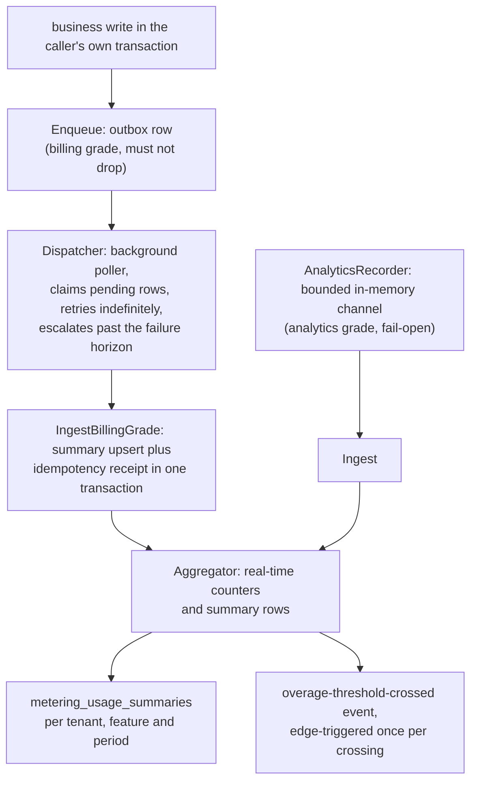

# metering

`go/metering` is speed's usage-metering module: one `Recorder`
interface business modules call to report usage, decoupled from
whatever stores and aggregates it. The [metering usage
page](/docs/user-guide/modules/services/metering/) shows the calls;
this page is why the module draws its boundaries where it does.

## Responsibility and boundary

**Metering measures and signals; billing decides.** The module ships
usage recording, aggregation and an overage-threshold-crossing event —
and deliberately none of the Plan/Feature/Entitlement domain model,
credits, or quota enforcement. Those live in `go/billing`, which sits
above metering in the module graph and imports it: billing's
`UsageReader` seam is satisfied structurally by metering's
`Aggregator`, and quota decisions read real-time usage counts through
it. "Zero usage" must never fail open for an over-quota tenant, so an
unwired reader is a coded error, never a guessed allowance.

The module also ships no HTTP surface — it is a Go-level API business
modules call in-process — and no `jobs` dependency: its delivery
loops are in-process goroutine pollers, keeping the module's
third-party footprint to a single small UUID package.

## Two reliability tiers, two call entries

Not all metering may fail open. Losing an analytics event costs a
dashboard number; losing a billing event costs revenue — and the
baseline data that would let anyone notice the loss is gone with it.
So the module has two tiers with **two different call entries**, not
one `Record` method with a flag:

- **Analytics grade** (`AnalyticsRecorder.Record`): fail-open. A
  bounded in-memory channel plus a background flush; a full buffer
  drops the event and counts it, and a flush that fails counts the
  loss the same way — the drop counter tells the whole truth about
  the tier.
- **Billing grade** (`Enqueue` + `Dispatcher`): must not silently
  drop and must not silently double-count. `Enqueue` writes an outbox
  row **in the caller's own transaction**; a background `Dispatcher`
  polls pending rows and delivers them into the aggregator, retrying
  indefinitely and escalating a permanently failing row to an
  error-level alert once its failed attempts pass a stated horizon.

Why the outbox rather than a second write or a log? The outbox makes
"business succeeded but metering lost" physically impossible: the
caller's commit and the meter's record stand or fall together. The
cost — one local write per event — is right for the low-frequency,
high-value operations billing-grade metering exists for; high-volume,
low-value events belong to the analytics tier by design.

Why not put billing-grade delivery behind the `Recorder` interface?
`Record(ctx, event)`'s signature has no room for a transaction
handle, and forcing a guaranteed path through a fire-and-forget shape
would be the wrong abstraction. `Enqueue(ctx, tx, event)` is a
package-level function for exactly that reason.

Idempotency closes the retry loops at every level. `Enqueue` dedupes
on a unique `(tenant_id, idempotency_key)` index, so even a retry
inside a *new* caller transaction returns the existing row with the
transaction left healthy. Redelivery of an outbox row whose
aggregation already committed is closed by a durable ingest receipt:
`IngestBillingGrade` inserts the receipt in the same database
transaction as the summary upsert, so a crash between the two writes —
or two concurrent dispatchers — applies the event exactly once. The
dedupe inserts are `ON CONFLICT DO NOTHING`, never a catch-the-error:
on PostgreSQL a statement error aborts the whole transaction, so a
caught conflict would poison the very transaction the module promises
to keep healthy.

**One feature belongs to exactly one tier.** Both tiers fold into the
same per-tenant, per-feature, per-period counter and summary row, and
neither carries a tier marker. A feature measured through both would
be a blend no reader could attribute — billing figures silently mixed
with quantities the analytics tier is allowed to lose. The rule is
caller discipline, stated at both places a recorder-call author reads.

## The aggregator: database-truth with in-process speed

Quota checks and dashboards cannot wait for batch aggregation, so the
`Aggregator` keeps real-time counters in process and folds each event
into the database-backed `UsageSummary` row in one
database-arbitrated statement — an `INSERT ... ON CONFLICT DO UPDATE`
that does the arithmetic server-side. The summary row is the shared
truth: a second replica's folds land through the same atomic
statement, and a process restart reconstructs its counters from the
summary rows on first touch. The overage event is edge-triggered —
exactly one crossing event per threshold crossing, never one per
subsequent event.

The outbox table is deliberately platform data, not tenant-scoped —
its one genuine departure from a literal "every table is
tenant-scoped" reading. The `Dispatcher` is a background process that
must find *every* tenant's pending rows; a scoped repository has no
cross-tenant read path, and the audited system-context escape hatch
elevates who may ask, not what a scoped repository can see. The
table carries a real, unenforced `tenant_id` for operator visibility,
the same shape jobs' own task table and the audit trail already use —
proven with `AssertNotTenantScoped`, never `AssertIsolated`.

The claim order treats retries fairly: rows are claimed by their
retry schedule alone, so a pile of permanently failing rows can never
starve healthy rows behind them, and a row that recovers is reached
the moment its window opens whatever the arrival rate.

## Trade-offs that shaped the module

- **Outbox in the caller's transaction over a post-commit publish.**
  The billing-grade guarantee is only as strong as its atomicity with
  the business write; the price is that billing-grade callers must
  hold a transaction handle — which is why the API is a function, not
  an interface method.
- **In-process aggregator over a distributed counter backend.** The
  shipped backend is the in-process one; summaries stay the shared,
  database-arbitrated record, which is what makes multi-process
  correctness a statement-level property rather than a
  coordination problem.
- **Schema declared, values at construction.** The module declares
  its period-bucket and threshold configuration items on the registry
  — schema only — while the aggregator reads Go-level options. A live
  per-tenant config read would add a real module dependency purely to
  serve thresholds that are still stand-ins: quota limits live in
  billing's per-plan grants, and nothing wires them into metering's
  thresholds yet.
- **Fixed-delay retries, no backoff curve.** A failing row is retried
  at most once per poll interval, scheduled by its `retry_after`
  column; the delay does not grow per attempt. The schedule is also
  the fairness mechanism, and the claim order never ranks never-failed
  rows above failed ones.

## Stable external surface

- `Recorder` (with `AnalyticsRecorder` as the shipped
  fail-open implementation), the package-level `Enqueue` +
  `Dispatcher` billing-grade pair, and `Aggregator` with its
  `RealtimeCount` reads and `Ingest` / `IngestBillingGrade` entries.
- Three tables with dual-dialect migrations: tenant-scoped
  `metering_usage_summaries` and `metering_ingest_receipts`, and the
  platform `metering_outbox_records`.
- The single published event
  (`metering.overage_threshold.crossed`), the declared config items,
  and the bilingual error catalog under `metering.*`.
- Consumed in the reference app: the `ai-gateway` usage-recorder seam
  feeds the analytics tier on every successful AI call, and the
  admin usage-summary endpoint reads the resulting rows; `go/billing`
  is metering's first consumer through the structurally-typed
  `UsageReader`.

## Source

- Module discipline: [go/metering/AGENTS.md](https://github.com/vislake/speed/blob/main/go/metering/AGENTS.md)

## Related pages

- [Platform services](/docs/developer-docs/modules/services/) group overview; siblings [storage](/docs/developer-docs/modules/services/storage/), [notification](/docs/developer-docs/modules/services/notification/), [pki](/docs/developer-docs/modules/services/pki/), [integration](/docs/developer-docs/modules/services/integration/)
- [Architecture](/docs/developer-docs/architecture/) — where metering sits below billing in the module graph
- Usage: [metering in the user guide](/docs/user-guide/modules/services/metering/), the [billing and metering domain page](/docs/user-guide/domains/billing-metering/)
