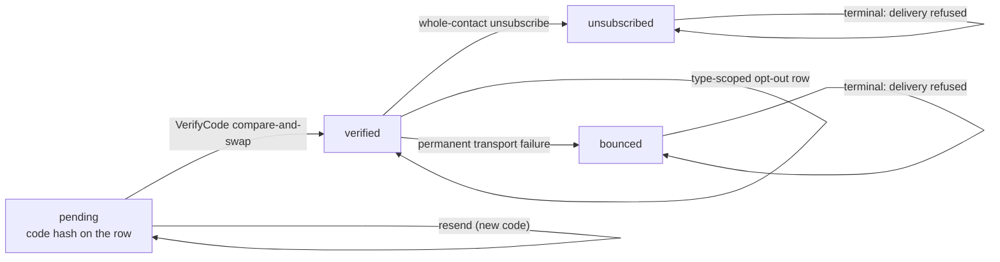
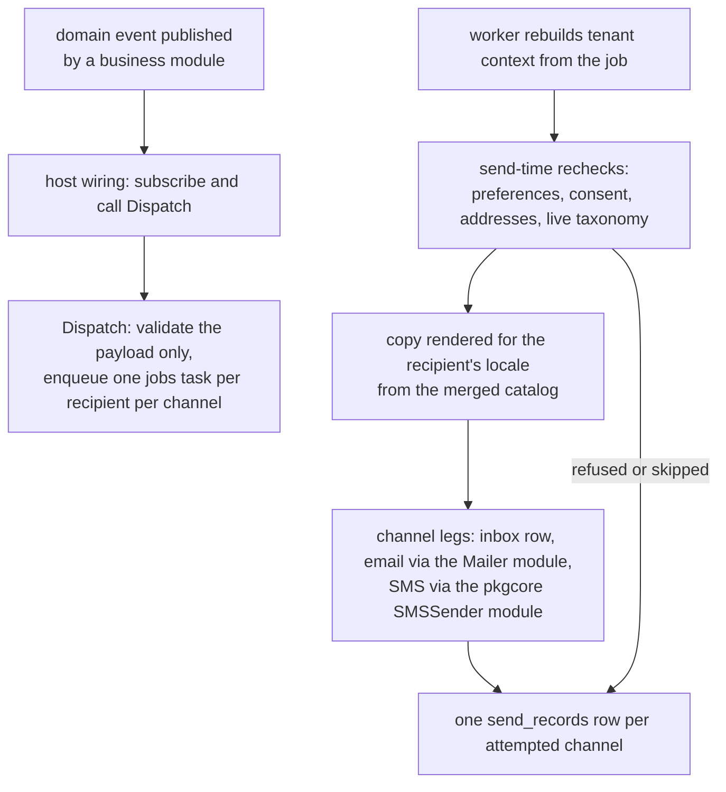

# notification

`go/notification` is the platform's outbound-message module: it
delivers a tenant's notifications to the people it serves — the in-app
inbox, email, SMS — on the channels those people choose, and, for
contacts who are not users of any tenant, only where consent has been
verified first. The [notification usage
page](/docs/user-guide/modules/services/notification/) documents the
wiring; this page is the design story.

## Responsibility and boundary

The module is a **leaf of the dependency graph**, and that fact drives
almost everything below. It never imports `authn`, `rbac` or `org`: a
user is an opaque id learned from an authenticated caller or a domain
event; a user's addresses are identity data the host resolves through
the `UserAddressResolver` module at send time, never rows here. And
business modules never import `notification` either — they publish
domain events, and the *host* subscribes and calls
`Deliveries().Dispatch`, deciding which events become which
notifications. The module's own `Register` subscribes to nothing but
its own inbox-created event, for the per-replica realtime fan-out.

Two consequences follow. First, "turn notifications off" is a wiring
question, not a code change — nothing in any business module names
this module. Second, the one exception the design allows — synchronous,
strongly-consistent verification messages — is handled by the module
for its own external-contact verification, while `authn`'s login codes
go through `authn`'s own SMS sender: neither business module depends
on `notification` for a message a user is waiting on.

What the module also deliberately does not own: the *copy*. A
notification type's templates live in the declaring module's own
bilingual locale bundles under the `<type_key>.<channel>.<part>` id
convention, rendered from the host's merged catalog at send time in
the recipient's locale. A missing template id is a coded internal
failure — never a fallback to another language, never a half-rendered
message.

## A live type registry, not a template store

Every notification type is declared by its owning business module
during `Register`, through `reg.NotificationsSeat().Add`: its key
(`<module>.<entity>.<action>`), default channels, and whether
recipients may unsubscribe. Transactional types — verification codes —
are not unsubscribable. Three design decisions hang off this registry:

- **It is read live, never snapshotted.** A preference write and a
  delivery both consult the current taxonomy, so a type declared after
  `notification`'s own `Register` ran is legal, an unknown type or
  channel is refused outright at the preference boundary, and an
  unsubscribable type cannot be switched off.
- **The preference matrix is per-type x per-channel**, resolving an
  absent row to the type's declared defaults. This is deliberately not
  a global on/off switch: "what happened" is a business fact, while
  which channels carry it is a recipient preference.
- **The registry is the deliverable's shape, not a menu.** Because the
  declaring module owns both the type and its copy, there is no
  central template store to drift from the code that renders it.

## Two recipient classes, two admission rules

System users and external contacts (a patient of a dental group, say —
not a user of any tenant) are different in kind. Users walk the
preference matrix; their addresses come from the host's identity layer
at send time. External contacts exist only inside the tenant that
verified them: one consent-gated address on one channel, in
`verified_contacts`, the address encrypted at rest under a
blind-indexed column.

Consent arrives by exactly two paths, each leaving its audit trail:

- **Double opt-in** — a `pending` row carries the code's SHA-256 hash
  (one pending code per contact, riding on the row itself, never a
  separate table); `VerifyCode` flips the state in one compare-and-
  swap. The verification message itself is the only message a
  never-verified address may receive, and its sending is rate limited
  per tenant and per address.
- **Business attestation** — an in-person or documented consent
  (patient's signed form) enters the contact already `verified`,
  carrying a `ConsentRef` so responsibility stays attributable.

`unsubscribed` and `bounced` are terminal states: delivery refuses
them before any transport is touched, and a re-attestation can never
resurrect an address that told the tenant to stop. Consent is per
tenant — unsubscribing from one clinic changes nothing at another. A
finer shape, the type-scoped opt-out, is its own per-(contact, type)
row rather than a set-in-a-cell, so each narrowing is a separate
consent fact with its own audit record and no read-modify-write race
on a shared row.

## Delivery: dispatch validates, send time decides

`Dispatch` is async by construction: it validates only what the
payload itself requires and enqueues one `jobs` task per recipient per
channel. Every decision that can change between enqueue and delivery —
channel preferences, a contact's consent and status, the addresses on
file — is **re-checked at send time** by the job, never frozen into
the payload. That is what makes an unsubscribe or a revocation that
lands mid-queue take effect on the very next attempt.

Each attempt settles one `send_records` row (platform data, keyed by a
derived idempotency key), and the record's error text is never the
transport's raw message: the row stores a bounded classification,
because a transport echoes an address in whatever form it chose, and
substring redaction of free text would systematically miss it. The
"at-most-once across a delivery's retries" guarantee is honestly
stated, double-send windows included — the record is written after the
transport call, and the module says so rather than designing around
the unknowable.

The in-app inbox is a first-class channel, not an email appendage. An
inbox delivery writes its row first and publishes
`notification.inbox.created` only after the row commits — so a
consumer (an SSE stream, cross-replica through the bus) reads the row
back instead of racing the writer. The stream endpoint
(`GET /api/v1/notifications/stream`) is deliberately absent from the
module's OpenAPI fragment — server-sent events are not an OpenAPI 3.0
media type — and is hand-mounted and recorded in the fragment's
header.

## Trade-offs that shaped the module

- **Host wiring instead of a mapping table.** The design doc's
  event-to-notification mapping could have been a module-owned table;
  the shipped shape puts the subscription in the host, which already
  imports both sides. `notification` keeps its leaf position, and the
  "what event sends what notification" decision stays where the
  cross-module knowledge actually lives.
- **No aggregation or delivery rate limiting.** The module's rate
  limits gate verification sends and the consent path; routine
  deliveries are dispatched as rendered. Replay dedupe collapses an
  identical re-dispatch, and a deliberate resend carries a fresh
  occurrence marker.
- **Host-resolved addresses over identity tables.** A user-recipient's
  verification is delegated to the host by contract — the resolver
  must return the host's verified addresses. The asymmetry is stated:
  the never-send-to-unverified-addresses rule is enforced in code on
  the contact side and by contract on the user side, because external
  contacts have no host-side identity store and users do.

## Stable external surface

- Eleven operations under `/api/v1/notifications` (inbox reads and
  mark-read family, unread count, type directory, preference
  get/update, contact roster list/create/verify/resend), generated
  from the module's fragment, plus the hand-mounted SSE stream.
- Service accessors: `Preferences()`, `Contacts()`, `Deliveries()`.
- Six required host options (`WithSMSSender`, `WithMailFrom`, the two
  contact blind indexers, `WithDeliveryQueue`,
  `WithUserAddressResolver`) — `Register` refuses to boot without any
  of them, each with its own named error.
- Events: `notification.inbox.created`; audit actions under
  `notification.contact.*`; error codes in bilingual locale bundles;
  four tenant-scoped and two platform tables.

## Source

- Module discipline: [go/notification/AGENTS.md](https://github.com/vislake/speed/blob/main/go/notification/AGENTS.md)

## Related pages

- [Platform services](/docs/developer-docs/modules/services/) group overview; siblings [storage](/docs/developer-docs/modules/services/storage/), [pki](/docs/developer-docs/modules/services/pki/), [integration](/docs/developer-docs/modules/services/integration/), [metering](/docs/developer-docs/modules/services/metering/)
- [Architecture](/docs/developer-docs/architecture/) — the middleware chain, the message catalog, the SMS module
- Usage: [notification in the user guide](/docs/user-guide/modules/services/notification/), the [jobs and notifications domain page](/docs/user-guide/domains/jobs-and-notifications/), the [jobs queue](/docs/user-guide/modules/core/jobs/) its deliveries run on
