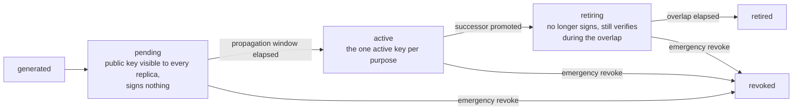

# pki

`go/pki` owns key material that needs a lifecycle: signing keys and
X.509 certificates, from generation through rotation to revocation.
The [pki usage page](/docs/user-guide/modules/services/pki/) shows the
wiring; this page is why the module has the shape it does — a shape
that answers a diagnosis of a real production certificate subsystem
whose failures (no rotation, one weak table for platform CAs and
tenant certificates, no revocation, predictable serials) became this
module's design constraints.

## Responsibility and boundary

The module is deliberately **not** a general PKI: no TLS certificates
for transport, no ACME, no OCSP responder (CRL only), no
cross-deployment CA federation, no certificate-transparency logging,
and no API that exports a private key. Its consumers are platforms
that hold their own key material — signing tokens, attesting their own
outputs — never end customers.

Why a standalone module rather than a corner of something else?
Key-material lifecycle needs tables, `jobs` scheduling and tenant
context, none of which belong in the `pkgcore` dependency floor; it is
a different concern from authentication (who the caller is), which
`authn` already owns; and `dbkit` sits below it in the graph, so
housing it there would be circular. The module implements
`the module contract` like any business module.

Inside, two layers with one boundary: the **key-lifecycle layer**
(the `Signer` seam, the state machine, the expiry scan) and the
**X.509 layer** (CA issuance, certificates, CRLs) built on top of it —
a certificate is a key with a lifecycle plus an identity statement
signed by a CA. `authn` consumes the first layer and must never see
the second: JWT verification needs only public keys and a kid, and
certificate parsing and chain validation would be pure attack surface
for it.

## The Signer seam: signing operations, never key extraction

The seam's defining decision is its shape: `Signer` exposes
`GenerateKey` / `Sign` / `Public` / `Destroy` — operations — and no way
to read a private key back out. A `Protect`/`Unprotect` design would
force the plaintext key through this process's memory and defeat the
point of a KMS-backed implementation entirely. That shape is what
makes "the private key never leaves the boundary" a realizable
capability: the `vault` and `kmsaws` provider subpackages register
both an envelope mode (the key is generated locally, wrapped by the
external service, and the ciphertext itself *is* the key reference —
no storage of the provider's own) and a direct-sign mode (the key is
generated inside and never exported by the external service, which
declares the `KeyNeverLeavesBoundary` capability). `LocalSigner`, the
zero-dependency implementation every unit test and standalone boot
uses, deliberately lacks that capability: signing decrypts into
process memory — the documented cost of a dependency-free signer.

Each provider lives in its own subpackage and self-registers, the
`database/sql` model: a host that never imports `vault` never pays for
it. Because one registered name carries one fixed capability, and the
envelope/direct-sign split is a runtime mode, each provider registers
two names (`signer.vault` and `signer.vault-direct`, and the kmsaws
pair).

## The lifecycle state machine: pending, active, retiring, retired, revoked

Three states carry the design's reasoning:

- **`pending` exists because of replica caches.** Replicas cache the
  key set. A key promoted straight to `active` would let replica A
  sign with a kid replica B has not seen yet — random login failures
  for the seconds after a rotation. So a new key enters `pending`:
  its public half propagates to every replica through the bus and the
  event-invalidated cache, and only after a propagation window —
  several cache-refresh periods — may it become `active`. The
  diagnosed system had no such state because it never rotated at
  runtime at all.
- **The `retiring` overlap is sized by the consumer, not by pki.**
  The overlap must cover the longest-lived credential the key signed
  — for `authn`, the access-token TTL. pki does not know that number;
  the consumer declares it, which is why `authn`'s `KeySource`
  interface carries `EnsurePurpose(ctx, purpose, algorithm,
  maxCredentialLifetime)` and why `authn` needs no import to say it.
- **The module manages the state machine; the host owns every push.**
  A `jobs` task scans for keys nearing expiry, stages successors and
  promotes them; the host schedules that scan on its own cadence —
  this module never schedules its own execution and never pushes to
  any external system, because distribution targets differ per
  deployment. Destruction of retired material follows the same
  division: `ReclaimRetired` is a host-invoked method, never
  automatic — under direct-sign modes `Destroy` is real provider-side
  deletion, a policy act no scan should take on its own.

Revocation is immediate and converged: `RevokeSigningKey` writes the
`revoked` state and invalidates the process-local key-set cache
through the module's own event, so a revoke on one replica excludes
the key on every replica without waiting out a TTL.

## One table never mixes two data domains

The diagnosed system's central defect was a platform CA and per-tenant
certificates sharing one table under one weak key. Here, `pki_signing_keys`,
`pki_authorities` and the revocation ledger are platform data;
`pki_certificates` is **tenant data**, tenant-scoped and
`AssertIsolated`. No business table ever holds a private key: the
three carry only `signer_name` + `key_ref`, an opaque pointer to
whichever `Signer` owns the material; `pki_local_keys` is
`LocalSigner`'s own encrypted store, touched by no other code.

The ledger exists for a cross-domain reason: a tenant-scoped read can
never enumerate every certificate one platform authority has revoked
across all tenants, so `pki_certificate_revocations` is a
denormalized, append-only platform table with a real, unenforced
`tenant_id` — the same accommodation jobs and audit make. Certificate
revocation is **ledger-arbitrated**: the row transition and the ledger
insert are both guarded single-winner statements, so concurrent
revokes with different reasons can never leave the two disagreeing,
and a retry of an already-revoked certificate reconciles rather than
double-writing. Serial numbers are 16 random bytes — never a
timestamp, the collision source the diagnosis found. The "at most one
active key per purpose" invariant is enforced by a partial unique
index in the database, not by application discipline.

The X.509 layer adds what a platform issuing its own certificates
needs: chain creation under fixed-subject idempotence (a restart never
mints a second chain), issuance that refuses a revoked authority
anywhere in the chain, chain verification through the standard
library's own `crypto/x509` path validation — never a hand-rolled
verifier — refusing a revoked certificate or a revoked authority up to
the root, and CRL generation with RFC 5280 numbering. The reference
app consumes it end to end as its AI-output attestation layer:
per-tenant certificates sign each observed simulation output, and the
share gate serves an attested output only when its certificate
verifies, its signature checks out, and its live content digest
matches the attested digest.

## Trade-offs that shaped the module

- **Consumer-declared overlap vs. module-owned rotation policy.**
  Rotation cadence is pki's own configuration; the retiring overlap
  is the consumer's credential lifetime. Splitting the two is the only
  way the arithmetic can be right, since only the consumer holds both
  numbers.
- **Structural seam over import.** `authn` declares `KeySource` with
  stdlib-only types and zero pki imports; pki's `Service` satisfies it
  structurally, pinned by a compile-time shape assertion kept in the
  module itself. The cost — a future signature change fails to
  compile loudly in exactly one place — is the point.
- **No expiry-driven lifecycle for authorities and certificates.**
  The signing-key layer rotates by schedule; the X.509 layer's
  lifecycle is revocation-shaped. Nothing watches
  `pki_authorities`/`pki_certificates` `not_after` and auto-renews —
  the host tracks its own certificates' expiry and re-issues, which
  the reference app's 365-day attestation certificates make a real
  operational fact, not a hypothetical.

## Stable external surface

- Key-lifecycle layer: `EnsurePurpose`, `ActiveSigner`,
  `VerificationKeys`, `RevokeSigningKey`, `ExportJWKS` — frozen API,
  consumed by `authn` through `KeySource`.
- X.509 layer: `CreateRootCA` / `CreateIntermediateCA` /
  `IssueCertificate` / `SignCertificate` / `VerifyCertificate` /
  `RevokeCertificate` / `GenerateCRL`.
- `Signer` seam: `signer.local`, and the registered names of the
  `vault` / `kmsaws` subpackages, each in envelope and direct-sign
  variants with their declared capabilities.
- HTTP: five operations under `/api/v1/pki` (revoke signing key,
  revoke certificate, two JWKS exports, the CRL fetch). The signing-
  key revoke is gated by a platform-domain permission; the certificate
  revoke by the tenant-domain one — one name could not span the two
  data domains, and a tenant-domain holder of the platform half could
  stop the whole deployment's token issuance.
- Five tables across three data domains, dual-dialect migrations,
  permissions under `pki:*`, four audit actions, five lifecycle
  events.

## Source

- Module discipline: [go/pki/AGENTS.md](https://github.com/vislake/speed/blob/main/go/pki/AGENTS.md)

## Related pages

- [Platform services](/docs/developer-docs/modules/services/) group overview; siblings [storage](/docs/developer-docs/modules/services/storage/), [notification](/docs/developer-docs/modules/services/notification/), [integration](/docs/developer-docs/modules/services/integration/), [metering](/docs/developer-docs/modules/services/metering/)
- [Architecture](/docs/developer-docs/architecture/) — the `KeySource` seam, the middleware chain, the module graph
- Usage: [pki in the user guide](/docs/user-guide/modules/services/pki/), the [identity and access domain page](/docs/user-guide/domains/identity-access/) (how the reference app wires pki as authn's key source)
