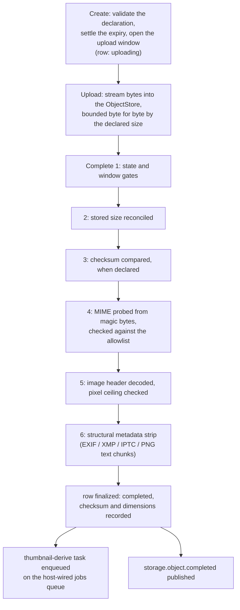
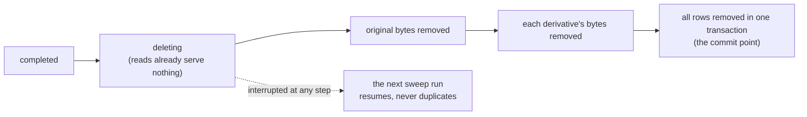

# storage

`go/storage` is the platform's media-object module: one tenant's
objects described in the database, their bytes living in an object
store, and the transfer lifecycle that moves those bytes in and out
with server-side revalidation. This page is about why the module is
shaped the way it is; the [storage usage
page](/docs/user-guide/modules/services/storage/) covers what you wire
and call.

## Responsibility and boundary

The module owns **metadata, not bytes** — and not the store either.
Bytes sit in the host's `ObjectStore` (a local directory in standalone
deployments, S3-compatible storage in distributed ones; the module
never knows which), resolved through the kernel seam. What the module
owns is the story of one object: what the uploader declared before any
bytes arrived, what the pipeline established once the bytes were in,
and where the object stands in its lifecycle.

What it deliberately does **not** do:

- **No caller-supplied keys.** Object keys are derived by the module
  from tenant and object id and never cross the wire — consumers name
  objects by id. A key that leaked would expose the tenant's storage
  layout.
- **No presigned transfer.** Bytes stream through the application
  server on upload and read. The module's revalidation pipeline must
  see the bytes anyway, and proxying keeps a single protocol shape for
  both the local and S3 store.
- **No timers.** Expiry is settled at create time and *enforced* by a
  sweep the host schedules through the queue — the module never runs a
  clock of its own. Retention is a host policy decision, so the module
  provides the mechanism (`EnqueueExpirySweep`) and the host chooses
  the cadence.
- **No virus scanning and no audit writes.** Scanning hooks and audit
  emission are host concerns; the module declares its audit actions
  and the host emits under them where it needs rows.

## The three-step protocol: why the probe of the bytes is the authority

An uploader's declaration is a claim. `Create` validates it and
reserves a row in the `uploading` state with an upload window;
`Upload` streams the body into the store, bounded byte for byte by the
declared size; `Complete` revalidates what actually arrived and only
then finalizes the row as `completed`. Reads serve completed objects
only — an unfinished upload is invisible to every reader.

Why three steps instead of one? The sizes involved are media-sized
(MiB-scale, image-heavy), so the module refuses bad declarations
before any byte moves, streams the body rather than buffering it, and
holds the authoritative verdict until the bytes are actually
inspectable. The revalidation pipeline runs in a fixed order:

1. state and upload-window gates;
2. stored size reconciled with the declaration;
3. stored SHA-256 compared when a checksum was declared;
4. media type probed from content magic bytes — never a filename or a
   caller-controlled header — and checked against the allowlist, then
   the declared type checked against the probe;
5. for images, a header-only decode with a pixel ceiling (a worker
   should never decode an image the transfer pipeline already
   refused);
6. a structural metadata strip removing the carriers of location and
   authorship metadata — EXIF, XMP and IPTC segments on JPEG, the
   `eXIf` and text-chunk family on PNG — before the object is
   readable at all. Patient photos carrying GPS coordinates are a
   privacy incident waiting to happen, so the strip runs on every
   completion, not as an option.

The strip is structural, never a re-encode: pixel data passes through
byte-identical, and the walkers are strict about structure — a file
whose metadata could be stripped but whose structure cannot be fully
verified is **refused**, never passed through on good faith. The
allowlist itself is guarded at registration: a media type is only
admissible if the module can both pixel-check it *and* strip it, so an
admitted type is a promise that every step of the pipeline applies.

**Expiry is settled at create, not left open.** An upload that
requests no retention expires at the host's configured maximum
lifetime — never silently permanent. A never-expiring object requires
two deliberate acts: a host that opts in (`WithNoExpiryAllowed`) and
an explicit per-object request. Omission produces bounded life.

## Lifecycle: crash-convergent deletion and the host-scheduled sweep

Deleting an object removes bytes and rows together, but a crash can
land between any two steps — so the protocol is built to be resumed,
never duplicated:

1. mark the row `deleting` — from this instant every reader serves
   nothing, since reads only see completed rows;
2. remove the original bytes from the store (idempotent per the
   store's delete contract);
3. remove each derivative's bytes in a deterministic order;
4. remove all rows in one transaction — the commit point; exactly one
   racing run wins it and publishes the deletion event.

An interruption at any step leaves work the next sweep run converges;
a second concurrent delete converges silently. The protocol refuses
exactly one state — an object still `uploading` — because an upload in
flight belongs to the transfer runtime until its window closes; only
the sweep reclaims it.

Derivative generation (thumbnails) mirrors the discipline: the worker
writes the derived bytes first and inserts the derivative row last,
gated in one transaction on the object row still existing and
`completed`. A crash between the two leaves nothing but re-derivable
bytes, never a row pointing at missing content — and a delete that
raced the insert wins the gate, so no window is left to close later.

The sweep runs three phases per tenant: resume interrupted deletions,
reclaim `uploading` rows whose window closed, delete completed objects
whose retention passed. One row's failure never stops the pass — a
fail-fast sweep would re-hit the same poisoned row first on every run
and starve everything after it — and a partial pass reports
`storage.sweep_partial_failure` with the failing rows named.

## Trade-offs that shaped the module

- **Server-relayed transfer over presigned URLs.** Presigned uploads
  keep bytes off the application server, but they push validation to
  a callback the server cannot trust as deeply as its own probe, and
  they require presigner machinery for every store implementation.
  The module accepted the relay cost for the standalone and
  small-replica shapes it targets.
- **Per-object serialization is process-local.** Upload and Complete
  serialize per object through an in-process lock map; two replicas of
  a distributed deployment share the store but not the lock. The
  `ObjectStore` seam carries no compare-and-swap, so the multi-replica
  interleaving is a documented residue rather than a pretended-away
  guarantee.
- **Host-scheduled sweeps.** Retention enforcement depends on the
  host scheduling the sweep task; a host that schedules none retains
  everything. The module treats this as the right trade: expiry is a
  policy question, and the queue wiring is the host's to own — but a
  window-scoped idempotency key on the sweep task keeps concurrent
  enqueues from racing each other.

## Stable external surface

- `NewModule(db, ...)`: options for the size and pixel ceilings, the
  media-type allowlist (jpeg/png by default), the upload window and
  maximum object lifetime, and the required `WithQueue` wiring.
- Three services: `ObjectService` (transfer lifecycle and reads),
  `DeriveService` (thumbnails), `LifecycleService` (delete, sweep,
  sweep enqueue).
- HTTP: seven operations under `/api/v1/storage`, generated from the
  module's OpenAPI fragment into a compile-checked handler; content
  responses carry `X-Content-Type-Options: nosniff` and
  `Content-Disposition: attachment` unconditionally. Tenant comes from
  request context only.
- Error codes are `storage.*` `apperr` values with bilingual copy in
  the module's own locale bundle; events `storage.object.completed`
  and `storage.object.deleted`; permissions `storage:read` and
  `storage:write`; two dual-dialect migration sets.

## Source

- Module discipline: [go/storage/AGENTS.md](https://github.com/vislake/speed/blob/main/go/storage/AGENTS.md)

## Related pages

- [Platform services](/docs/developer-docs/modules/services/) group overview; siblings [notification](/docs/developer-docs/modules/services/notification/), [pki](/docs/developer-docs/modules/services/pki/), [integration](/docs/developer-docs/modules/services/integration/), [metering](/docs/developer-docs/modules/services/metering/)
- [Architecture](/docs/developer-docs/architecture/) — the kernel seams and capability validation
- Usage: [storage in the user guide](/docs/user-guide/modules/services/storage/), the [storage, sharing and AI domain page](/docs/user-guide/domains/storage-sharing-and-ai/), and the [jobs queue](/docs/user-guide/modules/core/jobs/) its asynchronous half runs on
