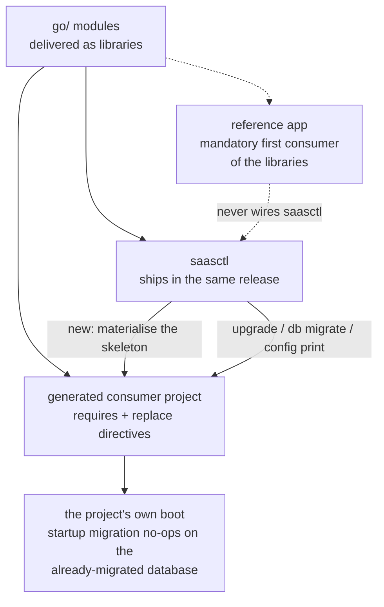

# saasctl

speed delivers libraries; the moment a consumer turns them into an
application must be delivered too — saasctl is that moment's tool:
materialising the project skeleton (`new`), moving speed requires
onto one release version (`upgrade`), applying the required modules'
schema ahead of a boot (`db migrate`), previewing what a boot would
run on (`config print`). Usage lives in the [user
guide](/docs/user-guide/modules/tools/saasctl/); here, the design
behind the shape.

## Why a CLI module

All four actions happen where nothing is assembled yet — creating a
directory, editing a `go.mod`, applying SQL, rendering configuration —
before and around boots, never inside them; none could be a feature
of a running application. A CLI keeps each action explicit,
scriptable and re-runnable, idempotence designed in so a second run
doubles as a verification; the surface is deliberately stdlib —
plain `flag`, no cobra.

Why ship the CLI as a **module in the monorepo**, under the lockstep
release, not as an independent tool? It is coupled to the libraries
at the version level — the embedded template must move with the
modules it compiles, and `upgrade`'s version grammar is the twin of
the release coordinator's own. One version number is the whole
compatibility surface, for the libraries and the tool that maintains
their consumers alike, so saasctl joins the same release, CI matrix
and `AGENTS.md` discipline as every module it shapes. What it does
not join is the kernel wiring (last section).

## Two consumer stories, one boundary tool

speed has two consumer stories that must not blur: the **reference
app** is the mandatory first consumer of the *libraries*, while the
**generated projects** consume *saasctl* — and, through their
`go.mod`, the libraries themselves. Hence the skeleton must genuinely
compile and boot, and the tool's proof is a
materialise-tidy-build-boot cycle on real projects.

## `new`: a template that is a working app by construction

The skeleton is not synthesised in code: it is an embedded tree of
real files, produced by materialising, `go mod tidy`-ing and `go
build`-ing them against a real speed checkout, then converting the
paths back to tokens. Compile-correctness is proven by real builds of
materialised apps, never in place — a `//go:build ignore` marker
keeps the embedded tree out of this module's own build. One binary
carries the template, so `new` pulls no separate template repository
and the two always ship at the same version.

The tree mirrors the reference app's `cmd/server` shape minus every
demo-specific piece — no notes module, no demo tenants, grants,
membership store or seeded data. Copying the reference app verbatim
would inherit its toy identity layer, so the host modules (authn's
`MembershipReader`, org's `SubjectResolver`, the config resolver) stay
unwired and fail closed, doc comments naming each as the owner's
first task. The honest consequence is stated, not papered over: with
no membership store, a correct and a wrong password answer identically
401 `authn.invalid_credentials`.

The switchable universe is the minimal combination `{authn, rbac,
org}` plus its four closures, the required five (`pkgcore`, `dbkit`,
`tenancy`, `config`, `observability`) always present. Selection is
positive with downward closure: `--with` lists what you want, there
is no `--without` — excluding `authn` means not listing it, and
picking `rbac` or `org` without it is refused, naming `authn` as
implied. `go/pki` is never a choice: it follows `authn` as its
`KeySource`, a mechanism dependency, not a consumer topic. Only two
files differ between selections — the `go.mod` require set and
`server.go`'s wiring — `config.go` shared verbatim, so the bootstrap
contract never changes with the selection, which is what makes the
two commands below well-defined.

## `upgrade`: the lockstep release as a rewrite problem

Because the version number is the whole compatibility surface, an
upgrade is one rewrite — every speed require to the target version —
done with the go command's own parser (`golang.org/x/mod/modfile`),
which edits the parsed syntax tree and prints it back. Only the
version token of each speed require changes; third-party requires
with their `// indirect` markers, `replace` blocks, comments and
formatting survive byte for byte, and the modules rewritten come from
the file's own require lines. `--version` is required — no usable release
is published yet, and version discovery is not implemented — and the result
is re-parsed and self-checked before writing back; the
check refuses a file whose `replace` or `exclude` defeats the rewrite
(a module-to-module replace pinning another version wins at build
time; an exclude of the target brands it unusable), since a clean
report would otherwise lie about what the project builds.

One rule governs every file the tool produces: **a produced artifact
must pass its consumer's own parser before delivery.** `new`
validates the module path a generated go.mod declares with
`module.CheckImportPath`, the go command's own validator, and passes
the whole document through `modfile.Parse` — its `replace` directives
embed the resolved speed-root path verbatim, and not every filesystem
path is valid go.mod grammar. Checking the artifact rather than the
input enumerates nothing about where the consumer's lexer breaks.

## `db migrate`: the require graph owns the schema

The migration universe is the intersection of the project `go.mod`'s
speed requires with the root modules that ship migrations — `authn`,
`config`, `org`, `pki`, `rbac`. The `go.mod` is the one authoritative
statement of which modules a project uses; the universe derives from
it and cannot drift, and `pki`'s tables migrate only when the file
genuinely requires `go/pki`.

Application runs through the same `dbkit.MigrationRegistry` the
generated app's startup `Apply` uses, over the same bootstrap
environment, one transaction per module, every file recorded in
`schema_migrations` — pure versioned SQL, never `AutoMigrate`. A
re-run applies only what is unrecorded, so CLI-then-boot and boot-only
converge. The CLI twin exists because operators need the schema
before any process runs — first boot, provisioning, CI. Refusals name their
reason: no speed requires suggests not a generated project; a
ledgerless existing database is refused with repair guidance. Both deployment modes are accepted — distributed mode
changes which components compose real implementations, never which dialect
the project's database speaks. The shared-SQLite-file hazard is
answered with a usage contract: run `migrate` to completion before
booting any replica.

## `config print`: a twin of the app's own bootstrap

`config print` renders how a generated project's bootstrap resolves
through the appconfig twin of the project's own `cmd/server/config.go`
— the embedded template's file, the twin pinned by tests — so values
and refusals are exactly the app's. When raw and effective differ,
both are shown. The one resolution step beyond the bootstrap is the
SQLite path: a relative value anchors to the directory the app runs
from, via the single shared `EffectiveDBPath` function — the very
function `db migrate` opens its database through, so the reported
file and the migrated file are identical by construction. A
partially set `APP_S3_*` or `APP_SMTP_*` group, or malformed input,
is refused with the same coded error the app's `configFromEnv`
raises. Secret rows render `[redacted]` whatever the environment
holds — never the bytes, never a hint of shape — with the secret
list one declaration consulted by every row.

## Why the reference app never wires it

The mandatory-first-consumer rule is satisfied per story: the
reference app proves the libraries; saasctl's consumers are the
generated projects — inside the reference app, the tool would operate
on its own output. Its end-to-end proof is the real lifecycle:
materialise each legal selection, genuine network `go mod tidy` and
`go build`, migrate a fresh database, boot and smoke the composed
HTTP chain. In CI form, scaffold-verify runs the full cycle daily for
one selection under both modes, against real Redis, RustFS and
Mailpit containers. What the proof cannot show
is recorded rather than faked — a correct-password login included —
and so are the scope limits: the `go.mod` goldens need the real tidy
procedure whenever a module's dependency set changes, and four of the
five selections carry no CI-wired dual-mode boot proof. Both are
deliberate, documented reductions.

## Source

- [saasctl AGENTS.md](https://github.com/vislake/speed/blob/main/go/saasctl/AGENTS.md) —
  the authoritative contract for all four commands; this page's
  primary source.
- [scaffold-verify.yml](https://github.com/vislake/speed/blob/main/.github/workflows/scaffold-verify.yml) —
  the daily end-to-end proof against real generated projects.
- [saasctl user guide](/docs/user-guide/modules/tools/saasctl/) — the
  four commands' usage, from the operator's side.
