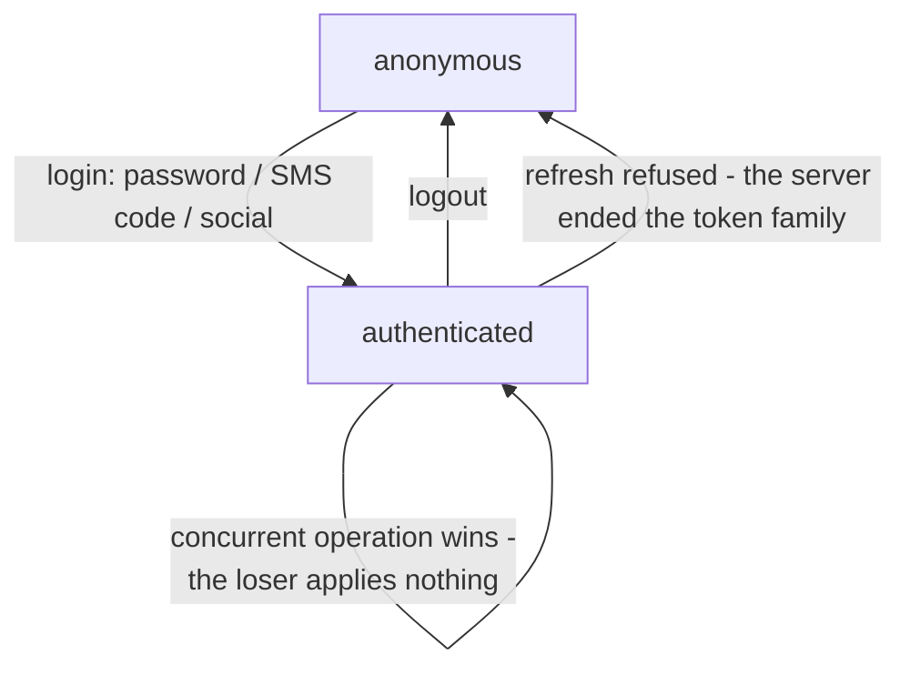

# @speed/auth-core: the session as a memory-only state machine

`createAuthSession(store)` turns the generated authn operations —
password and SMS login, logout, tenant switch, step-up, refresh, plus
the SMS-code request, register and social operations that feed the
sign-up and social flows — into one observable session. This page
explains why the session is shaped the way it is: where each token
lives, how races between concurrent operations are decided, and why
permission checks never fetch anything. How to wire it into an app is
the [auth-core usage page](/docs/user-guide/modules/web/auth-core/) in
the user guide.

## Responsibility and boundary

The session layer is headless by construction. **No UI and no
navigation**: a social channel's authorization URL is a pure request
reported upward, and the host's own navigation layer decides what
happens next — rendering lives in the auth-ui component family. **No
storage writes and no `restore`**: a reload starts anonymous; the
access token sits in the caller-supplied store, the refresh token in
the session closure (below). **Hooks read, never drive**: `useAuthState`,
`useCurrentTenant` and `usePermission` read one session the host
attaches with `attachSession` (last bind wins), and login and logout
are called from event handlers, never from hooks. React is a peer
dependency — only a host that already renders React carries it.

## Design: why the tokens live where they live

The authn API returns the refresh token in the token-issuing response
bodies and sets no refresh cookie — the only HttpOnly cookie authn ever
sets is the social-binding pre-auth one. So nothing outside the session
closure could hold the refresh token without writing it somewhere, and
the design refuses to write it anywhere: both tokens are
JavaScript-visible in memory by necessity, and the package shrinks that
surface to its minimum — no storage API exists on purpose, and there is
deliberately no `restore`, because a session that silently
re-established itself would hide that the page has been dead since the
user left it.

## Design: why one store wires session and client together

The host builds its client with the *same* store it hands to
`createAuthSession`, and configures
`refreshAccessToken: () => session.refresh()`. That one wiring gives
silent refresh for free: an expired-token 401 on any request — from any
package riding the shared request function — runs one refresh, and the
retried request carries the fresh token. The refresh request itself is credential-less
by declaration (the generated mutator's `omitAccessToken`) and never
touches the token store: it authenticates with the refresh token in its
body, and its own 401 stays terminal, never re-entering the refresh
path.

## Design: why races are decided by generations, and losers apply nothing

Every operation rejects with the raw `ApiError` on failure, and a
failed operation changes nothing — the store, the held refresh token
and the snapshot are exactly what they were before the attempt. One
rejection is deliberately not an `ApiError`: when a concurrent sibling
operation (a second login, a switch, a step-up) committed to the
session while this request was in flight, the request's own 2xx was
genuine but its answer no longer describes the session — nothing of it
is applied, and the operation rejects with `OperationSupersededError`
carrying the winner's snapshot. The reason is the one-shot side effect:
a tenant switch's `onSwitched`, a sign-in's post-login redirect must
never fire for a tenant or identity the session is not actually running
under. The same fail-closed discipline guards the wire: a token-issuing
2xx that violates the contract — missing tokens, principal or fields —
rejects with `client.protocol` (status 200) before any state change.

## Design: why refresh is a silent path with a generation guard

`refresh()` is the one operation that resolves instead of rejecting
when the news is bad. It resolves `true` when a fresh pair was stored;
`false` when there is nothing to refresh, when the server refused the
held token — the session is over, and signs out locally, the server
having already terminated the token family — and `false` too when a
tenant switch won the race while the refresh was in flight: the request
whose 401 started the refresh spoke for the old tenant and must fail
rather than replay under the new one. Transport failures rethrow the
raw `ApiError` with the store and held tokens untouched — a refresh
never clears them.

Concurrent `refresh()` calls presenting the same held refresh token
share one in-flight request, because the authn server treats parallel
presentations of one token as theft and rotates the whole family — the
session serialises them itself, and a call made after a tenant switch
or step-up presents the same held token, so it still shares the flight.
A completed logout wins over a refresh that resolves after it, and a
committed login/switch/step-up wins over a stale refresh: the losing
pair's access token and snapshot are never applied over the winner's —
with one exception, the rotated refresh token itself, adopted into the
held slot when the winning operation kept the held token (a switch or
step-up mints no new one, and the server has already consumed the held
token for that refresh). The resolution still reflects who won: a
step-up kept the same principal, so the refresh resolves `true` and a
retry speaks for the identity the refused request spoke for; a tenant
switch changed the principal, so it resolves `false` and the original
request fails instead of replaying under a principal it never asked.

## Design: why permission checks are set lookup only

`usePermission(domain, permission)` answers "is this string in the
host-attached list for that domain" — the `tenant` domain for
in-tenant permissions, `system` for platform-staff ones. Nothing here
fetches or evaluates: the shipped `/api/v1/authn/me` returns identity
only (`AuthnPrincipal` carries no permissions), and rbac mounts no HTTP
routes, so the /me-derived lists are the host's to attach through
`setPermissionSet`. The session applies the survival rules when a
principal change commits — a silent refresh or step-up keeps both
lists, a tenant switch drops the tenant list and keeps the system one,
a login (even by the same user in the same tenant) or an anonymous
transition clears both. Every hook fails closed before attach and after
logout: the anonymous snapshot, a null tenant, `false`. These checks
are a UX affordance, never a security boundary — the server
authorizes.

## Stable surface

`createAuthSession(store)`, the `AuthSession` and `AuthSnapshot` types
and the `subscribe` / `getSnapshot` observation contract;
`attachSession` and the three hooks; `setPermissionSet` with the
documented survival rules; the pre-session operations
(`requestSMSCode`, `register`, `socialAuthorizeUrl`, none changing the
session); `OperationSupersededError` and the `isOperationSuperseded`
guard; and the failure contract itself — every operation's zero-change
on failure and `refresh()`'s resolve-don't-reject semantics.

## Source

- Package contract and decisions: [AGENTS.md](https://github.com/vislake/speed/blob/main/web/packages/auth-core/AGENTS.md)

## Related pages

- [Frontend architecture](/docs/developer-docs/frontend-architecture/) — "Session state: memory only" is this package's section
- The Go side of the surface it drives: [authn](/docs/developer-docs/modules/identity/authn/) — the module whose generated operations and token contract shape this session
- How to use it: [auth-core in the user guide](/docs/user-guide/modules/web/auth-core/)
- The rest of the web HTTP group: [api-client](/docs/developer-docs/modules/web/api-client/) — the transport, token store and refresh seam; [api-sdk](/docs/developer-docs/modules/web/api-sdk/) — the generated operations and the `credentialless` refresh mutator
