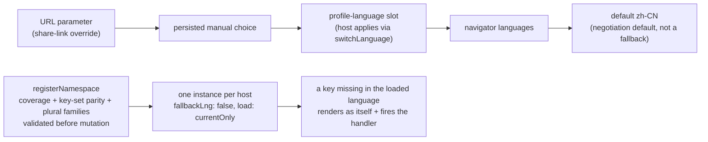

# i18n: bilingual namespaces, no fallback

`@speed/i18n` is the frontend's language layer: one react-i18next
instance per host, a start language chosen by a fixed negotiation
chain, per-package namespaces registered with coverage and parity
validation, and a missing-key discipline in which another language's
text is impossible. It is the deliberate frontend counterpart of
`go/pkgcore`'s message catalog: a key missing in the loaded language
renders as the key itself and fires a visible handler — never as the
same key's text from another language.

## Responsibility and boundary

- **One instance per host, not one per package.** The react-i18next
  bindings are re-exported from the main entry, so hosts and component
  packages consume the whole surface through one `@speed` package;
  lockstep single-version shipping guarantees one react-i18next copy
  in the tree, which is what makes `useTranslation` inside third-party
  components safe.
- **It owns the mechanism, not the copy.** Each rendering package
  ships its own bilingual bundles and registers them under its own
  namespace; business copy belongs to the host. What this package
  guarantees is that the registration is valid before it lands.
- **MUI stays out of the main import graph.** The locale helper lives
  at the isolated `@speed/i18n/mui-locale` subpath, so a consumer that
  never uses MUI never installs or resolves it; `muiLocaleFor` throws
  on unknown tags rather than silently pairing a Chinese UI with
  English texts.
- **It renders nothing.** The layer's output is an instance and a
  translation function.

## Design: the start language is negotiated, first match wins

`createI18n` walks a fixed chain, validating each source against the
instance's supported set and skipping it when it matches nothing: URL
parameter (the override for share links) → the persisted manual choice
→ the signed-in user's profile-language slot → navigator languages →
the `zh-CN` default. The order is the design: explicit intent outranks
a stored preference, which outranks a server-resolved profile, which
outranks the browser. Matching relaxes subtags in both directions but
never crosses languages: `ja-JP` may select supported `ja`, `en` may
select `en-US`, never another language. Two consequences are deliberate
and distinct:

- The profile slot outranks the browser but is fed only after
  creation, so applying a language to a live instance goes through
  `switchLanguage`, whose storage argument is three-state: `undefined`
  uses the storage bound at creation, `null` persists nothing, and a
  `StorageLike` persists there. A host applying a server-resolved
  profile must pass `null`: persisting would write the *manual* slot,
  which outranks the profile tier on later visits and would shadow
  subsequent profile changes until the slot clears.
- An unknown browser language resolving to the `zh-CN` default is a
  negotiation default — this product's home language, documented and
  overridable. It is a different rule from the missing-key rule, which
  never falls back.

Storage is best-effort by design: a failing write warns and never
aborts the switch, and a throwing read at creation simply means "no
stored choice".

## Design: registration is validated before any mutation

`registerNamespace` checks everything before anything lands: every
supported language must be present; all bundles must carry the same
leaf key set against a reference language,
so a key can never exist in one language and silently miss in another;
leaves must be non-empty strings — an empty translation renders as
silence and is indistinguishable from a dropped key, so it is refused
like the Go catalog refuses empty translations; and plural forms are
suffixed leaves (`key_one`, `key_other`, ...) that count as ordinary
keys for parity and must cover every count category any supported
language can select — validated with the same `Intl.PluralRules` the
renderer uses. Because bundles carry identical leaf sets, the forms
one language needs ship in every bundle: zh-CN carries `_one` forms
that en-US counts of 1 select and that zh-CN itself never does. A
namespace registers exactly once per instance, and names are bare and
unscoped — a short key hosts write in `useTranslation`, never a
package identifier, so `@speed/tokens` is refused.

Whole-language or whole-key gaps therefore surface at registration as
errors; a gap appearing after registration cannot be driven through
this package's API — the tests delete a registered namespace's whole
en-US bundle and prove the render path: the key renders as itself, the
zh-CN text is absent, the handler fires.

## Design: no fallback, enforced on the instance

`createI18n` pins `fallbackLng: false` and `load: 'currentOnly'`, so
cross-language fallback is impossible, with always-installed
missing-key handling. A missing key renders as the key itself — never
another language's text — and reports structured details to a handler
(the default handler warns visibly; the host may supply
`onMissingKey`). The strictness mirrors the backend: another
language's text is a silent lie about what is rendered, and one that
never gets fixed.

## Stable surface

`createI18n` and its supported-language set (canonical tags, validated
at creation); `switchLanguage` with its three-state storage argument;
`registerNamespace`'s contract and validation rules; the missing-key
handler's `MissingKeyDetails` shape; `muiLocaleFor`'s behavior;
`SPEED_LOCALE_STORAGE_KEY`; the re-exported react-i18next bindings;
and the actionable `[speed-i18n]`-prefixed errors every validation
throws.

## Related pages

- [Frontend architecture](/docs/developer-docs/frontend-architecture/)
  — the no-inline-text thread this package enforces
- Web group: [group guide](/docs/developer-docs/modules/web/),
  [ui-kit](/docs/developer-docs/modules/web/ui-kit/) and
  [layout-kit](/docs/developer-docs/modules/web/layout-kit/) — the
  packages that register namespaces through this one
- Backend mirror: [pkgcore](/docs/developer-docs/modules/core/pkgcore/)
  — `go/pkgcore`'s catalog, whose parity rule this package mirrors
- How to use it: [@speed/i18n in the user guide](/docs/user-guide/modules/web/i18n/)
