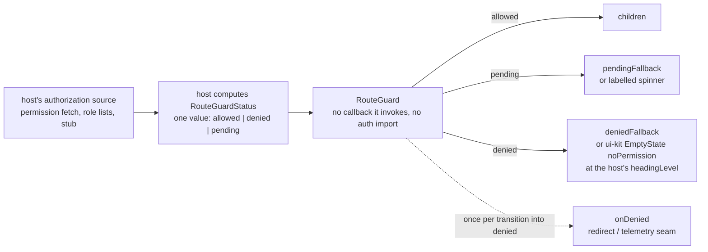

# layout-kit: app chrome without navigation logic

`@speed/layout-kit` is the shared app-chrome layer: `AppShell` (a
fixed header, a responsive nav drawer and a `main` content region) and
`RouteGuard` (a route/content gate driven by a host-injected status).
Both sit at the same auth-agnostic tier as `@speed/ui-kit`: no
business, tenant or authentication-mechanism semantics live here. The
package's defining property is what it refuses to know — navigation
state, authorization sources, routers — and the two components'
contracts are those refusals made concrete.

## Responsibility and boundary

- **No path-matching, ever.** `navItems` is a list the host computes in
  full, *including* which item is `selected`; AppShell never compares a
  location against an item, because different hosts use different
  routers and the package would otherwise duplicate each one's
  matching logic — and get it subtly wrong.
- **No router, no auth package, anywhere.** The package depends on
  `@speed/i18n` and `@speed/ui-kit` only. `RouteGuard`'s allow/deny/
  pending decision arrives as a plain `status` value, never a callback
  the package invokes and never an authentication or routing import —
  one package, two different authorization sources, no prop-shape
  change.
- **No direct `@speed/tokens` dependency.** AppShell reads
  `breakpoints.values` and `z-index` through the ambient MUI theme the
  host's `AppThemeProvider` builds. This is safe *because* of the
  tokens package's parity pins — those rows are MUI-identical
  defaults, so nothing layout-relevant is missing from the theme.
- **Its one concrete coupling is ui-kit's `EmptyState`, and only as
  the denied fallback** — chrome reusing a primitive, never anything
  auth- or routing-shaped.
- **Text is the package's own `layout-kit` namespace** (four keys:
  skip link, nav label, open/close labels, pending spinner label),
  registered by the host like every sibling's; the denied fallback
  carries no text of its own, by design.

## Design: AppShell — the theme decides, the host decides the rest

AppShell is a fixed `AppBar`, a nav `Drawer` and a `main` landmark.
The responsive split is driven by the ambient theme's *own*
breakpoints — `useMediaQuery(theme.breakpoints.up('md'))`, permanent
drawer at `md` and up, temporary and overlaid below — with no new
breakpoint introduced, because a shell must track whatever theme the
host composed rather than inventing its own scale. The skip-to-content
link is the first focusable element and focuses the `main` landmark
directly, never through fragment navigation — a fragment would rewrite
`location.hash` and lose a hash-routed host's current route.

The mobile drawer is optionally controlled (`mobileOpen` /
`onMobileOpenChange`); omit the pair and AppShell manages the toggle
itself — the one interaction-local exception, deliberately matching
ui-kit's `ConfirmDialog` arm carve-out, and the uncontrolled
temporary drawer also closes itself when a nav item is activated.

Narrow-viewport protections are CSS-only and add no props: the mobile
drawer's paper width is capped by `min(sidebarWidth, 85vw)` so a very
narrow viewport never gets a near-full-screen drawer, and the header
rows wrap under real overflow pressure instead of being clipped. The
wrap is not an auto-collapsing overflow menu — inventing one would be
new host-facing behavior, the thing this package's design avoids
elsewhere. Because a wrapped header is taller than the theme's toolbar
row, the shell measures the banner's rendered height (a
`ResizeObserver` where available) and derives the offset placeholders
from it, falling back to the theme toolbar height where no observer
exists.

## Design: RouteGuard — the decision is a value, not a callback

`RouteGuard` gates children on a `status: 'allowed' | 'denied' |
'pending'` value the host computed. Two reasons make the value shape
load-bearing. First, the package cannot know the authorization source
— a real permission fetch, a role list, a stub in a test — so it must
receive the *result*, never invoke the source. Second, one value from
one place makes the three states mutually exclusive by construction:
there is no separate boolean loading flag that could disagree with
"allowed", a failure mode value-shaped states cannot express. The
default render per state: children, a labelled spinner
(`pendingFallback` overridable), or ui-kit's `EmptyState
variant="noPermission"` — which renders as an `h1` by default because
the gate replaces the page content it guards, with `headingLevel`
letting a host whose own heading precedes the gate continue the page's
order without a skip. `onDenied` fires exactly once per transition
*into* `denied` — a `useEffect` keyed on status with a guard, so a
re-render that leaves the status at `denied` does not re-fire — the
seam for a host's redirect or telemetry, fully decoupled from render.

The consumers prove the value-in contract: the reference app derives
the gate's status from the served notes query — a refused read (403)
failing the gate closed to `denied` — and product-shell's suite
drives the same shape from role lists its stand-in host attached. The
status always arrives by host composition, never from package code.

## Stable surface

`AppShell` and its props (`navItems` with host-computed `selected`,
`header`/`headerActions`/`userMenu` slots, the optional
`mobileOpen`/`onMobileOpenChange` controlled pair, `sidebarWidth`
default 280, `sx`); `RouteGuard` and its props (`status`,
`pendingFallback`, `deniedFallback`, `headingLevel`, `onDenied`); the
`RouteGuardStatus` union; the `LAYOUT_KIT_NAMESPACE` constant and
`layoutKitResources` bundle.

## Source

- Design: [docs/internal/12-frontend.md](https://github.com/vislake/speed/blob/main/docs/internal/12-frontend.md)
  (package tiers, controlled components, bilingual text)
- Package contract: [web/packages/layout-kit/README.md](https://github.com/vislake/speed/blob/main/web/packages/layout-kit/README.md)
  and [web/packages/layout-kit/AGENTS.md](https://github.com/vislake/speed/blob/main/web/packages/layout-kit/AGENTS.md)

## Related pages

- [Frontend architecture](/docs/developer-docs/frontend-architecture/)
  — the auth-agnostic foundation tier this package belongs to
- Web group: [group guide](/docs/developer-docs/modules/web/),
  [ui-kit](/docs/developer-docs/modules/web/ui-kit/) (its denied
  fallback and theme), [i18n](/docs/developer-docs/modules/web/i18n/)
  (its namespace)
- How to use it: [@speed/layout-kit in the user guide](/docs/user-guide/modules/web/layout-kit/);
  its first consumer, [@speed/product-shell in the user guide](/docs/user-guide/modules/web/product-shell/)
