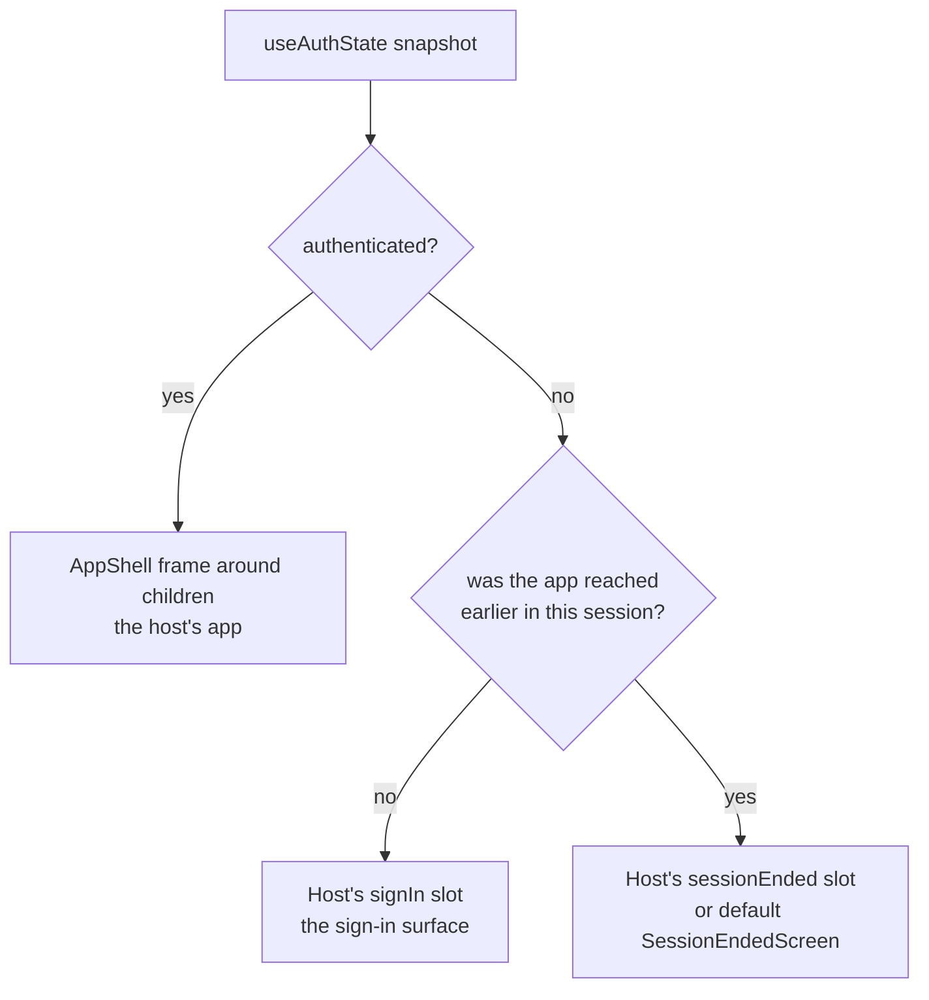

# product-shell

`@speed/product-shell` is the tenant-facing assembly shell: the
package that composes the shared app chrome
(`@speed/layout-kit`'s `AppShell`), the sign-in family
(`@speed/auth-ui`) and the headless session hooks (`@speed/auth-core`)
into one three-branch view machine — a ready-to-copy front door for a
tenant-facing business application. The platform-staff shell of the
same tier is deliberately not built. This page explains the design
reasoning; the
[user-guide product-shell page](/docs/user-guide/modules/web/product-shell/)
covers the how.

## Responsibility and boundary

`ProductShell` renders one of three branches from the authenticated
snapshot it reads through auth-core's hooks:

The shell reads the snapshot and never drives the session; its
boundaries are the inverse of what an assembly shell might be tempted
to do:

- **No permission gating of its own.** It never consumes `RouteGuard`,
  never calls `usePermission`, never attaches permission lists —
  route-level authorization is host composition in `children`, fed a
  status the host derives from lists it attaches and re-attaches on
  tenant switch.
- **No tenant switcher of its own.** Switching tenants is a session
  operation; hosts compose `@speed/tenancy-ui`'s `TenantSwitcher` into
  the `userMenu` slot. The package does not even depend on tenancy-ui —
  it is a dev-only companion of the suites.
- **No route matching.** Navigation selection is host-computed in
  `navItems`, `selected` included; the shell never inspects the URL.
- **No network, navigation or session calls.** Every request the
  composed views make is a session operation through the host-bound
  client.

## Why the shell exists as a component

The third branch is the reason the shell is a component rather than two
lines of hooks in every app: **a signed-out user who was inside the
app must not fall back to a fresh-visitor sign-in**. The shell
remembers that the app was reached, per session, in component state;
the session itself stays in auth-core, attached to no view. Because
the machine cannot tell a server-side session death from an explicit
sign-out — both are the same snapshot flip — every flip into the
session-ended view announces itself through a `role="status"` region,
and every branch flip moves focus into the branch's own container (a
focusable, non-tab-stop wrapper), the whole-page-switch accessibility
duties the shell owns rather than leaving to each host page.

Two further "no" decisions follow:

- **No default sign-in surface.** The channel mix (password, SMS,
  social, registration) is a product decision, so the anonymous-before-
  the-app branch renders the host's `signIn` slot — and with no slot,
  nothing. The machine never resets into a branch that would render
  nothing: the ended screen's action returns the viewer to the sign-in
  view, so a host without a `signIn` slot whose session ends mid-use
  stays on the ended screen until it supplies its own way out.
- **The switcher is a composition, not code.** The quick start's
  multi-tenant userMenu — `useCurrentTenant` feeding the switcher's
  `currentTenantId`, a committed switch reporting through `onSwitched`
  — is packaged evidence of the host duty, and the gated-journey suite
  plays that duty for real: a fixture host hangs `RouteGuard`s in
  `children` over lists it attaches and re-attaches on switch, proving
  that gate status arrives by host composition, never from package
  code. Before any sign-in the hooks fail closed, so the switcher
  shows its no-current-tenant text and disables — there is nothing to
  switch from.

## Why namespace registration is the host's job

The shell renders exactly one string of its own — the
`announcements.sessionEnded` announcement of the session-ended flip —
from the bilingual `product-shell` namespace. Every other string on
the frame comes from the layout-kit and auth-ui namespaces, which the
host registers anyway. The shell cannot register its own namespace,
and neither can any package: the i18n instance is the host's single
instance, created at bootstrap before render, and `registerNamespace`
validates identical key sets before it mutates and must run exactly
once per instance. Registration is therefore a host step, listed in
the host checklist; the announcement renders only when the namespace
is registered, and an unregistered host keeps the focus transfer and
gets no raw key text — the announcement is an enhancement, never a
requirement on the host's i18n setup. The `sessionEnded` slot has the
same optionality: with no slot, the default auth-ui
`SessionEndedScreen` renders; a custom node renders as-is and owns its
own way back.

## The stable surface

`ProductShell` with its props type — every `AppShell` chrome prop
(`navItems`, `header`, `userMenu`, ...) passed straight through, the
`signIn` and `sessionEnded` slots, and `children` — plus the
`PRODUCT_SHELL_NAMESPACE`/`productShellResources` pair. Dependencies
are the composed pieces only: layout-kit, auth-ui, auth-core and
i18n. No routing, state or query library is required — `children`
bring their own.

## Related pages

- [Frontend architecture](/docs/developer-docs/frontend-architecture/) — the package layers and the assembly tier
- [auth-ui design](/docs/developer-docs/modules/web/auth-ui/) — the sign-in family filling the shell's sign-in branch; [tenancy-ui design](/docs/developer-docs/modules/web/tenancy-ui/) — the switcher hosts compose into the `userMenu` slot; [account-ui design](/docs/developer-docs/modules/web/account-ui/) — the signed-in sibling section family
- User guide: [product-shell module](/docs/user-guide/modules/web/product-shell/), [web modules](/docs/user-guide/modules/web/), [building the frontend](/docs/user-guide/domains/frontend-building/)
